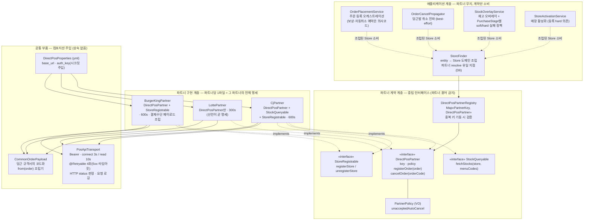
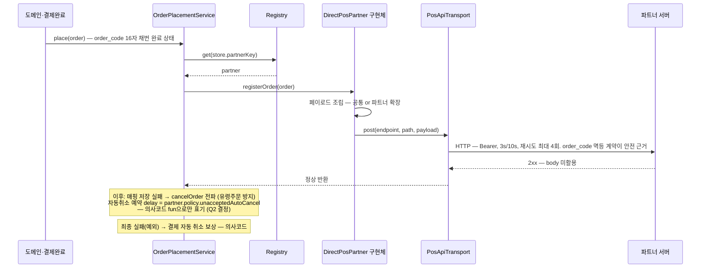
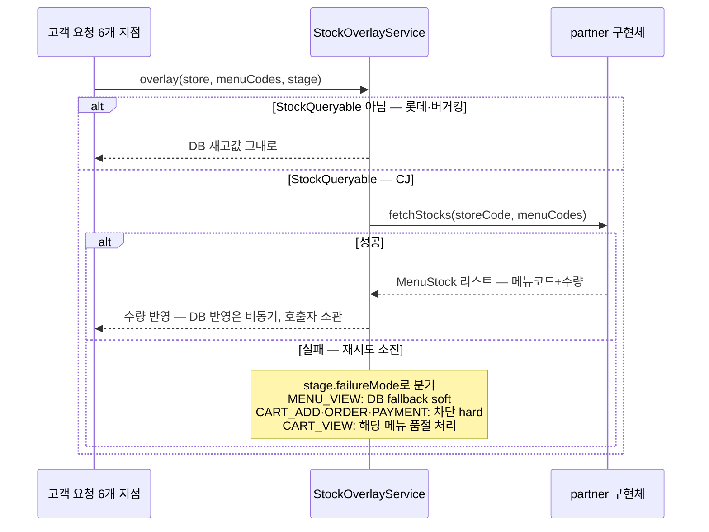
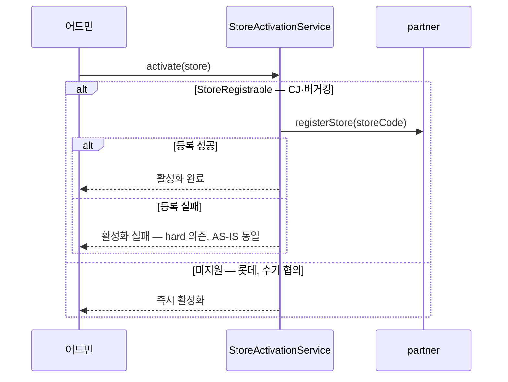

# TO-BE: 직연동 아웃바운드 아키텍처

> `03-to-be-design-discussion.md`의 결정(D1~D5, Q1~Q4)을 실행 가능한 설계로 구체화한 문서.
> 설계 언어는 참고 아티클의 기준을 따른다 — **변하는 축을 식별해 중립 계약으로 선언하고,
> 결합의 대가를 계산해 상속보다 컴포지션을 택하며, 계약에 특정 파트너의 용어가 새지 않게 한다.**

---

## 1. 변하는 축 분석 — 무엇을 추상화하는가

추상화는 패턴 선택이 아니라 축 식별에서 시작한다. AS-IS 플로우 분석(02 §4 seam)에서 확인한 축:

| 축 | 변하는가? | 표현 수단 (TO-BE) |
|---|---|---|
| **파트너 선택** (어느 파트너로 보내나) | 매장마다 다름 — 런타임 dispatch | `Map<PartnerKey, DirectPosPartner>` registry |
| **capability** (파트너가 뭘 지원하나) | 파트너마다 다름 — 3사 3색 | 인터페이스 구현 여부 (`StockQueryable`, `StoreRegistrable`) |
| **페이로드** (뭘 실어 보내나) | 버거킹부터 다름 | 파트너 구현체가 조립 소유, 공통 조립기는 부품 |
| **정책값** (자동취소 시간) | 파트너마다 다름 — 계약값 | 구현체가 선언하는 `PartnerPolicy` VO |
| **엔드포인트/키** (어디로, 무슨 키로) | 환경마다 다름 | yml/시크릿 (`DirectPosProperties`) — 코드가 아닌 유일한 것 |
| 전송 규약 (Bearer, 3s/10s, 재시도 4회, status 판정, order_code 멱등) | **변하지 않음** — 당근 규격서 | 공통 부품 `PosApiTransport` 1벌 |
| 실패 대응 (soft/hard, 보상 취소) | 구매 단계·비즈니스 소관 — 파트너와 무관 | **파트너 계층 밖** (호출자) |

> 마지막 두 줄이 이 설계의 절제 지점이다. 변하지 않는 것을 추상화하지 않고(전송은 클래스 1개),
> 파트너와 무관한 것을 파트너 계층에 넣지 않는다(soft/hard는 호출자).

## 2. 컴포넌트 구조도



### 컴포넌트 역할과 책임

| 컴포넌트 | 계층 | 역할 | 알고 있는 것 / 모르는 것 |
|---|---|---|---|
| `OrderPlacementService` | 앱 | 결제 후 주문 등록 오케스트레이션. 등록 실패 → 결제 취소 보상, 저장 실패 → 취소 전파(유령주문 방지), 자동취소 예약(policy의 시간 사용) | 파트너 계약만 앎 / 파트너가 누구인지, 페이로드가 뭔지 모름 |
| `OrderCancelPropagator` | 앱 | 당근발 취소만 전파. 실패해도 삼킴(best-effort) — 당근 취소는 이미 확정 | 〃 |
| `StockOverlayService` | 앱 | 재고 오버레이. `is StockQueryable` 검사 후 조회, **PurchaseStage별 soft/hard 실패 정책 소유** (파트너와 무관한 구매 단계 속성 — Q1 결정) | 〃 |
| `StoreActivationService` | 앱 | 활성화 플로우. `is StoreRegistrable`이면 등록 성공이 활성화의 전제(hard 의존), 아니면 즉시 활성화 | 〃 |
| `StoreFinder` / `Store` | 앱 | entity → Store 도메인 모델 조립의 단일 지점 (AS-IS 컨벤션 재현). INTEGRATED 매장은 `DirectPosContext(partner, partnerStoreCode)`를 resolve해 실음 — 함께 다니는 값의 응집, 컨텍스트 안은 전부 non-null. Store는 생성 시점 양방향 불변식으로 방어 — `directPos == null`이 곧 "직연동 아님" | **데이터(key)→행위(전략) 번역의 유일 지점** — registry 의존이 서비스 4곳에서 여기로 응집 (D6·D7, docs/06 §3) |
| `DirectPosPartnerRegistry` | 계약 | `List<DirectPosPartner>`를 주입받아 `Map<PartnerKey, _>`로 색인. 기동 시 중복/누락 검증 | Spring이 구현체를 모아줌 — 등록 코드 0줄. 코드↔DB 정합은 `PartnerRegistryReconciler`가 기동 시 대사 |
| `DirectPosPartner` | 계약 | 필수 계약: key, policy, 주문 등록/취소. **전 파트너가 반드시 하는 것만** 여기에 | 반환은 정상/예외 — 응답 body 미활용(AS-IS 확인)을 반영해 `Unit` |
| `StockQueryable` / `StoreRegistrable` | 계약 | 선택 capability. supports_* boolean 컬럼의 후계자 — **지원 여부와 구현이 같은 파일에서 움직임** | |
| `PartnerPolicy` | 계약 | 계약값 VO. `order_delayed_accept_seconds` 컬럼의 승격 | |
| `CjPartner` / `LottePartner` / `BurgerKingPartner` | 구현 | 파트너 1곳의 전체 명세: 무엇을 지원하고(구현 인터페이스), 어떤 정책이고(policy), 무엇을 보내는지(페이로드 조립). **파트너 용어는 이 파일 밖으로 새지 않는다** | 공통 부품을 조합해 사용 — 상속 없음 |
| `PosApiTransport` | 부품 | 변하지 않는 전송 규약 1벌: Bearer, 타임아웃, @Retryable 4회, status 판정, 로깅. 재시도 안전성의 근거는 order_code 멱등 규격 계약 | 무엇을 보내는지(페이로드 의미) 모름 |
| `CommonOrderPayload` | 부품 | 당근 공통 규격서의 코드화. CJ·롯데는 이대로, 버거킹은 부품으로 포함 | |
| `DirectPosProperties` | 부품 | 코드가 아닌 유일한 것 — 환경 데이터(base_url)와 시크릿(auth_key) 바인딩 | |

## 3. 계약 정의 (Kotlin)

```kotlin
/**
 * enum이 아니라 value class인 이유: enum이면 새 파트너 추가 시 공유 enum 파일을 수정해야 해서
 * "새 파트너 = 구현 1파일"이 깨진다. AS-IS의 파트너 식별도 partners.name 문자열(열린 집합)이었다.
 * 잘 알려진 키는 각 파트너 구현체가 자기 파일에서 선언한다 (CjPartner.KEY 등).
 */
@JvmInline value class PartnerKey(val name: String)

/** 직연동 파트너의 필수 계약 — 전 파트너가 반드시 수행하는 것만 선언한다. */
interface DirectPosPartner {
    val key: PartnerKey
    val policy: PartnerPolicy

    /** 성공 시 정상 반환, 실패 시 PosCommunicationException. 응답 body는 계약에 없다(AS-IS 미활용). */
    fun registerOrder(order: PosOrder)
    fun cancelOrder(orderCode: OrderCode)
}

/** 재고 조회 capability — supports_stock 컬럼의 후계자. 지원 파트너만 구현한다. */
interface StockQueryable {
    fun fetchStocks(storeCode: StoreCode, menuCodes: List<MenuCode>): List<MenuStock>
}

/** 매장 등록/해지 capability — supports_store_registration 컬럼의 후계자. */
interface StoreRegistrable {
    fun registerStore(storeCode: StoreCode)
    fun unregisterStore(storeCode: StoreCode)
}

/** 파트너와의 계약값 — 코드 리뷰·git 이력의 대상 (P5). */
data class PartnerPolicy(
    val unacceptedAutoCancel: Duration,   // CJ 600s / LOTTE 300s / BK 600s(가정)
)

class DirectPosPartnerRegistry(partners: List<DirectPosPartner>) {
    private val byKey: Map<PartnerKey, DirectPosPartner> =
        partners.associateBy { it.key }.also {
            require(it.size == partners.size) { "duplicate PartnerKey registration" }
        }
    operator fun get(key: PartnerKey): DirectPosPartner =
        byKey[key] ?: throw IllegalStateException("no partner registered for $key")
}
```

**파트너 구현 예 — 버거킹 (페이로드 확장의 실증):**

```kotlin
@Component
class BurgerKingPartner(
    private val transport: PosApiTransport,
    props: DirectPosProperties,
) : DirectPosPartner, StoreRegistrable {

    override val key = PartnerKey.BURGER_KING
    override val policy = PartnerPolicy(unacceptedAutoCancel = 600.seconds)
    private val endpoint = props.endpointOf(key)

    override fun registerOrder(order: PosOrder) {
        transport.post(endpoint, "/api/v1/karrot-pickup/orders/register",
            BurgerKingOrderPayload(
                common = CommonOrderPayload.from(order),
                paymentMethod = order.paymentMethod.toBurgerKingCode(),  // BK 용어는 이 파일 안에서만
            ))
    }
    // cancelOrder, registerStore, unregisterStore …
}
```

롯데 구현체는 필수 계약 + policy 선언이 전부다 — **파일을 여는 순간 "롯데는 재고도 매장 등록도
지원하지 않고, 자동취소 5분"이라는 명세가 읽힌다** (P4 해소).

## 4. Map이냐 List냐 — 컴포넌트 제공 방식의 기준

참고 아티클의 두 패턴을 이 설계에서 어떻게 갈랐는지:

| 상황 | 수단 | 이 설계에서 |
|---|---|---|
| **1개를 골라 실행** (keyed dispatch) | `Map<K, T>` | 파트너 선택 — key가 enum으로 닫혀 있고 1:1이므로 registry가 `associateBy`로 색인. `List + supports()` 순회보다 의도가 명확 |
| **N개를 모두 실행** (병렬 규칙) | `List<T>` | 현재 축 없음. 향후 주문 등록 전 검증 규칙(매장코드 검증 등)이 생기면 `List<Validator<PosOrder>>`로 — 계약만 선언하면 서비스 수정 없이 규칙 추가 |
| capability 분기 (지원 여부) | 인터페이스 구현 + `is` | Map/List 이전의 문제 — "이 파트너가 이 행위를 하는가"는 컬렉션이 아니라 타입의 문제 |

## 5. 상호작용 시퀀스

### 5-1. 주문 등록 (고객 동기 경로)



### 5-2. 재고 오버레이 (soft/hard는 호출자 소유)



### 5-3. 매장 활성화 (capability가 플로우를 가르는 지점)



## 6. 확장 시나리오 검증 — "무엇을 추가하고, 무엇을 안 고치는가"

확장성의 정의(안 고쳐도 됨)에 따라, 세 방향의 변경을 각각 검증한다:

| 시나리오 | 추가하는 것 | 고치지 않는 것 | 해소하는 문제 |
|---|---|---|---|
| **① 새 파트너 추가** (제4의 직연동사) | 구현 클래스 1파일 + yml endpoint 1블록 + PartnerKey enum 1값 | 앱 계층 4개 서비스, 계약, 공통 부품, 기존 파트너 전부 | P4 (전모가 파일 1개) |
| **② 새 API 추가** (매장 코드 검증 — 실제 논의됐던 것) | capability 인터페이스 1개(`StoreCodeVerifiable`) + 지원 파트너에 구현 + 호출자 1곳 | **DB 스키마 (마이그레이션 0), 비지원 파트너, 기존 계약** | **P1 (기능 축 확장)** — AS-IS의 5단계 수술이 코드 추가만으로 |
| **③ 페이로드 확장** (버거킹 결제수단) | 파트너 전용 DTO + 구현체의 조립 코드 | 공통 규격 DTO, 타 파트너, 앱 계층 | P2 (임계점 해소) |

## 7. AS-IS 문제(03 §1) 해소 매핑

| 문제 | 해소 방법 |
|---|---|
| P1 확장 단방향 | 기능 축 = capability 인터페이스 추가 (스키마 수술 소멸). 파트너 축 = 클래스 1개 (배포 동반 수용 — 03 비목표) |
| P2 페이로드 표현 불가 | 조립을 파트너 구현체가 소유 (D3) |
| P3 게이트 산개 | `is` 타입 검사 — 게이트 누락은 "메서드가 존재하지 않음"으로 컴파일 타임 차단 (D2) |
| P4 전모 부재 | 파트너 1곳 = 1파일 (선언 = 명세) |
| P5 리뷰 없는 계약 변경 | 정책값·path가 코드 → PR 리뷰·git 이력 (D4·D5) |
| P6 테스트 불가 | 계약 기반 테스트 더블 — Fake 파트너 구현체를 테스트에서 주입 (§8) |
| P7 설정·시크릿·정책 혼재 | 정책=코드 / 환경=yml / 시크릿=환경변수 주입으로 3분리 |

## 8. 테스트 전략 (Q3 결정: 통합 테스트로 동작 증명)

| 레벨 | 대상 | 대체물 |
|---|---|---|
| 통합 (전송) | PosApiTransport의 재시도 4회·status 판정·Bearer — AS-IS 규약 재현 검증 | HTTP mock 서버 (RestClient 대응 MockRestServiceServer 또는 WireMock) |
| 통합 (플로우) | 주문 등록→실패 보상, 재고 soft/hard, 활성화 hard 의존 | Fake `DirectPosPartner` 구현체 주입 (P6 해소의 실증) |
| 계약 (파트너별) | CJ/롯데/버거킹 각 구현체가 만드는 실제 요청(페이로드·path) 검증 — 버거킹 결제수단 필드 포함 | HTTP mock 서버 |
| **확장 데모** | "새 파트너 추가 = 1파일" — 테스트 안에서 가상의 제4 파트너를 정의·등록하고 전체 플로우 통과 | 테스트 소스에만 존재하는 구현체 |

## 9. 구현 스코프 표기

- **동작 코드**: 계약 계층 전체, 파트너 구현 3종, 공통 부품, 앱 계층 4개 서비스의 아웃바운드 상호작용
  (**유령주문 방지 보상 취소 전파 포함** — 파트너 계층의 아웃바운드 행위이므로), §8 테스트.
- **의사코드 / 동작하지 않는 fun** (Q2 결정): 결제 보상 취소(당근페이), SQS 자동취소 예약,
  재고 비동기 DB 반영, 24h 자동완료 — 시그니처와 주석으로 위치만 표시.
- **가정** (실제와 다르면 정정 필요): 버거킹 자동취소 600s, 결제수단 매핑(당근페이 결제수단 → BK 문자열 코드),
  매장 등록/해지 겸용 body의 구분 필드 형태(action).
- **구현 노트**: AS-IS의 @Retryable 4회는 명시적 재시도 부품(`RetrySpec`)으로 재현 — 백오프 sleeper를
  주입받아 테스트에서 대기 없이 재시도 횟수를 검증한다.

## 10. 설계 ↔ 코드 매핑

| 설계 (이 문서) | 코드 위치 |
|---|---|
| 파트너 계약 계층 | `src/main/kotlin/karrot/partnerpos/contract/` — PartnerKey, Model, DirectPosPartner(+capability+policy), DirectPosPartnerRegistry |
| 공통 부품 | `transport/PosApiTransport.kt`, `spec/CommonPayloads.kt`, `config/` (Properties·RestClient 구성) |
| 파트너 구현 계층 | `partner/CjPartner.kt` · `LottePartner.kt` · `BurgerKingPartner.kt` |
| 애플리케이션 계층 | `application/` — OrderPlacementService, OrderCancelPropagator, StockOverlayService, StoreActivationService, PartnerOrderWriter(서비스→Writer→Repository 계층, D9) |
| 매장 조립 (docs/06 §3) | `store/` — Store(도메인 모델), StoreFinder, PartnerRegistryReconciler(기동 대사), 인메모리 어댑터 |
| 환경 데이터·시크릿 | `resources/application.yml` (`partner-pos.endpoints`) |
| §8 테스트 전략 | `src/test/kotlin/karrot/partnerpos/` — 전송 규약(transport/), 파트너 계약(partner/), 플로우(application/), 확장 데모(NewPartnerExtensionTest) |
