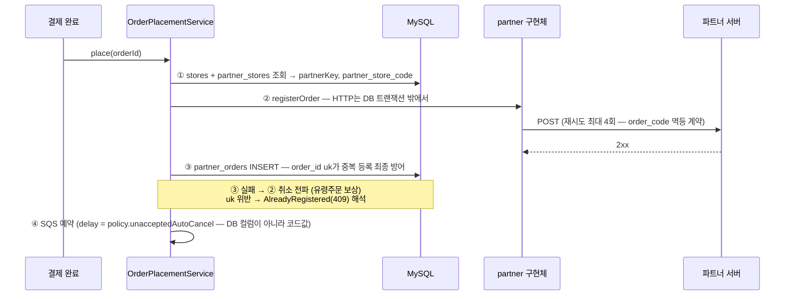
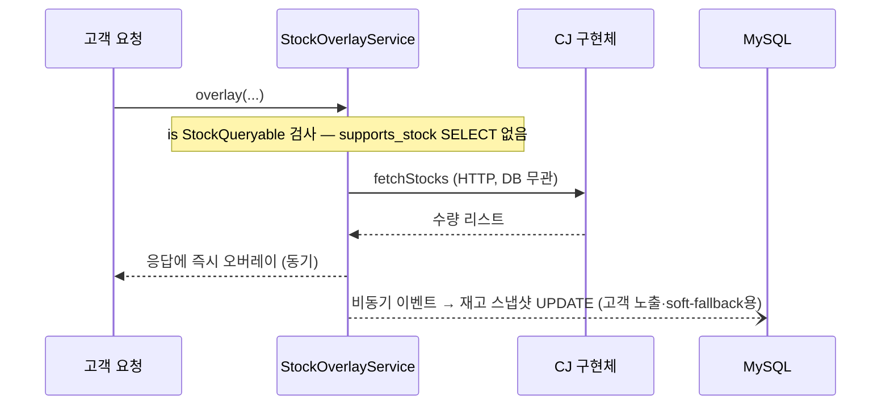

# DB 연동 — 코드로 올라간 것이 빠져나간 뒤, DB에는 무엇이 남는가

> TO-BE 구조에 실제 DB(AS-IS 스키마 기준)를 연결했을 때의 동작 정리.
> 원칙은 하나다: **행동은 코드, 상태는 DB.** 파트너의 "어떻게"(capability·정책·페이로드)는 코드가 갖고,
> 세상의 "지금"(어느 매장이 어느 파트너인지, 주문이 어디까지 갔는지, POS가 열려 있는지)은 DB가 갖는다.

---

## 1. 테이블별 운명

### `partners` — 대폭 다이어트, 그러나 소멸하지는 않는다

| 컬럼 | AS-IS 역할 | TO-BE |
|---|---|---|
| `name` (ux) | URL path 검증, 파트너 식별 | **유지** — 코드의 `PartnerKey.name`과 1:1 매핑되는 유일한 접점 |
| `api_key`, `whitelist_ips` | 인바운드 토큰 발급 인증 | **유지** — 인바운드 인증은 환경·운영 데이터 (재설계 스코프 밖) |
| `base_url` | 아웃바운드 대상 | **제거** → yml (`partner-pos.endpoints`) |
| `auth_key` (평문 TODO) | 아웃바운드 Bearer | **제거** → 환경변수/시크릿 스토어 (P7 해소) |
| `supports_stock`, `supports_store_registration` | capability 게이트 | **제거** → `StockQueryable`/`StoreRegistrable` 구현 여부 |
| `order_delayed_accept_seconds` | 자동취소 delay | **제거** → `PartnerPolicy` (구현체 선언) |
| `register/cancel_order_api_path` | path override | **제거** → 구현체 상수 |

테이블이 남는 이유 두 가지: ① `partner_stores`·`partner_orders`·`partner_tokens`의 FK 앵커,
② 인바운드 인증 데이터의 집. 즉 **"파트너 마스터"에서 "파트너 정체성 + 인바운드 자격증명"으로 역할이 축소**된다.

### 나머지는 전부 그대로 — 운영 상태이기 때문

| 테이블 | 유지 이유 |
|---|---|
| `stores.partner_type` + `partner_stores` | "이 매장이 어느 파트너인가"는 운영 데이터 — dispatch의 입력값. (선택: enum+partner_id 2단을 `partner_key` varchar 1단으로 단순화 가능) |
| `partner_stores.is_pos_open`, `deleted_at` | POS 개폐점 신호·연동 해지 — 시시각각 변하는 상태 |
| `partner_orders` (order_id uk) | **중복 등록 멱등의 최종 방어선은 DB 유니크 제약만이 제공** — 코드로 대체 불가능한 것의 대표 |
| `orders.order_code` (16자 uk) | 파트너 왕복의 주문 식별자 채번 원장 |
| `partner_tokens` | 인바운드 토큰 (스코프 밖) |

## 2. 코드 ↔ DB의 유일한 접점: PartnerKey ↔ partners.name

AS-IS에서 URL path와 `name` 컬럼을 문자열 비교하던 그 지점이, TO-BE에서는 **기동 시 대사(reconciliation)** 로 옮겨간다:

```kotlin
@Component
class PartnerRegistryReconciler(
    private val registry: DirectPosPartnerRegistry,
    private val partnerRepository: PartnerRepository,   // partners 테이블
) : ApplicationRunner {
    override fun run(args: ApplicationArguments) {
        val dbNames = partnerRepository.findAllNames().toSet()          // DB의 정체성
        val codeNames = registry.keys.map { it.name }.toSet()           // 코드의 구현체

        val notImplemented = dbNames - codeNames   // row는 있는데 구현이 없다 → 주문이 터질 파트너
        val notRegistered = codeNames - dbNames    // 구현은 있는데 row가 없다 → FK 걸 수 없는 파트너
        check(notImplemented.isEmpty() && notRegistered.isEmpty()) {
            "partner code-DB drift: missing impl=$notImplemented, missing row=$notRegistered"
        }
    }
}
```

이 검증이 있어야 "새 파트너 추가 = 구현 1파일 + yml + **row INSERT(정체성만)**"의 3요소 중
하나를 빠뜨린 배포가 **런타임 주문 실패가 아니라 기동 실패**로 잡힌다. AS-IS에서 런타임 문자열
비교였던 계약이 기동 시점 fail-fast로 승격되는 것.

## 3. 플로우가 DB와 만나는 지점

### 3-1. 주문 등록 — 트랜잭션 경계가 핵심



- **HTTP를 DB 트랜잭션 안에 가두지 않는다.** read 10s × 재시도 4회를 트랜잭션이 물고 있으면 커넥션
  풀이 마른다. AS-IS에 "등록 성공 후 저장 실패"라는 보상 케이스가 존재했다는 것 자체가 둘이 분리되어
  있었다는 증거이고, TO-BE도 같은 경계를 유지한다 — 분리의 대가(보상 취소)는 이미 구현되어 있다.
- 달라진 것: ④의 delay가 `partners.order_delayed_accept_seconds` SELECT가 아니라
  `registry[key].policy` 메모리 참조다. **주문 경로에서 partners 테이블 조회가 사라진다.**

### 3-2. 재고 조회 — 동기 조회, 비동기 반영 (AS-IS 확인 사항 재현)



soft 실패 시 fallback으로 쓰는 "DB 값"이 바로 이 비동기 스냅샷이다 — 조회 경로와 반영 경로의
분리가 fallback 데이터의 출처를 설명한다.

### 3-3. 매장 활성화 / 해지

```
활성화: partner_stores INSERT (side-table 생성)
      → partner is StoreRegistrable 이면 registerStore 성공이 전제 (hard 의존)
      → stores.status = ACTIVE
해지:   partner_stores.deleted_at = now() (soft-delete — 재입점 이력 추적)
      → StoreRegistrable 이면 unregisterStore 전파
POS 개폐점: 인바운드가 is_pos_open 갱신 (스코프 밖) — 운영상태 판정이 읽음
```

## 4. 마이그레이션 경로 — 컬럼을 어떻게 안전하게 죽이나

운영 중인 시스템이라면 partners 컬럼 제거는 3단계:

1. **이중 읽기 검증**: 코드값(policy·capability)을 사용하되, 기존 컬럼값과 비교해 불일치를 로깅.
   배포 후 한동안 "코드가 DB를 정확히 흡수했는가"를 데이터로 증명한다.
2. **읽기 전환**: 컬럼 참조 코드 제거. 이 시점부터 컬럼은 죽은 데이터.
3. **컬럼 DROP**: 마이그레이션으로 제거. 롤백 대비로 1~2 릴리즈 간격을 둔다.

이 순서가 필요한 이유: 정책값은 파트너와의 계약이라 **코드 이관 과정에서 값을 잘못 옮기면 그 자체가
장애**다 (자동취소 300s를 600s로 잘못 적으면 롯데 계약 위반). 1단계의 비교 로깅이 그 보험.

## 5. 구현 관점 — 포트에 어댑터만 꽂힌다

이 리포지토리의 코드는 이미 포트로 분리되어 있어 DB 연동은 어댑터 추가로 끝난다:

| 포트 (현재 인메모리) | DB 어댑터 |
|---|---|
| `PartnerOrderMappingRepository` | `partner_orders` JPA/JDBC — `save`의 중복 검사를 uk 제약 + `DataIntegrityViolationException` 해석으로 교체 |
| (신규) `StoreRepository` | `stores` + `partner_stores` 조회 — place() 진입 시 partnerKey 결정 |
| (신규) `PartnerRepository` | §2 기동 대사용 `findAllNames()` |

파트너 계층(`partner/`)과 계약(`contract/`)은 **한 줄도 바뀌지 않는다** — DB는 애플리케이션 계층
바깥의 세부사항이라는 것이 이 구조의 검증 포인트다.
