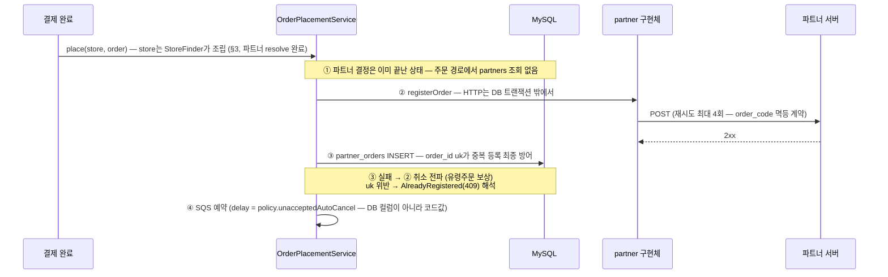
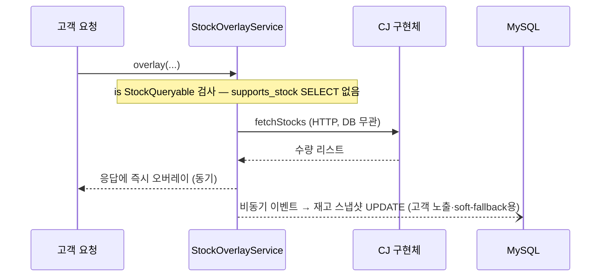

# DB 연동 — 코드로 올라간 것이 빠져나간 뒤, DB에는 무엇이 남는가

> TO-BE 구조에 실제 DB(AS-IS 스키마 기준)를 연결했을 때의 동작 정리.
> 원칙은 하나다: **행동은 코드, 상태는 DB.** 파트너의 "어떻게"(capability·정책·페이로드)는 코드가 갖고,
> 세상의 "지금"(어느 매장이 어느 파트너인지, 주문이 어디까지 갔는지, POS가 열려 있는지)은 DB가 갖는다.

---

## 1. 테이블별 운명

### `partners` — 대폭 다이어트, 그러나 소멸하지는 않는다

| 컬럼 | AS-IS 역할 | TO-BE |
|---|---|---|
| `name` (ux) | URL path 검증, 파트너 식별 | **유지** — 표시·인바운드 URL 검증 용도로 한정. dispatch 식별자 역할은 신설 `partner_key`로 이관 |
| `partner_key` (신설, ux) | — | **추가** (03 결정 D8) — 코드 `PartnerKey`와 1:1 매핑되는 **안정 식별자**. name(변경 가능)과 분리해 이름 변경이 dispatch를 깨지 않게 한다. TO-BE의 유일한 스키마 추가 |
| `api_key`, `whitelist_ips` | 인바운드 토큰 발급 인증 | **유지** — 인바운드 인증은 환경·운영 데이터 (재설계 스코프 밖) |
| `base_url` | 아웃바운드 대상 | **제거** → yml (`partner-pos.endpoints`) |
| `auth_key` (평문 TODO) | 아웃바운드 Bearer | **제거** → 환경변수/시크릿 스토어 (P7 해소) |
| `supports_stock`, `supports_store_registration` | capability 게이트 | **제거** → `StockQueryable`/`StoreRegistrable` 구현 여부 |
| `order_delayed_accept_seconds` | 자동취소 delay | **제거** → `PartnerPolicy` (구현체 선언) |
| `register/cancel_order_api_path` | path override | **제거** → 구현체 상수 |

테이블이 남는 이유 두 가지: ① `partner_stores`·`partner_orders`·`partner_tokens`의 FK 앵커,
② 인바운드 인증 데이터의 집. 즉 **"파트너 마스터"에서 "파트너 정체성 + 인바운드 자격증명"으로 역할이 축소**된다.

### 나머지는 전부 그대로 — 운영 상태이기 때문

| 테이블 | 유지 이유 |
|---|---|
| `stores.partner_type` + `partner_stores` | "이 매장이 어느 파트너인가"는 운영 데이터 — dispatch의 입력값. (`partner_key` varchar 직접 저장으로 단순화하는 B안은 검토 후 기각 — 기존 스키마 존중, 03 결정 D7) |
| `partner_stores.is_pos_open`, `deleted_at` | POS 개폐점 신호·연동 해지 — 시시각각 변하는 상태 |
| `partner_orders` (order_id uk) | **중복 등록 멱등의 최종 방어선은 DB 유니크 제약만이 제공** — 코드로 대체 불가능한 것의 대표 |
| `orders.order_code` (16자 uk) | 파트너 왕복의 주문 식별자 채번 원장 |
| `partner_tokens` | 인바운드 토큰 (스코프 밖) |

## 2. 코드 ↔ DB의 유일한 접점: PartnerKey ↔ partners.partner_key

AS-IS에서 URL path와 `name` 컬럼을 문자열 비교하던 그 지점이, TO-BE에서는 **기동 시 대사(reconciliation)** 로 옮겨간다:

```kotlin
@Component
class PartnerRegistryReconciler(
    private val registry: DirectPosPartnerRegistry,
    private val partnerRepository: PartnerRepository,   // partners 테이블
) : ApplicationRunner {
    override fun run(args: ApplicationArguments) {
        val dbKeys = partnerRepository.findAllKeys().toSet()            // DB의 정체성 (partner_key)
        val codeKeys = registry.keys.map { it.name }.toSet()            // 코드의 구현체

        val notImplemented = dbKeys - codeKeys     // row는 있는데 구현이 없다 → 주문이 터질 파트너
        val notRegistered = codeKeys - dbKeys      // 구현은 있는데 row가 없다 → FK 걸 수 없는 파트너
        check(notImplemented.isEmpty() && notRegistered.isEmpty()) {
            "partner code-DB drift: missing impl=$notImplemented, missing row=$notRegistered"
        }
    }
}
```

이 검증이 있어야 "새 파트너 추가 = 구현 1파일 + yml + **row INSERT(정체성만)**"의 3요소 중
하나를 빠뜨린 배포가 **런타임 주문 실패가 아니라 기동 실패**로 잡힌다. AS-IS에서 런타임 문자열
비교였던 계약이 기동 시점 fail-fast로 승격되는 것.

### 2-1. 이 동기화 비용의 정체 — 분산 enum

파트너 키가 DB(`partners.partner_key`)와 코드(`PartnerKey` 선언) 두 곳에 정의되는 것은 **분산 enum**이며,
행동을 코드로 올리고 정체성을 DB에 남긴 하이브리드 설계의 **필연적 이음새**다 (우발적 복잡성이 아님).
없애는 방법은 전부 DB로(AS-IS 회귀) 또는 전부 코드로(FK·매장별 운영 데이터 상실) 뿐이라 둘 다 기각.
결제수단 코드↔핸들러처럼 "코드 테이블 + 전략 레지스트리"를 쓰는 시스템의 표준 이음새이고, 3중 방어가 있다:

1. 기동 대사 (§2) — drift는 기동 실패
2. registry의 미등록 키 fail-loud — 조립 시점 2차 방어
3. 파트너 추가는 어차피 코드 배포 필요 → row INSERT와 배포가 자연히 한 작업 단위

규율 하나가 따라온다: **키 값은 안정 식별자**(통화 코드처럼 rename 금지 — rename은 마이그레이션 이벤트)다.

### 2-2. partners 테이블이 실제로 읽히는 순간

| 시점 | 무엇을 읽나 | 빈도 |
|---|---|---|
| 매장 조립 (StoreFinder, §3) | `partner_stores.partner_id` → `partners.partner_key` — id→키 번역 | 매장 조회마다 (작은 불변 테이블이라 조인/캐시 비용 무시 가능) |
| 인바운드 인증 (스코프 밖) | `api_key`·`whitelist_ips` 검증, URL `{partnerType}`↔`name` 대조 | 토큰 발급/검증마다 — **실질적으로 가장 일하는 곳** |
| 기동 대사 (§2) | `findAllNames()` | 배포마다 1회 |

그 외에는 FK 앵커로 존재하며, 쓰기는 파트너 온보딩 시 row INSERT 한 번뿐이다.

## 3. 매장 조립 — StoreFinder와 Store 도메인 모델 (03 결정 D6·D7)

"이 매장은 누구와 통신하는가"는 매장 조회 시점에 확정된다. AS-IS의 StoreFinder 컨벤션
(entity → 도메인 모델 조립 전담)을 재현하되, 조립 시 파트너(행위)를 resolve해 함께 싣는다:

```
StoreFinder.find(storeId)
  ├ stores 조회 → partnerType
  ├ (INTEGRATED_PARTNER면) partner_stores 조회 → partner_id + partner_store_code
  ├ partners 조회 → partner_key (A안: id→key 번역, D8)
  └ registry[PartnerKey(partner_key)] → Store(partnerType, directPosPartner, partnerStoreCode)
                                  ↑ 데이터(key)가 행위(전략)로 번역되는 유일한 지점
```

**설계 결정의 요지:**
- **영속 모델과 도메인 모델의 분리가 전제**: entity(StoreRecord)는 데이터만, StoreFinder가 돌려주는
  Store(도메인 모델)가 resolve된 파트너를 든다. 싱글턴 빈을 영속 모델에 싣는 문제(직렬화·캐시·equals)를 회피.
- **기존 `partnerType: PartnerType` enum 유지**: sealed 재모델링은 기존 모델 호환·작업 범위상 기각(D6).
  잃는 타입 안전성은 Store 생성 시점의 양방향 불변식(INTEGRATED ⇔ 파트너 맥락 보유)으로 보완 —
  조립 지점이 StoreFinder 하나뿐이므로 잘못 조립된 Store는 존재 불가. 그래서 property를 직접 노출해도
  안전하다: `directPosPartner == null`이 곧 "직연동 아님"이고, 앱 서비스의 partnerType 분기가
  null 검사(`partner !is StockQueryable` 등)로 수렴한다.
- **registry 의존의 응집**: 앱 서비스 4곳이 각자 registry를 조회하던 구조가 StoreFinder 1곳으로 모이고,
  서비스 시그니처는 `(partnerKey, storeCode, …)` → `(store, …)`가 된다. 파트너측 매장 코드
  (`partner_store_code`)도 같은 맥락으로 조립되어, 재고 조회·매장 등록이 올바른 코드로 나간다.

## 4. 플로우가 DB와 만나는 지점

### 4-1. 주문 등록 — 트랜잭션 경계가 핵심



- **HTTP를 DB 트랜잭션 안에 가두지 않는다.** read 10s × 재시도 4회를 트랜잭션이 물고 있으면 커넥션
  풀이 마른다. AS-IS에 "등록 성공 후 저장 실패"라는 보상 케이스가 존재했다는 것 자체가 둘이 분리되어
  있었다는 증거이고, TO-BE도 같은 경계를 유지한다 — 분리의 대가(보상 취소)는 이미 구현되어 있다.
- 달라진 것: ④의 delay가 `partners.order_delayed_accept_seconds` SELECT가 아니라
  `registry[key].policy` 메모리 참조다. **주문 경로에서 partners 테이블 조회가 사라진다.**

### 4-2. 재고 조회 — 동기 조회, 비동기 반영 (AS-IS 확인 사항 재현)



soft 실패 시 fallback으로 쓰는 "DB 값"이 바로 이 비동기 스냅샷이다 — 조회 경로와 반영 경로의
분리가 fallback 데이터의 출처를 설명한다.

### 4-3. 매장 활성화 / 해지

```
활성화: partner_stores INSERT (side-table 생성)
      → partner is StoreRegistrable 이면 registerStore 성공이 전제 (hard 의존)
      → stores.status = ACTIVE
해지:   partner_stores.deleted_at = now() (soft-delete — 재입점 이력 추적)
      → StoreRegistrable 이면 unregisterStore 전파
POS 개폐점: 인바운드가 is_pos_open 갱신 (스코프 밖) — 운영상태 판정이 읽음
```

## 5. 마이그레이션 경로 — 컬럼을 어떻게 안전하게 죽이나

신설은 `partner_key` 컬럼 하나(추가 + 백필 + ux — 안전한 additive 변경)이고,
제거가 문제다. 운영 중인 시스템이라면 partners 컬럼 제거는 3단계:

1. **이중 읽기 검증**: 코드값(policy·capability)을 사용하되, 기존 컬럼값과 비교해 불일치를 로깅.
   배포 후 한동안 "코드가 DB를 정확히 흡수했는가"를 데이터로 증명한다.
2. **읽기 전환**: 컬럼 참조 코드 제거. 이 시점부터 컬럼은 죽은 데이터.
3. **컬럼 DROP**: 마이그레이션으로 제거. 롤백 대비로 1~2 릴리즈 간격을 둔다.

이 순서가 필요한 이유: 정책값은 파트너와의 계약이라 **코드 이관 과정에서 값을 잘못 옮기면 그 자체가
장애**다 (자동취소 300s를 600s로 잘못 적으면 롯데 계약 위반). 1단계의 비교 로깅이 그 보험.

## 6. 구현 관점 — 포트에 어댑터만 꽂힌다

이 리포지토리의 코드는 포트로 분리되어 있어 DB 연동은 어댑터 교체로 끝난다:

| 포트 (현재 인메모리 어댑터) | 대응 테이블 | DB 어댑터 시 유의점 |
|---|---|---|
| `PartnerOrderMappingRepository` | `partner_orders` | `save`의 중복 검사를 uk 제약 + `DataIntegrityViolationException` 해석으로 교체 |
| `StoreRecordRepository` | `stores` | StoreFinder 조립의 시작점 |
| `PartnerStoreLinkRepository` | `partner_stores` | partner_id + partner_store_code |
| `PartnerRecordRepository` | `partners` | 조립 시 id→key 번역(A안·D8) + 기동 대사 `findAllKeys()` |

파트너 계층(`partner/`)과 계약(`contract/`)은 **한 줄도 바뀌지 않는다** — DB는 애플리케이션 계층
바깥의 세부사항이라는 것이 이 구조의 검증 포인트다.
