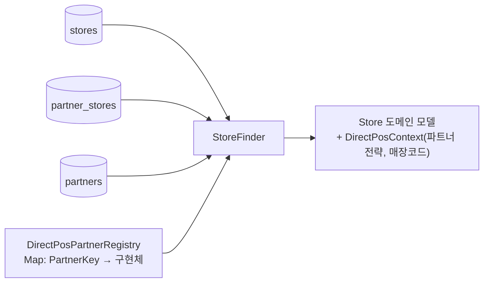

# Core 구조 — 주문 시스템 (order-system)

> 현재 코드베이스의 핵심 구조 스냅샷 (2026-08-18 기준, 테스트 50개 통과).
> 프로젝트는 **주문 시스템**이고, 직연동 POS 연동은 그 안의 첫 번째 도메인이다.

---

## 1. 계층 구조와 의존 방향

```
src/main/kotlin/karrot/partnerpos/
├── domain/     비즈니스 규칙 — 도메인별(order·menu·store·pos)로 나누고, 각각 model / application으로 구분
├── client/     외부 연동 구현 — transport(전송 규약) · direct(직연동 파트너 3종) · legacy(푸드테크·해피오더 포트)
├── infra/      영속 계층 — JPA 엔티티(*Entity) + Spring Data 리포지토리 (H2)
└── config/     환경 데이터·시크릿 바인딩(yml) + 클라이언트 빈 구성
```

**의존 규칙 (팀 컨벤션)**
- `domain`의 Finder/Writer가 **infra의 JPA 리포지토리를 직접 주입**받는다 — Finder/Writer가 추상화 지점이고,
  entity ↔ 도메인 모델 변환이 그 안에서 일어난다. 별도 포트 인터페이스 층은 두지 않는다.
- 도메인 모델은 `domain/*/model`에, 영속 표현은 `infra`의 `*Entity`에 — 서로 섞이지 않는다.
- `client`는 도메인의 계약(`DirectPosPartner` 등)을 구현하고, `config`가 환경값을 꽂아준다.

## 2. 영속 계층 컨벤션

| 규칙 | 예 |
|---|---|
| 테이블명은 복수형 `*s` | `stores`, `partners`, `partner_stores`, `partner_orders` |
| 엔티티는 `*Entity` | `StoreEntity`, `PartnerEntity`, `PartnerStoreEntity`, `PartnerOrderEntity` |
| 도메인 객체는 `model`에 | `Store`, `PosOrder`, `MenuStock` … |
| Finder가 리포지토리 주입 → entity 조회 → 도메인 모델 변환 | `StoreFinder`: `StoreEntity` → `Store` |

### 테이블 4종 (지금 요구사항의 최소 구성)

| 테이블 | 핵심 컬럼 | 역할 |
|---|---|---|
| `stores` | `partner_type` | 매장 원장 — 파트너 타입 분기의 시작점 |
| `partners` | `partner_key` (uk) | 다이어트된 파트너 마스터 — 정체성 + FK 앵커만 남음 (docs/06 §1) |
| `partner_stores` | `store_id` (uk), (`partner_id`,`partner_store_code`) (uk) | 직연동 매장 side-table |
| `partner_orders` | `order_code` (uk) | 주문 매핑 원장 — **uk가 중복 등록 멱등의 최종 방어선** |

- 스키마는 데모용으로 Hibernate `create-drop`, 시드는 `data.sql`(파트너 3종 + 데모 매장 1곳).
- 파트너 시드는 코드의 구현 3종과 1:1이어야 하며, 불일치는 `PartnerRegistryReconciler`가 **기동 실패**로 잡는다.

## 3. 데이터 → 행위 조립 경로 (핵심 메커니즘)



`StoreFinder.find(storeId)`가 유일한 조립 지점이다: stores → partner_stores → partners(id→key 번역) →
registry에서 파트너 **전략(행위)** 을 resolve해 `Store`에 실어 준다. 이후 앱 서비스들은 파트너가 누구인지
모른 채 `Store`가 물고 온 맥락으로만 동작한다.

## 4. 도메인별 컴포넌트 맵

| 도메인 | application | 역할 |
|---|---|---|
| order | `OrderPlacementService` | 결제 완료 → 파트너 등록 → 매핑 저장, 유령주문 보상(등록 후 저장 실패 → 취소 전파), 자동취소 예약(의사코드) |
| order | `PosOrderSynchronizer` | 주문 등록/취소의 파트너 타입 분기 (직연동=전략 / 푸드테크·해피오더=레거시 / KARROT=no-op) |
| order | `PosOrderWriter` → `PartnerOrderWriter` | 매핑 저장의 타입 분기 → `partner_orders` 쓰기, uk 위반을 도메인 예외로 해석 (AS-IS 409) |
| order | `OrderCancelPropagator` | 당근발 취소의 best-effort 전파 |
| menu | `StockOverlayService` → `PosStockFinder` | 실시간 재고 오버레이 — soft/hard는 구매 단계(PurchaseStage) 속성, 재고 지원은 capability(`StockQueryable`) |
| store | `StoreFinder` | entity → `Store` 조립 (§3) |
| store | `StoreActivationService` → `PosStoreRegistrar` | 활성화 — 매장 등록 지원 파트너(`StoreRegistrable`)는 등록 성공이 활성화의 전제 |
| pos | `DirectPosPartnerRegistry` | keyed dispatch (Spring이 구현체 수집, 중복 키 기동 실패) |
| pos | `PartnerRegistryReconciler` | 코드↔DB 분산 enum의 기동 대사 |

파트너 계약(`domain/pos/model`): `DirectPosPartner`(필수: 주문 등록/취소 + policy) + capability 2종
(`StockQueryable`, `StoreRegistrable`) + `PartnerPolicy`(계약값). 구현은 `client/direct`에 파트너당 1파일
(CJ 풀세트 / 롯데 최소셋 / 버거킹 페이로드 확장) — **파트너 1곳의 전모가 파일 1개**다.

## 5. 테스트 맵 (50개)

| 종류 | 대상 | 파일 |
|---|---|---|
| 전송 규약 | 재시도 4회·Bearer·status 판정 (MockRestServiceServer) | `client/transport/PosApiTransportTest` |
| 파트너 계약 | 실제 요청 페이로드·path (버거킹 결제수단 포함) | `client/direct/CjPartnerTest` · `BurgerKingPartnerTest` |
| 타입 분기 | 주문/재고/매장의 4유형 라우팅 | `PosDispatchTest` |
| 영속 (H2) | entity→모델 조립, uk 방어, 기동 대사, 보상 흐름 | `StoreFinderTest` · `PosOrderWriterTest` · `OrderPlacementServiceTest` · `PartnerRegistryReconcilerTest` (@DataJpaTest) |
| 확장 데모 | 새 파트너 = 구현 1파일 + row INSERT (기존 코드 수정 0) | `NewPartnerExtensionTest` |
| 기동 | 스키마 생성 + 시드 + 기동 대사 통과 | `OrderSystemApplicationTests` |
