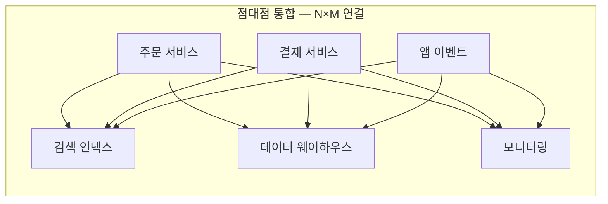
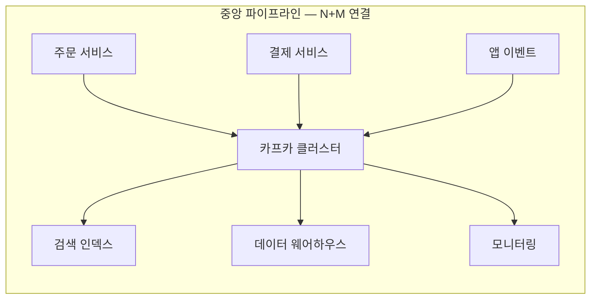
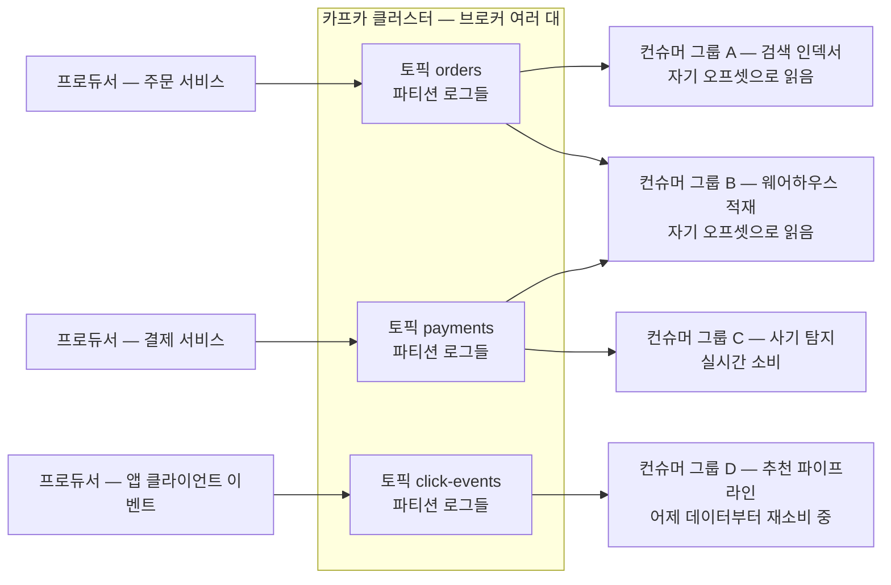

# 왜 카프카인가 — 탄생 배경과 핵심 아이디어

> 카프카 0-to-100 시리즈 00편. 이 편은 "카프카가 무엇을 푸는 도구인가"를 다룬다.
> 토픽·파티션·오프셋 같은 구체적 개념은 `01-core-concepts.md`에서, 로그가 디스크에 어떻게 저장되는지는 `02-storage-internals.md`에서 이어진다.

---

## 1. 문제 설정 — 시스템 간 데이터 흐름의 폭발 🟢

### 1.1 N×M 통합 문제

서비스가 작을 때 데이터 흐름은 단순하다. 애플리케이션 하나가 데이터베이스 하나에 쓰고, 거기서 끝난다. 그런데 서비스가 성장하면 데이터를 **만들어내는 시스템**과 데이터를 **필요로 하는 시스템**이 각각 늘어난다.

- 만들어내는 쪽(소스, source): 주문 서비스, 결제 서비스, 웹 서버 액세스 로그, 앱 클라이언트 이벤트, IoT 센서…
- 필요로 하는 쪽(싱크, sink): 검색 인덱스, 추천 시스템, 데이터 웨어하우스, 캐시, 모니터링, 사기 탐지…

이 둘을 점대점(point-to-point)으로 직접 연결하면 어떻게 될까. 소스가 N개, 싱크가 M개면 연결(파이프라인)은 최대 **N×M개**가 된다. 소스 5개 × 싱크 5개면 벌써 25개다. 각 연결마다 프로토콜, 데이터 포맷, 재시도 정책, 장애 처리 방식이 제각각이고, 새 시스템 하나를 추가할 때마다 기존 시스템 전부를 건드려야 한다.

가운데에 **모든 시스템이 합의한 단일 데이터 허브**를 두면 연결 수는 N×M에서 **N+M**으로 줄어든다. 소스는 허브에 한 번만 쓰고, 싱크는 허브에서 한 번만 읽는다. 새 싱크가 생겨도 소스는 아무것도 바꿀 필요가 없다. 카프카는 정확히 이 자리, "조직의 중앙 신경계" 자리를 노리고 설계된 시스템이다.

비유하자면 **전원 콘센트 규격**과 같다. 발전소(소스)와 가전제품(싱크)이 서로를 직접 알 필요 없이, 220V 콘센트라는 합의된 인터페이스만 지키면 된다. 다만 비유의 한계도 있다. 전기는 흘러가면 사라지지만, 카프카의 데이터는 소비된 뒤에도 남는다. 이 차이가 뒤에서 다룰 핵심 아이디어다.

### 1.2 배치에서 실시간으로 🟢

두 번째 압력은 **시간 축**에서 왔다. 전통적 데이터 통합은 배치(batch)였다. 하루에 한 번, 밤중에 ETL(Extract-Transform-Load) 잡이 돌면서 운영 DB의 데이터를 데이터 웨어하우스로 옮긴다. "어제까지의 데이터"로 리포트를 만드는 데는 충분했다.

그러나 요구사항이 바뀌었다.

- 사기 거래 탐지는 결제 **직후** 몇 초 안에 판단해야 의미가 있다.
- 추천 시스템은 사용자가 방금 본 상품을 **지금** 반영해야 한다.
- 장애 모니터링에서 "어제 서버가 죽었다"는 리포트는 쓸모가 없다.

즉 데이터는 하루치 덩어리(파일)가 아니라 **끊임없이 발생하는 이벤트의 흐름(stream)**으로 다뤄져야 했다. 배치는 스트림의 특수한 경우(스트림을 하루 단위로 잘라 모은 것)일 뿐이라는 관점의 전환이 일어났고, 이 흐름을 받아낼 기반 인프라가 필요해졌다. 파일 기반 ETL 도구는 실시간성이 없고, 당시의 메시지 큐는 이 규모의 처리량을 감당하지 못했다. 왜 못했는지가 다음 절의 주제다.

---

## 2. 전통 메시지 큐 모델과 그 한계 🟢

### 2.1 브로커가 소비 상태를 책임지는 구조

RabbitMQ, ActiveMQ 같은 전통적 메시지 브로커(message broker)는 대략 이렇게 동작한다.

1. 프로듀서(producer)가 큐(queue)에 메시지를 넣는다.
2. 브로커가 메시지를 컨슈머(consumer)에게 **밀어 넣는다**(push).
3. 컨슈머가 처리 완료를 확인 응답(acknowledgement, ack)으로 알린다.
4. 브로커는 ack를 받은 메시지를 **삭제**한다.

핵심은 **"누가 어떤 메시지를 어디까지 처리했는가"라는 소비 상태를 브로커가 전부 기억하고 관리한다**는 점이다. 우체국에 비유하면, 우체국이 모든 수취인의 수령 여부를 편지 한 통 단위로 장부에 기록하고, 수령이 확인된 편지는 즉시 소각하는 방식이다.

이 모델은 작업 큐(task queue) 용도 — "이 작업을 딱 한 번, 아무 워커나 처리해라" — 에는 자연스럽다. 문제는 규모가 커질 때다.

### 2.2 이 구조가 스케일에서 무너지는 이유 🟢

**첫째, 메시지 단위 상태 관리 비용.** 브로커가 메시지마다 전달됨/ack됨/재전송 필요 같은 상태를 추적해야 한다. 초당 수백만 건이 흐르면 이 메타데이터 관리 자체가 병목이 된다. 랜덤 액세스로 개별 메시지를 찾아 지우는 작업은 디스크에게 가장 불리한 워크로드다.

**둘째, 팬아웃(fan-out) 비용.** 같은 데이터를 검색 인덱스도, 웨어하우스도, 모니터링도 받고 싶다면? 삭제 기반 모델에서는 컨슈머 그룹마다 메시지를 **복사**해서 각자의 큐에 넣어야 한다. 컨슈머가 10팀이면 저장량과 상태 관리가 10배가 된다. 발행-구독(pub/sub) 익스체인지가 이를 지원하긴 하지만, 결국 큐 개수만큼 메시지가 복제되는 본질은 같다.

**셋째, 느린 컨슈머가 브로커를 압박한다.** 삭제 기반 브로커는 "소비되지 않은 메시지"를 특별한 부채로 취급한다. 컨슈머 하나가 느려지면 미확인 메시지가 브로커 메모리와 인덱스에 쌓이고, 브로커 전체 성능이 떨어지며, 다른 컨슈머까지 피해를 본다. 컨슈머의 문제가 프로듀서와 브로커의 문제로 전염된다.

**넷째, 재소비가 불가능하다.** 컨슈머 코드에 버그가 있어서 지난 3시간치 데이터를 잘못 처리했다면? 메시지는 이미 삭제됐다. 다시 읽을 방법이 없다. 새 팀이 "지난 일주일 데이터로 모델을 학습하고 싶다"고 해도 줄 데이터가 없다.

**다섯째, push 모델의 배압(backpressure) 문제.** 브로커가 컨슈머 속도를 고려하지 않고 밀어 넣으면 컨슈머가 압사한다. 이를 막으려면 브로커가 컨슈머별 처리 속도까지 추적해야 하고, 상태 관리 부담이 또 늘어난다.

정리하면, **브로커가 소비를 책임지는 순간 브로커는 모든 컨슈머의 사정을 다 알아야 하는 존재가 되고, 그 지식의 총량이 시스템의 상한선이 된다.**

### 2.3 LinkedIn의 상황 🟢

2010년경 LinkedIn이 정확히 이 벽에 부딪혔다. 사용자 활동 이벤트(페이지 뷰, 검색, 클릭)와 운영 메트릭이 하루 수십억 건 규모로 쏟아졌고, 이를 실시간 모니터링·검색 인덱싱·추천·웨어하우스 적재 등 수많은 시스템이 각자 원했다. 기존 메시지 큐로는 처리량이 부족했고, 파이프라인은 점대점으로 얽혀 유지보수 불가능한 상태로 가고 있었다.

Jay Kreps, Neha Narkhede, Jun Rao가 이 문제를 풀기 위해 만든 것이 카프카다. 2011년 초 오픈소스로 공개되었고, 2012년 아파치 최상위 프로젝트(Apache Top-Level Project)가 되었다. 이름은 소설가 프란츠 카프카에서 따왔다 — "쓰기(writing)에 최적화된 시스템"이라는 농담 섞인 작명이다.

---

## 3. 핵심 아이디어 — 분산·복제되는 append-only 커밋 로그 🟢

카프카의 설계를 한 문장으로 압축하면 이렇다.

> **카프카는 메시지 큐가 아니라, 분산되고 복제되는 append-only 커밋 로그(commit log)다.**

이 문장을 단어별로 뜯어보자.

### 3.1 커밋 로그란 무엇인가

커밋 로그는 데이터베이스 내부에서 오래전부터 쓰이던 구조다. **레코드를 끝에만 덧붙이고(append-only), 한번 쓴 것은 수정하지 않으며, 순서가 곧 시간인** 파일. DB의 WAL(Write-Ahead Log)이나 복제 로그가 바로 이것이다.

카프카의 통찰은 단순하다. **"DB 내부 구현으로 숨어 있던 로그를 시스템 간 통합의 일급 인터페이스로 꺼내자."**

로그 구조가 주는 이점은 다음과 같다.

- **순차 쓰기.** 디스크는 랜덤 액세스에는 느리지만 순차 쓰기·순차 읽기에는 매우 빠르다. append-only 로그는 디스크의 가장 빠른 사용법과 정확히 일치한다. (제로카피, 페이지 캐시 활용 등 구체 메커니즘은 `02-storage-internals.md`.)
- **순서 보장.** 로그의 위치가 곧 순서다. "3번 다음 4번"은 구조 자체가 보장하므로 별도 관리가 필요 없다.
- **단순한 주소 체계.** 각 레코드는 로그 안의 위치 번호 하나로 유일하게 식별된다. 이 번호가 **오프셋(offset)**이다.

### 3.2 컨슈머가 오프셋을 스스로 관리한다 🟢

여기가 전통 메시지 큐와의 결정적 분기점이다.

전통 브로커: "브로커가 각 컨슈머에게 무엇을 줬고 무엇이 ack됐는지 전부 기억한다."

카프카: **"브로커는 로그를 보관할 뿐이다. 각 컨슈머는 '나는 오프셋 몇 번까지 읽었다'는 숫자 하나만 기억하면 된다."**

컨슈머는 브로커에게 "오프셋 1234부터 읽고 싶다"고 **당겨온다**(pull). 브로커 입장에서 컨슈머 100팀이 붙든 1팀이 붙든, 해야 할 일은 "요청받은 위치부터 순차 읽기로 돌려주기"뿐이다. 소비 상태의 관리 책임이 브로커에서 컨슈머로 넘어가면서 다음이 한꺼번에 풀린다.

- **팬아웃이 공짜에 가깝다.** 데이터는 한 벌만 존재하고, 컨슈머 그룹마다 각자의 오프셋으로 같은 로그를 읽는다. 컨슈머가 늘어도 저장량은 늘지 않는다.
- **느린 컨슈머가 남에게 피해를 주지 않는다.** 느린 컨슈머는 그저 오프셋이 뒤처질 뿐이다. 브로커에 미확인 메시지가 쌓이는 일이 없다.
- **배압이 자연스럽다.** pull 모델이므로 컨슈머는 자기 속도대로 가져간다.
- **재소비(replay)가 가능하다.** 오프셋은 그냥 숫자다. 버그를 고친 뒤 오프셋을 3시간 전 위치로 되감으면 그 구간을 다시 처리할 수 있다.

비유하자면 전통 큐가 "우체국이 배달하고 소각하는 우편"이라면, 카프카는 **"신문의 축쇄판 서가"**다. 신문사는 매일 지면을 서가에 꽂을 뿐이고, 독자마다 "나는 몇 월 며칠자까지 읽었다"는 책갈피를 각자 들고 다닌다. 독자가 백 명이어도 서가는 한 벌이고, 늦게 온 독자는 지난 호부터 읽으면 된다. 비유의 한계: 실제 서가와 달리 카프카는 보존 기간(retention)이 지난 로그를 정책에 따라 지우며, 파티션 때문에 "서가가 여러 줄"이라 전체 순서는 줄 단위로만 보장된다(자세한 것은 `01-core-concepts.md`).

### 3.3 "소비되어도 남는다"의 의미 🟢

카프카에서 **읽기는 삭제가 아니다.** 데이터의 수명은 소비 여부가 아니라 **보존 정책**(`retention.ms`, `retention.bytes`, 또는 로그 컴팩션 `cleanup.policy=compact`)이 결정한다. 이 한 가지 결정이 카프카의 정체성을 바꾼다.

- 메시지 큐는 "전달 중인 데이터의 임시 대기소"다. 데이터가 지나가는 곳.
- 카프카는 "이벤트의 기록 저장소"다. 데이터가 **머무는** 곳.

그래서 카프카는 통신 수단이면서 동시에 **일종의 스토리지**다. 며칠~수주치 이벤트가 항상 남아 있으므로, 새로운 컨슈머를 언제든 과거 시점부터 투입할 수 있고, 장애 복구·재처리·감사(audit)가 구조적으로 가능하다.

### 3.4 분산과 복제 🟢

"append-only 로그" 앞에 붙은 **분산(partitioned)**과 **복제(replicated)**가 스케일과 내구성을 담당한다.

- **분산**: 하나의 토픽(topic)을 여러 파티션(partition)으로 쪼개 여러 브로커에 나눠 담는다. 쓰기와 읽기가 수평 확장된다. 단일 큐 서버의 처리량 한계가 사라진다.
- **복제**: 각 파티션을 여러 브로커에 복사해 두어(`replication.factor`), 브로커가 죽어도 데이터를 잃지 않고 서비스가 계속된다. 복제 프로토콜과 리더 선출은 `03-replication-and-controller.md`에서 깊게 다룬다.

즉 카프카 = **커밋 로그의 단순함** × **분산 시스템의 확장성·내구성**이다.

### 3.5 전체 조감도 🟢

아래 그림이 이 시리즈 전체의 지도다. 프로듀서들이 토픽에 쓰고, 서로 다른 컨슈머 그룹이 **같은 데이터를 각자의 오프셋으로 독립적으로** 읽는다.

주목할 점: 그룹 A와 그룹 B는 같은 토픽 orders를 읽지만 서로의 존재를 모르고, 서로의 속도에 영향을 주지 않는다. 그룹 D는 지금 막 투입되어 과거 오프셋부터 따라잡는 중이다. 전통 큐에서는 이 그림 자체가 성립하지 않는다.

---

## 4. 메시지 큐 vs 이벤트 로그 비교 🟢

| 관점 | 전통 메시지 큐 — RabbitMQ 류 | 이벤트 로그 — 카프카 |
|---|---|---|
| 전달 모델 | 브로커가 컨슈머에게 push, 스마트 브로커·단순 컨슈머 | 컨슈머가 pull, 단순 브로커·스마트 컨슈머 |
| 소비 상태 | 브로커가 메시지 단위로 전달·ack 상태를 관리 | 컨슈머 그룹이 오프셋 숫자 하나로 스스로 관리 |
| 소비 후 데이터 | ack 즉시 삭제 — 데이터는 지나감 | 보존 정책까지 유지 — 데이터는 남음 |
| 재소비 | 불가능 — 삭제됐으므로 | 오프셋 되감기로 언제든 가능 |
| 팬아웃 | 컨슈머 그룹 수만큼 큐·메시지 복제 필요 | 로그 한 벌을 N개 그룹이 독립 오프셋으로 공유 |
| 순서 | 재전송·경쟁 소비 시 쉽게 깨짐 | 파티션 안에서는 항상 보장 |
| 느린 컨슈머 | 브로커에 부담 누적, 전체에 전염 | 오프셋 랙으로만 나타남, 격리됨 |
| 라우팅 | 익스체인지·바인딩 등 브로커 내 정교한 라우팅 | 토픽 구독이 기본, 라우팅은 컨슈머·스트림 처리 몫 |
| 잘 맞는 일 | 작업 분배, 요청 단위 처리, 복잡한 라우팅, 지연 큐 | 이벤트 스트림, 대용량 파이프라인, 다중 소비, 재처리 |

한 줄 요약: **큐는 "할 일 목록"이고 로그는 "일어난 일의 기록"이다.** 할 일은 끝나면 지우는 게 맞고, 기록은 남겨야 가치가 있다.

---

## 5. 이벤트 스트리밍 플랫폼으로의 진화 🟢→🟡

카프카는 "로그 수집 파이프라인"으로 태어났지만, 커뮤니티와 (창시자들이 2014년 설립한) Confluent를 중심으로 **이벤트 스트리밍 플랫폼**으로 진화했다. 오늘날 카프카는 세 가지 능력의 묶음이다.

1. **발행/구독**: 이벤트 스트림을 쓰고 읽는다. (코어)
2. **저장**: 이벤트를 내구성 있게, 원하는 만큼 보관한다. (코어)
3. **처리**: 스트림을 실시간으로 변환·집계·조인한다. (Kafka Streams, 그리고 외부 시스템 연동은 Kafka Connect — `07-ecosystem.md`)

아키텍처 관점에서는 마이크로서비스 간 비동기 통신의 중추, 이벤트 소싱(event sourcing)과 CQRS의 기반, CDC(Change Data Capture)를 통한 DB 간 동기화 축으로 쓰인다(패턴은 `08-architecture-patterns.md`).

역사 맥락 하나만 짚고 가자. **ZooKeeper**. 카프카는 오랫동안 클러스터 메타데이터 관리와 컨트롤러 선출을 외부 시스템인 ZooKeeper에 의존했다. 운영 부담(별도 클러스터 하나를 더 돌려야 함)과 확장 한계(파티션 수십만 개 규모에서 병목) 때문에, KIP-500을 시작으로 카프카 자신의 로그로 메타데이터를 관리하는 **KRaft(Kafka Raft)** 모드가 개발되었다. Kafka 3.3에서 KRaft가 프로덕션 준비 완료로 선언되었고, **Kafka 4.0부터 ZooKeeper가 완전히 제거되어 KRaft 전용**이 되었다. "자기 문제를 자기 핵심 아이디어(복제되는 로그)로 풀었다"는 점이 흥미로운 대목이다. 상세한 동작은 `03-replication-and-controller.md`에서 다룬다.

이 시리즈는 Kafka 4.x, KRaft 전용을 기준으로 한다. ZooKeeper는 앞으로도 역사·비교 맥락으로만 등장한다.

---

## 6. 카프카가 맞는 선택인 경우 / 아닌 경우 🟢

### 6.1 카프카가 잘 맞는 경우

- **여러 시스템이 같은 데이터를 원한다.** 팬아웃이 핵심 요구일 때. N×M 문제를 겪고 있다면 가장 확실한 신호다.
- **처리량이 크다.** 초당 수만~수백만 건의 이벤트. 로그 수집, 클릭스트림, 메트릭, IoT.
- **재처리·재소비가 필요하다.** 컨슈머 버그 복구, 신규 컨슈머의 과거 데이터 학습, 감사 로그.
- **순서가 중요하다.** 같은 키(예: 같은 주문 ID)의 이벤트를 발생 순서대로 처리해야 할 때. 파티션 내 순서 보장을 활용한다.
- **시스템 간 결합도를 낮추고 싶다.** 소스와 싱크가 서로의 존재·가용성·속도를 몰라도 되게 하고 싶을 때.
- **스트림 처리가 필요하다.** 실시간 집계, 윈도우 연산, 스트림 조인.

### 6.2 카프카가 맞지 않는 경우 — 오버엔지니어링 경고 🟢

카프카는 공짜가 아니다. 클러스터 운영, 파티션 설계, 컨슈머 그룹 리밸런싱, 스키마 관리, 모니터링 — 배워야 할 것과 운영해야 할 것이 많다(`06-operations-and-tuning.md`가 통째로 그 얘기다). 다음 경우라면 멈추고 다시 생각하라.

- **트래픽이 작다.** 하루 수만 건 수준의 작업 큐라면 RabbitMQ, AWS SQS, 혹은 DB 테이블 기반 큐로 충분하다. "나중에 커질지도 모르니까"는 대개 지금 카프카를 도입할 이유가 되지 못한다.
- **단순 작업 분배가 목적이다.** 이메일 발송, 이미지 리사이징 같은 "한 번 처리하고 끝"인 잡은 전통 큐의 홈그라운드다. 개별 메시지 ack, 처리 실패 시 재큐잉, 지연 실행 같은 기능은 큐 쪽이 자연스럽다.
- **요청-응답이 필요하다.** 호출 결과를 동기적으로 받아야 한다면 그냥 HTTP/gRPC를 써라. 카프카로 요청-응답을 흉내 내는 것은 대부분 잘못된 설계다.
- **메시지 단위의 복잡한 라우팅·우선순위·지연 큐가 핵심 요구다.** 브로커 내 라우팅 규칙, 우선순위 큐, TTL 후 데드레터 등은 RabbitMQ 류가 기본 기능으로 제공한다. 카프카에서는 전부 직접 구현해야 한다.
- **운영 인력이 없다.** 자체 운영이 부담이면 관리형 서비스(Confluent Cloud, AWS MSK 등)를 쓰거나, 그조차 과하면 더 단순한 도구를 선택하라.
- **데이터베이스가 필요한 자리다.** 카프카는 이벤트의 기록이지 조회용 저장소가 아니다. 키로 최신 상태를 조회하는 요구는 DB나 캐시의 일이다.

경험칙: **"이 데이터를 두 번째로 원하는 컨슈머가 나타났는가, 혹은 되감기가 필요해졌는가"** — 둘 다 아니오라면 카프카 없이 시작해도 늦지 않다.

---

## 7. 정리 🟢

- 문제: 점대점 통합의 N×M 폭발 + 배치에서 실시간으로의 전환.
- 전통 큐의 한계: 브로커가 소비 상태를 관리하고 소비 즉시 삭제하는 구조는 팬아웃·재소비·대규모 처리량에서 무너진다.
- 카프카의 답: **분산·복제되는 append-only 커밋 로그.** 브로커는 로그를 보관하고, 컨슈머는 오프셋을 스스로 관리하며, 데이터는 소비돼도 보존 정책까지 남는다.
- 결과: 저장량 증가 없는 팬아웃, 컨슈머 격리, 되감기 가능한 파이프라인, 그리고 발행/구독·저장·처리를 아우르는 이벤트 스트리밍 플랫폼.
- 단, 작은 트래픽의 단순 작업 큐에는 과하다. 문제의 모양이 "기록의 공유와 재생"일 때 카프카를 꺼내라.

다음 편 `01-core-concepts.md`에서 토픽, 파티션, 오프셋, 브로커, 컨슈머 그룹을 정식으로 정의한다.

---

## 면접 포인트

**Q1. 카프카와 RabbitMQ의 가장 근본적인 차이는 무엇인가?**

- 좋은 답변 뼈대: 기능 나열이 아니라 **소비 상태의 소유권**으로 시작한다. RabbitMQ는 브로커가 메시지 단위 전달·ack 상태를 관리하고 소비된 메시지를 삭제하는 "스마트 브로커" 모델, 카프카는 브로커가 append-only 로그만 보관하고 컨슈머가 오프셋으로 위치를 자가 관리하는 "스마트 컨슈머" 모델. 이 차이에서 팬아웃 비용, 재소비 가능성, 느린 컨슈머 격리가 전부 파생됨을 연결해서 설명한다.
- 나쁜 답변 예시: "카프카가 더 빠르고 대용량입니다." — 왜 빠른지(순차 I/O, 상태 관리 최소화)를 말하지 못하면 외운 답이다.

**Q2. 카프카는 왜 pull 모델을 택했는가?**

- 좋은 답변 뼈대: push는 브로커가 컨슈머별 속도를 알아야 배압을 조절할 수 있어 브로커 상태가 비대해진다. pull은 컨슈머가 자기 속도대로 가져가므로 배압이 자연 해결되고, 브로커는 순차 읽기 서빙만 하면 되며, 컨슈머가 대량으로 묶어 가져가 처리량에도 유리하다. pull의 단점(빈 폴링)과 그 보완(fetch 대기, `fetch.min.bytes`·`fetch.max.wait.ms`)까지 언급하면 상급.
- 나쁜 답변 예시: "pull이 더 유연해서요." — 트레이드오프를 말하지 못하는 답.

**Q3. "카프카는 메시지 큐가 아니라 로그다"라는 말의 의미는?**

- 좋은 답변 뼈대: 큐는 전달 후 삭제되는 임시 대기소, 로그는 발생한 사실의 순서 있는 영속 기록. 카프카에서 읽기와 삭제가 분리되어 있고 수명은 retention 정책이 결정한다는 점, 그래서 다중 컨슈머 독립 소비와 오프셋 되감기 재처리가 구조적으로 가능하다는 점을 짚는다. DB의 WAL을 시스템 간 인터페이스로 꺼낸 것이라는 관점을 덧붙이면 좋다.
- 나쁜 답변 예시: "카프카도 결국 메시지 큐의 일종입니다." — 반은 맞지만 설계 철학의 차이를 놓친 답.

**Q4. 카프카를 도입하면 안 되는 상황을 말해보라.**

- 좋은 답변 뼈대: 구체 사례로 답한다 — 소규모 작업 큐(이메일 발송 등), 동기 요청-응답, 메시지 단위 우선순위·지연·복잡한 라우팅이 핵심인 경우, 운영 여력이 없는 팀. "컨슈머가 둘 이상인가, 재소비가 필요한가"라는 판단 기준을 제시하면 실무 감각이 드러난다.
- 나쁜 답변 예시: "카프카는 만능이라 어디든 좋습니다." — 트레이드오프 인식 부재로 감점.

**Q5. LinkedIn은 왜 기존 솔루션 대신 카프카를 새로 만들었나?**

- 좋은 답변 뼈대: 하루 수십억 건의 활동 이벤트·메트릭을 다수 시스템에 실시간 공급해야 했는데, 당시 메시지 큐는 처리량과 팬아웃에서, ETL 도구는 실시간성에서 각각 부족했다. 처리량·영속성·다중 소비를 동시에 만족하는 것이 없어 "분산 커밋 로그"라는 재설계로 답했다는 흐름. 이후 오픈소스화(2011)와 이벤트 스트리밍 플랫폼으로의 확장까지 이으면 완결된 답이 된다.
- 나쁜 답변 예시: "빅데이터 시대라서요." — 구체적 문제 정의가 없는 답.
