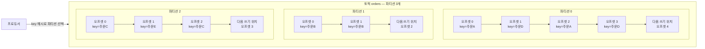
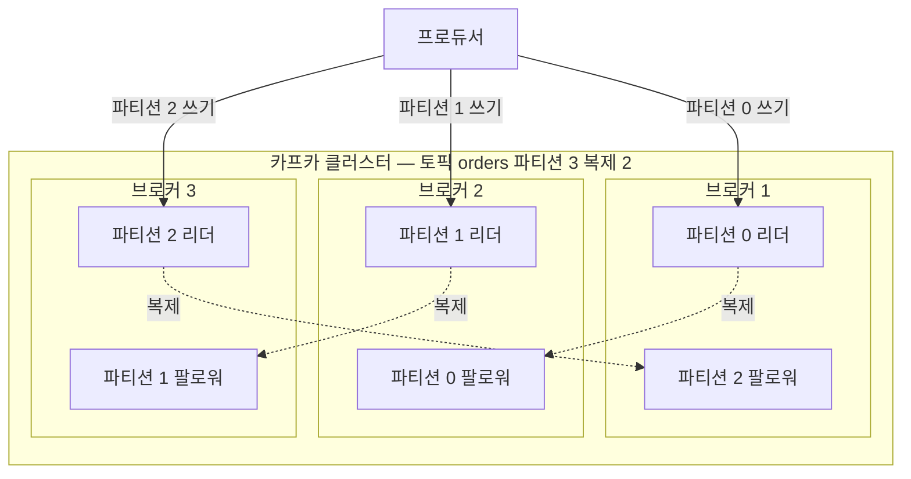
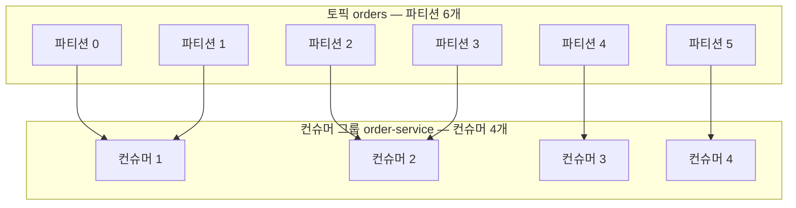
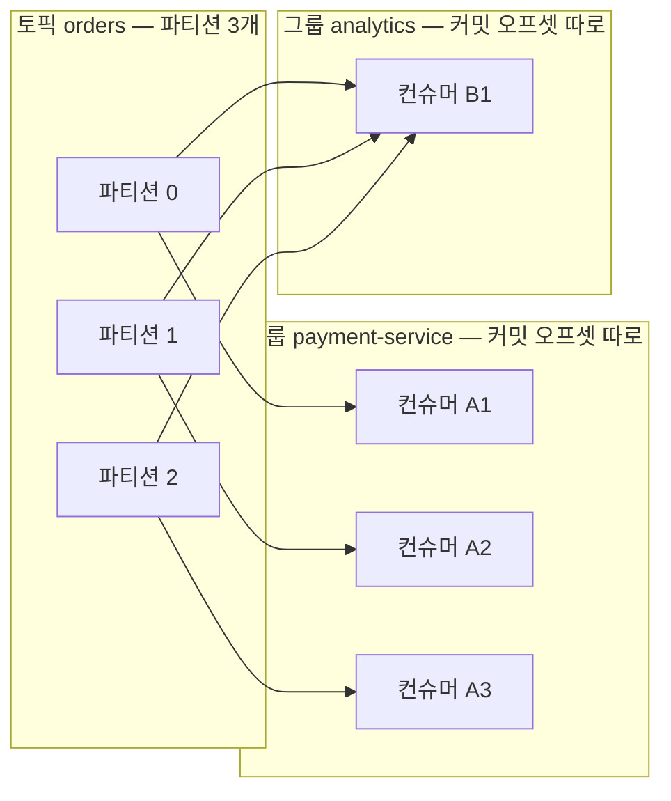

# 핵심 개념 — 토픽·파티션·오프셋·컨슈머 그룹

> 시리즈 01편. 카프카를 다루는 데 필요한 기초 어휘를 이 한 편에서 완성한다.
> "왜 카프카인가"는 [00-why-kafka.md](00-why-kafka.md), 디스크에 실제로 어떻게 저장되는지는 [02-storage-internals.md](02-storage-internals.md)에서 다룬다.
> 기준 버전: Apache Kafka 4.x — KRaft(Kafka Raft) 전용, ZooKeeper 제거 완료.

---

## 0. 이 편을 읽는 법 🟢

카프카 문서를 처음 읽으면 토픽(topic), 파티션(partition), 오프셋(offset), 브로커(broker), 컨슈머 그룹(consumer group) 같은 단어가 정의 없이 쏟아진다. 문제는 이 단어들이 서로를 참조하며 정의된다는 것이다. "파티션은 토픽의 분할 단위다", "오프셋은 파티션 내 레코드의 위치다"처럼 순환하는 어휘 체계이기 때문에, 하나만 어설프게 알면 전체 그림이 흔들린다.

이 편의 목표는 단 하나다. **카프카의 데이터 모델을 구성하는 어휘를, 서로의 관계까지 포함해 정확하게 몸에 익히는 것.** 이후 편(프로듀서 심화, 컨슈머 심화, 복제)은 전부 이 어휘 위에 쌓인다.

전체 구조를 먼저 한 문장으로 압축하면 이렇다.

> 프로듀서(producer)가 **레코드(record)** 를 **토픽**으로 보내면, 레코드는 토픽을 구성하는 여러 **파티션** 중 하나의 끝에 추가되고(append), 각 레코드는 파티션 안에서 **오프셋**이라는 순번을 부여받는다. **컨슈머 그룹**에 속한 컨슈머들이 파티션을 나눠 맡아 읽고, "어디까지 읽었는지"는 브로커가 아니라 **컨슈머 그룹이 오프셋으로 기억**한다.

이제 이 문장을 단어 하나씩 해체한다.

---

## 1. 레코드 — 카프카가 나르는 데이터의 단위 🟢

### 1.1 왜 "메시지"가 아니라 "레코드"인가

카프카에서 주고받는 데이터 한 건을 **레코드(record)** 라고 부른다. 옛 문서나 커뮤니티에서는 메시지(message)라고도 부르며 사실상 동의어다. 다만 "레코드"라는 이름에는 의도가 있다. 카프카는 데이터를 전달하고 버리는 우체부가 아니라, **데이터를 로그(log)에 기록해 두고 여러 독자가 각자의 속도로 읽게 하는 저장소**에 가깝기 때문이다. 데이터베이스의 행(row)을 "레코드"라 부르듯, 카프카의 데이터 단위도 "기록된 것"이라는 뉘앙스를 가진다.

### 1.2 레코드의 구조

레코드 하나는 네 가지 주요 요소로 구성된다.

| 필드 | 타입 | 필수 여부 | 역할 |
|---|---|---|---|
| **key** | 바이트 배열, null 가능 | 선택 | 파티션 결정의 기준. 같은 key는 같은 파티션으로 |
| **value** | 바이트 배열, null 가능 | 선택 | 실제 데이터 본문. 보통 JSON·Avro·Protobuf 직렬화 결과 |
| **timestamp** | long, epoch millis | 자동 부여 가능 | 레코드의 시각. 생성 시각 또는 브로커 도착 시각 |
| **headers** | key-value 목록 | 선택 | 본문 밖의 메타데이터. HTTP 헤더와 같은 역할 |

몇 가지 짚을 점이 있다.

**key와 value는 브로커 입장에서 그냥 바이트 배열이다.** 카프카 브로커는 내용물을 해석하지 않는다. "주문 이벤트인지, 로그인지"는 브로커가 알 바 아니다. 직렬화(serialization)와 역직렬화(deserialization)는 전적으로 프로듀서·컨슈머 애플리케이션의 책임이며, 프로듀서 설정의 `key.serializer` / `value.serializer`, 컨슈머 설정의 `key.deserializer` / `value.deserializer`로 지정한다. 브로커가 내용을 해석하지 않기 때문에 브로커는 어떤 형식의 데이터든 똑같은 속도로 처리할 수 있고, 스키마 관리는 스키마 레지스트리(Schema Registry) 같은 별도 계층의 몫이 된다([07-ecosystem.md](07-ecosystem.md)).

**timestamp에는 두 가지 의미가 있다.** 토픽 설정 `message.timestamp.type`이 결정한다.
- `CreateTime`(기본값): 프로듀서가 레코드를 만든 시각. 프로듀서가 직접 지정할 수도 있다.
- `LogAppendTime`: 브로커가 레코드를 로그에 기록한 시각. 프로듀서가 보낸 값을 브로커가 덮어쓴다.

"이벤트가 실제 발생한 시각"과 "카프카에 도착한 시각"은 다를 수 있다는 것 — 이 구분은 스트림 처리에서 이벤트 시간(event time) 대 처리 시간(processing time) 문제로 이어지는 중요한 씨앗이다.

**headers는 본문을 건드리지 않고 메타데이터를 실어 나르는 통로다.** 대표적인 용도는 분산 추적(trace id 전파), 메시지 타입 태깅, 재처리 횟수 기록 등이다. value를 역직렬화하지 않고도 읽을 수 있다는 것이 핵심 장점이다. 예를 들어 "이 레코드는 몇 번째 재시도인가"를 확인하기 위해 무거운 본문을 파싱할 필요가 없다.

### 1.3 key가 갖는 특별한 의미 🟢

key는 단순한 식별자가 아니다. 카프카에서 key는 **두 가지 시스템 수준의 의미**를 가진다.

1. **파티션 결정**: 같은 key를 가진 레코드는 항상 같은 파티션으로 간다(파티션 수가 변하지 않는 한). 그리고 뒤에서 보겠지만 순서 보장은 파티션 단위이므로, **"같은 key끼리는 순서가 보장된다"** 는 카프카 순서 보장의 실질적 단위가 key가 된다. "주문 A의 생성 → 결제 → 취소 이벤트가 순서대로 처리되어야 한다"면 key를 주문 ID로 잡는 것이 정석이다.
2. **컴팩션(compaction)의 기준**: 토픽을 `cleanup.policy=compact`로 운영하면 카프카는 key별로 최신 value만 남기고 과거 value를 정리한다. 이때 key는 "이 레코드가 어떤 엔티티의 상태인가"를 뜻하는 기본 키 역할을 한다. 상세는 [02-storage-internals.md](02-storage-internals.md).

비유하자면 key는 우편물의 "받는 주소"다. 같은 주소로 보낸 우편물은 같은 우체통(파티션)에 도착 순서대로 쌓인다. 다만 비유의 한계가 있다. 실제 우편은 주소마다 우체통이 하나씩 있지만, 카프카는 **여러 주소(key)가 하나의 우체통(파티션)을 공유**한다. key가 백만 개여도 파티션이 10개면 우체통은 10개다. key → 파티션은 해시로 결정되는 다대일 매핑이다.

---

## 2. 토픽과 파티션 — 왜 쪼개는가 🟢

### 2.1 문제: 하나의 로그는 하나의 머신에 갇힌다

토픽은 레코드의 논리적 분류 단위다. `orders`, `payments`, `user-activity`처럼 "같은 종류의 데이터가 흐르는 이름 붙은 통로"라고 보면 된다. 데이터베이스의 테이블에 자주 비유된다.

그런데 토픽을 통째로 하나의 로그 파일로 관리하면 두 가지 물리 법칙에 부딪힌다.

1. **쓰기 한계**: 하나의 로그는 한 브로커의 디스크와 네트워크 대역폭에 갇힌다. 초당 수백만 건이 들어오는 토픽을 서버 한 대가 받아낼 수 없다.
2. **읽기 한계**: 로그가 하나면 이를 순서대로 읽는 컨슈머도 사실상 하나로 제한된다. 소비를 수평 확장할 방법이 없다.

카프카의 답이 **파티션**이다. 토픽을 여러 개의 독립된 로그로 쪼개고, 각 로그를 서로 다른 브로커에 배치한다. 파티션은 카프카에서 **병렬성의 단위이자 순서의 단위**다. 이 한 구절이 이 편에서 가장 중요한 문장이다.

- **병렬성의 단위**: 파티션이 12개면 쓰기는 12개 로그로 분산되고, 하나의 컨슈머 그룹 안에서 최대 12개의 컨슈머가 동시에 읽을 수 있다.
- **순서의 단위**: 순서는 **파티션 안에서만** 보장된다. 하나의 파티션은 추가 전용(append-only) 로그이므로 먼저 기록된 레코드가 먼저 읽힌다. 그러나 **토픽 전체의 순서는 존재하지 않는다.** 파티션 0의 오프셋 5번 레코드와 파티션 1의 오프셋 5번 레코드 중 무엇이 먼저인지 카프카는 정의하지 않는다.

즉 파티션 수를 늘릴수록 병렬성은 올라가지만, 전역 순서는 처음부터 포기한 설계다. 이것은 버그가 아니라 트레이드오프다. 전역 순서가 정말 필요하면 파티션 1개짜리 토픽을 쓰면 되지만, 그 순간 병렬성도 1이 된다. 실무에서는 "전역 순서"가 아니라 "**같은 엔티티 안에서의 순서**"(같은 주문, 같은 사용자)만 필요한 경우가 대부분이고, 그것은 key 파티셔닝으로 해결된다.

### 2.2 파티션 안의 구조 — 오프셋과 함께 보기

이 그림에서 확인할 것들.

- 각 파티션은 **독립된 추가 전용 로그**다. 새 레코드는 항상 끝에만 붙는다. 중간 삽입도, 수정도 없다.
- **오프셋은 파티션마다 0부터 독립적으로 증가**한다. 파티션 0의 오프셋 2와 파티션 2의 오프셋 2는 아무 관계가 없다. 따라서 레코드 하나를 유일하게 지목하려면 `토픽 + 파티션 번호 + 오프셋` 세 가지가 모두 필요하다.
- 같은 key(주문A)는 항상 같은 파티션(0)에 쌓인다. 주문A의 이벤트끼리는 오프셋 순서대로, 즉 발행 순서대로 읽힌다.
- 파티션 길이는 제각각이다. key 분포가 고르지 않으면 특정 파티션만 빨리 자란다(핫 파티션 문제 — [06-operations-and-tuning.md](06-operations-and-tuning.md)).

파티션 수는 토픽 생성 시 지정하며(`--partitions`, 브로커 기본값은 `num.partitions`), 나중에 **늘릴 수는 있지만 줄일 수는 없다.** 그리고 파티션을 늘리면 `hash(key) % 파티션수`의 결과가 달라져 **기존 key와 파티션의 매핑이 깨진다**는 점을 반드시 기억해야 한다. "같은 key는 같은 파티션"이라는 순서 보장은 파티션 수가 고정일 때만 성립한다.

### 2.3 비유: 고속도로 차선

토픽은 고속도로, 파티션은 차선이다. 차선을 늘리면 전체 처리량이 늘고, 각 차선 안에서 차량의 순서는 유지되지만, 차선이 다른 두 차량 중 누가 먼저 도착할지는 알 수 없다. 비유의 한계: 실제 고속도로는 차선 변경이 가능하지만 카프카 레코드는 일단 파티션에 기록되면 절대 다른 파티션으로 이동하지 않는다.

---

## 3. 오프셋 — 브로커의 것이 아니라 컨슈머의 책갈피 🟢

### 3.1 관점 전환이 필요한 이유

전통적인 메시지 큐(RabbitMQ 등)는 대체로 이렇게 동작한다. 브로커가 메시지를 컨슈머에게 배달하고, 컨슈머가 확인(ack)하면 브로커가 그 메시지를 지우거나 "처리됨"으로 표시한다. 즉 **"어디까지 소비됐는가"라는 상태를 브로커가 메시지 단위로 관리**한다.

카프카는 정반대다. 브로커는 레코드를 지우지도, 소비 여부를 레코드에 표시하지도 않는다. 레코드는 보존 정책(`retention.ms`, `retention.bytes`)이 만료될 때까지 **읽혔든 안 읽혔든 그대로 남는다.** 대신,

> **"어디까지 읽었는가"는 컨슈머 그룹이 파티션별 오프셋 하나로 기억한다.**

이것이 카프카를 처음 배울 때 가장 중요한 관점 전환이다. 오프셋은 두 가지 얼굴을 가진다.

1. **레코드의 주소로서의 오프셋**: 파티션 안에서 각 레코드에 부여되는, 0부터 시작해 1씩 증가하는 순번. 이것은 브로커가 기록 시점에 확정하는 불변의 값이다.
2. **책갈피로서의 오프셋**: 컨슈머 그룹이 "이 파티션은 여기까지 읽었다"라고 저장해 두는 값. 이것은 컨슈머 측 상태다.

책을 생각하면 쉽다. 책의 쪽 번호(레코드의 오프셋)는 인쇄된 순간 고정된다. 그러나 책갈피(커밋된 오프셋)는 읽는 사람마다 다르고, 각자 자기 책갈피만 옮긴다. 도서관(브로커)은 누가 몇 쪽까지 읽었는지에 따라 책장을 찢지 않는다. 비유의 한계: 실제 카프카에서 책갈피는 "다음에 읽을 쪽 번호"를 가리킨다. 오프셋 5까지 처리했다면 커밋하는 값은 6이다. 이 off-by-one은 실무에서 종종 헷갈리는 지점이다.

### 3.2 이 설계가 가져오는 것들

소비 상태를 컨슈머 쪽으로 옮긴 대가로 카프카는 세 가지 강력한 성질을 얻는다.

- **다중 독립 소비**: 하나의 토픽을 여러 컨슈머 그룹이 각자의 책갈피로 읽는다. 결제 서비스와 분석 파이프라인이 같은 `orders` 토픽을 서로 간섭 없이 소비한다. 브로커 입장에서는 그룹이 몇 개든 추가 비용이 거의 없다 — 어차피 레코드는 그대로 있고, 책갈피만 늘어날 뿐이다.
- **재처리(replay)**: 책갈피를 뒤로 옮기면 과거 데이터를 다시 읽을 수 있다. 배포한 코드에 버그가 있어서 지난 3시간치 이벤트를 다시 처리해야 한다면, 오프셋을 3시간 전으로 되감으면 된다(`kafka-consumer-groups.sh --reset-offsets`). 전통 큐에서는 이미 ack되어 삭제된 메시지를 되살릴 수 없다.
- **브로커의 단순함과 성능**: 브로커는 메시지별 소비 상태를 추적하는 복잡한 장부를 유지할 필요가 없다. 순차 쓰기와 순차 읽기만 잘하면 된다. 이 단순함이 카프카 처리량의 근원 중 하나다([02-storage-internals.md](02-storage-internals.md)).

### 3.3 그런데 책갈피는 어디에 저장되나 🟡

"컨슈머가 관리한다"는 말은 "컨슈머 프로세스의 메모리에만 있다"는 뜻이 아니다. 컨슈머가 죽고 다른 컨슈머가 파티션을 이어받아도 책갈피를 찾을 수 있어야 하므로, 커밋된 오프셋은 카프카 내부의 특수 토픽 `__consumer_offsets`에 저장된다. 즉 물리적 저장 위치는 브로커지만, **그 값을 언제 얼마로 갱신할지 결정하는 주체는 컨슈머**다. "브로커는 책갈피 보관함을 빌려줄 뿐, 책갈피를 옮기는 손은 컨슈머의 것"이라고 정리하면 된다.

오프셋 커밋 방식(`enable.auto.commit`, 수동 커밋, 커밋 시점과 중복·유실의 관계)과 커밋된 오프셋이 없을 때의 행동(`auto.offset.reset` — `earliest`/`latest`)은 [05-consumer-deep-dive.md](05-consumer-deep-dive.md)에서 깊게 다룬다. 이 편에서는 "오프셋 커밋이 곧 처리 완료 선언이고, 그 선언 시점을 잘못 잡으면 중복 처리나 유실이 생긴다"는 문제의식만 기억하자.

---

## 4. 브로커와 클러스터 — 파티션이 사는 곳 🟢

### 4.1 브로커, 클러스터, 그리고 리더

**브로커**는 카프카 서버 프로세스 하나다. 여러 브로커가 모여 **클러스터**를 이룬다. 파티션은 클러스터의 브로커들에 분산 배치되며, 장애 대비를 위해 각 파티션은 여러 브로커에 복제된다(`replication.factor`).

복제본 중 하나가 **리더(leader)** 로 선출되고, 나머지는 **팔로워(follower)** 가 된다. 규칙은 단순하다.

> **읽기와 쓰기는 기본적으로 리더에서만 일어난다.** 팔로워는 리더를 복제해 두었다가, 리더가 죽으면 그 자리를 이어받는다.

따라서 클러스터의 부하 분산이란 곧 **파티션 리더들이 브로커에 고르게 퍼져 있는 상태**를 뜻한다. 특정 브로커에 리더가 몰리면 그 브로커만 바쁘고 나머지는 논다.

브로커 3대에 리더가 하나씩 배치되어 쓰기 부하가 3등분되고 있다. 각 리더의 데이터는 다른 브로커의 팔로워로 복제되므로, 예컨대 브로커 1이 죽으면 브로커 2의 파티션 0 팔로워가 새 리더로 승격되어 서비스가 계속된다. 복제 동기화 상태(ISR, In-Sync Replicas), 리더 선출, `min.insync.replicas`와 내구성의 관계는 [03-replication-and-controller.md](03-replication-and-controller.md)의 주제다.

### 4.2 클라이언트는 리더를 어떻게 찾는가 🟡

프로듀서와 컨슈머는 로드 밸런서를 거치지 않고 **파티션 리더가 있는 브로커에 직접 연결**한다. 시작할 때 `bootstrap.servers`에 적힌 브로커 아무에게나 접속해 "이 토픽의 파티션들이 어느 브로커에 있고 리더는 누구인가"라는 **메타데이터(metadata)** 를 받아온 뒤, 이후에는 각 파티션의 리더와 직접 통신한다. 리더가 바뀌면 클라이언트는 에러를 받고 메타데이터를 갱신해 새 리더를 찾아간다. `bootstrap.servers`에 브로커 전체를 나열할 필요가 없는 이유(어느 하나로 들어가든 전체 지도를 받는다), 그럼에도 두세 개를 적는 이유(첫 접속 시점의 가용성)를 여기서 이해할 수 있다.

### 4.3 ZooKeeper는 어디 갔나 — 역사 한 토막 🟢

4.x 이전의 카프카는 클러스터 메타데이터 관리와 컨트롤러 선출을 외부 시스템인 ZooKeeper에 의존했다. 운영자는 카프카와 ZooKeeper라는 서로 다른 분산 시스템 두 개를 함께 돌봐야 했다. 카프카는 KIP-500을 통해 이 의존을 제거하고, 메타데이터를 카프카 자신의 로그와 Raft 합의 프로토콜로 관리하는 **KRaft** 모드로 전환했다. Kafka 4.0부터 ZooKeeper 모드는 완전히 제거되어 KRaft가 유일한 운영 방식이다. 컨트롤러가 무엇이고 KRaft가 어떻게 동작하는지는 [03-replication-and-controller.md](03-replication-and-controller.md)에서 다룬다. 이 편에서는 "옛 자료에서 ZooKeeper가 나오면 지금은 카프카 내장 기능으로 대체됐다"고 읽으면 된다.

---

## 5. 프로듀서 기초 — 레코드는 어느 파티션으로 가는가 🟢

프로듀서 내부 구조(배치, `acks`, 멱등성, 재시도)는 [04-producer-deep-dive.md](04-producer-deep-dive.md)에서 다루고, 여기서는 이 편의 어휘를 완성하는 데 필요한 **파티션 선택 로직**만 본다.

프로듀서가 레코드를 보낼 때 파티션은 다음 우선순위로 결정된다.

1. **파티션을 직접 지정**했다면 그 파티션으로. (드물게 쓰는 방법)
2. **key가 있다면**: `murmur2 해시 값을 파티션 수로 나눈 나머지`로 결정한다. 기본 파티셔너(partitioner)의 동작이며, 같은 key → 같은 해시 → 같은 파티션이 보장된다. 여기서 다시 강조 — **파티션 수가 바뀌면 나머지 연산 결과가 바뀌어 매핑이 깨진다.**
3. **key가 null이라면**: **스티키 파티셔닝(sticky partitioning)** 이 동작한다.

### 5.1 null key와 스티키 파티셔닝

key가 없으면 순서 보장 대상이 없으므로 아무 파티션에나 보내도 된다. 예전(2.4 이전) 기본 동작은 레코드 한 건마다 라운드 로빈(round robin)으로 파티션을 돌리는 것이었다. 문제는 프로듀서가 전송 효율을 위해 **파티션별로 배치(batch)를 만들어 보낸다**는 데 있다. 레코드마다 파티션을 바꾸면 배치가 여러 파티션에 잘게 흩어져, 배치마다 레코드가 몇 건 안 담긴 채 전송된다. 배치가 작으면 네트워크 요청 수가 늘고 지연이 커진다.

스티키 파티셔닝(KIP-480, 2.4 도입)은 이를 뒤집는다. **하나의 파티션에 "들러붙어(sticky)" 배치를 꽉 채우고, 배치가 전송되면 그때 다른 파티션으로 옮긴다.** 배치 단위로 보면 파티션들이 골고루 사용되므로 장기적 분포는 여전히 균등하면서, 개별 배치는 커진다. Kafka 3.3부터는 개선판(KIP-794)이 기본 파티셔너에 내장되어, 파티션을 옮길 때 `batch.size` 기준으로 균등하게 순환하고 느린 브로커에는 상대적으로 적게 배정하는 적응형 로직(`partitioner.adaptive.partitioning.enable`)까지 동작한다.

정리하면:

| 상황 | 파티션 결정 | 순서 보장 |
|---|---|---|
| key 있음 | 해시 % 파티션 수 | 같은 key 안에서 보장 |
| key null | 스티키 — 배치 단위로 파티션 순환 | 보장 대상 없음 |
| 직접 지정 | 지정한 파티션 | 그 파티션 안에서 보장 |

실무 감각: **순서가 중요하면 key를 설계하고, 순서가 무관한 대량 데이터(로그, 메트릭)는 key 없이 보내 스티키의 처리량 이득을 취한다.** 단, key 선택이 곧 부하 분포를 결정하므로 특정 key에 트래픽이 쏠리면(유명 셀러의 주문 등) 핫 파티션이 생긴다는 점도 함께 기억한다.

---

## 6. 컨슈머 그룹 — 소비를 수평 확장하는 방법 🟢

### 6.1 문제: 컨슈머 하나로는 못 따라간다

파티션 덕분에 쓰기는 분산됐다. 읽기는 어떻게 분산하나. 컨슈머 프로세스를 여러 개 띄우면 되는데, 그러면 즉시 두 가지 질문이 생긴다. "같은 레코드를 여러 컨슈머가 중복 처리하면 어쩌지?" 그리고 "누가 어느 파티션을 읽을지 누가 정하지?"

카프카의 답이 **컨슈머 그룹**이다. 컨슈머는 `group.id` 설정으로 그룹에 속하며, 카프카는 다음 규칙으로 그룹 내 분업을 조율한다.

> **하나의 파티션은, 하나의 컨슈머 그룹 안에서, 정확히 하나의 컨슈머에게만 할당된다.**

이 규칙을 방향별로 뜯어보면:

- **파티션 → 컨슈머는 그룹 내에서 1:1.** 파티션 하나를 그룹 내 두 컨슈머가 나눠 읽는 일은 없다. 그래서 그룹 내 중복 소비가 원천 차단되고, 파티션 내 순서가 소비 시에도 유지된다(한 파티션을 한 컨슈머가 순서대로 읽으므로).
- **컨슈머 → 파티션은 1:N 가능.** 컨슈머 하나가 여러 파티션을 맡을 수 있다. 파티션 6개에 컨슈머 2개면 각자 3개씩 맡는 식이다.
- 따라서 **그룹의 최대 병렬성 = 파티션 수.** 파티션 6개인 토픽에 컨슈머를 8개 띄우면 2개는 아무 파티션도 할당받지 못하고 논다(idle). 컨슈머를 늘려도 처리량이 안 오르면 파티션 수가 상한에 걸린 것이다. 이것이 "파티션 수 = 소비 병렬성의 상한"이라는, 토픽 설계 시 파티션 수를 정하는 가장 중요한 근거다.

파티션 6개를 컨슈머 4개가 나눠 맡은 모습이다. 컨슈머 1과 2는 2개씩, 3과 4는 1개씩 맡았다. 여기서 컨슈머를 6개까지 늘리면 1개씩 균등해지고, 7개째부터는 노는 컨슈머가 생긴다. 실제 할당 방식은 할당 전략(range, cooperative-sticky 등)에 따라 달라지며 [05-consumer-deep-dive.md](05-consumer-deep-dive.md)에서 다룬다.

노는 컨슈머가 반드시 낭비인 것은 아니다. 컨슈머 하나가 죽었을 때 즉시 파티션을 이어받는 대기 요원(standby)으로 의도적으로 두기도 한다.

### 6.2 그룹이 다르면 완전히 독립이다 🟢

컨슈머 그룹의 두 번째 얼굴은 **브로드캐스트(broadcast)** 다. 3장에서 본 대로 책갈피(커밋 오프셋)는 그룹 단위로 저장된다. 그룹이 다르면 책갈피도 다르므로, **서로 다른 그룹은 같은 토픽의 전체 데이터를 각자 처음부터 독립적으로 읽는다.** 한 그룹이 레코드를 읽었다고 해서 다른 그룹이 못 읽게 되는 일은 없다 — 레코드는 소비되어도 사라지지 않으니까.

같은 `orders` 토픽을 결제 서비스 그룹은 컨슈머 3개로 병렬 소비하고, 분석 그룹은 컨슈머 1개가 전체 파티션을 혼자 소비한다. 두 그룹은 서로의 존재도, 진행 속도도 모른다. 결제 그룹이 실시간으로 따라가는 동안 분석 그룹은 밤에만 배치로 돌아도 되고, 새로 만든 그룹은 `auto.offset.reset=earliest`로 과거 데이터 전체를 처음부터 읽을 수도 있다.

이 구조가 카프카를 "메시지 큐"와 "발행-구독(pub-sub)"의 통합체로 만든다.

- **그룹 안에서는 큐처럼**: 파티션이 컨슈머들에게 분배되어 각 레코드가 그룹 내에서 한 번만 처리된다.
- **그룹 사이에서는 pub-sub처럼**: 모든 그룹이 전체 데이터를 받는다.

전통적으로 큐(경쟁 소비)와 pub-sub(전체 브로드캐스트)은 별도의 메시징 모델이었는데, 카프카는 "그룹"이라는 한 겹의 개념으로 둘을 동시에 제공한다. 새 소비 용도가 생기면 토픽을 건드리지 않고 그룹만 하나 더 만들면 된다 — 이것이 이벤트 기반 아키텍처에서 카프카가 사실상 표준이 된 이유 중 하나다([08-architecture-patterns.md](08-architecture-patterns.md)).

### 6.3 조율은 누가 하나 — 그룹 코디네이터와 리밸런싱 맛보기 🟡

"파티션을 누가 어느 컨슈머에게 나눠 주는가"라는 질문이 남았다. 각 그룹마다 브로커 중 하나가 **그룹 코디네이터(group coordinator)** 역할을 맡는다. 컨슈머들은 코디네이터에 참여 의사를 밝히고 주기적으로 하트비트(heartbeat)를 보내 생존을 알린다.

그룹의 구성이 변하면 — 컨슈머가 새로 들어오거나, 죽거나, 하트비트가 끊기거나, 토픽의 파티션이 늘어나면 — 파티션 할당을 다시 계산해야 한다. 이 재할당 과정이 **리밸런싱(rebalancing)** 이다.

리밸런싱은 필요악이다. 자동 분업과 장애 복구를 공짜로 주는 대신, 재할당이 진행되는 동안 소비가 일부 또는 전부 멈출 수 있고, 처리 중이던 레코드의 커밋 타이밍에 따라 중복 처리가 생길 수 있다. 리밸런싱이 왜 일어나는지, eager와 cooperative 프로토콜의 차이, Kafka 4.0에서 도입된 새 그룹 프로토콜(KIP-848)이 무엇을 개선했는지, 그리고 리밸런싱 폭풍을 피하는 설정(`session.timeout.ms`, `max.poll.interval.ms` 등)은 [05-consumer-deep-dive.md](05-consumer-deep-dive.md)에서 상세히 다룬다. 이 편에서는 "**그룹 멤버십이 변하면 파티션 재분배가 일어나고, 그 순간이 카프카 컨슈머 운영의 최대 리스크 구간**"이라는 문제의식만 챙기면 충분하다.

---

## 7. 어휘 총정리 — 한 장의 지도 🟢

이 편의 어휘를 관계 중심으로 다시 묶는다.

| 용어 | 한 줄 정의 | 핵심 관계 |
|---|---|---|
| 레코드 | key·value·timestamp·headers로 구성된 데이터 한 건 | key가 파티션과 순서 보장의 단위를 결정 |
| 토픽 | 레코드의 논리적 분류, 이름 붙은 통로 | 1개 토픽 = N개 파티션 |
| 파티션 | 토픽을 쪼갠 독립 추가 전용 로그 | 병렬성의 단위이자 순서의 단위 |
| 오프셋 | 파티션 내 레코드 순번이자 컨슈머 그룹의 책갈피 | 토픽+파티션+오프셋 = 레코드의 유일 주소 |
| 브로커 | 카프카 서버 프로세스 | 파티션 리더·팔로워를 분산 보관 |
| 클러스터 | 브로커의 집합 | 리더가 고르게 퍼져야 부하 분산 |
| 프로듀서 | 레코드를 쓰는 클라이언트 | key 해시 또는 스티키로 파티션 선택 |
| 컨슈머 그룹 | 파티션을 나눠 맡는 컨슈머 집합 | 그룹 내 분업, 그룹 간 독립 |
| 리밸런싱 | 그룹 내 파티션 재할당 | 멤버십 변화가 방아쇠 |

그리고 반드시 몸에 새겨야 할 명제 다섯 개.

1. 순서는 파티션 안에서만 보장된다. 토픽 전체 순서는 없다. 실질적 순서 단위는 key다.
2. 파티션 수는 소비 병렬성의 상한이다. 컨슈머가 파티션보다 많으면 논다.
3. 레코드는 소비되어도 사라지지 않는다. 보존 기간이 지나야 사라진다.
4. "어디까지 읽었는가"는 컨슈머 그룹의 책갈피(커밋 오프셋)이며, 그룹마다 독립이다.
5. 파티션 수를 늘리면 key와 파티션의 매핑이 깨진다. 파티션 수는 처음부터 신중하게.

---

## 면접 포인트

### Q1. 카프카는 토픽 전체의 순서를 보장하는가?

- **나쁜 답변**: "네, 카프카는 순서를 보장하는 메시징 시스템입니다."
- **좋은 답변의 뼈대**: 순서 보장의 단위는 토픽이 아니라 **파티션**이다. 파티션은 추가 전용 로그라서 파티션 안에서는 기록 순서 = 읽기 순서가 보장되지만, 파티션 간 순서는 정의되지 않는다. 실무에서는 전역 순서 대신 **같은 key 안에서의 순서**로 요구를 좁히고, key 파티셔닝으로 해결한다. 전역 순서가 정말 필요하면 파티션 1개를 쓰되 병렬성을 포기하는 트레이드오프임을 언급하면 좋다. 추가로 파티션 수 변경 시 key 매핑이 깨진다는 점, 프로듀서 재시도로 인한 순서 역전 가능성(`max.in.flight.requests.per.connection` — 04편 주제)까지 이어가면 시니어급 답변이 된다.

### Q2. 컨슈머를 늘렸는데 처리량이 늘지 않는다. 원인은?

- **나쁜 답변**: "컨슈머 서버의 스펙을 올려야 합니다."
- **좋은 답변의 뼈대**: 가장 먼저 **파티션 수와 컨슈머 수를 비교**한다. 하나의 파티션은 그룹 내 한 컨슈머에게만 할당되므로, 컨슈머 수가 파티션 수를 넘으면 초과분은 유휴 상태다. 파티션 수가 충분하다면 다음 용의자로 특정 파티션에 트래픽이 쏠리는 핫 파티션(key 분포 문제), 컨슈머의 개별 레코드 처리 시간(poll 루프 병목)을 순서대로 짚는다. "병렬성의 상한 = 파티션 수"라는 원칙에서 출발하는 것이 핵심이다.

### Q3. 카프카에서 오프셋은 누가 관리하는가?

- **나쁜 답변**: "브로커가 관리합니다. 컨슈머가 읽으면 브로커가 처리됨으로 표시합니다."
- **좋은 답변의 뼈대**: 전통 큐와 달리 브로커는 소비 여부를 추적하지 않는다. 레코드의 오프셋 자체는 브로커가 기록 시 부여하는 불변 순번이지만, **"어디까지 읽었는가"라는 상태는 컨슈머 그룹이 결정하고 커밋**하며, 커밋 값은 내부 토픽 `__consumer_offsets`에 저장된다. 이 설계 덕에 다중 그룹의 독립 소비와 오프셋 되감기를 통한 재처리가 가능하다. "커밋 오프셋은 다음에 읽을 위치"라는 off-by-one, 커밋 시점에 따른 중복/유실 가능성(at-least-once 대 at-most-once)까지 언급하면 좋다.

### Q4. 같은 토픽을 두 개의 서로 다른 서비스가 소비하려면 어떻게 구성하나?

- **나쁜 답변**: "토픽을 두 개 만들어 양쪽에 발행합니다."
- **좋은 답변의 뼈대**: 토픽은 하나로 두고 **서비스마다 다른 `group.id`를 부여**한다. 그룹이 다르면 커밋 오프셋이 독립이므로 각 서비스가 전체 데이터를 각자의 속도로 소비한다. 카프카가 그룹 안에서는 큐(분업), 그룹 사이에서는 pub-sub(브로드캐스트)로 동작한다는 이중성을 설명하면 개념 이해를 보여줄 수 있다. 레코드는 소비로 삭제되지 않고 보존 정책으로만 삭제된다는 전제도 함께.

### Q5. key가 null인 레코드는 어느 파티션으로 가는가?

- **나쁜 답변**: "무조건 라운드 로빈으로 돌아갑니다."
- **좋은 답변의 뼈대**: 2.4 이전에는 레코드 단위 라운드 로빈이었지만, 현재 기본 동작은 **스티키 파티셔닝**이다. 하나의 파티션에 배치가 찰 때까지 붙어 있다가 배치 전송 후 다른 파티션으로 옮긴다. 이유는 프로듀서가 파티션별로 배치를 만들기 때문 — 레코드마다 파티션을 바꾸면 배치가 잘게 쪼개져 처리량이 떨어진다. 3.3부터는 KIP-794로 배치 크기 기준 균등 순환과 브로커 성능을 고려한 적응형 배정까지 기본 파티셔너에 내장됐다는 것, key가 있으면 murmur2 해시로 결정되어 순서 보장의 근거가 된다는 대비까지 말하면 완성도가 높다.

---

**다음 편**: [02-storage-internals.md](02-storage-internals.md) — 파티션이라는 "로그"가 디스크에 실제로 어떻게 저장되고, 카프카는 왜 디스크를 쓰면서도 빠른가.
