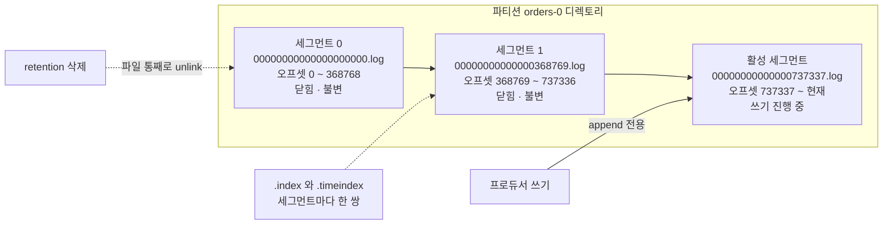
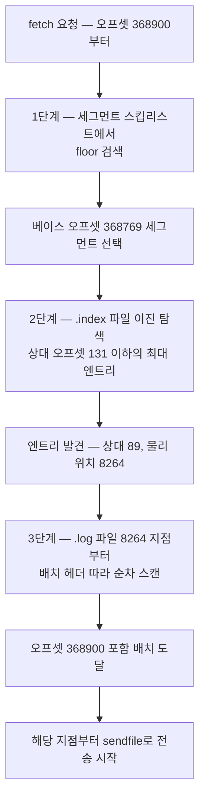
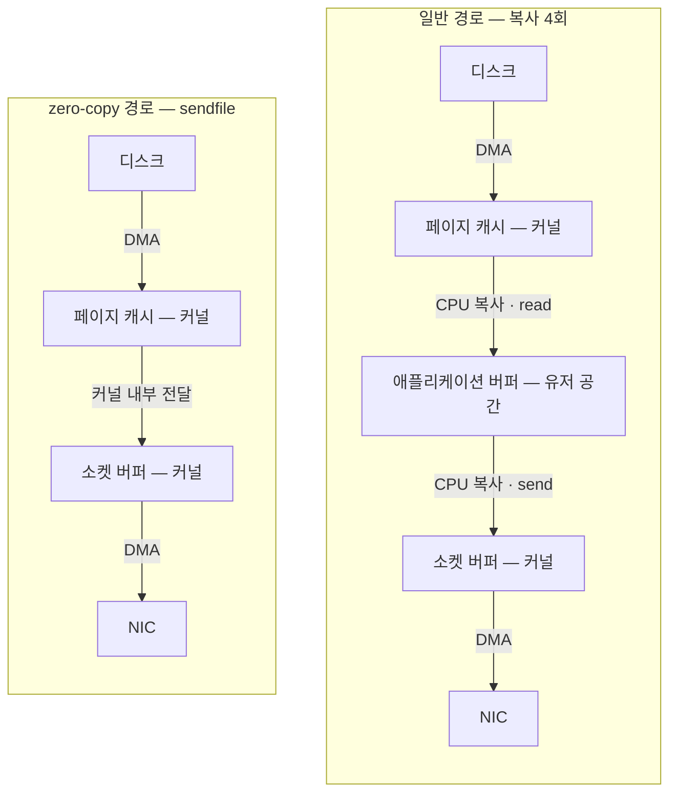
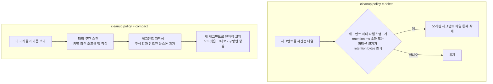

# 저장 내부 구조 — 카프카는 디스크를 쓰는데 왜 빠른가

> 시리즈 02편. 브로커·토픽·파티션·오프셋 같은 기본 개념은 `01-core-concepts.md`를 먼저 읽는 것을 권장한다.
> 복제(replication)를 통한 내구성 보장의 상세 메커니즘은 `03-replication-and-controller.md`에서 다룬다.
> 기준 버전은 Apache Kafka 4.x(KRaft 전용)다.

---

## 0. 문제 제기 — "디스크는 느리다"는 통념 🟢

카프카를 처음 접하면 누구나 같은 의문을 갖는다.

> "카프카는 모든 메시지를 디스크에 쓴다는데, 어떻게 초당 수백만 건을 처리하지? 메모리 기반 메시지 큐보다 빠를 수가 있나?"

이 의문의 전제가 틀렸다. **디스크가 느린 게 아니라, 디스크를 '랜덤하게' 쓰는 것이 느리다.** 7,200RPM HDD 기준으로 랜덤 쓰기는 초당 수백 KB 수준이지만, 순차 쓰기는 수백 MB/s에 달한다 — 수백~수천 배 차이다. SSD에서도 순차 접근이 랜덤 접근보다 훨씬 빠르고, OS와 하드웨어의 선읽기(read-ahead)·쓰기 병합(write coalescing) 최적화도 순차 패턴에서만 제대로 작동한다.

카프카의 설계 철학은 여기서 출발한다.

1. **디스크를 순차로만 쓰고 순차로만 읽는다** — 로그(log)라는 자료구조 자체가 append-only이기 때문에 가능하다.
2. **OS 페이지 캐시(page cache)를 애플리케이션 캐시처럼 쓴다** — JVM 힙에 데이터를 들고 있지 않는다.
3. **커널이 지원하는 zero-copy 전송으로 유저 공간 복사를 생략한다.**

이 문서는 이 세 가지가 실제 파일 시스템 위에서 어떻게 구현되는지, 그리고 그 위에 얹힌 보존 정책(retention)·컴팩션(compaction)·계층형 저장소(tiered storage)까지 저장 계층 전체를 해부한다.

비유하자면 카프카의 저장 구조는 **회계 장부**다. 장부는 항상 마지막 페이지에만 새 항목을 적고(순차 쓰기), 과거 항목은 절대 고치지 않으며(불변성), 오래된 장부는 통째로 창고에 보내거나 폐기한다(세그먼트 단위 관리). 다만 이 비유의 한계도 있다 — 실제 장부는 "키별 최신값만 남기기"(컴팩션) 같은 재작성을 하지 않지만 카프카는 한다. 이 예외는 뒤에서 다룬다.

---

## 1. 파티션의 실체 = 디렉토리 🟡

### 1.1 디스크에서 직접 확인하기

카프카에서 파티션(partition)은 논리적 개념이 아니라 **브로커 디스크 위의 디렉토리 하나**다. `log.dirs`로 지정한 경로 아래에 `토픽명-파티션번호` 형식으로 존재한다.

```text
/var/kafka-logs/
├── orders-0/                        ← orders 토픽의 0번 파티션
│   ├── 00000000000000000000.log        ← 실제 레코드가 담긴 세그먼트 파일
│   ├── 00000000000000000000.index     ← 오프셋 인덱스
│   ├── 00000000000000000000.timeindex ← 타임스탬프 인덱스
│   ├── 00000000000000368769.log       ← 다음 세그먼트
│   ├── 00000000000000368769.index
│   ├── 00000000000000368769.timeindex
│   ├── 00000000000000737337.log       ← 현재 쓰기 중인 활성 세그먼트
│   ├── 00000000000000737337.index
│   ├── 00000000000000737337.timeindex
│   ├── leader-epoch-checkpoint        ← 리더 에포크 이력 — 03편 참조
│   └── partition.metadata             ← 토픽 ID 기록
├── orders-1/
└── payments-0/
```

핵심 관찰 두 가지.

- **파일명이 곧 베이스 오프셋(base offset)이다.** `00000000000000368769.log`는 "이 파일의 첫 레코드 오프셋이 368769"라는 뜻이다. 20자리 0-패딩 숫자는 오프셋의 최대값인 64비트 정수를 담기 위한 것이다. 파일명만 정렬해도 오프셋 순서가 되므로, 특정 오프셋이 어느 파일에 있는지 파일명 비교만으로 알 수 있다.
- **파티션은 세그먼트(segment)들의 연속이다.** 파티션 하나를 통짜 파일 하나로 만들지 않고 여러 조각으로 나눈 이유는 뒤의 롤링·삭제에서 명확해진다.

### 1.2 세 종류의 세그먼트 파일

| 파일 | 역할 | 내용 |
|---|---|---|
| `.log` | 데이터 본체 | 레코드 배치(record batch)가 오프셋 순서로 append된 바이너리 파일 |
| `.index` | 오프셋 → 파일 위치 | `상대 오프셋 4바이트 + 파일 내 물리 위치 4바이트` 엔트리의 배열 |
| `.timeindex` | 타임스탬프 → 오프셋 | `타임스탬프 8바이트 + 상대 오프셋 4바이트` 엔트리의 배열 |

`.index`가 상대 오프셋(베이스 오프셋과의 차)을 4바이트로 저장하는 이유: 세그먼트 하나의 크기가 제한되어 있으므로(기본 1GiB) 세그먼트 안의 상대 오프셋은 32비트로 충분하고, 엔트리당 8바이트로 인덱스를 작게 유지할 수 있다. 인덱스가 작아야 통째로 페이지 캐시에 올라간다.

`.timeindex`는 `KafkaConsumer#offsetsForTimes` 같은 "특정 시각 이후부터 다시 읽기" 요청과, 시간 기반 retention 판정에 쓰인다.

이 외에도 트랜잭션을 쓰면 `.snapshot`(프로듀서 상태 스냅샷), aborted 트랜잭션 조회용 `.txnindex` 파일이 생기는데, 이는 `04-producer-deep-dive.md`의 트랜잭션 절에서 다룬다.

### 1.3 세그먼트 롤링(rolling) — 언제 새 파일로 넘어가나

쓰기는 항상 **마지막 세그먼트(active segment)** 에만 일어난다. 활성 세그먼트가 아래 조건 중 하나를 만족하면 닫고 새 세그먼트를 연다.

| 설정 키 | 기본값 | 의미 |
|---|---|---|
| `log.segment.bytes` (토픽: `segment.bytes`) | 1073741824 — 1GiB | 세그먼트 크기가 이 값에 도달하면 롤링 |
| `log.roll.ms` / `log.roll.hours` (토픽: `segment.ms`) | 168시간 — 7일 | 세그먼트의 첫 레코드 타임스탬프 기준 이 시간이 지나면 크기와 무관하게 롤링 |
| `log.index.size.max.bytes` (토픽: `segment.index.bytes`) | 10485760 — 10MiB | 인덱스 파일이 가득 차도 롤링 |

**왜 세그먼트로 쪼개는가?** 두 가지 결정적 이유가 있다.

1. **삭제가 O(1)이 된다.** retention에 걸린 오래된 데이터를 지울 때, 통짜 파일이라면 파일 앞부분을 잘라내는 값비싼 재작성이 필요하다. 세그먼트 구조에서는 그냥 오래된 세그먼트 **파일을 통째로 삭제**하면 끝이다. 활성 세그먼트는 삭제 대상이 되지 않으므로, retention의 실제 삭제 단위는 항상 "닫힌 세그먼트"다.
2. **불변(immutable) 파일이 생긴다.** 닫힌 세그먼트는 다시는 수정되지 않는다. 불변 파일은 페이지 캐시 일관성 걱정이 없고, 뒤에서 볼 tiered storage처럼 "통째로 원격에 올리기"도 가능해진다.

실무 함정: `segment.ms`를 지나치게 줄이면(예: 몇 분 단위) 파티션마다 파일이 수천 개씩 생기고, 파일당 최소 3개의 파일 핸들과 인덱스의 사전 할당(preallocation) 공간을 소비한다. 브로커의 열린 파일 디스크립터 한도(`ulimit -n`)를 터뜨리는 고전적인 장애 패턴이다. 반대로 세그먼트가 너무 크면 retention 삭제의 최소 단위가 커져서 "7일 보존"을 걸어도 마지막 세그먼트가 안 닫혀 훨씬 오래 남는 일이 생긴다.



---

## 2. 오프셋으로 레코드를 찾는 경로 🟡

컨슈머가 "오프셋 368,900부터 읽고 싶다"고 fetch 요청을 보내면 브로커는 세 단계로 위치를 찾는다.

### 2.1 1단계 — 세그먼트 선택

브로커는 파티션의 세그먼트 목록을 베이스 오프셋을 키로 하는 정렬 맵(구현상 `ConcurrentSkipListMap`)으로 메모리에 들고 있다. "368,900 이하 중 가장 큰 베이스 오프셋"을 조회하면 — floor 검색 한 번 — `00000000000000368769.log`가 나온다. O(log N)이고 디스크를 건드리지 않는다.

### 2.2 2단계 — 희소 인덱스(sparse index) 이진 탐색

`.index` 파일은 **모든 레코드를 인덱싱하지 않는다.** 로그에 약 `log.index.interval.bytes`(기본 4096, 즉 4KiB)만큼 쓰일 때마다 엔트리를 하나씩만 추가한다. 그래서 "희소" 인덱스다.

```text
00000000000000368769.index  — 엔트리는 상대 오프셋 기준
┌──────────────┬──────────────┐
│ 상대 오프셋   │ 물리 위치     │
├──────────────┼──────────────┤
│ 0            │ 0            │
│ 42           │ 4180         │
│ 89           │ 8264         │   ← 368769 + 89 = 368858 ≤ 368900, floor 매치
│ 151          │ 12401        │
│ ...          │ ...          │
└──────────────┴──────────────┘
```

찾는 오프셋 368,900의 상대 오프셋은 131. 인덱스에서 "131 이하 중 가장 큰 엔트리"를 이진 탐색하면 상대 오프셋 89, 물리 위치 8,264바이트가 나온다.

**왜 촘촘한 인덱스가 아니라 희소 인덱스인가?**

- 촘촘한 인덱스는 크기가 로그에 비례해 커지고, 쓰기마다 인덱스 갱신 비용이 붙는다.
- 희소 인덱스는 1GiB 세그먼트당 최대 약 2MB 수준이라 **인덱스 전체가 페이지 캐시에 상주**한다. 인덱스는 mmap으로 매핑되어 있어 탐색이 사실상 메모리 연산이다.
- 어차피 다음 단계의 순차 스캔이 최대 4KiB — 페이지 캐시에서 한두 페이지 — 로 상한이 잡혀 있어, 정밀 인덱스의 이득이 거의 없다. B-tree 같은 복잡한 구조 대신 "정렬된 append-only 배열 + 이진 탐색"으로 충분한 이유다.

### 2.3 3단계 — 로그 파일 순차 스캔

`.log` 파일의 8,264바이트 지점부터 배치 헤더를 읽으며 앞으로 스캔한다. 각 배치 헤더에는 베이스 오프셋과 길이가 있으므로 배치를 건너뛰며 진행하다가, 368,900을 포함하는 배치를 찾으면 **그 지점부터의 데이터를 전송하기 시작**한다. 스캔 범위는 인덱스 간격만큼 — 기본 최대 4KiB — 으로 제한된다.



주목할 점: 이 경로 전체에서 **레코드를 역직렬화하거나 파싱하지 않는다.** 배치 헤더의 오프셋·길이 필드만 읽는다. 데이터 본문은 브로커에게 그저 바이트 덩어리다. 이것이 다음 절의 zero-copy와 맞물린다.

---

## 3. 왜 빠른가 3대장 🟡

### 3.1 첫째 — 순차 I/O

위에서 본 구조의 귀결이다. 쓰기는 활성 세그먼트의 끝에 append뿐이고, 읽기도 컨슈머가 오프셋 순서로 따라가므로 순차다. 디스크 헤드 시크(seek)가 없고, OS의 read-ahead가 컨슈머가 곧 읽을 데이터를 미리 페이지 캐시에 올려 둔다.

또 하나 중요한 귀결: 카프카의 성능은 **데이터 총량과 무관하다.** B-tree 기반 저장소는 데이터가 커지면 트리 깊이가 늘어 O(log N)으로 느려지지만, 카프카의 append와 "인덱스 floor 검색 + 상한 있는 스캔"은 파티션에 데이터가 100GB 쌓여 있든 10TB 쌓여 있든 같은 비용이다. "카프카는 디스크에 남은 공간만큼 보존 기간을 늘려도 성능이 안 변한다"는 말이 여기서 나온다.

한계도 짚자. 이 이야기는 **파티션 하나** 기준이다. 브로커 하나가 수천 개 파티션에 동시에 쓰면 디스크 관점에서는 여러 순차 스트림이 섞여 랜덤 I/O에 가까워진다. 파티션 수를 무한정 늘리면 안 되는 저장 계층 쪽 이유이며, `06-operations-and-tuning.md`에서 다룬다.

### 3.2 둘째 — OS 페이지 캐시, 그리고 fsync를 하지 않는 대담함

카프카 브로커는 데이터를 JVM 힙에 캐시하지 않는다. 대신 **OS 페이지 캐시를 그대로 캐시로 쓴다.**

쓰기 경로를 따라가 보자.

1. 브로커가 세그먼트 파일에 write 시스템 콜을 한다.
2. 데이터는 **페이지 캐시에 기록되는 순간 write가 리턴**한다. 디스크에 아직 안 내려갔다.
3. 커널의 플러셔 스레드가 백그라운드에서 더티 페이지를 디스크로 내린다.

여기서 핵심 질문: **"디스크에 fsync도 안 했는데 프로듀서에게 ack를 보내도 되나?"**

카프카의 대답은 "된다"이다. 기본 설정에서 카프카는 **레코드 단위 fsync를 하지 않는다.** 관련 설정 `log.flush.interval.messages`와 `log.flush.interval.ms`는 기본값이 사실상 무한대이며, 공식 문서도 이를 건드리지 말라고 권고한다. 강제 flush는 순차 쓰기의 이점을 크게 갉아먹기 때문이다.

그럼 브로커가 fsync 전에 죽으면 데이터가 날아가지 않나? 날아간다 — **그 브로커에서는.** 카프카의 내구성 모델은 "한 장비의 디스크"가 아니라 **"복제본 집합"** 이다. `acks=all` + `min.insync.replicas=2` 설정이면 ack 시점에 데이터가 서로 다른 장비 2대 이상의 페이지 캐시(및 곧 디스크)에 존재한다. 장비 하나가 전원 장애로 페이지 캐시를 잃어도 다른 복제본에서 복구한다. "fsync로 한 대에서 살아남기"보다 "복제로 여러 대에 존재하기"가 더 강한 보장이라는 관점 전환이다. 이 모델이 성립하려면 복제와 리더 선출이 정확해야 하는데, 그 상세 — ISR, unclean election, 그리고 KRaft 메타데이터 로그는 예외적으로 fsync를 한다는 사실 — 는 `03-replication-and-controller.md`에서 다룬다.

페이지 캐시 방식의 부수 효과들도 실무에서 중요하다.

- **JVM 힙을 작게 유지할 수 있다.** 브로커 힙은 보통 6GB 안팎이면 충분하고, 나머지 수십 GB RAM은 전부 페이지 캐시가 쓴다. 데이터를 힙에 들면 객체 오버헤드로 크기가 2배쯤 부풀고 GC 압박이 생기는데, 이를 통째로 회피한다.
- **브로커 재시작에도 캐시가 따뜻하다.** 캐시가 프로세스가 아니라 커널에 있으므로, 브로커 프로세스를 재시작해도 페이지 캐시는 그대로다.
- **"실시간 소비는 디스크를 안 읽는다."** 컨슈머가 프로듀서를 바짝 따라가는 정상 상태에서는 읽기가 전부 페이지 캐시 히트다. 반대로 오래 뒤처진 컨슈머(lagging consumer)가 과거 데이터를 읽으면 콜드 리드가 발생하고, 이때 읽어온 옛 페이지가 최신 페이지를 캐시에서 밀어내 **잘 돌던 다른 컨슈머까지 느려지는** 오염이 생길 수 있다. 유명한 운영 함정이다.

### 3.3 셋째 — zero-copy, sendfile

브로커가 컨슈머에게 데이터를 보내는 일반적인 서버라면 경로는 이렇다.

1. 디스크 → 페이지 캐시 (DMA 복사)
2. 페이지 캐시 → 유저 공간 애플리케이션 버퍼 (read 콜, CPU 복사)
3. 유저 버퍼 → 커널 소켓 버퍼 (send 콜, CPU 복사)
4. 소켓 버퍼 → NIC (DMA 복사)

복사 4회, 유저/커널 모드 전환 다수. 카프카는 브로커가 데이터 내용을 볼 필요가 없다는 점을 이용해 2·3번을 통째로 생략한다. Java의 `FileChannel.transferTo`가 리눅스의 `sendfile` 시스템 콜로 내려가며, **페이지 캐시의 데이터가 유저 공간을 거치지 않고 소켓으로 직행**한다. scatter-gather DMA를 지원하는 NIC에서는 CPU 복사가 사실상 0회가 된다.



이게 가능한 전제 조건이 앞 절들과 정확히 맞물린다.

- 브로커는 fetch 경로에서 데이터를 파싱하지 않는다 (2.3절).
- 프로듀서가 만든 배치가 디스크의 바이트와 네트워크의 바이트와 **완전히 동일한 포맷**이다 (4절). 포맷 변환이 필요 없으니 바이트를 그대로 쏠 수 있다.

**함정 1 — TLS를 쓰면 zero-copy가 무효화된다.** `sendfile`은 커널이 바이트를 그대로 소켓에 넣는 방식인데, TLS는 유저 공간(JVM의 SSLEngine)에서 데이터를 **암호화해야** 한다. 즉 데이터가 반드시 유저 공간으로 올라와 암호화 후 다시 내려가야 하므로 일반 경로로 돌아간다. 리눅스 커널의 kTLS(커널 내 TLS)와 결합하면 sendfile을 유지할 수 있다는 논의(KIP-712 등)가 있었지만, 현재 아파치 카프카에는 적용되어 있지 않다. 그래서 "브로커 간 통신과 클러스터 내부 트래픽은 평문 + 네트워크 격리, 외부 노출 구간만 TLS" 같은 절충을 택하는 조직도 있다. 물론 규제 환경에서는 성능을 내주고 전 구간 TLS를 택하는 것이 맞다 — zero-copy는 최적화이지 정합성 요건이 아니다.

**함정 2 — 다운컨버전(down-conversion).** 아주 오래된 클라이언트가 구형 메시지 포맷을 요구하면 브로커가 배치를 유저 공간에서 변환해야 해서 zero-copy가 깨지고 CPU·힙을 태운다. 카프카 4.x는 구형 포맷(v0/v1) 지원 자체를 제거했으므로 새 클러스터에서는 사실상 사라진 문제지만, "브로커 CPU가 갑자기 튀면 구형 클라이언트를 의심하라"는 교훈은 남아 있다.

정리하면, 3대장은 독립된 트릭 세 개가 아니라 **하나의 설계에서 파생된 연쇄**다: append-only 로그라서 순차 I/O가 되고, 순차 I/O라서 페이지 캐시가 극대화되며, 브로커가 데이터를 안 건드리는 바이트 파이프라서 페이지 캐시에서 소켓으로 직행하는 sendfile이 성립한다.

---

## 4. 레코드 배치 단위 저장과 압축 🟡

### 4.1 저장 단위는 레코드가 아니라 배치다

프로듀서는 레코드를 한 건씩 보내지 않고 파티션별로 모아 **레코드 배치(RecordBatch)** 로 전송한다(`batch.size`, `linger.ms` — 상세는 `04-producer-deep-dive.md`). 중요한 것은 이 배치가 **네트워크 전송 단위이자 디스크 저장 단위이자 다시 컨슈머로 가는 전송 단위**라는 점이다. 브로커는 받은 배치를 풀지 않고 그대로 append한다.

배치 포맷(v2, magic=2)의 구조는 대략 이렇다.

```text
RecordBatch
├── baseOffset            — 배치 첫 레코드의 절대 오프셋. 브로커가 append 시 부여
├── batchLength, magic, crc
├── attributes            — 압축 코덱, 트랜잭션 여부, 타임스탬프 타입 등
├── lastOffsetDelta, base/maxTimestamp
├── producerId, producerEpoch, baseSequence   — 멱등성·트랜잭션용
└── records[]             — 압축 대상 영역
    └── 각 레코드: 길이, 오프셋 델타, 타임스탬프 델타, key, value, headers
```

배치 안의 개별 레코드는 절대 오프셋이 아닌 **델타(delta)** 만 갖는다. 덕분에 브로커는 배치 헤더의 baseOffset 하나만 세팅하면 되고, 압축된 본문을 건드릴 필요가 없다.

### 4.2 압축 — 프로듀서가 압축한 그대로 저장되고 전달된다

프로듀서가 `compression.type`(gzip, snappy, lz4, zstd)을 설정하면 **배치의 records 영역을 통째로** 압축한다. 레코드 하나씩이 아니라 배치 단위 압축이라 유사한 데이터가 뭉쳐 압축률이 좋다.

토픽/브로커 쪽 `compression.type`의 기본값은 `producer`인데, 이것이 핵심 설계다: **"프로듀서가 압축해 보낸 배치를 브로커는 해제도 재압축도 하지 않고 그대로 저장하고, 컨슈머에게도 그대로 보낸다."** 압축 해제는 최종적으로 컨슈머에서만 일어난다. 압축·해제라는 CPU 비용을 클러스터의 병목인 브로커가 아니라 스케일 아웃이 쉬운 클라이언트로 밀어낸 것이다. 이 불변성 덕분에 압축된 상태 그대로 zero-copy 전송도 성립한다.

브로커가 배치를 다시 만드는 예외적인 경우들.

- 토픽의 `compression.type`을 `producer`가 아닌 특정 코덱으로 지정했는데 프로듀서가 다른 코덱으로 보낸 경우 — 브로커가 해제 후 재압축한다. CPU를 크게 태우므로 특별한 이유가 없으면 `producer`를 유지한다.
- 로그 컴팩션이 세그먼트를 재작성할 때 (5.2절).
- 배치 검증 실패나 다운컨버전 등 극히 예외적인 경로.

참고로 브로커는 저장 전 배치의 CRC 검증과 오프셋 부여를 위해 헤더는 읽지만, `producer` 모드에서는 압축된 본문을 해제하지 않는다.

실무 팁: 코덱 선택의 대세는 **lz4(속도 우선)와 zstd(압축률·속도 균형, 카프카 2.1+)** 다. gzip은 CPU 대비 이득이 애매하고, snappy는 lz4에 대체로 밀린다. 압축은 네트워크·디스크·페이지 캐시 사용량을 동시에 줄이므로 — 캐시에 압축된 채로 올라가 실효 캐시 용량이 커진다 — 대부분의 워크로드에서 켜는 것이 이득이다.

---

## 5. 데이터는 언제 사라지는가 — retention vs log compaction 🟡

카프카는 데이터베이스처럼 "지울 때까지 보관"이 아니라 **정책에 따라 정리**한다. 정책은 토픽별 `cleanup.policy`로 정하며 `delete`(기본), `compact`, 그리고 둘의 병용 `compact,delete`가 있다.

### 5.1 retention — 시간·크기 기반 삭제

`cleanup.policy=delete`에서 브로커는 주기적으로(`log.retention.check.interval.ms`, 기본 5분) 각 파티션을 검사해 조건에 걸린 **닫힌 세그먼트를 파일째 삭제**한다.

| 설정 키 (토픽 레벨) | 기본값 | 의미 |
|---|---|---|
| `log.retention.hours` (`retention.ms`) | 168시간 — 7일 | 세그먼트의 최대 타임스탬프가 이보다 오래되면 삭제 |
| `log.retention.bytes` (`retention.bytes`) | -1 — 무제한 | 파티션 크기가 이 값을 넘으면 오래된 세그먼트부터 삭제. **파티션당** 기준임에 주의 |

둘 다 설정하면 **먼저 걸리는 조건**이 적용된다. 주의할 실무 포인트.

- 삭제 단위가 세그먼트이므로 보존 기간은 정확하지 않다. "retention 7일 + 세그먼트가 늦게 닫힘"이면 데이터가 7일보다 오래 남는다. 시간 판정 기준은 세그먼트 내 레코드의 최대 타임스탬프이며, 프로듀서가 이상한 타임스탬프(예: 미래 시각)를 넣으면 삭제가 계속 미뤄지는 사고도 있다.
- retention은 **컨슈머가 읽었는지와 완전히 무관**하다. 전통 메시지 큐처럼 "소비되면 삭제"가 아니다. 컨슈머가 7일 넘게 죽어 있으면 데이터는 그냥 사라진다. 반대로 이 독립성 덕분에 여러 컨슈머 그룹이 같은 데이터를 각자 속도로 읽고, 오프셋을 되감아 재처리하는 것이 가능하다.
- `retention.ms=-1`로 무기한 보존도 가능하다. 이벤트 소싱 등에서 쓰이며, 디스크 한계는 6절의 tiered storage가 푼다.

### 5.2 log compaction — 키별 최신값 유지

retention이 "오래된 것 삭제"라면 컴팩션은 전혀 다른 질문에 답한다: **"같은 키의 과거 값은 필요 없고 최신 값만 있으면 되는 데이터라면?"**

대표 사례가 카프카 자신의 `__consumer_offsets` 토픽이다. 키는 "그룹+토픽+파티션", 값은 커밋된 오프셋이다. 어떤 그룹이 1초에 한 번 커밋하면 하루에 86,400개 레코드가 쌓이지만 의미 있는 것은 마지막 하나뿐이다. 이 토픽은 `cleanup.policy=compact`로 운영되며, 컴팩션 덕분에 크기가 "활성 그룹 수"에 비례하는 수준으로 유지된다. 그 밖에 DB 변경 캡처(CDC) 토픽, 설정/상태 스냅샷, Kafka Streams의 changelog 토픽이 컴팩션의 전형적 용처다.

동작 원리 — **로그 클리너(log cleaner)** 백그라운드 스레드가:

1. 파티션 로그를 **클린 구간(이미 컴팩션됨)** 과 **더티 구간(이후 append됨)** 으로 나눈다. 더티 비율이 `min.cleanable.dirty.ratio`(기본 0.5)를 넘으면 청소 대상이 된다.
2. 더티 구간을 스캔해 **키 → 마지막 오프셋** 해시맵(오프셋 맵)을 만든다.
3. 클린+더티 세그먼트들을 처음부터 다시 읽으며, 각 레코드가 오프셋 맵의 최신 오프셋보다 오래된 값이면 버리고 아니면 새 세그먼트에 복사한다. 완료되면 새 세그먼트로 원자적으로 교체(swap)한다.

컴팩션에서 반드시 알아야 할 성질들.

- **오프셋은 절대 재부여되지 않는다.** 레코드가 빠져 오프셋에 구멍이 생길 뿐, 남은 레코드의 오프셋과 순서는 그대로다. 컨슈머가 구멍 난 오프셋으로 fetch하면 다음 존재하는 레코드를 받는다.
- **활성 세그먼트는 컴팩션하지 않는다.** 따라서 "방금 쓴 중복"은 한동안 남아 있다. 컴팩션은 "언젠가 키별 최신값만 남는다"는 **최종적(eventual)** 보장이지, "항상 키당 1건"이 아니다. 컨슈머는 같은 키를 여러 번 볼 수 있어야 한다.
- **삭제는 tombstone으로.** 키를 아예 없애려면 `value=null`인 레코드(툼스톤)를 보낸다. 컴팩션이 그 키의 과거 값들을 지우고, 툼스톤 자체는 `delete.retention.ms`(기본 24시간) 동안 유지된 뒤 제거된다. 이 유예가 필요한 이유: 툼스톤을 너무 빨리 지우면, 천천히 따라오던 컨슈머가 "과거 값도 툼스톤도 못 본" 채로 지나가 삭제 사실을 영영 모르게 된다. 컨슈머 랙이 24시간을 넘을 수 있는 시스템이면 이 값을 늘려야 한다.
- 컴팩션을 쓰려면 **모든 레코드에 키가 있어야** 한다. 키 없는 레코드는 컴팩트 토픽에서 거부된다.
- `compact,delete` 병용: 최신값 유지 + "그래도 N일 지나면 삭제". changelog성 데이터에 보존 상한을 두고 싶을 때 쓴다.

**언제 무엇을 쓰나** — 판단 기준은 데이터의 성격이다.

| | retention — delete | compaction — compact |
|---|---|---|
| 데이터 성격 | 이벤트 스트림 — "무슨 일이 있었나" | 상태의 최신 스냅샷 — "지금 값이 뭔가" |
| 예시 | 주문 이벤트, 클릭 로그, 메트릭 | `__consumer_offsets`, CDC, 설정 브로드캐스트 |
| 크기 상한 | 시간·용량으로 결정 | 유니크 키 수에 수렴 |
| 전체 재구축 가능? | 보존 기간 내에서만 | 언제든 처음부터 읽으면 최신 상태 전체 복원 |

### 5.3 두 정책의 흐름 비교



---

## 6. tiered storage — KIP-405 🔴

### 6.1 문제 — 브로커 디스크가 보존 기간을 결정해 버린다

전통 구조에서 파티션의 전체 데이터는 그 파티션 복제본을 가진 브로커들의 로컬 디스크에 있어야 한다. 그 결과:

- **보존 기간 = 디스크 비용.** "1년 보존" 요구가 오면 고성능 로컬 디스크를 그만큼 증설해야 한다. 대부분 다시 읽히지 않을 콜드 데이터를 위해.
- **탄력성 저하.** 브로커 교체·파티션 재배치 시 수 TB를 네트워크로 복사해야 하고, 이 시간이 장애 복구 시간과 스케일링 속도를 지배한다.
- 저장과 연산이 결합되어 있어 **처리량만 늘리고 싶어도 저장까지 함께 증설**해야 한다.

### 6.2 개념 — 로그를 로컬 계층과 원격 계층으로 나눈다

KIP-405 tiered storage는 세그먼트가 불변 파일이라는 점을 이용한다. 카프카 3.6에서 얼리 액세스, **3.9에서 프로덕션 준비 완료(production-ready)** 로 선언되었고 4.x에서 표준 기능이다.

- 닫힌 세그먼트를 백그라운드에서 **원격 저장소**(S3, HDFS 등 — `RemoteStorageManager` 플러그인 구현체가 담당)로 복사한다.
- 로컬에는 최근 구간만 남긴다: `local.retention.ms` / `local.retention.bytes`가 로컬 계층의 보존을, 기존 `retention.ms` / `retention.bytes`가 **원격 포함 전체** 보존을 정한다.
- 컨슈머 입장에서는 **투명하다.** 오래된 오프셋을 fetch하면 브로커가 원격 계층에서 읽어와 응답한다. 클라이언트 코드는 그대로다.
- 활성화는 `remote.storage.enable=true`(브로커) + 토픽별 `remote.storage.enable=true`.

### 6.3 의의와 한계

의의:

- **보존 기간과 디스크 비용의 분리.** 원격 객체 스토리지 단가로 "수개월~무기한 보존"이 현실적인 선택지가 된다. 이벤트 소싱, 재처리(reprocessing), 감사 로그 요구와 궁합이 좋다.
- **저장·연산 분리로 탄력성 향상.** 로컬 데이터가 최근 구간뿐이므로 브로커 교체·리밸런싱 때 옮길 데이터가 극적으로 줄어든다.
- **페이지 캐시 오염 완화.** 콜드 리드가 로컬 디스크 대신 원격 계층으로 향하므로, 과거 데이터 재처리가 실시간 소비의 캐시를 덜 밀어낸다.

한계와 주의점:

- **컴팩트 토픽은 tiered storage를 지원하지 않는다.** 컴팩션은 세그먼트를 재작성하는데 원격 세그먼트는 불변 업로드가 전제이기 때문이다. `cleanup.policy=compact`인 토픽에는 켤 수 없다.
- 원격 구간 읽기는 로컬보다 지연이 크다. "무제한 보존 = 무료"가 아니라 읽기 패턴에 따른 성능 계층이 생기는 것이다.
- 한 번 켠 토픽에서 되돌리기(비활성화)는 제약이 있으므로 설계 단계에서 결정하는 것이 좋다.

시야를 넓히면, tiered storage는 "카프카를 스트림 전송 파이프가 아니라 **장기 이벤트 저장소**로 쓸 수 있는가"라는 질문에 대한 공식 답변이다. 이 방향의 아키텍처 패턴(이벤트 소싱, Kappa 아키텍처 등)은 `08-architecture-patterns.md`에서 다룬다.

---

## 7. 한 장 요약 🟢

- 파티션 = 디렉토리, 그 안은 베이스 오프셋을 파일명으로 갖는 세그먼트 파일들(`.log`/`.index`/`.timeindex`)이다. 쓰기는 활성 세그먼트 append뿐이고, 롤링 조건은 `segment.bytes` / `segment.ms`다.
- 오프셋 조회는 "세그먼트 floor 검색 → 희소 인덱스 이진 탐색 → 최대 4KiB 순차 스캔"의 3단계이고, 전 과정이 페이지 캐시 안에서 끝나는 것이 정상 상태다.
- 빠른 이유는 순차 I/O + 페이지 캐시(fsync 대신 복제로 내구성) + sendfile zero-copy이며, 셋은 append-only 로그라는 한 설계의 연쇄 귀결이다. TLS는 zero-copy를 무효화한다.
- 저장 단위는 레코드 배치이고, 프로듀서가 압축한 배치가 브로커를 그대로 통과해 컨슈머에서만 해제된다(`compression.type=producer`).
- 이벤트 스트림에는 retention(delete), 키별 최신 상태에는 compaction(compact, 툼스톤, `__consumer_offsets`)을 쓴다.
- tiered storage(KIP-405)는 닫힌 세그먼트를 원격 저장소로 내려 보존 기간과 로컬 디스크를 분리한다. 컴팩트 토픽에는 못 쓴다.

---

## 면접 포인트

### Q1. 카프카는 디스크 기반인데 왜 빠른가요?

**나쁜 답변**: "메모리에 캐싱하니까 빠릅니다." — 절반만 맞고, 카프카가 자체 캐시를 두지 않는다는 핵심을 놓친 답이다.

**좋은 답변 뼈대**: ① 랜덤 I/O가 느린 것이지 순차 I/O는 빠르다는 전제 교정 → ② append-only 로그라 쓰기·읽기가 모두 순차 → ③ JVM 캐시 대신 OS 페이지 캐시를 활용, 실시간 소비는 사실상 메모리 서빙 → ④ 브로커가 데이터를 파싱하지 않으므로 sendfile zero-copy로 페이지 캐시에서 소켓으로 직행 → ⑤ 세 가지가 별개 트릭이 아니라 append-only 설계의 연쇄 귀결이라는 통찰로 마무리. TLS 시 zero-copy가 깨진다는 단서까지 붙이면 실무 경험이 드러난다.

### Q2. 브로커가 fsync 없이 프로듀서에 ack를 보내는데, 데이터 유실 위험은 없나요?

**나쁜 답변**: "카프카는 디스크에 쓰고 나서 ack하므로 안전합니다." — 사실과 다르다. ack 시점 데이터는 페이지 캐시에 있다.

**좋은 답변 뼈대**: ① 기본 설정에서 레코드 단위 fsync를 하지 않음을 인정 → ② 내구성의 단위를 "한 장비의 디스크"에서 "복제본 집합"으로 옮긴 설계임을 설명 → ③ `acks=all` + `min.insync.replicas`로 ack 시점에 여러 장비에 존재함을 보장 → ④ 단일 장비 전원 장애는 다른 복제본으로 복구, 상관 장애(전체 정전)가 이 모델의 약점이며 랙/존 분산으로 완화 → ⑤ 강제 flush 설정(`log.flush.interval.messages`)이 존재하지만 성능을 죽이므로 권장되지 않는다는 것까지.

### Q3. 특정 오프셋의 메시지를 브로커가 어떻게 찾는지 설명해 보세요.

**좋은 답변 뼈대**: ① 파일명이 베이스 오프셋인 세그먼트 목록에서 floor 검색으로 세그먼트 선택 → ② 세그먼트의 `.index`는 4KiB마다 한 엔트리를 두는 희소 인덱스이고, 여기서 이진 탐색으로 근처 물리 위치 획득 → ③ 로그 파일을 배치 헤더 단위로 짧게 순차 스캔. 여기에 "왜 희소 인덱스인가"(인덱스가 작아 mmap+페이지 캐시 상주, 스캔 상한이 4KiB라 촘촘할 필요 없음)를 덧붙이면 상급. 인덱스가 B-tree가 아닌 이유(정렬 append-only 배열로 충분, 쓰기 비용 최소화)까지 가면 만점.

### Q4. retention과 log compaction의 차이, 그리고 각각 언제 쓰나요?

**나쁜 답변**: "compaction이 압축이라 디스크를 아낍니다." — gzip류 압축(compression)과 컴팩션을 혼동한 답으로, 가장 흔한 오답이다.

**좋은 답변 뼈대**: ① retention은 시간·크기 기준 세그먼트 통째 삭제, compaction은 키별 최신값만 남기는 재작성으로 서로 다른 문제를 푼다 → ② 선택 기준은 데이터 성격: "무슨 일이 있었나"(이벤트)면 delete, "지금 값이 뭔가"(상태)면 compact → ③ 사례로 `__consumer_offsets` → ④ 컴팩션의 성질: 최종적 보장일 뿐 중복은 항상 가능, 오프셋 불변·구멍 허용, 삭제는 tombstone + `delete.retention.ms` 유예 → ⑤ `compact,delete` 병용도 가능.

### Q5. 세그먼트 크기나 개수 설정이 잘못되면 어떤 운영 문제가 생기나요?

**좋은 답변 뼈대**: ① 세그먼트가 너무 작으면 — 파일 핸들 폭증으로 `ulimit` 초과 장애, 인덱스·메타데이터 오버헤드, 롤링 빈발 → ② 너무 크면 — retention 삭제 단위가 커져 보존 기간이 사실상 늘어나고, 컴팩션·복구 단위도 커짐 → ③ retention 판정이 레코드 최대 타임스탬프 기준이라 비정상 타임스탬프가 삭제를 막는 사고 → ④ lagging consumer의 콜드 리드가 페이지 캐시를 오염시켜 다른 컨슈머까지 느려지는 문제와 tiered storage(KIP-405)가 이를 어떻게 완화하는지 → 저장·연산 분리라는 아키텍처 관점으로 마무리.
