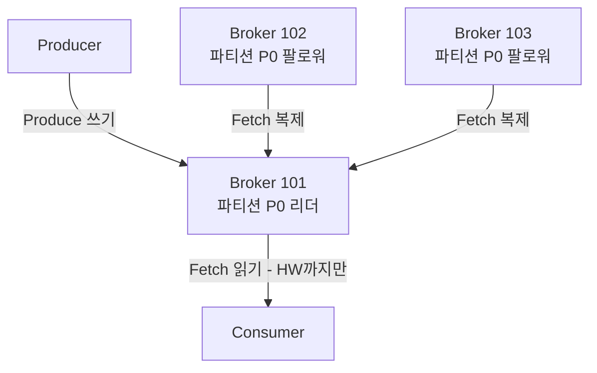
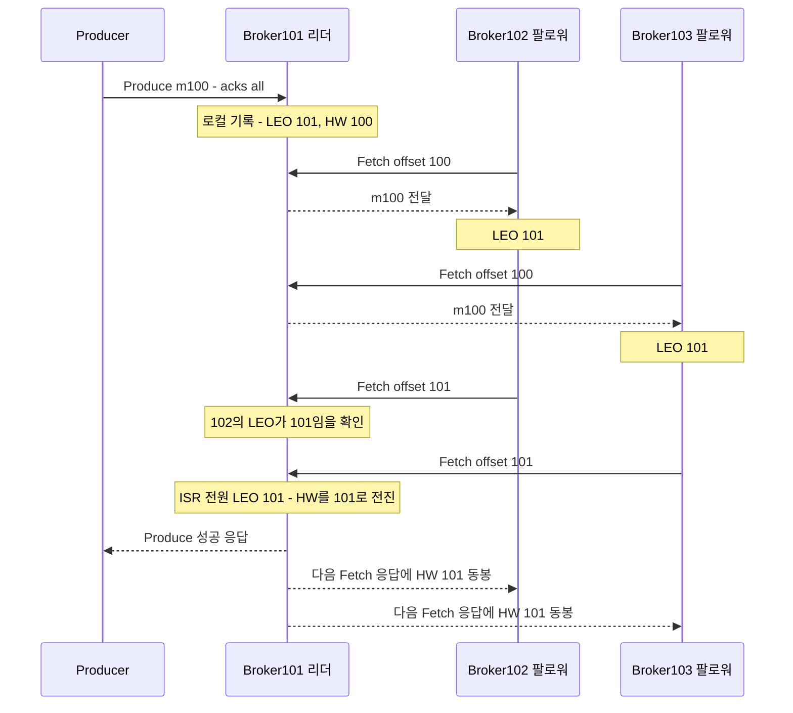
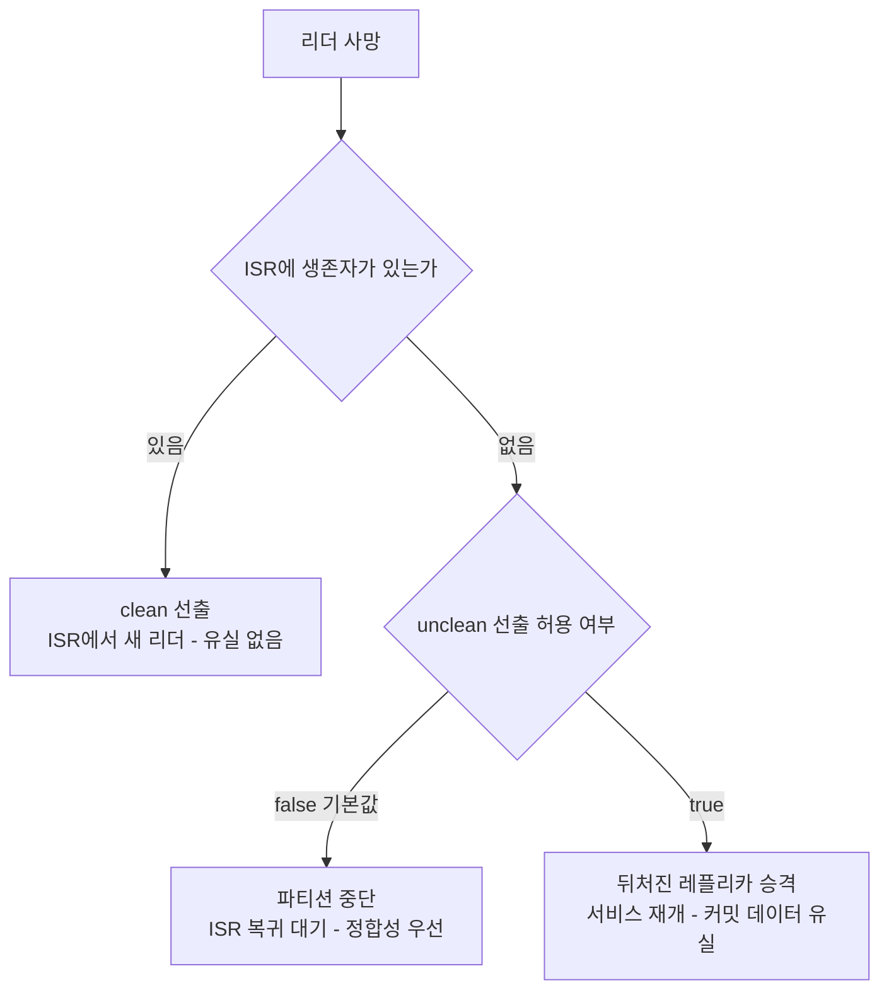
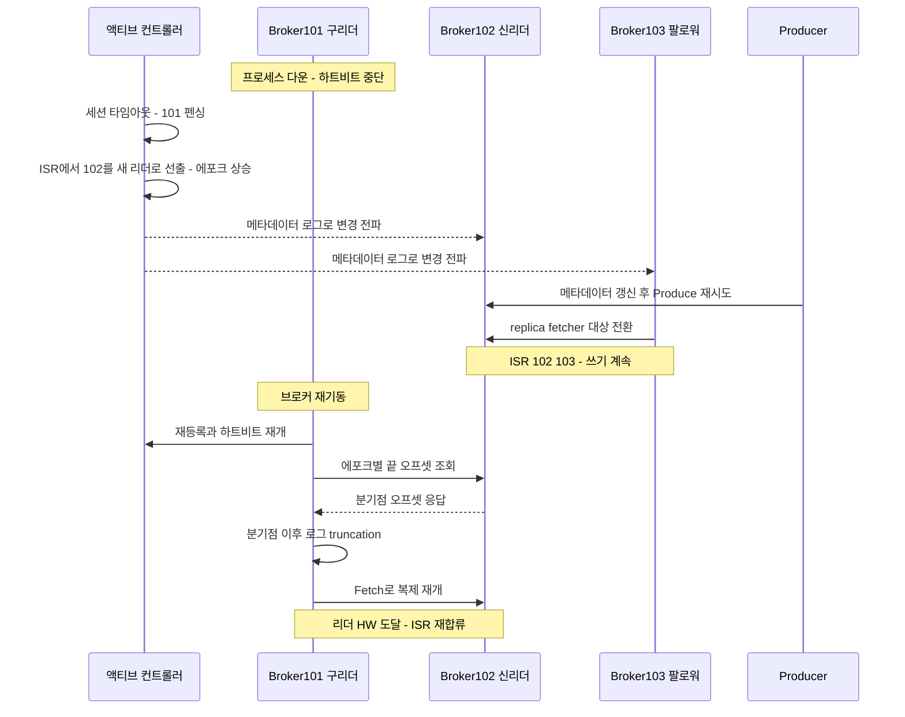
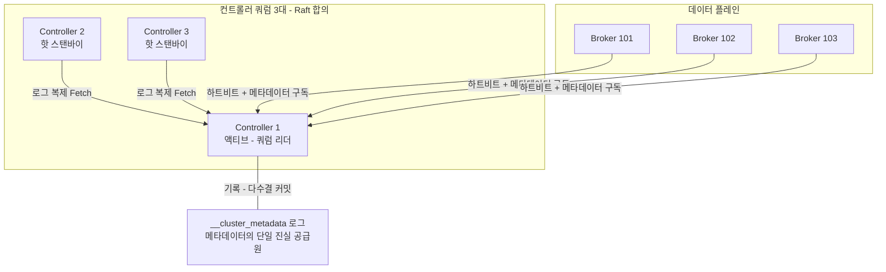

# 복제와 컨트롤러 — 유실 없는 카프카의 조건, KRaft

> 시리즈 03편. 파티션과 오프셋 등 기본 개념은 `01-core-concepts.md`, 세그먼트·인덱스·페이지 캐시 등 저장 구조는 `02-storage-internals.md`를 전제로 한다. 프로듀서 쪽 재시도·멱등성은 `04-producer-deep-dive.md`에서, 운영 관점의 모니터링 지표는 `06-operations-and-tuning.md`에서 이어진다.

이 편은 시리즈의 심장이다. "카프카는 메시지를 유실하지 않는다"는 말은 절반만 맞다. 정확히는 **특정 설정 조합과 특정 장애 범위 안에서만** 유실하지 않는다. 그 조건이 무엇인지, 브로커 한 대가 죽는 순간 내부에서 무슨 일이 벌어지는지, 그리고 이 모든 것을 지휘하는 컨트롤러가 ZooKeeper 시대를 지나 KRaft로 어떻게 다시 태어났는지를 끝까지 파고든다.

---

## 1. 왜 복제가 필요한가 🟢

`02-storage-internals.md`에서 봤듯 카프카는 메시지를 브로커의 로컬 디스크에 쓴다. 그런데 디스크는 죽는다. 브로커 프로세스도 죽고, 서버 랙의 전원도 나가고, 가용 영역(Availability Zone) 하나가 통째로 내려가기도 한다. 파티션이 브로커 한 대에만 존재한다면:

- 그 브로커가 죽는 순간 해당 파티션은 **읽기도 쓰기도 불가능**해진다 (가용성 상실).
- 디스크가 복구 불가능하게 망가지면 데이터가 **영원히 사라진다** (내구성 상실).

해법은 데이터베이스의 리플리카와 같은 발상이다. **같은 파티션의 사본(replica)을 여러 브로커에 두는 것**. 카프카에서 이 사본 개수를 **복제 팩터(replication factor)** 라고 부른다.

```
replication.factor = 3   ← 토픽 생성 시 지정 (브로커 기본값: default.replication.factor)
```

RF=3이면 파티션 하나의 데이터가 서로 다른 브로커 3대에 존재한다. 실무 표준은 3이다. 2는 한 대만 죽어도 "남은 사본이 하나뿐"인 아슬아슬한 상태가 되고, 4 이상은 디스크·네트워크 비용 대비 이득이 작다.

**비유**: 복제 팩터는 중요한 계약서를 원본 1부 + 사본 2부로 만들어 서로 다른 금고 3곳에 넣는 것이다. 금고 하나가 털려도 계약 내용은 안전하다. 다만 이 비유의 한계가 있다 — 계약서 사본은 한 번 만들면 끝이지만, 카프카의 사본은 **끊임없이 새 데이터가 흘러들어오는 살아있는 로그**라서 "사본이 원본을 얼마나 잘 따라가고 있는가"라는 동기화 문제가 새로 생긴다. 이 편의 절반은 바로 그 문제를 다룬다.

---

## 2. 리더/팔로워 복제 모델 🟢

카프카는 멀티 마스터가 아니라 **단일 리더(single leader) 복제**를 쓴다. 파티션마다:

- **리더(leader) 레플리카 1개**: 해당 파티션의 모든 쓰기(Produce)와 — 기본적으로 — 모든 읽기(Fetch)를 처리한다.
- **팔로워(follower) 레플리카 N-1개**: 클라이언트 요청을 받지 않고, 오직 리더에게 Fetch 요청을 보내 데이터를 복제해 온다.

핵심 포인트 세 가지.

**첫째, 복제는 팔로워가 당겨간다(pull)**. 리더가 팔로워에게 밀어넣는(push) 게 아니다. 팔로워는 내부적으로 컨슈머와 거의 동일한 Fetch 프로토콜을 사용해 "오프셋 X부터 주세요"라고 요청한다. 팔로워 브로커 안에서 이 일을 하는 스레드가 replica fetcher 스레드다. pull 방식이라 리더는 팔로워의 상태를 일일이 추적하며 밀어줄 필요가 없고, 팔로워가 자기 속도대로 따라온다.

**둘째, 리더는 파티션 단위다.** 브로커 단위가 아니다. 브로커 3대, 파티션 3개, RF=3이면 보통 각 브로커가 파티션 하나씩의 리더를 맡고 나머지 둘의 팔로워를 겸한다. 리더 역할이 클러스터 전체에 분산되므로 부하도 분산된다.

**셋째, 읽기도 기본은 리더에서만.** 일반적인 DB 리플리카는 읽기 분산이 목적이지만 카프카 팔로워의 1차 목적은 내구성이다. 팔로워에서 읽으면 뒤에서 설명할 HW(high watermark) 문제로 일관성이 깨질 수 있기 때문이다. 예외적으로 KIP-392(Fetch from Follower)로 컨슈머가 같은 랙/AZ의 팔로워에서 읽게 해 네트워크 비용을 아낄 수 있는데, 이때도 HW까지만 읽도록 안전장치가 유지된다.



---

## 3. ISR — "따라오고 있는" 사본의 정확한 정의 🟡

### 3.1 왜 ISR이라는 개념이 필요한가

사본이 3개 있다고 치자. "메시지가 안전하게 복제됐다"고 판정하려면 몇 개의 사본이 받아야 할까?

- **3개 전부**를 기다리면: 팔로워 하나가 GC로 5초 멈추기만 해도 모든 쓰기가 5초 지연된다. 가장 느린 사본이 전체 속도를 결정한다.
- **다수결(quorum)** 방식(Raft처럼 3 중 2)을 쓰면: 지연 문제는 완화되지만, f대 장애를 견디려면 2f+1대가 필요해 사본 효율이 나쁘다.

카프카의 답은 제3의 길이다. **"현재 잘 따라오고 있는 사본들의 명단"을 동적으로 관리**하고, 그 명단 안의 사본들만 기다린다. 이 명단이 **ISR(In-Sync Replicas)** 이다. 느려진 팔로워는 명단에서 빼버리면 되므로 쓰기 지연을 잡을 수 있고, RF=3으로도 2대 장애까지 (설정에 따라) 데이터를 지킬 수 있다.

**비유**: 단체 등산에서 "선두 그룹" 명단과 같다. 페이스를 유지하는 사람만 선두 그룹으로 인정하고, 뒤처지면 명단에서 뺀다. 중요한 결정(안전하게 복제됨 판정)은 선두 그룹의 합의로만 내린다. 한계: 등산과 달리 카프카에서는 **명단 자체가 줄어들 수 있다는 사실이 곧 유실 위험**이 된다 — 뒤에서 acks=all의 함정으로 다시 만난다.

### 3.2 ISR의 정확한 정의와 이탈 조건

ISR = **리더 자신 + 리더의 로그를 충분히 최근에 끝까지 따라잡은 팔로워들의 집합**.

"충분히 최근에"의 기준이 되는 설정이 바로:

```
replica.lag.time.max.ms = 30000   (기본값 30초)
```

정확한 판정 로직은 이렇다. 리더는 팔로워마다 **"마지막으로 내 LEO(로그 끝)까지 완전히 따라잡았던 시각"** 을 기록해 둔다. 팔로워가 Fetch 요청으로 리더의 로그 끝까지 도달할 때마다 이 시각이 갱신된다. 현재 시각과 이 시각의 차이가 `replica.lag.time.max.ms`를 넘으면 리더가 해당 팔로워를 ISR에서 제외한다.

주의할 점 두 가지:

1. **메시지 개수 기준이 아니다.** 옛 버전에는 `replica.lag.max.messages`(N개 이상 뒤처지면 이탈)가 있었지만 0.9에서 제거됐다. 트래픽이 순간적으로 몰리면 정상적인 팔로워도 잠깐 N개 이상 뒤처질 수 있어서, 개수 기준은 오탐(정상 팔로워 강제 이탈)을 유발했기 때문이다. 지금은 오직 **시간** 기준이다.
2. **"요청을 보내고 있다"만으로는 부족하다.** 팔로워가 Fetch를 계속 보내더라도 리더의 로그 끝을 따라잡지 못하면(처리 속도가 유입 속도보다 느리면) 이탈한다. 반대로 트래픽이 없을 때는 Fetch만 주고받아도 항상 끝까지 따라잡은 상태이므로 ISR이 유지된다.

이탈 원인은 크게 세 가지다 — 팔로워 브로커 다운, 팔로워의 처리 지연(느린 디스크, 긴 GC, 네트워크 병목), 그리고 새로 추가되어 아직 따라잡는 중인 레플리카.

### 3.3 재합류 조건과 ISR 변경의 기록

이탈했던 팔로워는 다시 리더를 따라잡으면 재합류한다. 재합류 판정 기준은 **리더의 HW까지 따라잡았는가**(그리고 현재 리더 에포크 기준으로 유효한 로그인가)이다. 그 시점부터 다시 "안전 판정에 참여하는 사본"이 된다.

중요한 사실: ISR 변경은 리더 혼자 결정하고 끝나는 게 아니라 **클러스터 메타데이터에 영속화**된다. 리더가 컨트롤러에게 AlterPartition 요청을 보내고, 컨트롤러가 이를 메타데이터 로그(`__cluster_metadata`, 9절)에 기록해야 확정된다. ISR 명단은 "리더가 죽었을 때 누가 리더가 되어도 안전한가"를 판정하는 근거이므로, 리더 자신이 죽어도 살아남는 곳에 기록되어야 하기 때문이다.

---

## 4. LEO와 HW — 어디까지가 "확정된" 데이터인가 🟡

### 4.1 두 개의 오프셋 포인터

레플리카마다 두 개의 위치 값이 있다.

- **LEO(Log End Offset)**: 그 레플리카의 로그 맨 끝. 정확히는 "다음에 기록될 메시지가 받을 오프셋". 마지막 메시지의 오프셋이 99라면 LEO는 100이다.
- **HW(High Watermark, 하이 워터마크)**: **ISR의 모든 레플리카가 가지고 있는 지점**, 즉 ISR 멤버들의 LEO 중 최솟값. HW 미만의 메시지들을 **커밋된(committed) 메시지**라 부른다.

리더는 각 팔로워의 Fetch 요청에 담긴 "오프셋 X부터 주세요"를 보고 그 팔로워의 LEO를 역산한다(X까지 다 받았다는 뜻이므로). 모든 ISR 멤버의 LEO가 어떤 지점을 넘어서면 리더가 HW를 그 지점까지 전진시키고, 다음 Fetch 응답에 실어 팔로워들에게도 알려준다.

```
          0    1    2    3    4    5    6
리더      [m0] [m1] [m2] [m3] [m4] [m5]      LEO = 6
팔로워A   [m0] [m1] [m2] [m3] [m4]           LEO = 5
팔로워B   [m0] [m1] [m2] [m3]                LEO = 4
                              ↑
                        HW = 4  (ISR 최소 LEO)
          |—— 커밋됨: 컨슈머가 읽을 수 있음 ——|—— 미확정 ——|
```

### 4.2 HW가 전진하는 과정

acks=all Produce 하나가 커밋되기까지의 흐름이다. 팔로워의 Fetch 요청 자체가 "이전 것까지 다 받았다"는 암묵적 ACK 역할을 한다는 점에 주목하자.



여기서 미묘하지만 중요한 사실 하나: **팔로워의 HW는 리더의 HW보다 항상 한 박자 늦게 갱신된다**(다음 Fetch 응답을 받아야 알게 되므로). 이 시차가 과거에 심각한 버그를 만들었고, 그 해결책이 리더 에포크다(7.4절).

### 4.3 컨슈머는 왜 HW까지만 읽는가

컨슈머는 리더의 LEO가 아니라 **HW 미만까지만** 읽을 수 있다. 아직 복제가 덜 된 데이터(HW ~ LEO 구간)를 컨슈머에게 보여주면 무슨 일이 생기는지 보자.

1. 리더의 LEO가 105, HW가 100인 상태에서 컨슈머가 오프셋 103의 메시지를 읽었다고 하자.
2. 직후 리더 브로커가 죽는다. 오프셋 101~104는 아직 어떤 팔로워에도 복제되지 않았다.
3. 팔로워 중 하나가 새 리더가 된다. 새 리더의 로그는 100까지밖에 없다. 오프셋 101~104는 **클러스터 관점에서 존재한 적 없는 데이터**가 된다.
4. 이후 새 리더가 새 메시지를 받으면 오프셋 101부터 **전혀 다른 내용**으로 다시 채워진다.

결과: 컨슈머는 "읽었는데 세상에서 사라진 메시지"(팬텀 리드)를 처리했고, 심지어 같은 오프셋 103을 다시 읽으면 다른 메시지가 나온다. 오프셋의 불변성이라는 카프카의 근본 계약이 깨진다. 그래서 HW는 **"이 지점까지는 리더가 바뀌어도 절대 사라지지 않는다"는 클러스터의 약속선**이고, 컨슈머에게는 그 약속선 안쪽만 보여준다.

실무 함정: 이 때문에 **프로듀서가 방금 쓴 메시지가 컨슈머에게 곧바로 안 보이는 짧은 시간**이 존재한다(복제 완료까지). 또한 팔로워가 느려져 HW 전진이 막히면, 리더에 데이터가 쌓여 있어도 컨슈머 lag이 늘어난 것처럼 보인다. lag 지표를 볼 때 "컨슈머가 느린 것"과 "HW가 안 나가는 것"을 구분해야 한다.

또 하나 — 트랜잭션을 쓰는 경우 `read_committed` 컨슈머는 HW보다 더 보수적인 LSO(Last Stable Offset)까지만 읽는데, 이는 `04-producer-deep-dive.md`의 트랜잭션 절에서 다룬다.

---

## 5. acks와 min.insync.replicas — 유실 시나리오 전격 분석 🟡

### 5.1 acks 세 가지 모드

`acks`는 프로듀서 설정으로, **"언제 쓰기 성공으로 인정받을 것인가"** 를 정한다.

| acks | 성공 판정 시점 | 의미 |
|---|---|---|
| `0` | 요청을 소켓에 쓴 순간 | 응답을 기다리지 않음. 브로커가 받았는지조차 모름 |
| `1` | **리더가 로컬 로그에 기록**한 순간 | 팔로워 복제는 기다리지 않음 |
| `all` (`-1`) | **ISR의 모든 레플리카가 기록**한 순간 | HW가 해당 메시지를 지나 전진해야 응답 |

여기에 브로커/토픽 설정 하나가 짝을 이룬다:

```
min.insync.replicas = 1   (기본값)
```

의미: **acks=all 쓰기를 받아주기 위한 ISR의 최소 크기**. ISR 크기가 이 값 미만이면 브로커는 acks=all Produce를 `NotEnoughReplicasException`으로 거절한다. 핵심은 이것이 **acks=all일 때만 작동하는 안전장치**라는 점이다. acks=0/1에는 아무 영향이 없다.

### 5.2 조합별 유실 시나리오 표

RF=3 기준. "유실"은 프로듀서가 **성공 응답을 받은** 메시지가 사라지는 경우를 말한다(응답을 못 받아 재시도하는 건 유실이 아니라 정상 동작이다).

| 조합 | 유실 시나리오 | 유실 가능성 | 가용성 |
|---|---|---|---|
| `acks=0` | 네트워크 유실, 리더 다운, 파티션 리더 교체 등 거의 모든 상황. 성공 여부 자체를 모름 | **상시** | 최고 (응답 대기 없음) |
| `acks=1` | 리더가 로컬 기록 후 응답 → **복제 전에 리더 다운** → 팔로워가 새 리더가 되며 해당 메시지 증발 | **리더 장애 시마다** | 높음 |
| `acks=all` + `min.insync.replicas=1` | ⚠️ **함정 케이스.** 아래 5.3 상세 | 팔로워 전원 ISR 이탈 시 acks=1과 동일해짐 | 높음 (ISR 1대만 있어도 쓰기 가능) |
| `acks=all` + `min.insync.replicas=2` | 성공 응답 = 최소 2대에 존재. **1대 장애까지는 유실 없음.** 2대 동시 장애 + 남은 1대가 하필 미복제분만 가진 경우에만 위험 | 실질적으로 매우 낮음 | ISR이 1대로 줄면 **쓰기 거절** (읽기는 가능) |
| `acks=all` + `min.insync.replicas=3` (RF=3) | 유실 방어는 최고지만 **브로커 1대만 내려가도 모든 쓰기 중단**. 롤링 재시작조차 불가 | 최저 | 최저 — 실무에서 사실상 금기 |

실무 표준 조합은 **RF=3 + `acks=all` + `min.insync.replicas=2`** 다. "N대 중 1대 장애는 유실 없이 견디고, 2대 장애 시엔 유실 대신 쓰기 중단을 택한다"는 명시적 선언이다.

### 5.3 acks=all인데도 유실되는 함정 케이스 (상세)

**"acks=all이면 3대 전부에 복제된 후 응답한다"는 흔한 오해**부터 깨야 한다. acks=all은 "**현재 ISR** 전부"이지 "레플리카 전부"가 아니다. ISR은 동적으로 줄어드는 명단이라는 걸 떠올리자.

`min.insync.replicas=1`(기본값!)인 상태에서 시간 순으로:

1. **t0**: RF=3, ISR = {101(리더), 102, 103}. 정상 운영 중.
2. **t1**: 브로커 102가 긴 GC로 멈추고, 103은 디스크 병목으로 뒤처진다. `replica.lag.time.max.ms`(30초) 경과 후 리더가 둘을 ISR에서 제외. **ISR = {101} 하나뿐.**
3. **t2**: 프로듀서가 acks=all로 메시지 전송. ISR 크기 1 ≥ `min.insync.replicas` 1이므로 브로커는 거절하지 않는다. "ISR 전원"인 **리더 혼자** 기록하고 즉시 성공 응답. — 이 순간 acks=all은 사실상 acks=1이다.
4. **t3**: 브로커 101이 디스크 장애로 사망. t2의 메시지는 어디에도 복제되지 않은 채 사라졌다.
5. **t4**: 102나 103이 새 리더가 되고(ISR 복귀 후, 또는 unclean 선출로), 클러스터는 t2 메시지가 존재한 적 없다는 듯 계속 동작한다. **프로듀서는 성공 응답을 받았는데 메시지는 없다.**

`min.insync.replicas=2`였다면 t2에서 브로커가 `NotEnoughReplicas`로 거절했을 것이고, 프로듀서는 실패를 인지하고 재시도하거나 알람을 울렸을 것이다. **유실이 "조용한 사고"에서 "시끄러운 장애"로 바뀐다** — 분산 시스템에서 후자가 압도적으로 낫다.

그 밖의 acks=all 함정들:

- **프로듀서 쪽 구멍**: acks=all이어도 `retries=0`이거나 콜백에서 실패를 무시하면 클라이언트 단에서 유실된다. 브로커 응답 유실 시 재시도로 인한 중복은 멱등 프로듀서(`enable.idempotence`)로 막는다 — `04-producer-deep-dive.md`.
- **fsync는 하지 않는다**: acks=all의 "기록"은 OS 페이지 캐시까지다. 카프카는 기본적으로 메시지마다 디스크 강제 동기화(fsync)를 하지 않고(`log.flush.interval.messages` 기본 무제한), 내구성을 디스크가 아닌 **복제**에서 얻는다. 따라서 ISR 전원이 **동시에 전원 유실**되는 상관 장애(같은 랙, 같은 AZ)에서는 acks=all + min.insync.replicas=2로도 유실될 수 있다. 레플리카를 랙/AZ에 분산하는 `broker.rack` 설정이 중요한 이유다.
- **unclean 리더 선출이 켜져 있는 경우**: 다음 절.

---

## 6. unclean.leader.election.enable — 가용성 vs 정합성 🔴

리더가 죽으면 컨트롤러는 **ISR 안에서** 새 리더를 뽑는다. ISR 멤버는 정의상 HW까지의 모든 커밋된 데이터를 가지고 있으므로, 이 선출은 유실이 없다(clean election).

그런데 **ISR 멤버가 전부 죽어버렸다면?** 살아있는 건 ISR에서 이탈했던, 즉 데이터가 뒤처진 레플리카뿐이라면? 선택지는 둘이다.

```
unclean.leader.election.enable = false   (기본값)
```

- **false (정합성 우선)**: ISR 멤버가 돌아올 때까지 파티션은 리더 없음 상태로 **읽기/쓰기 전면 중단**. 커밋된 데이터는 절대 잃지 않지만, 죽은 브로커의 디스크가 영영 복구 안 되면 수동 개입 전까지 파티션이 멈춘다.
- **true (가용성 우선)**: 뒤처진 레플리카라도 즉시 리더로 승격시켜 서비스를 재개한다. 대가는 두 가지 — 새 리더가 갖지 못한 커밋된 메시지들의 **확정 유실**, 그리고 옛 리더가 복귀했을 때 로그가 새 리더 기준으로 잘려나가며 생기는 **로그 이력의 되감기**(컨슈머가 봤던 오프셋에 다른 데이터가 들어올 수 있음).



어느 쪽이 맞는지는 **데이터의 성격**이 정한다. 결제·정산·원장이라면 false(멈추는 게 낫다). 클릭 로그·메트릭처럼 일부 유실보다 수집 중단이 더 아픈 데이터라면 토픽 단위로 true를 고려할 수 있다. 이 설정이 토픽별 오버라이드가 가능한 이유다. 긴급 상황에서는 설정과 무관하게 `kafka-leader-election.sh --election-type unclean`으로 특정 파티션만 수동 unclean 선출을 할 수도 있다.

참고로 이 "ISR 전멸 시 딜레마" 자체를 구조적으로 완화하는 것이 KIP-966 ELR이다(9.5절).

---

## 7. 장애 워크스루 — 브로커 한 대가 죽으면 🔴

RF=3, `min.insync.replicas=2`, 브로커 101/102/103. 파티션 P0의 리더가 101, ISR = {101, 102, 103}인 상태에서 **브로커 101이 죽는다**. 시간 순으로 따라가 보자. (컨트롤러의 정체는 다음 절에서 다루니, 여기서는 "클러스터의 관제탑"으로만 이해해도 된다.)

### 7.1 감지 — 하트비트 중단과 펜싱

KRaft 모드에서 브로커는 액티브 컨트롤러에 주기적으로 하트비트를 보낸다.

```
broker.heartbeat.interval.ms = 2000   (하트비트 주기)
broker.session.timeout.ms    = 9000   (이 시간 동안 하트비트 없으면 사망 판정)
```

101의 하트비트가 끊기고 약 9초 후, 컨트롤러는 101을 **펜싱(fencing)** 한다 — "이 브로커는 더 이상 유효하지 않다"는 공식 선언이다. (`controlled.shutdown`으로 곱게 내려가는 경우엔 브로커가 미리 통보하므로 이 대기 없이 즉시 진행된다.)

### 7.2 리더 선출과 에포크 상승

컨트롤러는 101이 리더였던 모든 파티션에 대해 새 리더를 뽑는다. 규칙: **레플리카 배정 목록 순서대로 훑으며, ISR에 속한 살아있는 첫 번째 레플리카**를 리더로 선출. P0의 ISR에 102, 103이 남아 있으므로 clean 선출이다 — 유실 없음. 102가 새 리더가 됐다고 하자.

이때 파티션의 **리더 에포크(leader epoch)** 가 1 증가한다. 리더 에포크는 "이 파티션의 몇 번째 리더 체제인가"를 나타내는 단조 증가 카운터로, 모든 메시지 배치에 함께 기록된다. 두 가지 일을 한다:

1. **좀비 리더 차단**: 옛 리더(101)가 네트워크 단절이었다가 돌아와 여전히 자기가 리더인 줄 알고 행동해도, 낡은 에포크가 찍힌 요청은 거절된다.
2. **복구 시 로그 정합성 판정**: 7.4절의 truncation 기준점.

새 리더십은 컨트롤러가 메타데이터 로그에 기록하고, 전 브로커가 이를 구독해 알게 된다. 클라이언트는 다음 요청에서 `NOT_LEADER_OR_FOLLOWER` 에러를 받고 메타데이터를 갱신해 102로 붙는다 — 프로듀서의 `retries`가 이 순단을 흡수한다.

### 7.3 ISR 축소와 그 파장

- P0의 ISR에서 101이 제거된다: ISR = {102, 103}. 크기 2 ≥ `min.insync.replicas` 2이므로 쓰기는 계속된다. **여기서 한 대가 더 죽으면 ISR=1이 되어 acks=all 쓰기가 멈춘다** — RF=3의 장애 허용 한도는 "유실 없이 1대"라는 뜻이다.
- 101이 **팔로워**였던 다른 파티션들에서도, 각 리더가 30초(`replica.lag.time.max.ms`) 후 101을 ISR에서 제외한다.
- 모니터링에는 UnderReplicatedPartitions 지표가 치솟는다 — 운영 대응은 `06-operations-and-tuning.md`.



### 7.4 복구 — 재합류와 truncation, 그리고 리더 에포크가 필요한 이유

101이 재기동하면 컨트롤러에 재등록하고, P0의 **팔로워**로서 102를 따라잡기 시작한다. 그런데 그냥 이어서 받으면 안 된다. **101의 로그 꼬리에는 클러스터가 인정하지 않는 데이터가 있을 수 있다** — 죽기 직전 리더로서 받았지만 미처 복제 못 한(HW 위의) 메시지들이다. 한편 102는 새 리더가 된 후 같은 오프셋 구간에 다른 메시지들을 받았을 수 있다. 두 로그가 **분기(diverge)** 한 것이다.

그래서 팔로워는 복제 재개 전에 리더에게 묻는다: **"에포크 E는 어느 오프셋에서 끝났습니까?"** (OffsetsForLeaderEpoch, 최신 버전에선 Fetch 프로토콜에 통합). 리더의 답을 받아 자기 로그와 비교해 **분기 시작점을 정확히 찾고, 그 지점 이후를 잘라낸(truncate) 뒤** 복제를 재개한다. 잘려나간 메시지들은 어차피 커밋된 적 없는(HW 위) 데이터이므로, 프로듀서 입장에선 응답을 못 받아 재시도했을 메시지들이다 — 계약 위반이 아니다.

**왜 HW 기준 truncation으론 부족했나 (KIP-101 이전의 버그)**: 과거엔 "재기동한 팔로워는 자기 HW까지 자르고 시작"이었다. 그런데 4.2절에서 봤듯 팔로워의 HW는 리더보다 한 박자 늦다. 이 시차 때문에 (a) 팔로워가 실제로는 커밋된 메시지를 갖고 있는데도 낡은 HW 기준으로 잘라버린 직후 리더가 죽으면 **커밋된 데이터가 유실**되거나, (b) 두 브로커가 연쇄로 죽었다 살아나는 시나리오에서 서로 다른 내용의 로그가 같은 오프셋에 공존하는 **로그 분기가 영구화**되는 문제가 있었다. 에포크 기반 truncation은 "몇 번째 리더 체제의 데이터인가"를 기준으로 분기점을 정확히 찾으므로 두 문제가 모두 사라진다.

101이 102의 HW까지 따라잡으면 ISR = {101, 102, 103}으로 복원된다. 마지막으로, 리더십이 102에 쏠린 채로 남는 것을 막기 위해 `auto.leader.rebalance.enable=true`(기본값)면 컨트롤러가 주기적으로 **선호 리더(preferred leader)** — 레플리카 목록의 첫 번째, 여기선 101 — 로 리더십을 되돌린다.

---

## 8. 컨트롤러 — 클러스터의 관제탑 🔴

### 8.1 컨트롤러가 하는 일

앞 절의 워크스루에서 감지·선출·전파를 전부 수행한 주체가 **컨트롤러(controller)** 다. 담당 업무:

- 브로커 등록과 생존 감시(하트비트), 펜싱
- 파티션 리더 선출, 리더 에포크 관리
- ISR 변경의 승인과 영속화 (AlterPartition 처리)
- 토픽 생성/삭제, 파티션 추가, 레플리카 재배치, 설정 변경
- 이 모든 **메타데이터의 단일 진실 공급원(source of truth)** 이자 전파자

브로커들이 각자 판단하면 스플릿 브레인이 나므로, 이런 결정은 반드시 한 곳에서 내려져야 한다. 문제는 "그 한 곳이 죽으면?"이다. 컨트롤러 자체의 고가용성을 어떻게 확보하느냐가 카프카 아키텍처 역사의 큰 줄기이고, ZooKeeper → KRaft 전환의 이유다.

### 8.2 ZooKeeper 시대의 구조 🟡

Kafka 3.x까지의 전통 구조(역사적 맥락으로 이해하면 된다):

- 별도의 **ZooKeeper 앙상블**(보통 3~5대)이 메타데이터 저장소 역할. 브로커 목록, 토픽 설정, ISR, 컨트롤러가 누구인지 등이 znode로 저장됐다.
- 브로커 중 **한 대**가 ZooKeeper의 임시(ephemeral) znode `/controller`를 선점해 컨트롤러가 된다. 컨트롤러가 죽으면 znode가 사라지고, 이를 감지한 브로커들이 재선점 경쟁을 벌여 새 컨트롤러가 뽑힌다.
- 컨트롤러는 결정을 내리면 ZooKeeper에 쓰고, 각 브로커에 개별 RPC(LeaderAndIsr, UpdateMetadata 등)로 밀어넣었다.

### 8.3 ZooKeeper 구조의 한계 🔴

이 구조는 오래 버텼지만 규모가 커지자 구조적 병목이 드러났다.

1. **컨트롤러 페일오버가 느리다**: 새 컨트롤러는 취임 직후 ZooKeeper에서 **전체 클러스터 상태를 처음부터 다 읽어** 메모리에 재구성해야 했다. 파티션이 수십만 개면 이 초기화만 수십 초~분 단위 — 그동안 리더 선출이 불가능해 클러스터가 사실상 마비된다.
2. **메타데이터 전파가 O(브로커 × 파티션)**: 변경을 브로커마다 개별 RPC로 밀어넣는 구조라 대규모 장애(브로커 다운으로 수천 파티션 동시 리더 교체) 시 전파 폭풍이 일었다.
3. **이중 진실 공급원**: 메타데이터가 ZooKeeper에도, 컨트롤러 메모리에도, 각 브로커 캐시에도 존재해 미묘한 불일치 버그의 온상이었다.
4. **운영 부담**: 완전히 다른 분산 시스템(ZooKeeper)을 별도로 배포·튜닝·모니터링해야 했다.
5. 이 모든 요인이 겹쳐 클러스터당 파티션 수의 실질적 상한(대략 수십만 수준)을 만들었다.

### 8.4 KRaft — 메타데이터도 카프카 로그다 🔴

KIP-500의 통찰은 우아하다: **"카프카는 세계 최고 수준의 복제 로그 시스템인데, 왜 자기 메타데이터는 남의 시스템에 맡기는가?"** KRaft(Kafka Raft)는 메타데이터 관리를 카프카 안으로 들여온다.

- **컨트롤러 쿼럼**: 컨트롤러 역할을 하는 노드 3대 또는 5대가 **Raft 합의 프로토콜**(정확히는 push가 아닌 pull 기반의 카프카식 변형)로 쿼럼을 이룬다. 쿼럼 리더가 **액티브 컨트롤러**, 나머지는 핫 스탠바이다. `process.roles=controller`(전용) 또는 `process.roles=broker,controller`(소규모/개발용 겸용)로 지정한다.
- **`__cluster_metadata`**: 모든 메타데이터 변경(브로커 등록, 파티션 리더 변경, ISR 변경, 토픽 생성…)이 이 **내부 단일 파티션 토픽에 이벤트 레코드로 순서대로 기록**된다. 메타데이터가 곧 이벤트 소싱된 로그다. Raft 다수결로 커밋되어야 확정된다.
- **전파는 push가 아니라 구독**: 브로커들은 이 메타데이터 로그를 컨슈머처럼 **Fetch로 구독**해 변경분(delta)만 따라간다. 새로 뜨거나 한참 뒤처진 브로커는 **스냅샷**부터 받고 이어 읽는다. O(브로커 × 파티션) RPC 폭풍이 사라졌다.
- **즉각적인 페일오버**: 스탠바이 컨트롤러들도 같은 로그를 실시간 복제하고 있으므로 이미 최신 상태를 메모리에 갖고 있다. 액티브가 죽으면 Raft 선출(에포크 상승)만으로 **수 초 내, 상태 재로딩 없이** 승계한다. ZooKeeper 시대 최대 약점의 해소다.
- **쿼럼 구성**: `controller.quorum.voters`로 정적 지정하거나, Kafka 3.9의 KIP-853부터는 `controller.quorum.bootstrap.servers` 기반 **동적 쿼럼**으로 컨트롤러를 무중단 추가/제거할 수 있다.



재미있는 대칭성: 일반 토픽은 ISR 방식으로, `__cluster_metadata`는 Raft 다수결로 복제된다. 일반 토픽이 다수결을 안 쓰는 건 사본 효율과 처리량 때문이고, 메타데이터가 다수결을 쓰는 건 **리더 선출을 해줄 상위 존재가 없는 최상위 계층이라 자체 합의가 필요**하기 때문이다. 직접 만들어보는 실습은 `09-build-your-own-kafka.md`에서.

### 8.5 타임라인 — 그리고 Kafka 4.0의 ZooKeeper 완전 제거 🟢

- **2.8 (2021)**: KRaft 얼리 액세스 → **3.3**: 프로덕션 준비 완료 선언 → **3.5+**: ZooKeeper 모드 사용 중단(deprecated) 예고, 마이그레이션 도구 제공.
- **3.9 (2024)**: ZooKeeper를 지원하는 마지막 버전. 무중단 마이그레이션의 브리지 릴리스.
- **4.0 (2025-03)**: **ZooKeeper 코드 완전 삭제. KRaft 전용.** 기존 ZK 클러스터는 3.9를 거쳐 KRaft로 마이그레이션한 후에만 4.x로 올라갈 수 있다.

### 8.6 한 걸음 더 — ELR, ISR 모델의 마지막 구멍 메우기 🔴

5.3절의 함정(ISR이 1로 쪼그라든 뒤 그 한 대가 죽는 시나리오)을 프로토콜 차원에서 완화하는 것이 **KIP-966 ELR(Eligible Leader Replicas)** 이다. 아이디어: ISR이 `min.insync.replicas` 아래로 줄어들면 HW가 전진할 수 없다는 사실을 역이용한다. 그 시점 이후 ISR에서 이탈한 레플리카는 **HW까지의 커밋 데이터는 전부 갖고 있음이 보장**되므로, "ISR은 아니지만 리더가 되어도 유실이 없는 후보" 명단(ELR)에 올려 둔다. 마지막 ISR 멤버까지 죽어도 ELR에서 clean 선출이 가능해져, unclean 선출이 필요한 상황 자체가 크게 줄어든다. Kafka 4.0에서 프리뷰로 도입됐고(`eligible.leader.replicas.version=1`로 활성화), **4.1부터 신규 클러스터에서 기본 활성**이다.

---

## 정리 — 유실 없는 카프카의 조건

이 편의 결론을 한 줄씩 압축하면:

1. **RF=3** — 사본은 서로 다른 브로커(가능하면 다른 랙/AZ, `broker.rack`)에 3개.
2. **acks=all** — 프로듀서는 ISR 전원의 복제를 기다린다.
3. **min.insync.replicas=2** — ISR이 쪼그라들어 acks=all이 무력화되는 함정을 차단.
4. **unclean.leader.election.enable=false** — 뒤처진 사본의 리더 승격 금지.
5. **프로듀서 재시도 + 멱등성** — 순단을 유실도 중복도 없이 흡수 (`04-producer-deep-dive.md`).
6. 그리고 이 모든 것은 "**ISR 전멸 + 상관 장애**"까지 막아주지는 않는다는 한계 인식 — 그 너머는 랙/AZ 분산과 클러스터 간 복제(`07-ecosystem.md`의 MirrorMaker 2)의 영역이다.

---

## 면접 포인트

**Q1. acks=all이면 메시지 유실이 없다고 봐도 되나요?**
- 나쁜 답변: "네, 모든 레플리카에 복제된 후 응답하니까 안전합니다." — ISR과 레플리카 전체를 혼동했고, min.insync.replicas를 모른다는 신호다.
- 좋은 답변 뼈대: acks=all은 "현재 ISR 전원"이 기준인데 ISR은 동적으로 줄어든다 → min.insync.replicas=1(기본값)이면 ISR이 리더 하나로 줄었을 때 acks=all이 사실상 acks=1이 된다 → 그래서 min.insync.replicas=2가 필수 짝이다 → 추가로 acks=all은 fsync가 아니라 페이지 캐시 기준이므로 상관 장애(전원 동시 유실)는 복제 분산 배치로 막아야 하고, 클라이언트 쪽 retries/멱등성까지 언급하면 만점.

**Q2. HW(high watermark)는 무엇이고, 컨슈머는 왜 HW까지만 읽나요?**
- 나쁜 답변: "복제가 끝난 지점이고, 안 끝난 데이터를 주면 안 되니까요." — 동어반복. "왜 안 되는지"가 핵심이다.
- 좋은 답변 뼈대: HW = ISR 전원이 보유한 지점(ISR 멤버 LEO의 최솟값) = "리더가 바뀌어도 절대 사라지지 않는 약속선" → HW 위를 읽게 하면, 리더 장애 시 새 리더에는 그 데이터가 없어 컨슈머가 "존재한 적 없는 메시지"를 처리한 셈이 되고, 같은 오프셋에 나중에 다른 메시지가 들어와 오프셋 불변성이 깨진다 → 덤: 이 때문에 produce 직후 consume 사이에 복제 지연만큼의 가시성 지연이 존재한다.

**Q3. 브로커 한 대가 갑자기 죽으면 어떤 일이 일어나는지 순서대로 설명해 보세요.**
- 나쁜 답변: "리더가 다시 뽑히고 알아서 복구됩니다." — 블랙박스 답변.
- 좋은 답변 뼈대: 하트비트 중단 → broker.session.timeout.ms 후 컨트롤러가 펜싱 → 그 브로커가 리더였던 파티션마다 ISR 내 생존 레플리카를 새 리더로 선출 + 리더 에포크 증가 → 메타데이터 로그로 전파, 클라이언트는 NOT_LEADER 에러 후 메타데이터 갱신 → 각 파티션 ISR 축소(min.insync.replicas 미달이면 쓰기 중단) → 복구 시 재기동 브로커는 리더 에포크 기준으로 분기점을 찾아 truncation 후 Fetch로 따라잡고, 리더 HW 도달 시 ISR 재합류 → 이후 선호 리더로 리밸런싱. truncation이 HW가 아닌 에포크 기준인 이유(KIP-101, 팔로워 HW의 시차)까지 말하면 시니어급.

**Q4. ISR에서 팔로워가 빠지는 정확한 조건은 무엇인가요?**
- 나쁜 답변: "메시지가 일정 개수 이상 밀리면 빠집니다." — 0.9에서 제거된 옛날 기준이다.
- 좋은 답변 뼈대: 기준은 개수가 아니라 시간 — 팔로워가 리더의 LEO(로그 끝)까지 완전히 따라잡은 마지막 시각이 replica.lag.time.max.ms(기본 30초)보다 오래되면 리더가 제외한다 → 개수 기준은 트래픽 스파이크 때 정상 팔로워를 오탐해서 제거됐다 → ISR 변경은 리더 단독 결정이 아니라 컨트롤러 승인을 거쳐 메타데이터 로그에 영속화된다 → 재합류는 리더의 HW까지 따라잡았을 때.

**Q5. KRaft가 ZooKeeper 방식보다 나은 점을 구조적으로 설명해 보세요.**
- 나쁜 답변: "관리할 시스템이 하나 줄어서 편합니다." — 사실이지만 운영 편의는 부수 효과다.
- 좋은 답변 뼈대: 핵심은 메타데이터를 상태 저장소가 아니라 복제 로그(__cluster_metadata)로 모델링한 것 → (1) 페일오버: ZK 시대엔 새 컨트롤러가 전체 상태를 ZK에서 재로딩해야 해 파티션 수에 비례해 느렸지만, KRaft 스탠바이는 같은 로그를 이미 복제 중이라 즉시 승계 → (2) 전파: 브로커별 RPC push에서 로그 구독 pull + 스냅샷으로 바뀌어 delta 전파가 됨 → (3) 진실 공급원 단일화로 불일치 버그 제거 → 결과적으로 파티션 수 상한이 크게 올라갔고, 4.0에서 ZK 코드가 완전히 제거됐다.

---

## 참고 자료

- [Apache Kafka 4.0.0 Release Announcement](https://kafka.staged.apache.org/blog/2025/03/18/apache-kafka-4.0.0-release-announcement/) — ZooKeeper 완전 제거, KIP-966 프리뷰
- [Apache Kafka 공식 문서 — Eligible Leader Replicas](https://kafka.apache.org/41/operations/eligible-leader-replicas/) — ELR 활성화 조건과 4.1 기본값
- [KIP-966: Eligible Leader Replicas](https://cwiki.apache.org/confluence/display/KAFKA/KIP-966:+Eligible+Leader+Replicas)
- [Jack Vanlightly — Kafka KIP-966: Fixing the Last Replica Standing issue](https://jack-vanlightly.com/blog/2023/8/17/kafka-kip-966-fixing-the-last-replica-standing-issue)
- [Confluent — Apache Kafka 4.0 Release](https://www.confluent.io/blog/latest-apache-kafka-release/)
