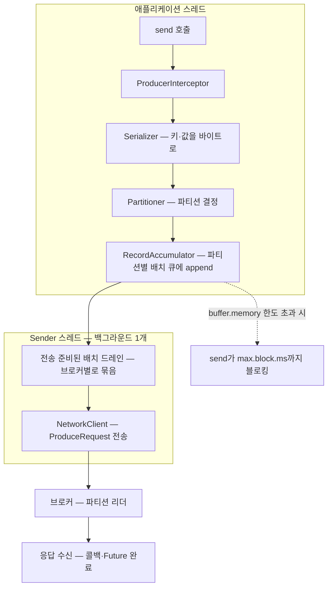
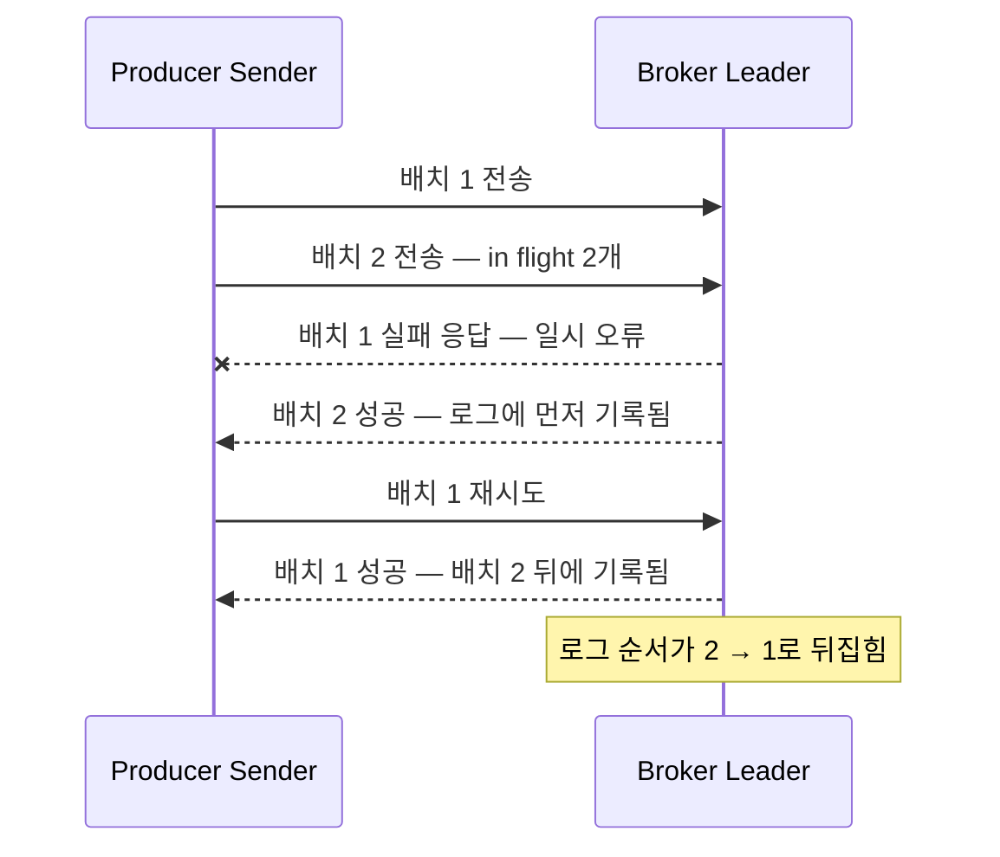
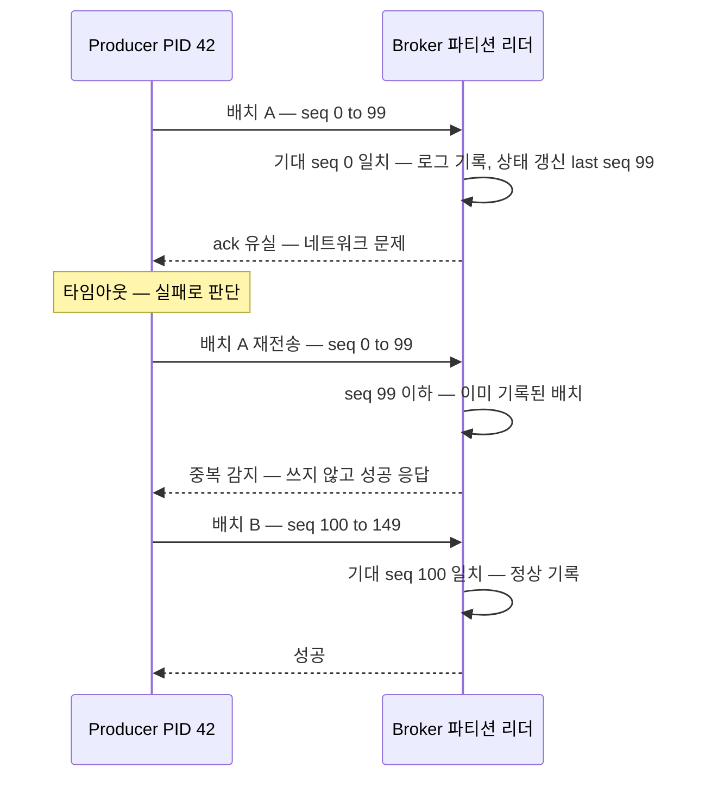
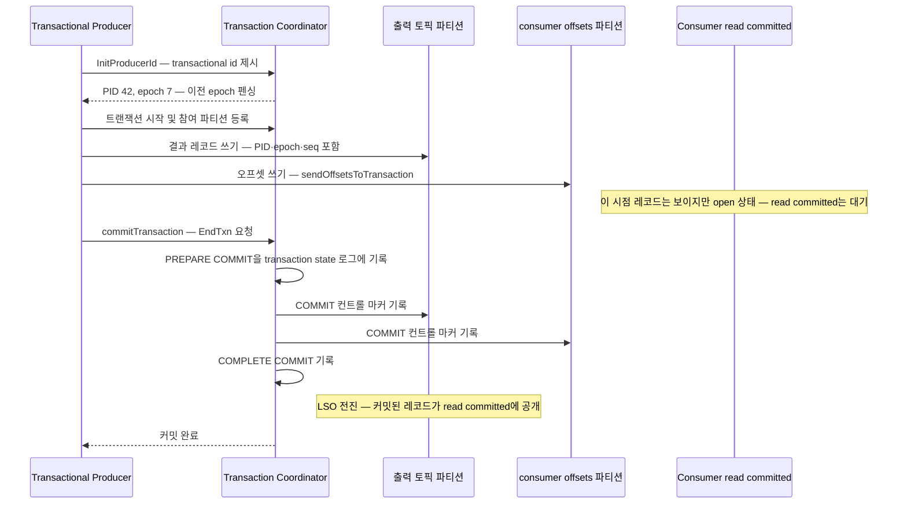
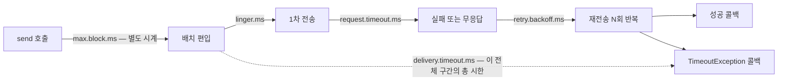

# 프로듀서 심화 — 배칭·멱등성·트랜잭션·정확히 한 번

> 시리즈 04편. 기준 버전은 Apache Kafka 4.x(KRaft 전용)다. 토픽·파티션·오프셋 같은 기본 개념은 [01-core-concepts.md](01-core-concepts.md), 복제와 acks의 브로커 쪽 사정은 [03-replication-and-controller.md](03-replication-and-controller.md)를 전제한다. 컨슈머 쪽 짝은 [05-consumer-deep-dive.md](05-consumer-deep-dive.md)에서 다룬다.

---

## 목차

1. [send()는 보내지 않는다 — 프로듀서 내부 파이프라인](#1-send는-보내지-않는다--프로듀서-내부-파이프라인) 🟡
2. [배칭 튜닝 — linger.ms, batch.size, buffer.memory](#2-배칭-튜닝--lingerms-batchsize-buffermemory) 🟡
3. [재시도와 순서 — 순서가 뒤집히는 순간](#3-재시도와-순서--순서가-뒤집히는-순간) 🟡
4. [멱등 프로듀서 — PID와 시퀀스 넘버](#4-멱등-프로듀서--pid와-시퀀스-넘버) 🔴
5. [트랜잭션 — 좀비 펜싱과 원자적 쓰기](#5-트랜잭션--좀비-펜싱과-원자적-쓰기) 🔴
6. [exactly-once의 정확한 범위](#6-exactly-once의-정확한-범위) 🔴
7. [타임아웃 관계 총정리 — delivery.timeout.ms 계열](#7-타임아웃-관계-총정리--deliverytimeoutms-계열) 🟡
8. [면접 포인트](#면접-포인트)

---

## 1. send()는 보내지 않는다 — 프로듀서 내부 파이프라인 🟡

### 왜 알아야 하는가

`producer.send(record)`를 호출하면 네트워크로 메시지가 나갈 것 같지만, 실제로는 **메모리 버퍼에 쌓일 뿐**이다. 이 사실을 모르면 세 가지 사고가 난다.

- 앱을 그냥 종료했더니 마지막 메시지들이 사라졌다 — 버퍼에만 있고 전송 전이었다.
- "카프카가 느리다"고 브로커를 튜닝했는데 실제 병목은 프로듀서의 배칭 설정이었다.
- `send()`가 갑자기 블로킹돼서 요청 스레드가 멈췄다 — 버퍼가 꽉 찼거나 메타데이터를 못 가져온 것이다.

프로듀서는 내부적으로 **두 개의 스레드가 협업하는 비동기 파이프라인**이다. 택배에 비유하면, `send()`는 "집하장에 물건을 맡기는 것"이고, 실제 배송 트럭(sender 스레드)은 물건이 어느 정도 모이거나 시간이 되면 출발한다. 다만 비유의 한계도 있다. 택배 집하장은 물건을 잃어버리면 배상하지만, 프로듀서 버퍼는 프로세스가 죽으면 그냥 증발한다. "맡겼다 = 안전하다"가 아니라는 점이 핵심이다.

### 전체 파이프라인

단계별로 뜯어보자.

#### 1) 직렬화 — Serializer

키와 값을 바이트 배열로 바꾼다(`key.serializer`, `value.serializer`). 카프카 브로커는 내용물을 해석하지 않고 바이트만 저장하므로([02-storage-internals.md](02-storage-internals.md)), 스키마 호환성은 전적으로 클라이언트 책임이다. JSON, Avro, Protobuf 중 무엇을 쓰든 브로커는 모른다. Schema Registry 이야기는 [07-ecosystem.md](07-ecosystem.md)에서 다룬다.

#### 2) 파티셔닝 — Partitioner

레코드가 어느 파티션으로 갈지 결정한다. 기본 동작은 다음과 같다.

- **키가 있으면**: `murmur2(키 바이트) % 파티션 수`. 같은 키는 항상 같은 파티션으로 간다 — 이것이 카프카가 제공하는 유일한 순서 보장의 전제다. 주의: **파티션 수를 늘리면 이 매핑이 깨진다.** 키 기반 순서에 의존하는 토픽은 파티션 증설이 사실상 마이그레이션 작업이 된다.
- **키가 없으면**: **uniform sticky 방식**(KIP-480 → KIP-794 개선). 하나의 파티션에 `batch.size`만큼 "붙어서(sticky)" 채우다가, 배치가 차거나 전송되면 다음 파티션으로 옮긴다. 레코드 단위 라운드로빈보다 배치가 꽉 차게 만들어져 처리량이 크게 좋아진다. Kafka 3.3부터는 파티션 단위가 아니라 **바이트 단위로 균등**하게 분배되도록 개선됐고(KIP-794), `partitioner.adaptive.partitioning.enable=true`(기본값)면 느린 브로커의 파티션에는 덜 배정하는 적응형 동작도 한다.
- `partitioner.class`는 4.x에서 기본값이 null이며, null이면 위의 내장 로직을 쓴다. 예전의 `DefaultPartitioner` 클래스를 명시적으로 지정하는 것은 deprecated다.

#### 3) RecordAccumulator — 배치가 만들어지는 곳

파티션별로 배치(`ProducerBatch`)의 덱(deque)을 유지한다. 레코드는 마지막 배치에 append되고, 배치가 꽉 찼으면 새 배치를 만든다. 이 메모리 풀의 총량이 `buffer.memory`(기본 32MB)다. **압축(`compression.type`)도 여기서 배치 단위로 수행된다** — 레코드 하나씩이 아니라 배치를 통째로 압축하므로, 배치가 클수록 압축률이 좋아진다.

`send()`가 블로킹되는 유일한 지점이 여기다. (a) 대상 토픽의 메타데이터가 아직 없거나, (b) `buffer.memory`가 꽉 찼을 때, 최대 `max.block.ms`(기본 60초)까지 기다렸다가 `TimeoutException`을 던진다. "비동기 API인데 왜 블로킹되죠?"라는 흔한 질문의 답이다.

#### 4) Sender 스레드 — 실제 전송자

프로듀서 인스턴스당 하나 존재하는 백그라운드 I/O 스레드다. 루프를 돌며:

1. 전송 준비가 된 배치를 찾는다 — 배치가 꽉 찼거나, `linger.ms`가 경과했거나, 다른 배치가 어차피 그 브로커로 나가거나, 버퍼가 압박받고 있으면 준비된 것이다.
2. **같은 브로커가 리더인 파티션들의 배치를 하나의 ProduceRequest로 묶는다.** 배칭이 이중으로 일어나는 셈이다 — 파티션 수준(배치)과 브로커 수준(요청).
3. 브로커당 동시에 `max.in.flight.requests.per.connection`(기본 5)개까지 응답을 기다리지 않고 보낸다.
4. 응답이 오면 Future를 완료시키고 콜백을 호출한다. 실패면 재시도 큐로 되돌린다.

**콜백은 sender 스레드에서 실행된다.** 콜백 안에서 무거운 작업이나 블로킹을 하면 프로듀서 전체의 전송이 멈춘다. 실무에서 은근히 자주 밟는 지뢰다.

`acks` 설정(브로커가 언제 "받았다"고 응답하는가 — `0`, `1`, `all`)의 의미와 `min.insync.replicas`와의 조합은 [03-replication-and-controller.md](03-replication-and-controller.md)에서 이미 다뤘다. 4.x 기본값은 `acks=all`이다.

---

## 2. 배칭 튜닝 — linger.ms, batch.size, buffer.memory 🟡

### 왜 배칭인가

메시지 하나를 보내는 비용은 "메시지 크기"보다 "요청 1회의 고정 비용"(시스템 콜, 네트워크 왕복, 브로커의 요청 처리)이 지배한다. 100개를 한 번에 보내면 고정 비용을 100분의 1로 나누는 것이다. 카프카가 초당 수백만 메시지를 처리하는 비결의 절반은 브로커의 순차 I/O([02-storage-internals.md](02-storage-internals.md))이고, 나머지 절반이 프로듀서의 배칭이다.

### 세 설정의 실제 의미

| 설정 | 기본값 (4.x) | 실제 의미 |
|---|---|---|
| `batch.size` | 16384 (16KB) | 파티션당 배치 하나의 **목표 크기(바이트)**. 이보다 크면 즉시 전송 대상 |
| `linger.ms` | **5** (4.0부터, 이전엔 0) | 배치가 안 찼어도 **최대 이만큼 기다렸다가** 전송 |
| `buffer.memory` | 33554432 (32MB) | 프로듀서 전체의 미전송 배치 메모리 총량 |

전송 트리거는 "`batch.size`가 차거나 `linger.ms`가 지나거나, **둘 중 먼저 오는 쪽**"이다. 버스 정류장 비유가 정확하다 — 버스는 만석이 되거나(batch.size) 출발 시각이 되면(linger.ms) 떠난다. 비유의 한계: 실제로는 "어차피 그 브로커로 가는 다른 버스가 있으면 자리가 비어도 같이 떠나는" 최적화가 있어서, `linger.ms`를 채워서 기다리는 일은 생각보다 적다.

몇 가지 흔한 오해를 바로잡자.

- **`batch.size`는 상한이 아니다.** 단일 레코드가 `batch.size`보다 크면 그 레코드 하나짜리 배치가 만들어진다. 진짜 상한은 `max.request.size`(프로듀서, 기본 1MB)와 `message.max.bytes`(브로커)다.
- **`linger.ms=0`이어도 배칭은 일어난다.** sender 스레드가 바쁜 동안 도착한 레코드들은 자연스럽게 같은 배치에 쌓인다. `linger.ms`는 "배칭을 켜는 스위치"가 아니라 "한가할 때도 인위적으로 기다릴지"다.
- **4.0부터 기본값이 5ms다**(KIP-1030). 커뮤니티가 측정해 보니, 약간의 linger로 배치가 커지면 요청 수가 줄어 오히려 지연 시간까지 낮아지는 경우가 많았기 때문이다. "linger를 늘리면 무조건 지연이 는다"는 직관은 고부하에서는 틀린다 — 요청 폭주로 브로커 큐가 밀리는 것이 linger 5ms보다 훨씬 큰 지연을 만든다.

### 튜닝 직관

- **처리량이 목표**: `linger.ms` 10~100, `batch.size` 64~256KB, `compression.type=lz4` 또는 `zstd`. 배치가 커지면 압축률도 좋아져 네트워크·디스크가 함께 절약된다. 배치 채움 정도는 `records-per-request-avg`, `batch-size-avg` 메트릭으로 확인한다.
- **지연이 목표**: `linger.ms`를 낮추되, 위에서 말했듯 0이 항상 최선은 아니다. p99 지연을 실측하며 조정하라.
- **`buffer.memory`가 차는 경우**: 브로커가 프로듀서 유입 속도를 못 따라간다는 신호다. 버퍼를 늘리는 것은 진통제일 뿐이고(터지는 시점만 늦춘다), 근본 원인은 브로커 처리량이나 파티션 수다. `buffer-available-bytes`, `bufferpool-wait-time` 메트릭을 보라.
- **파티션 수가 많으면 메모리를 계산하라.** 파티션마다 배치가 만들어지므로, 1000개 파티션에 쓰는 프로듀서는 최악의 경우 `1000 × batch.size`를 배치로만 쓸 수 있다. `buffer.memory`가 그보다 작으면 배치가 조기 전송되어 배칭 효율이 떨어진다.

---

## 3. 재시도와 순서 — 순서가 뒤집히는 순간 🟡

### 왜 문제인가

네트워크는 실패한다. 브로커 응답이 유실될 수도, 리더 교체 중일 수도 있다. 그래서 프로듀서는 재시도한다(`retries`, 4.x 기본값 `Integer.MAX_VALUE` — 재시도 횟수 제한은 사실상 없애고 시간 제한 `delivery.timeout.ms`로 통제한다, 7장 참고). 문제는 **재시도와 파이프라이닝이 만나면 순서가 뒤집힐 수 있다**는 것이다.

### 순서가 뒤집히는 시나리오

`max.in.flight.requests.per.connection=5`(기본값)이므로 프로듀서는 응답을 기다리지 않고 배치 1, 2를 연달아 보낼 수 있다.

1. 배치 1 전송 → 실패 (예: 일시적 네트워크 오류)
2. 배치 2 전송 → 성공
3. 배치 1 재시도 → 성공

결과: 파티션 로그에는 **2, 1 순서**로 기록된다. 같은 키의 "주문 생성 → 주문 취소"가 "취소 → 생성"으로 뒤집히면 컨슈머 입장에서는 재앙이다.

### 고전적 해법과 그 비용

멱등성이 없던 시절의 해법은 `max.in.flight.requests.per.connection=1`이었다. 요청을 하나씩만 보내니 뒤집힐 수가 없다. 대신 파이프라이닝이 사라져 처리량이 크게 떨어진다(왕복 지연마다 한 요청).

**현대의 답은 멱등 프로듀서다.** 멱등성이 켜져 있으면(4.x 기본) `max.in.flight`를 **5까지 유지하면서도 순서가 보장된다**. 브로커가 시퀀스 넘버로 순서를 검증해서, 배치 2가 배치 1보다 먼저 도착하면 "시퀀스가 안 맞는다"며 거부하고, 프로듀서가 올바른 순서로 재전송하기 때문이다. 브로커가 파티션당 프로듀서별로 최근 5개 배치의 시퀀스 메타데이터를 캐시하기 때문에 이 보장의 상한이 5다 — `max.in.flight`를 5 초과로 올리면 멱등성 활성화가 거부된다.

또 하나 주의할 것: 재시도는 **재시도 가능(retriable) 예외에만** 일어난다. `LEADER_NOT_AVAILABLE`, `NOT_ENOUGH_REPLICAS`, 네트워크 단절 등은 재시도하지만, `RecordTooLargeException`이나 직렬화 실패, 인가 실패는 재시도해도 소용없으므로 즉시 실패로 콜백에 전달된다.

---

## 4. 멱등 프로듀서 — PID와 시퀀스 넘버 🔴

### 왜 필요한가 — at-least-once의 그늘

`acks=all` + 재시도 조합은 "적어도 한 번(at-least-once)"을 보장하지만, 정확히 그 이유 때문에 **중복**을 만든다. 결정적인 시나리오는 이것이다.

1. 프로듀서가 배치를 보낸다.
2. 브로커가 **로그에 쓰고** 응답을 보냈는데, **응답이 네트워크에서 유실**된다.
3. 프로듀서는 실패로 간주하고 재전송한다.
4. 브로커는 같은 배치를 **한 번 더** 쓴다. → 중복.

프로듀서 입장에서 "브로커가 못 받은 것"과 "받았는데 응답만 유실된 것"은 구별 불가능하다. 그래서 해법은 프로듀서가 아니라 **브로커가 중복을 알아보게** 만드는 것이다.

### 원리 — PID + 파티션별 시퀀스 넘버

멱등 프로듀서(`enable.idempotence=true`, **Kafka 3.0부터 기본값**)는 다음처럼 동작한다.

1. 프로듀서가 시작할 때 브로커로부터 **PID(Producer ID)** 를 발급받는다(`InitProducerId` 요청). 프로듀서 세션마다 고유한 64비트 숫자다.
2. 프로듀서는 **파티션별로** 0부터 시작하는 **시퀀스 넘버**를 배치의 각 레코드에 붙인다. 배치에는 첫 시퀀스(baseSequence)가 기록된다.
3. 브로커는 파티션별·PID별로 **마지막으로 커밋된 시퀀스**를 기억한다(프로듀서 상태 스냅숏으로 디스크에도 보존 — [02-storage-internals.md](02-storage-internals.md)의 producer state snapshot).
4. 도착한 배치의 시퀀스가:
   - **기대값(마지막+1)** 이면 → 정상 기록.
   - **이미 본 값 이하**면 → **중복이다. 로그에 쓰지 않고 성공 응답만 보낸다.** 프로듀서는 중복이 걸러진 줄도 모른다.
   - **기대값보다 크면**(중간이 빠짐) → `OutOfOrderSequenceException`. 순서 깨짐이 데이터 유실로 이어지기 전에 차단한다.

멱등성의 비용은 거의 없다. 레코드당 몇 바이트의 메타데이터와 브로커의 소량 메모리뿐이다. 그래서 3.0부터 기본으로 켜졌고, 켜면 `acks=all`, `retries>0`, `max.in.flight<=5`가 강제된다. 끌 이유는 사실상 없다.

### 막아주는 것과 못 막아주는 것 — 경계가 핵심이다

멱등 프로듀서가 보장하는 범위는 정확히 이것이다: **"하나의 프로듀서 세션이, 하나의 파티션에, 재시도로 인한 중복 없이, 순서대로 쓴다."**

이 문장의 모든 한정어가 경계선이다.

| 상황 | 막아주는가 | 이유 |
|---|---|---|
| 응답 유실 후 프로듀서 내부 재시도로 인한 중복 | ✅ | 같은 PID·시퀀스 → 브로커가 거부 |
| 재시도로 인한 파티션 내 순서 역전 | ✅ | 시퀀스 검증으로 차단 |
| **앱이 재시작한 뒤 같은 메시지를 다시 send** | ❌ | 새 프로세스는 **새 PID**를 받는다. 브로커에겐 완전히 새로운 메시지 |
| **프로듀서 인스턴스 2개가 같은 메시지를 보냄** | ❌ | PID가 다르다. 멱등성은 세션 간을 넘지 못한다 |
| **애플리케이션 코드가 send를 두 번 호출** | ❌ | 브로커 입장에서는 서로 다른 두 메시지다. 멱등성은 "프로듀서 내부 재시도"만 안다 |
| 여러 파티션에 걸친 원자성 | ❌ | 시퀀스는 파티션별이다. 이건 트랜잭션의 영역 |

특히 세 번째가 실무에서 중요하다. 전형적인 사고: "DB에서 읽어서 카프카로 보내는 배치 잡이 중간에 죽었다 → 재기동 후 처음부터 다시 보냈다 → 중복 발생." 멱등 프로듀서는 여기서 아무것도 못 한다. **세션을 넘는 정체성**이 필요하고, 그것이 다음 장의 `transactional.id`다.

---

## 5. 트랜잭션 — 좀비 펜싱과 원자적 쓰기 🔴

### 왜 필요한가 — 두 개의 남은 문제

멱등성으로도 못 푸는 문제가 둘 남았다.

**문제 1: 세션을 넘는 정체성.** 앱이 죽었다 살아나면 새 PID다. 죽기 직전의 "미완의 쓰기"와 재시작 후의 쓰기 사이에 아무 관계가 없다.

**문제 2: 여러 파티션에 걸친 원자성.** 스트림 처리의 기본 패턴인 **consume-transform-produce**를 보자. 입력 토픽에서 읽고 → 변환하고 → 출력 토픽에 쓰고 → **컨슈머 오프셋을 커밋**한다. 오프셋 커밋도 실은 `__consumer_offsets` 토픽에 쓰는 것이므로([05-consumer-deep-dive.md](05-consumer-deep-dive.md)), 이 패턴은 "여러 토픽 파티션에 걸친 쓰기"다. 출력은 썼는데 오프셋 커밋 전에 죽으면 → 재처리 → 출력 중복. 이 둘이 **원자적으로 함께 성공하거나 함께 버려져야** exactly-once가 된다.

### transactional.id와 좀비 펜싱

트랜잭션 프로듀서는 설정에 `transactional.id`(애플리케이션이 정하는 **논리적 정체성** 문자열)를 넣고, 시작 시 `initTransactions()`를 호출한다. 그러면:

1. 브로커 중 하나가 **트랜잭션 코디네이터**(transaction coordinator) 역할을 맡는다. `transactional.id`의 해시로 내부 토픽 `__transaction_state`의 파티션이 정해지고, 그 파티션 리더가 코디네이터다.
2. 코디네이터는 이 `transactional.id`에 PID를 매핑해 주는데, **재시작해도 같은 transactional.id면 같은 PID**를 준다. 세션을 넘는 정체성이 생겼다.
3. 대신 **producer epoch**를 1 올린다. 그리고 **이전 epoch의 요청은 모두 거부한다.**

3번이 **좀비 펜싱(zombie fencing)** 이다. 시나리오: 인스턴스 A가 GC 멈춤이나 네트워크 파티션으로 "죽은 것처럼" 보여서 오케스트레이터가 인스턴스 B를 띄웠다. 그런데 A는 사실 살아 있고(좀비), 잠시 후 깨어나 쓰기를 계속하려 한다. B가 `initTransactions()`를 부른 순간 epoch가 올라갔으므로, A의 요청은 낡은 epoch → 브로커가 `InvalidProducerEpochException`/`ProducerFencedException`으로 거부한다. **좀비는 울타리 밖으로 밀려난다(fenced).** 분산 시스템에서 "죽었는지 확인할 수 없는 프로세스"를 다루는 표준 기법이며, 카프카는 이를 epoch 단조 증가로 구현했다.

따라서 `transactional.id`는 **"논리적으로 같은 쓰기 주체는 같은 값, 서로 다른 주체는 다른 값"** 이어야 한다. 같은 값을 서로 다른 두 앱이 쓰면 서로를 펜싱하며 무한 재시작하는 장애가 난다(실제로 자주 나는 사고다).

### 트랜잭션 커밋 흐름

짚을 포인트:

- **트랜잭션 레코드는 특별한 곳에 쓰이지 않는다.** 일반 레코드와 똑같이 각 파티션 로그에 즉시 append된다. "커밋됐는가"는 나중에 같은 로그에 기록되는 **컨트롤 레코드(commit/abort 마커)** 로 판정한다. 2단계 커밋(two-phase commit)의 코디네이터 로그가 `__transaction_state`이고, 참가자 로그가 각 파티션인 셈이다.
- **abort해도 레코드는 로그에 남는다.** ABORT 마커가 뒤에 붙어 "이 구간은 무효"라고 표시될 뿐이다. 디스크에서 지우는 게 아니라 컨슈머가 걸러 읽는다.
- `sendOffsetsToTransaction(offsets, groupMetadata)`이 consume-transform-produce의 접착제다. 오프셋 커밋을 컨슈머의 `commitSync` 대신 **프로듀서의 트랜잭션에 포함**시킨다. `ConsumerGroupMetadata`를 넘기는 이유(KIP-447): 컨슈머 리밸런싱 세대(generation)를 코디네이터가 검증해서, 이미 파티션을 뺏긴 낡은 인스턴스의 오프셋 커밋을 거부하기 위해서다. 이 덕분에 예전처럼 "입력 파티션마다 transactional.id를 따로" 만들 필요 없이 인스턴스당 하나의 트랜잭션 프로듀서로 EOS가 가능해졌다.
- **Kafka 4.0의 트랜잭션 v2(KIP-890)**: 서버 설정 `transaction.version=2`와 4.0+ 클라이언트 조합이면 **매 트랜잭션 커밋·중단마다 epoch를 범프**한다. 트랜잭션 하나하나가 (PID, epoch)로 유일하게 식별되므로, 지연 도착한 이전 트랜잭션의 메시지가 다음 트랜잭션에 끼어드는 희귀한 hanging transaction 문제를 서버 측에서 차단한다(server-side defense). 오류 처리도 정리되어 `TransactionAbortableException`이 "이 트랜잭션은 abort하고 새로 시작하면 된다"는 신호로 표준화됐다(KIP-1050).

### isolation.level=read_committed — 컨슈머 쪽 의미

트랜잭션은 반쪽짜리 계약이다. 나머지 반쪽은 컨슈머의 `isolation.level`이다.

- `read_uncommitted`(기본값): 트랜잭션 여부와 무관하게 HW(high watermark)까지 전부 읽는다. abort된 레코드도 읽는다.
- `read_committed`: **LSO(Last Stable Offset)까지만** 읽는다. LSO는 "그 앞의 모든 트랜잭션이 커밋 또는 중단으로 결판난 오프셋"이다. 컨슈머 클라이언트는 브로커가 함께 내려주는 abort 목록으로 중단된 트랜잭션의 레코드를 걸러낸다.

실무 함정 두 가지:

- **하나의 열린 트랜잭션이 LSO를 붙잡는다.** 어떤 프로듀서가 트랜잭션을 열어놓고 커밋도 abort도 안 하면, 그 뒤에 커밋된 다른 트랜잭션들까지 read_committed 컨슈머에게 안 보인다. 파티션 전체의 소비가 멈춘 것처럼 보이는 장애가 된다. 안전장치가 `transaction.timeout.ms`(기본 60초) — 이 시간이 지나면 코디네이터가 직권으로 abort한다. 트랜잭션 v2의 epoch 범프는 이 시나리오의 잔재까지 청소한다.
- **트랜잭션을 안 쓰는 토픽에 read_committed를 걸어도 손해는 없다**(LSO = HW). 반대로 트랜잭션 토픽을 read_uncommitted로 읽으면 abort된 쓰레기까지 읽는다. Streams의 EOS 모드가 내부적으로 read_committed를 쓰는 이유다.

---

## 6. exactly-once의 정확한 범위 🔴

"카프카는 exactly-once를 지원한다"는 문장은 반은 맞고 반은 위험하다. **정확한 범위**를 말할 수 있어야 한다.

### 성립하는 범위: 카프카 안 — topic → topic

카프카의 EOS(exactly-once semantics)는 정확히 이것이다:

> **카프카 토픽에서 읽어 → 처리하고 → 카프카 토픽에 쓰는** 파이프라인에서, 각 입력 레코드의 처리 결과가 출력에 **정확히 한 번 반영**된다.

성립 조건을 분해하면: 멱등성(재시도 중복 제거) + 트랜잭션(출력 쓰기와 오프셋 커밋의 원자성) + 펜싱(좀비 차단) + read_committed(하류에서 abort분 제외). 넷 중 하나라도 빠지면 무너진다. Kafka Streams에서는 `processing.guarantee=exactly_once_v2` 한 줄로 이 조합이 켜진다.

주의: 이것은 "각 메시지가 물리적으로 한 번만 쓰인다"가 아니라 "**결과적으로 한 번만 반영된 것처럼 보인다**"다. abort된 시도의 레코드는 로그에 물리적으로 존재하고, 처리도 실제로 두 번 일어났을 수 있다. 정확히는 exactly-once *delivery*가 아니라 exactly-once *processing semantics*다.

### 성립하지 않는 범위: 외부 시스템이 끼는 순간

파이프라인의 끝이 DB, 검색엔진, 외부 API라면 카프카 트랜잭션은 그 시스템을 **포함하지 못한다.** 카프카의 커밋 마커는 카프카 로그에만 쓸 수 있기 때문이다. 컨슈머가 "DB에 저장 + 카프카 오프셋 커밋" 두 동작을 원자적으로 묶을 방법이 카프카 트랜잭션에는 없다.

- DB 저장 후, 오프셋 커밋 전에 죽으면 → 재처리 → **DB에 중복 반영** (at-least-once).
- 오프셋 커밋 후, DB 저장 전에 죽으면 → **유실** (at-most-once). (커밋을 먼저 하는 잘못된 순서일 때)

즉 **경계를 넘는 순간 문제는 분산 트랜잭션이 되고**, 카프카는 외부 시스템의 트랜잭션 매니저가 아니다. 실무 해법은 카프카 밖에서 마련해야 한다.

1. **멱등한 싱크(idempotent sink)**: 가장 실용적인 답. DB 쓰기를 자연 키 기반 upsert로 만들거나, 메시지 키·오프셋을 유니크 제약으로 걸어 중복 반영을 무해화한다. "at-least-once 전달 + 멱등한 반영 = 사실상 exactly-once 효과."
2. **오프셋을 싱크에 함께 저장**: 처리 결과와 소비 오프셋을 **같은 DB 트랜잭션**으로 커밋하고, 재시작 시 DB에서 오프셋을 읽어 `seek()`한다. 원자성의 주체를 카프카에서 DB로 옮기는 방식이다.
3. **아웃박스 패턴(outbox), 2단계 커밋 싱크**: DB → 카프카 방향의 원자성은 아웃박스 + CDC로([08-architecture-patterns.md](08-architecture-patterns.md)), Flink 같은 프레임워크는 자체 체크포인트 + 2단계 커밋 싱크로 경계를 넘는 EOS를 구현한다([07-ecosystem.md](07-ecosystem.md)).

면접에서든 설계 리뷰에서든, "EOS는 카프카가 자신의 로그와 자신의 오프셋을 하나의 트랜잭션 도메인 안에 갖고 있기 때문에 가능한 것이고, 그 도메인 밖으로는 한 발짝도 못 나간다"가 정확한 한 줄 요약이다.

---

## 7. 타임아웃 관계 총정리 — delivery.timeout.ms 계열 🟡

프로듀서 타임아웃 설정은 여럿이라 헷갈리지만, KIP-91 이후 구조는 명쾌하다: **`delivery.timeout.ms` 하나가 "send()의 성패가 결판나는 총 시한"이고, 나머지는 그 안의 구간별 세부 설정**이다.

| 설정 | 기본값 | 적용 구간 |
|---|---|---|
| `max.block.ms` | 60000 | `send()` 호출 자체의 블로킹 상한 — 메타데이터 대기 + 버퍼 확보 대기. **delivery.timeout.ms 밖의 별도 시계** |
| `linger.ms` | 5 | 배치 완성 대기 |
| `request.timeout.ms` | 30000 | 전송한 요청 1회의 응답 대기 상한 |
| `retry.backoff.ms` / `retry.backoff.max.ms` | 100 / 1000 | 재시도 사이 대기 — 지수적으로 증가 |
| `retries` | Int 최대 | 재시도 횟수 상한 — 사실상 무제한으로 두고 시간으로 통제 |
| `delivery.timeout.ms` | 120000 | **배치가 accumulator에 들어간 순간부터 성공·실패 확정까지의 총 시한** |

규칙과 직관:

- **제약식**: `delivery.timeout.ms >= linger.ms + request.timeout.ms`. 위반하면 프로듀서 생성 시점에 `ConfigException`이다. 최소 1회의 전송 시도조차 못 담는 시한은 무의미하기 때문이다.
- **`retries`를 세지 말고 시간을 정하라.** "몇 번 재시도하는가"는 backoff에 따라 소요 시간이 들쭉날쭉하다. 4.x의 설계 의도는 `retries`는 무제한으로 두고 "**최대 2분(delivery.timeout.ms) 안에 결판**"으로 사고하는 것이다. 업무 요구가 "5초 안에 못 보내면 실패 처리"라면 `delivery.timeout.ms=5000`을 줄이는 것이 정답이지 `retries=3` 같은 횟수 조정이 아니다.
- **`request.timeout.ms`를 함부로 줄이지 마라.** 브로커가 살아서 처리 중인데 응답만 늦는 경우, 타임아웃 → 재전송은 브로커에 부하를 더 얹는다. 멱등성이 중복은 막아주지만 부하는 못 막는다.
- **`max.block.ms`는 성격이 다르다.** 이것은 "전송이 오래 걸린다"가 아니라 "**전송을 시작조차 못 한다**"(메타데이터 없음, 버퍼 만석)의 상한이다. 웹 요청 스레드에서 동기적으로 `send()`를 부르는 서비스라면 이 값이 사실상 장애 시 요청 스레드의 최대 hang 시간이 된다 — 60초 기본값은 대부분의 API 서버에 너무 길다.
- `transaction.timeout.ms`(기본 60000)는 또 다른 시계다: **트랜잭션이 열려 있을 수 있는 최대 시간**으로, 초과 시 코디네이터가 직권 abort한다(5장). 처리 시간이 긴 스트림 잡은 이 값을 늘려야 하고, 반대로 너무 길면 장애 시 LSO가 오래 붙잡힌다.

---

## 면접 포인트

**Q1. `producer.send()`를 호출하면 내부적으로 어떤 일이 일어나는가?**

- 나쁜 답변: "카프카 브로커로 메시지를 전송한다." — 파이프라인 이해가 없다는 자백이다.
- 좋은 답변의 뼈대: ① send는 비동기이며 serializer → partitioner를 거쳐 RecordAccumulator의 파티션별 배치에 쌓일 뿐이다 ② 실제 전송은 별도 sender 스레드가 batch.size 충족 또는 linger.ms 경과 시 브로커 단위로 묶어 수행한다 ③ 예외적으로 메타데이터 부재나 buffer.memory 고갈 시 max.block.ms까지 블로킹된다 ④ 따라서 종료 시 close/flush를 부르지 않으면 버퍼의 미전송분이 유실된다 — 까지 말하면 실무 경험이 보인다.

**Q2. 재시도 때문에 메시지 순서가 뒤집힐 수 있는가? 어떻게 막는가?**

- 나쁜 답변: "max.in.flight를 1로 하면 된다." — 정답이긴 하나 2017년의 정답이고, 처리량 비용과 현대적 대안을 모른다는 뜻이다.
- 좋은 답변의 뼈대: ① max.in.flight > 1에서 앞 배치 실패 + 뒤 배치 성공 + 앞 배치 재시도 성공이면 역전된다 ② 고전 해법은 in.flight=1이지만 파이프라이닝을 죽인다 ③ 현재 기본값인 멱등 프로듀서는 시퀀스 넘버 검증으로 in.flight 5까지 순서를 보장한다 — 브로커가 파티션·PID당 최근 5개 배치 메타데이터를 캐시하기 때문에 상한이 5라는 것까지 말하면 심화 이해다.

**Q3. 멱등 프로듀서는 어떤 중복을 막고, 어떤 중복을 못 막는가?**

- 나쁜 답변: "멱등성을 켜면 중복이 없어진다." — 경계를 모르면 오히려 사고를 낸다.
- 좋은 답변의 뼈대: ① 원리는 PID + 파티션별 시퀀스 넘버로 브로커가 재전송 배치를 식별·폐기하는 것 ② 막는 것: 응답 유실 후 프로듀서 내부 재시도로 인한 중복과 순서 역전 ③ 못 막는 것: 앱 재시작(새 PID), 다중 프로듀서 인스턴스, 애플리케이션 레벨의 중복 send — 즉 보장 범위가 "단일 세션 × 단일 파티션"임을 명시 ④ 세션을 넘으려면 transactional.id 기반 트랜잭션이 필요하다.

**Q4. transactional.id와 producer epoch는 무엇을 위한 것인가? 좀비 펜싱을 설명하라.**

- 좋은 답변의 뼈대: ① transactional.id는 세션을 넘는 논리적 정체성으로, 재시작해도 같은 PID를 회복하게 한다 ② initTransactions마다 코디네이터가 epoch를 올리고 이전 epoch의 요청을 전부 거부한다 ③ 이로써 GC 멈춤 등으로 죽은 줄 알았던 옛 인스턴스(좀비)가 깨어나 쓰는 것을 차단한다 ④ consume-transform-produce에서는 KIP-447로 컨슈머 그룹 세대 검증까지 결합된다 — Kafka 4.0의 KIP-890(매 트랜잭션 epoch 범프로 hanging transaction 차단)을 언급하면 최신 버전을 따라가고 있다는 신호다.

**Q5. "카프카는 exactly-once를 보장한다"는 말은 맞는가?**

- 나쁜 답변: "네, 트랜잭션을 쓰면 됩니다." / "아니요, 분산 시스템에서 exactly-once는 불가능합니다." — 양쪽 다 범위를 안 가른 극단이다.
- 좋은 답변의 뼈대: ① 카프카 토픽 → 카프카 토픽 범위에서는 성립한다: 멱등성 + 출력·오프셋 커밋을 묶는 트랜잭션 + 펜싱 + read_committed의 조합 ② 정확히는 exactly-once delivery가 아니라 processing semantics다 — abort된 레코드는 로그에 물리적으로 남는다 ③ 외부 시스템이 끼면 카프카의 커밋 마커가 그 시스템까지 못 미치므로 성립하지 않는다 ④ 그 경우 멱등 싱크, 오프셋의 싱크 측 저장, 아웃박스 패턴으로 경계를 메운다.

---

## 참고 자료

- [KIP-1030: Change constraints and default values for various configurations](https://cwiki.apache.org/confluence/display/KAFKA/KIP-1030:+Change+constraints+and+default+values+for+various+configurations) — 4.0의 linger.ms 기본값 5ms 변경
- [KIP-890: Transactions Server-Side Defense](https://cwiki.apache.org/confluence/display/KAFKA/KIP-890:+Transactions+Server-Side+Defense) — 트랜잭션 v2, 매 트랜잭션 epoch 범프
- [Apache Kafka 4.x Transaction Protocol 문서](https://kafka.apache.org/40/operations/transaction-protocol/)
- [Apache Kafka Producer Configs 공식 문서](https://kafka.apache.org/41/configuration/producer-configs/)
- KIP-98 (Exactly Once Delivery and Transactional Messaging), KIP-91 (delivery.timeout.ms), KIP-447 (EOS scalability), KIP-480/794 (sticky partitioner), KIP-1050 (트랜잭션 오류 처리 일원화)
