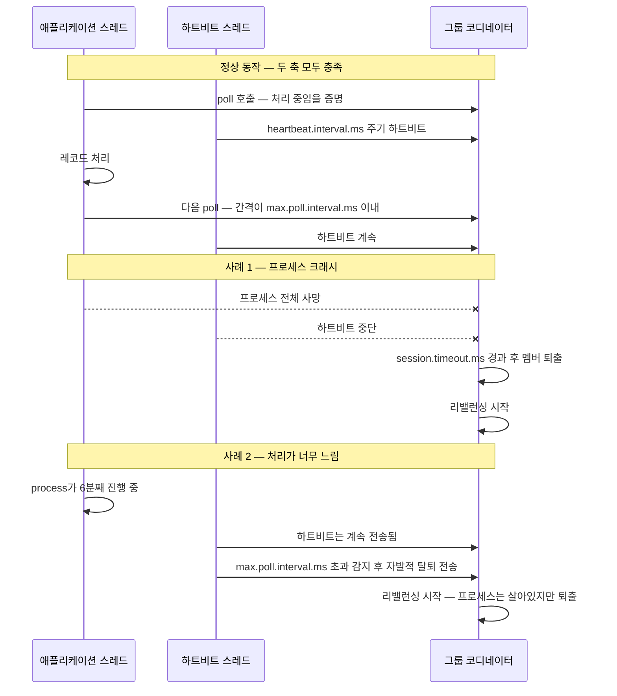
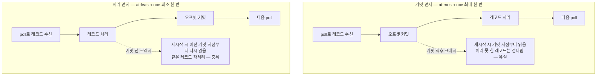
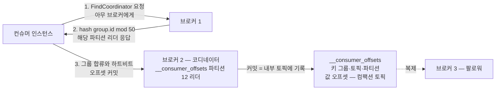
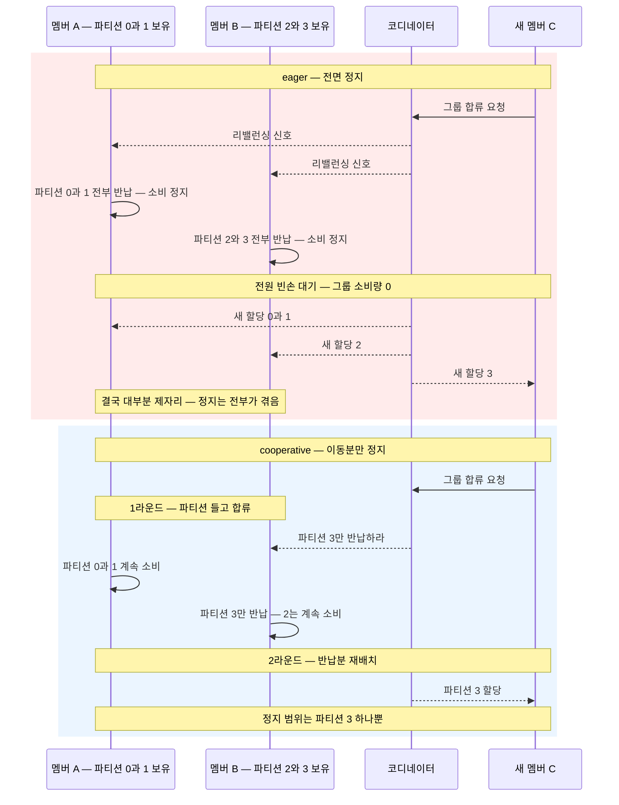

# 컨슈머 심화 — poll 루프·오프셋 커밋·리밸런싱

> 시리즈: [00-why-kafka.md](00-why-kafka.md) → [01-core-concepts.md](01-core-concepts.md) → [02-storage-internals.md](02-storage-internals.md) → [03-replication-and-controller.md](03-replication-and-controller.md) → [04-producer-deep-dive.md](04-producer-deep-dive.md) → **05-consumer-deep-dive.md** → [06-operations-and-tuning.md](06-operations-and-tuning.md)
>
> 기준 버전: Apache Kafka 4.x — KRaft 전용. 컨슈머 그룹 프로토콜은 클래식(classic) 프로토콜과 차세대(KIP-848) 프로토콜을 모두 다룬다.

프로듀서([04-producer-deep-dive.md](04-producer-deep-dive.md))가 "어떻게 안 잃어버리고 보내느냐"의 싸움이었다면, 컨슈머는 **"어디까지 읽었는지를 어떻게 정확히 기억하느냐"**와 **"여러 인스턴스가 어떻게 파티션을 나눠 갖느냐"**의 싸움이다. 실무에서 카프카 장애 티켓의 절반 이상은 컨슈머 쪽에서 터진다 — 메시지 중복 처리, 리밸런싱 폭풍, 랙(lag) 폭증, "컨슈머가 멀쩡히 살아있는데 아무것도 안 읽어요" 같은 것들이다. 이 문서는 그 장애들의 뿌리인 poll 루프 모델, 오프셋 커밋, 리밸런싱을 바닥까지 파헤친다.

---

## 목차

1. [🟡 poll 루프 — 컨슈머는 왜 싱글 스레드인가](#1--poll-루프--컨슈머는-왜-싱글-스레드인가)
2. [🟡 두 개의 죽음 감지 축 — session.timeout.ms vs max.poll.interval.ms](#2--두-개의-죽음-감지-축--sessiontimeoutms-vs-maxpollintervalms)
3. [🟡 오프셋 커밋 — 어디까지 읽었는지 기억하기](#3--오프셋-커밋--어디까지-읽었는지-기억하기)
4. [🔴 __consumer_offsets 토픽과 그룹 코디네이터](#4--__consumer_offsets-토픽과-그룹-코디네이터)
5. [🔴 리밸런싱 — 파티션을 다시 나누는 비용](#5--리밸런싱--파티션을-다시-나누는-비용)
6. [🟡 컨슈머 랙과 오프셋 제어 — seek, auto.offset.reset](#6--컨슈머-랙과-오프셋-제어--seek-autooffsetreset)
7. [🔴 멀티 스레드 소비 패턴과 위험](#7--멀티-스레드-소비-패턴과-위험)
8. [🔴 셰어 그룹 — KIP-932, 파티션 상한을 넘는 큐 시맨틱스](#8--셰어-그룹--kip-932-파티션-상한을-넘는-큐-시맨틱스)
9. [면접 포인트](#면접-포인트)

---

## 1. 🟡 poll 루프 — 컨슈머는 왜 싱글 스레드인가

### 문제: "메시지가 오면 알려줘" 방식의 함정

많은 메시징 시스템은 푸시(push) 모델을 쓴다. 브로커가 컨슈머에게 메시지를 밀어넣고, 컨슈머는 콜백으로 받는다. 직관적이지만 두 가지 문제가 있다.

1. **역압(backpressure) 제어가 어렵다.** 컨슈머 처리 속도보다 빠르게 밀어넣으면 컨슈머가 터진다. 브로커가 컨슈머마다 처리 속도를 추적해야 한다.
2. **소비 속도의 주도권이 브로커에 있다.** 컨슈머가 "지금은 바쁘니 천천히", "과거부터 다시 읽고 싶어" 같은 제어를 하기 어렵다.

카프카는 반대로 **풀(pull) 모델**을 택했다. 컨슈머가 자기 페이스로 브로커에 "다음 것 줘"라고 요청한다. 역압은 자연스럽게 해결된다 — 컨슈머가 바쁘면 그냥 요청을 안 하면 된다. 과거 재소비도 자연스럽다 — 읽을 위치(오프셋)를 컨슈머가 들고 있으니 되감으면 된다. "풀 모델은 메시지가 없을 때 빈 요청을 반복하는 낭비가 있지 않나?"라는 고전적 반론은 **long polling**으로 해결한다: 브로커는 데이터가 없으면 `fetch.max.wait.ms`(기본 500ms)까지, 혹은 `fetch.min.bytes`(기본 1바이트)만큼 쌓일 때까지 응답을 붙잡아 둔다.

### poll 루프의 실제 모습

카프카 컨슈머 애플리케이션은 결국 이 루프 하나다.

```java
try (KafkaConsumer<String, String> consumer = new KafkaConsumer<>(props)) {
    consumer.subscribe(List.of("orders"));
    while (running) {
        ConsumerRecords<String, String> records = consumer.poll(Duration.ofMillis(1000));
        for (ConsumerRecord<String, String> record : records) {
            process(record);                       // 비즈니스 로직
        }
        consumer.commitSync();                     // 처리 후 커밋 — 3장에서 상세
    }
}
```

여기서 결정적으로 중요한 사실: **`poll()`은 단순히 "레코드 가져오기" 함수가 아니다.** `poll()` 호출 안에서 컨슈머는 다음을 전부 수행한다.

- 그룹 코디네이터 찾기 및 그룹 합류(초회)
- **리밸런싱 참여** — 파티션 회수·할당, `ConsumerRebalanceListener` 콜백 실행
- 브로커로부터 레코드 페치(fetch) — 실제 네트워크 I/O는 백그라운드에서 선페치(prefetch)되지만, 완료 처리와 역직렬화는 poll 안에서
- 자동 커밋이 켜져 있다면 오프셋 커밋
- 오프셋 초기 위치 결정(`auto.offset.reset` 적용)

즉 **poll을 부르지 않으면 컨슈머는 그룹 활동을 아무것도 하지 못한다.** 이것이 뒤에 나올 `max.poll.interval.ms`의 존재 이유다.

비유하자면 컨슈머는 **회사에 매일 출근 도장을 찍어야 하는 직원**이다. 출근 도장(`poll`)을 찍으러 와야 새 업무(레코드)도 받고, 조직 개편 공지(리밸런싱)도 듣고, 업무 보고(커밋)도 한다. 도장을 안 찍으면 회사는 "이 사람 일 안 하네"라고 판단하고 업무를 다른 사람에게 넘긴다. 이 비유의 한계: 실제로는 심장박동(heartbeat)을 담당하는 별도 스레드가 있어서 "살아는 있다"는 신호는 따로 간다 — 2장에서 다룬다.

### 스레드 모델: 왜 KafkaConsumer는 thread-safe가 아닌가

`KafkaConsumer`는 **스레드 안전(thread-safe)하지 않다.** 하나의 컨슈머 인스턴스는 하나의 스레드에서만 사용해야 하며, 여러 스레드가 동시에 `poll()`·`commitSync()`를 부르면 `ConcurrentModificationException`이 발생한다.

이는 게으름이 아니라 의도된 설계다. 컨슈머는 "현재 할당된 파티션", "각 파티션의 소비 위치", "리밸런싱 진행 상태"라는 복잡한 상태 기계를 품고 있다. 이 상태를 락으로 보호하며 멀티 스레드에 여는 대신, 카프카는 **싱글 스레드 소유 + 필요하면 컨슈머를 여러 개 띄우기**라는 단순한 모델을 택했다. 스케일아웃의 단위는 스레드가 아니라 **컨슈머 인스턴스와 파티션**이다([01-core-concepts.md](01-core-concepts.md)의 컨슈머 그룹 참조).

> 🔴 구현 디테일: 4.x의 클래식 `KafkaConsumer`도 내부적으로 네트워크 I/O 일부(하트비트, 선페치 응답 수신)는 별도로 굴러가지만, **사용자 API 표면은 철저히 싱글 스레드 계약**이다. 한편 KIP-848 기반 차세대 컨슈머 구현(`AsyncKafkaConsumer`)은 내부적으로 애플리케이션 스레드와 백그라운드 네트워크 스레드를 이벤트 큐로 분리한 구조로 재작성되었다. 그래도 사용자 계약은 동일하다: 한 스레드에서만 쓰라.

### 한 번의 poll이 가져오는 양 제어

| 설정 | 기본값 | 의미 |
|---|---|---|
| `max.poll.records` | 500 | 한 번의 `poll()`이 반환하는 최대 레코드 수. **네트워크 페치 크기가 아니라 애플리케이션에 넘겨주는 개수 제한**이다. |
| `fetch.min.bytes` | 1 | 브로커가 응답하기 전 최소로 모을 바이트. 올리면 처리량↑ 지연↑ |
| `fetch.max.wait.ms` | 500 | `fetch.min.bytes`를 못 채워도 응답하는 최대 대기 시간 |
| `fetch.max.bytes` | 50MB | 페치 요청 한 번의 최대 크기 |
| `max.partition.fetch.bytes` | 1MB | 파티션당 페치 최대 크기 |

`max.poll.records`는 성능 튜닝 값이 아니라 **생존 튜닝 값**에 가깝다. "레코드 500개 처리 시간 < `max.poll.interval.ms`"를 보장하지 못하면 컨슈머는 죽은 것으로 간주된다. 왜 그런지 지금부터 본다.

---

## 2. 🟡 두 개의 죽음 감지 축 — session.timeout.ms vs max.poll.interval.ms

### 문제: "죽었다"에는 두 종류가 있다

컨슈머 그룹에서 어떤 멤버가 죽으면 그 파티션을 다른 멤버에게 넘겨야 한다. 그런데 "죽음"은 두 가지다.

1. **프로세스의 죽음** — JVM 크래시, OOM 킬, 네트워크 단절, 서버 전원 차단. 아예 응답이 없다.
2. **처리의 죽음(livelock)** — 프로세스는 살아있는데 `process(record)`가 무한 루프에 빠졌거나, 외부 API 호출이 10분째 안 끝난다. 심장은 뛰는데 일은 안 한다.

카프카 0.10.0 이전에는 이 둘을 구분하지 못했다. 하트비트가 `poll()` 안에서만 전송됐기 때문에, 처리가 오래 걸리면 하트비트도 끊겨서 "느린 처리 = 죽음"으로 오판돼 불필요한 리밸런싱이 폭발했다. 이를 피하려고 `session.timeout.ms`를 크게 잡으면 이번엔 진짜 프로세스 죽음의 감지가 느려졌다. **KIP-62(0.10.1)**가 하트비트를 별도 백그라운드 스레드로 분리하면서 두 축이 독립했다.

### 두 감지 축의 분리

| | `session.timeout.ms` | `max.poll.interval.ms` |
|---|---|---|
| 감지 대상 | **프로세스 죽음** — 살아있긴 한가 | **처리 죽음** — 일을 하고 있는가 |
| 신호 | 하트비트 스레드가 `heartbeat.interval.ms`(기본 3초)마다 전송 | 애플리케이션 스레드의 `poll()` 호출 간격 |
| 기본값 | 45초 | 5분 — 300000ms |
| 판정 주체 | 그룹 코디네이터가 하트비트 미수신 시 퇴출 | 컨슈머 **자신**이 초과를 감지하고 스스로 그룹 탈퇴 요청을 보냄 |
| 위반 시 | 코디네이터가 멤버 제거 후 리밸런싱 | 컨슈머가 자발적 탈퇴 → 리밸런싱. 이후 `poll()`을 다시 부르면 재합류 |

핵심 문장으로 압축하면: **하트비트는 "살아있음"을, poll은 "일하고 있음"을 증명한다.** 살아있음의 시한이 `session.timeout.ms`, 일하고 있음의 시한이 `max.poll.interval.ms`다.



### 실무 함정 모음

- **가장 흔한 장애 로그**: `consumer poll timeout has expired ... you can address this either by increasing max.poll.interval.ms or by reducing the maximum size of batches returned in poll() with max.poll.records`. 이 로그가 보이면 처리 루프가 5분을 초과한 것이다. 해법은 로그가 말하는 그대로 두 가지 — 처리 시한을 늘리거나(`max.poll.interval.ms`↑), 한 번에 처리할 양을 줄이거나(`max.poll.records`↓). 근본적으로는 개별 레코드 처리 시간을 줄여야 한다.
- **퇴출 후 커밋 실패**: `max.poll.interval.ms`를 초과해 퇴출된 컨슈머가 뒤늦게 처리를 끝내고 `commitSync()`를 부르면 `CommitFailedException`이 난다. 이미 그 파티션은 다른 멤버 소유이고, 그 멤버가 같은 레코드를 다시 처리하고 있다 — **중복 처리**가 발생하는 대표 경로다.
- **`heartbeat.interval.ms`는 `session.timeout.ms`의 1/3 이하**로 잡는 것이 원칙이다. 하트비트 한두 번의 네트워크 유실로 퇴출되지 않도록 여유를 두는 것이다. 기본값 3초/45초는 이 원칙을 지킨다.
- **`session.timeout.ms`를 무작정 줄이면** 빠른 장애 감지 대신 GC 멈춤(stop-the-world GC), 순간적 네트워크 지터에도 리밸런싱이 터진다. 브로커 설정 `group.min.session.timeout.ms` / `group.max.session.timeout.ms` 범위 안에서만 조정 가능하다.
- 🔴 **KIP-848 차세대 프로토콜에서의 변화**: 새 프로토콜(`group.protocol=consumer`)에서는 하트비트가 리밸런싱의 전달 통로를 겸하는 `ConsumerGroupHeartbeat` API로 통합되고, **`session.timeout.ms`와 하트비트 주기가 클라이언트 설정이 아니라 브로커 설정(`group.consumer.session.timeout.ms`, `group.consumer.heartbeat.interval.ms`)으로 넘어갔다.** 수백 개 팀의 클라이언트 설정 실수로 클러스터가 흔들리는 것을 막기 위한 중앙 통제다. `max.poll.interval.ms`는 여전히 클라이언트 측 개념으로 남는다. 5장에서 상세히 다룬다.

---

## 3. 🟡 오프셋 커밋 — 어디까지 읽었는지 기억하기

### 문제: 읽었다는 사실은 누가 기억하나

카프카 브로커는 "누가 어디까지 읽었는지"를 강제로 추적하지 않는다. 메시지를 읽어도 삭제되지 않고([02-storage-internals.md](02-storage-internals.md)의 보존 정책 참조), 컨슈머는 원하는 오프셋 어디서든 읽을 수 있다. 그렇다면 컨슈머가 재시작하거나 파티션이 다른 멤버에게 넘어갔을 때 **"어디부터 이어 읽을지"**는 어떻게 아는가? 그 답이 **오프셋 커밋(offset commit)**이다: 컨슈머 그룹이 "이 파티션은 오프셋 N까지 처리 완료" 라는 체크포인트를 카프카에 저장하는 행위다.

중요한 관례 하나: 커밋되는 값은 **"마지막으로 처리한 오프셋"이 아니라 "다음에 읽을 오프셋"**이다. 오프셋 100번까지 처리했으면 101을 커밋한다. 재시작한 컨슈머는 커밋된 값에서 그대로 읽기 시작한다.

책갈피 비유가 정확하다: 책(파티션)은 그대로 있고, 독자(컨슈머 그룹)마다 자기 책갈피(커밋된 오프셋)를 꽂는다. 책갈피를 안 꽂고 책을 덮으면(커밋 없이 재시작) 마지막 책갈피 위치부터 다시 읽게 되고, 읽지도 않은 페이지에 미리 책갈피를 꽂으면(선커밋) 그 사이 내용은 영영 건너뛴다. 비유의 한계: 실제로는 그룹 하나에 독자가 여러 명이고 책갈피는 파티션마다 하나씩이며, 책갈피 보관소 자체가 카프카 내부 토픽이다(4장).

### enable.auto.commit의 함정

`enable.auto.commit=true`(기본값)이면 컨슈머는 `auto.commit.interval.ms`(기본 5초)마다 오프셋을 자동 커밋한다. 정확히는: **`poll()`을 호출하는 시점에, 마지막 자동 커밋 후 5초가 지났으면 직전 poll이 반환했던 오프셋들을 커밋한다.** 자동 커밋도 poll 루프에 얹혀 동작한다.

이 동작의 함정 두 가지:

1. **유실 가능** — 레코드를 받아서 별도 스레드/큐에 던져놓고 poll을 계속 돌리는 구조라면, 아직 처리 안 된 레코드의 오프셋이 자동 커밋될 수 있다. 그 상태에서 크래시하면 미처리 레코드는 커밋 뒤로 사라진다 — 유실이다.
2. **중복 가능** — 마지막 자동 커밋 후 4초 동안 처리한 레코드들이 있는 상태에서 크래시하면, 재시작 후 그 4초치를 다시 읽는다 — 중복이다.

즉 자동 커밋은 "**poll 루프 안에서 동기적으로 처리를 끝내는 단순한 앱**"에서는 사실상 at-least-once로 동작하지만, 처리를 비동기로 넘기는 순간 유실 가능성이 열린다. 그리고 어느 경우든 **중복은 피할 수 없다**. 시맨틱스를 통제하고 싶다면 `enable.auto.commit=false`로 끄고 수동 커밋을 쓰는 것이 실무 기본기다. (참고로 스프링 카프카(Spring for Apache Kafka) 같은 프레임워크도 기본적으로 자동 커밋을 끄고 컨테이너가 "처리 후 커밋"을 대행한다.)

### 수동 커밋 — commitSync vs commitAsync

| | `commitSync` | `commitAsync` |
|---|---|---|
| 블로킹 | 커밋 완료까지 블로킹 | 즉시 반환, 콜백으로 결과 통지 |
| 재시도 | 일시 오류에 자동 재시도 | **재시도하지 않음** — 재시도하면 뒤에 이미 성공한 더 큰 오프셋을 과거 값으로 덮을 수 있기 때문 |
| 처리량 | 낮음 — 매 커밋마다 왕복 대기 | 높음 |
| 용도 | 정확성이 필요한 지점 — 종료 직전, 리밸런싱 직전 | 루프 안의 상시 커밋 |

실무 표준 패턴은 **둘의 조합**이다: 루프 안에서는 `commitAsync`로 처리량을 벌고, 종료·리밸런싱 시점에만 `commitSync`로 확실히 마무리한다.

```java
try {
    while (running) {
        ConsumerRecords<String, String> records = consumer.poll(Duration.ofMillis(1000));
        for (ConsumerRecord<String, String> record : records) {
            process(record);
        }
        consumer.commitAsync();            // 상시: 논블로킹 커밋
    }
} finally {
    try {
        consumer.commitSync();             // 마지막 1회: 확실하게
    } finally {
        consumer.close();
    }
}
```

특정 오프셋만 커밋하고 싶다면 `commitSync(Map<TopicPartition, OffsetAndMetadata>)` 오버로드를 쓴다. 이때 "처리한 오프셋 + 1"을 넣는 것을 잊는 실수가 매우 흔하다 — 잊으면 재시작 때마다 마지막 1건이 중복 처리된다.

### 커밋 시점이 시맨틱스를 결정한다

커밋을 **처리 전에** 하느냐 **처리 후에** 하느냐가 장애 시 중복이냐 유실이냐를 가른다.



| 전략 | 장애 시 결과 | 쓰는 경우 |
|---|---|---|
| 커밋 → 처리 (at-most-once) | **유실** 가능, 중복 없음 | 유실이 허용되는 메트릭·로그 샘플링 등 극히 드묾 |
| 처리 → 커밋 (at-least-once) | **중복** 가능, 유실 없음 | **기본기. 거의 모든 업무 시스템** |
| 처리와 커밋을 원자적으로 | 중복도 유실도 없음 (exactly-once) | 트랜잭션([04-producer-deep-dive.md](04-producer-deep-dive.md)의 EOS) 또는 멱등 처리 |

**"처리 후 커밋"이 기본기인 이유**: 분산 시스템에서 유실과 중복 중 하나를 골라야 한다면 거의 항상 중복을 고르는 것이 옳다. 중복은 **멱등성(idempotency)** — 같은 처리를 두 번 해도 결과가 같게 만드는 설계(유니크 키 upsert, 이벤트 ID 기반 dedupe) — 로 애플리케이션 레벨에서 방어할 수 있지만, 유실은 데이터가 이미 사라진 뒤라 애플리케이션이 방어할 방법 자체가 없기 때문이다. 그래서 실무 공식은 **"at-least-once 소비 + 멱등한 처리 = 사실상 exactly-once"**다. 카프카 트랜잭션이 보장하는 exactly-once는 "consume-transform-produce", 즉 결과가 다시 카프카로 들어가는 파이프라인에 한정된다는 것도 기억하라 — DB에 쓰는 순간부터는 다시 멱등성의 영역이다.

### 리밸런싱 리스너와 커밋

파티션을 빼앗기기 직전에 커밋할 마지막 기회가 `ConsumerRebalanceListener`다.

```java
consumer.subscribe(List.of("orders"), new ConsumerRebalanceListener() {
    @Override
    public void onPartitionsRevoked(Collection<TopicPartition> partitions) {
        consumer.commitSync(currentOffsets);   // 빼앗기기 전에 지금까지의 진행 상황 커밋
    }
    @Override
    public void onPartitionsAssigned(Collection<TopicPartition> partitions) { }
});
```

이걸 안 하면 리밸런싱 때마다 "마지막 커밋 이후 처리분"이 새 담당자에 의해 중복 처리된다. 리밸런싱이 잦은 그룹에서 중복이 유독 많이 보이는 이유가 바로 이것이다.

---

## 4. 🔴 __consumer_offsets 토픽과 그룹 코디네이터

### 문제: 체크포인트는 어디에 저장되나

옛날 카프카(0.8 이전)는 오프셋을 ZooKeeper에 저장했다. 컨슈머가 많아지자 ZooKeeper가 쓰기 부하를 감당하지 못했고, 카프카는 근본적인 답을 내놨다: **"고내구성 분산 로그가 필요하다고? 우리가 그걸 만드는 회사잖아."** 오프셋 커밋을 카프카 내부 토픽 `__consumer_offsets`에 저장하는 방식으로 바꾼 것이다. 4.x에서는 ZooKeeper 자체가 제거됐고([03-replication-and-controller.md](03-replication-and-controller.md)) 이 방식만 남아 있다.

### __consumer_offsets의 구조

- 기본 **50개 파티션**(`offsets.topic.num.partitions`), 복제 팩터 3(`offsets.topic.replication.factor`)의 내부 토픽이다.
- 메시지의 **키는 `[group.id, 토픽, 파티션]`**, 값은 커밋된 오프셋과 메타데이터다. 커밋은 곧 이 토픽으로의 프로듀스다.
- **컴팩션(log compaction)** 토픽이다([02-storage-internals.md](02-storage-internals.md)). 같은 키의 최신 값만 남기면 되므로 — 그룹 X의 파티션 P에 대한 "최신 커밋"만 의미가 있다 — 컴팩션이 정확히 들어맞는 용례다.
- 커밋된 오프셋에도 수명이 있다. **그룹이 비어있는(empty) 상태로 `offsets.retention.minutes`(기본 7일)가 지나면 오프셋이 삭제**된다. 배치성 컨슈머를 한 달 만에 다시 켰더니 처음부터 다시 읽거나(earliest) 다 건너뛰는(latest) 대참사의 원인이 이것이다 — 6장의 `auto.offset.reset`과 직결된다.

### 그룹 코디네이터의 동작

**그룹 코디네이터(group coordinator)**는 특정 컨슈머 그룹의 멤버십·하트비트·오프셋 커밋을 책임지는 브로커다. 별도 서버가 아니라 브로커가 겸직하는 역할이며, 결정 방식이 우아하다.

1. `hash(group.id) % 50` → `__consumer_offsets`의 파티션 번호가 나온다.
2. **그 파티션의 리더를 맡은 브로커가 곧 이 그룹의 코디네이터**다.

이 설계로 (a) 코디네이터가 자연스럽게 전체 브로커에 분산되고, (b) 그룹의 오프셋 데이터와 그 관리자가 같은 브로커에 놓여 로컬 읽기·쓰기가 되며, (c) 코디네이터 브로커가 죽으면 해당 파티션의 리더 선출([03-replication-and-controller.md](03-replication-and-controller.md))이 곧 코디네이터 페일오버가 된다. 새 리더는 파티션의 로그를 읽어 그룹 상태와 오프셋을 복원한다.



컨슈머가 처음 뜨면 `FindCoordinator` 요청을 아무 브로커에나 보내 자기 코디네이터를 찾고, 이후의 그룹 합류·하트비트·커밋·(클래식 프로토콜의) 리밸런싱 조율이 전부 그 코디네이터와의 대화로 이뤄진다. 정리하면 **컨슈머 그룹의 "뇌"는 코디네이터 브로커, "장부"는 `__consumer_offsets` 토픽**이다.

---

## 5. 🔴 리밸런싱 — 파티션을 다시 나누는 비용

### 문제: 멤버가 바뀌면 파티션을 다시 나눠야 한다

컨슈머 그룹의 약속은 "한 파티션은 그룹 내 정확히 한 멤버가 소비한다"이다. 그러니 멤버가 들어오거나(스케일아웃, 배포 후 재기동), 나가거나(크래시, 스케일인), 구독 토픽의 파티션 수가 바뀌면 **파티션 소유권을 재분배**해야 한다. 이것이 **리밸런싱(rebalancing)**이다. 문제는 그 비용이다 — 순진하게 구현하면 재분배하는 동안 **그룹 전체의 소비가 멈춘다**.

### 클래식 프로토콜의 뼈대 — JoinGroup과 SyncGroup

클래식 프로토콜(4.x에서도 여전히 지원되는 기존 방식)의 리밸런싱은 코디네이터와 클라이언트의 합작이다.

1. 코디네이터가 리밸런싱 필요를 감지하면, 하트비트 응답에 "재합류하라"는 신호를 실어 보낸다.
2. 모든 멤버가 `JoinGroup` 요청을 보낸다. 코디네이터는 전원이 모일 때까지(`group.initial.rebalance.delay.ms`, 이탈 멤버 대기 등) 기다린 뒤, 한 멤버를 **그룹 리더(group leader)**로 지정한다.
3. **파티션 할당 계산은 브로커가 아니라 그룹 리더 클라이언트가 수행한다.** 리더는 `partition.assignment.strategy`에 지정된 할당자(assignor)로 배분을 계산해 `SyncGroup`으로 코디네이터에 제출하고, 코디네이터가 각 멤버에게 자기 몫을 배포한다.

할당 계산을 클라이언트에 맡긴 것은 유연성을 위한 선택이었지만 — 커스텀 할당자를 브로커 업그레이드 없이 쓸 수 있다 — 이것이 나중에 KIP-848로 뒤집히는 원죄가 된다: 브로커는 할당 로직을 모르니 전 멤버를 멈춰 세우는 **동기화 장벽(synchronization barrier)**으로만 일관성을 지킬 수 있었다.

### eager — stop-the-world 리밸런싱

전통적인 **eager(즉시) 프로토콜**에서는 리밸런싱이 시작되면 **모든 멤버가 자신의 모든 파티션을 즉시 반납**하고 빈손으로 JoinGroup에 들어간다. 새 할당을 받을 때까지 그룹 전체의 소비가 0이 된다. 그래서 stop-the-world라 부른다.

부조리한 점: 리밸런싱 후 대부분의 파티션은 **원래 주인에게 돌아간다**. 100개 파티션 중 실제로 이동이 필요한 건 새 멤버에게 갈 몇 개뿐인데, 100개 전부를 내려놓고 다시 집는 것이다. 파티션 반납에는 커밋·상태 플러시·커넥션 정리가, 재획득에는 오프셋 조회·상태 복원이 따라오므로 파티션이 많고 상태가 무거울수록 정지 시간이 길어진다. 롤링 배포처럼 멤버가 연쇄적으로 드나드는 상황에서는 리밸런싱이 리밸런싱을 물고 이어지는 **리밸런싱 폭풍**이 된다.

### cooperative sticky — 증분 리밸런싱

**KIP-429(2.4)**의 `CooperativeStickyAssignor`는 발상을 바꿨다: **"진짜로 이동해야 하는 파티션만 반납시키자."** 리밸런싱을 두 라운드로 쪼갠다.

- **1라운드**: 모두 현재 파티션을 **들고 있는 채로** 합류한다. 할당자는 "이동해야 할 파티션"만 골라 현 소유자의 할당 목록에서 빼는 새 할당을 내린다. 각 멤버는 빠진 파티션만 반납하고, **나머지 파티션은 계속 소비한다.**
- **2라운드**: 반납된 파티션들을 새 주인에게 붙이는 후속 리밸런싱이 즉시 이어진다.

리밸런싱이 두 번 도는 대신, 각 라운드에서 멈추는 것은 실제로 이사 가는 파티션뿐이다. 전체 정지가 부분 정지로 바뀐다. sticky(끈끈한)라는 이름은 기존 소유권을 최대한 유지하는 배분 성질에서 왔다.



⚠️ 운영 함정: 클래식 프로토콜에서 eager 계열 할당자(range, roundrobin)와 cooperative를 **무중단으로 오가려면 2단계 롤링 배포**가 필요하다(먼저 두 전략을 병기해 배포, 그다음 eager를 제거해 재배포). 한 그룹 안에 eager와 cooperative가 섞이면 소유권 충돌이 날 수 있어 프로토콜이 이를 금지하기 때문이다.

### static membership — group.instance.id

리밸런싱의 또 다른 대형 유발원은 **재시작**이다. 쿠버네티스 롤링 업데이트로 파드 30개가 순서대로 재시작하면, 기본 동작으로는 파드 하나가 내려갈 때 1번, 올라올 때 1번씩 리밸런싱이 난다. 그런데 재시작한 파드는 사실 "같은 일꾼"이다 — 잠깐 나갔다 온 것뿐인데 매번 조직 개편을 할 필요가 있나?

**KIP-345(2.3)의 정적 멤버십(static membership)**은 컨슈머에 `group.instance.id`(예: 파드 이름 같은 고유하고 안정적인 ID)를 부여한다. 이 ID가 있는 멤버가 나가도 코디네이터는 즉시 리밸런싱하지 않고 **`session.timeout.ms` 동안 자리를 비워둔 채 기다린다.** 그 안에 같은 ID로 재합류하면 **기존 파티션 할당을 리밸런싱 없이 그대로 돌려받는다.** 재시작이 리밸런싱을 유발하지 않게 되는 것이다.

- 정적 멤버십을 쓸 때는 `session.timeout.ms`를 "재시작 소요 시간보다 길게"(예: 1~5분) 잡는 것이 핵심이다. 짧으면 복귀 전에 타임아웃이 나서 의미가 없다.
- 트레이드오프: 진짜로 죽은 멤버의 감지도 그만큼 느려진다. 그 멤버의 파티션은 타임아웃까지 아무도 소비하지 않으므로 랙이 쌓인다.
- 같은 `group.instance.id`로 두 프로세스가 동시에 붙으면 나중 것이 기존 것을 펜싱(fencing)한다.

### KIP-848 — 차세대 그룹 프로토콜, 브로커 주도 리밸런싱

**Kafka 4.0에서 정식(GA)이 된 KIP-848**은 리밸런싱 프로토콜을 바닥부터 다시 설계했다. 클래식 프로토콜의 구조적 문제 — 클라이언트 주도 할당, 전역 동기화 장벽, JoinGroup/SyncGroup의 복잡한 상태 기계, 멤버 하나의 문제가 그룹 전체를 흔드는 취약성 — 를 정면으로 제거한다.

핵심 변화:

- **할당 계산이 브로커(코디네이터)로 이동한다.** 그룹 리더 클라이언트도, JoinGroup/SyncGroup도 없다. 클라이언트는 `ConsumerGroupHeartbeat` API 하나로 자기 상태(구독, 현재 할당)를 보고하고, 코디네이터가 목표 할당(target assignment)을 계산해 하트비트 응답에 실어 내려보낸다. 할당자는 브로커 측 `group.consumer.assignors`로 정하며 클라이언트는 `group.remote.assignor`로 선택만 한다(uniform, range 제공).
- **전역 동기화 장벽이 없는 완전 증분 리밸런싱.** 코디네이터는 멤버별로 "이 파티션을 내려놔라 / 이걸 새로 맡아라"를 **개별적으로, 점진적으로** 조정(reconcile)한다. 파티션은 이전 소유자가 반납을 확인한 뒤에만 새 소유자에게 넘어가고, 이동과 무관한 멤버는 아무 영향도 받지 않는다. cooperative sticky가 "두 번의 전체 라운드"로 흉내 내던 것을 프로토콜 수준에서 멤버 단위로 해낸다.
- **그룹 상태가 이벤트 소싱된다.** 코디네이터는 그룹 상태 변화를 `__consumer_offsets`에 기록하므로 코디네이터 페일오버 후에도 리밸런싱을 처음부터 다시 하지 않고 이어간다. 그룹 에포크(group epoch)와 멤버 에포크로 낡은 멤버를 펜싱한다.
- **설정의 서버 이관**: 2장에서 언급했듯 세션 타임아웃·하트비트 주기가 브로커 설정이 된다. `partition.assignment.strategy`, `session.timeout.ms`, `heartbeat.interval.ms`는 새 프로토콜에서 무시된다.
- **켜는 법**: 클라이언트에서 `group.protocol=consumer`(기본값은 `classic`). 브로커는 4.0부터 기본으로 새 프로토콜을 지원한다(`group.coordinator.rebalance.protocols`). 클래식 그룹에서 새 프로토콜 그룹으로의 온라인 마이그레이션도 지원된다.
- 정적 멤버십(`group.instance.id`)은 새 프로토콜에서도 동작한다.

한 줄 요약: **클래식은 "학급 회의로 자리 바꾸기"(전원 기립, 반장이 배치 결정), KIP-848은 "담임이 개별 호출로 자리 조정"(움직일 학생만 움직임)**이다. 비유의 한계: 담임(코디네이터)도 죽을 수 있는데, 그 경우 출석부(`__consumer_offsets`의 그룹 상태 로그)를 물려받은 새 담임이 이어서 진행한다.

### 리밸런싱이 터지는 원인 체크리스트 (실무)

| 증상 | 원인 | 처방 |
|---|---|---|
| 배포 때마다 리밸런싱 연쇄 | 롤링 재시작 | static membership, cooperative/KIP-848 |
| 주기적으로 멤버 퇴출 | GC 멈춤 > `session.timeout.ms` | GC 튜닝, 타임아웃 상향 |
| "poll timeout expired" 후 퇴출 | 처리 시간 > `max.poll.interval.ms` | `max.poll.records` 축소, 처리 최적화 |
| 오토스케일링 때마다 전면 정지 | eager 할당자 | cooperative sticky 또는 `group.protocol=consumer` |
| 리밸런싱마다 중복 처리 | revoke 시 커밋 누락 | `onPartitionsRevoked`에서 `commitSync` |

---

## 6. 🟡 컨슈머 랙과 오프셋 제어 — seek, auto.offset.reset

### 컨슈머 랙 — 소비가 생산을 못 따라가는 정도

**컨슈머 랙(consumer lag)** = 파티션의 로그 끝 오프셋(log end offset, LEO — 다음에 기록될 오프셋, [03-replication-and-controller.md](03-replication-and-controller.md)) − 그룹의 커밋된 오프셋. "생산됐지만 아직 처리 확인이 안 된 메시지 수"다. 컨슈머 시스템의 **단 하나의 핵심 건강 지표**라고 해도 과언이 아니다.

- 랙이 **꾸준히 증가**하면 소비 처리량 < 생산 처리량이다. 컨슈머를 늘리거나(파티션 수 한도 내에서), 처리 로직을 빠르게 하거나, 파티션을 늘려야 한다.
- 랙이 **일부 파티션에서만** 증가하면 파티션 키 쏠림(hot partition, [04-producer-deep-dive.md](04-producer-deep-dive.md)) 또는 특정 컨슈머의 문제다.
- 랙이 **톱니 모양**이면 배치성 소비 패턴이거나 주기적 GC/리밸런싱이다.
- 주의: 랙은 커밋 기준이므로 **커밋 주기만큼 과대측정**된다. 처리했지만 아직 커밋 전인 분량도 랙으로 보인다.

측정 도구: `kafka-consumer-groups.sh --describe --group my-group`(CURRENT-OFFSET, LOG-END-OFFSET, LAG 컬럼), 그리고 지속 모니터링은 Burrow, 프로메테우스 기반 kafka-lag-exporter 등을 쓴다([06-operations-and-tuning.md](06-operations-and-tuning.md)).

### auto.offset.reset — 유효한 오프셋이 없을 때의 행동

`auto.offset.reset`은 오해가 많은 설정이다. **"항상 어디서 읽을지"가 아니라, "유효한 커밋 오프셋이 없을 때만" 발동하는 예외 규정**이다. 발동 조건은 두 가지뿐이다.

1. 그룹이 이 파티션에 커밋한 오프셋이 아예 없다 — 신규 그룹, 또는 `offsets.retention.minutes` 경과로 커밋이 삭제됨(4장).
2. 커밋된 오프셋이 가리키는 위치가 이미 보존 정책으로 삭제됐다 — 랙이 리텐션을 초과한 경우(out-of-range).

| 값 | 동작 | 함정 |
|---|---|---|
| `latest` (기본) | 파티션의 끝에서부터 읽기 시작 | 발동 조건에 걸린 사이의 메시지를 **조용히 전부 건너뜀** — 유실을 눈치채기 어렵다 |
| `earliest` | 파티션에 남아있는 가장 오래된 것부터 | 대량 재처리 폭탄 — 랙 그래프가 수직 상승하고 다운스트림이 밀린다 |
| `none` | 예외를 던지고 멈춤 | 가장 안전하지만 예외 처리를 직접 해야 함 |

실무 교훈: **업무 데이터 컨슈머에서 기본값 `latest`를 그대로 두는 것은 위험하다.** "컨슈머를 2주 내렸다 켰더니(오프셋 만료) 그 사이 데이터를 모두 건너뛰고 최신부터 읽더라"는 사고의 공식 루트다. 유실이 허용되지 않으면 `earliest` + 멱등 처리, 혹은 `none` + 명시적 seek 전략을 쓰라.

### seek — 오프셋을 내 손으로 움직이기

카프카의 강력함 중 하나는 **재처리(reprocessing)가 일급 기능**이라는 점이다. 로그는 그대로 있으니 읽는 위치만 되돌리면 된다.

```java
// 특정 시각 이후부터 재처리 — 장애 시점부터 다시 돌리기
Map<TopicPartition, Long> query = new HashMap<>();
for (TopicPartition tp : consumer.assignment()) {
    query.put(tp, failureTimestamp);
}
Map<TopicPartition, OffsetAndTimestamp> found = consumer.offsetsForTimes(query);
found.forEach((tp, ot) -> { if (ot != null) consumer.seek(tp, ot.offset()); });
```

- `seek(tp, offset)` / `seekToBeginning` / `seekToEnd` — 다음 `poll()`부터 지정 위치에서 읽는다. **파티션이 할당된 뒤에만** 유효하므로, subscribe 방식에서는 `onPartitionsAssigned` 콜백 안에서 seek하는 것이 정석이다.
- `offsetsForTimes`는 타임스탬프 인덱스([02-storage-internals.md](02-storage-internals.md))를 이용해 "이 시각 이후 첫 오프셋"을 찾아준다. 장애 복구 재처리의 표준 도구다.
- 애플리케이션을 고치지 않고 되감고 싶다면 CLI: `kafka-consumer-groups.sh --reset-offsets --to-datetime ... --execute` (그룹이 **정지된 상태**에서만 가능).
- seek로 되감는 순간 그 구간은 필연적으로 **중복 처리**된다. 재처리가 안전하려면 결국 또 멱등성이다 — 3장의 결론이 여기서도 반복된다.

`assign()`으로 파티션을 직접 지정하면 그룹 관리(리밸런싱) 없이 완전 수동 제어도 가능하다. 이 경우 코디네이터의 멤버십 관리를 우회하므로 장애 페일오버도 스스로 책임져야 한다.

---

## 7. 🔴 멀티 스레드 소비 패턴과 위험

### 문제: 파티션 수보다 더 많은 병렬성이 필요할 때

컨슈머 병렬성의 기본 단위는 파티션이다. 파티션 30개면 유효 컨슈머는 최대 30개. 그런데 처리 하나하나가 느린 I/O(외부 API 300ms 호출 등)라면 파티션당 처리량이 초당 3건에 묶인다. 파티션을 늘리는 게 정공법이지만 파티션 수는 마음대로 못 늘리는 경우가 많다(키 순서 보장, 운영 비용). 그래서 **컨슈머 내부의 멀티 스레드화**가 등장한다. 그러나 `KafkaConsumer`는 thread-safe가 아니고, 오프셋 커밋의 정확성이 걸려 있어 지뢰밭이다.

### 패턴 1 — thread-per-consumer (기본 권장)

스레드마다 독립된 컨슈머 인스턴스를 하나씩 준다. 프로세스 하나에 컨슈머 N개.

- ✅ 가장 단순하고 안전하다. 각 스레드가 자기 컨슈머·자기 파티션·자기 커밋을 온전히 소유한다. 파티션 내 순서도 자연히 보장된다.
- ❌ 병렬성 상한은 여전히 파티션 수. 컨슈머 수만큼 TCP 커넥션·메모리·그룹 멤버가 늘어난다.
- 스프링 카프카의 `concurrency=N`이 정확히 이 패턴이다.

### 패턴 2 — 단일 컨슈머 + 워커 풀 (decouple consumption from processing)

poll하는 스레드는 하나, 처리(process)는 스레드 풀에 넘긴다. 파티션 수와 무관하게 처리 병렬성을 올릴 수 있다. 대신 세 가지 지뢰를 전부 직접 밟지 않아야 한다.

1. **커밋 정확성** — poll 스레드는 워커가 "실제로 완료한" 오프셋까지만 커밋해야 한다. 파티션별로 완료 오프셋을 추적하되, **오프셋 7이 완료돼도 5가 미완료면 커밋은 4+1에 머물러야 한다**(연속 완료 구간의 하한만 커밋). 이걸 틀리면 크래시 시 미완료 레코드가 유실된다.
2. **순서 붕괴** — 같은 파티션의 레코드가 서로 다른 워커에서 동시에 돌면 파티션 순서 보장이 깨진다. 순서가 필요하면 **같은 파티션(또는 같은 키)은 같은 워커 큐로** 라우팅해야 한다.
3. **poll 루프 계속 돌리기와 역압** — 워커가 밀렸다고 poll을 멈추면 `max.poll.interval.ms` 초과로 퇴출된다(2장). 해법은 `consumer.pause(partitions)`로 **페치만 멈추고 poll은 계속 돌리는 것**이다. pause된 파티션은 poll이 레코드를 반환하지 않지만 그룹 활동(리밸런싱 참여, 하트비트 유지 효과)은 계속된다. 워커 큐가 빠지면 `resume()`한다.
4. (보너스 지뢰) **리밸런싱 연동** — 파티션을 빼앗길 때(`onPartitionsRevoked`) 해당 파티션의 진행 중 작업을 기다리거나 취소하고 완료분을 커밋해야 한다. 안 하면 새 주인과 이중 처리가 된다.

이 패턴을 제대로 구현한 오픈소스가 **Confluent Parallel Consumer**다. 키 단위 순서 보장(key-level ordering) — 파티션보다 더 잘게, 키별로 순서를 지키며 병렬화 — 과 위 오프셋 관리 전부를 라이브러리로 제공한다. 직접 구현하기 전에 검토할 가치가 있다.

### 패턴 비교 요약

| | thread-per-consumer | 컨슈머 + 워커 풀 |
|---|---|---|
| 구현 난이도 | 낮음 | 높음 — 커밋·순서·pause·리밸런싱 훅 전부 수동 |
| 병렬성 상한 | 파티션 수 | 워커 수 — 파티션 무관 |
| 순서 보장 | 파티션 순서 자동 보장 | 직접 설계해야 함 |
| 장애 시 위험 | 낮음 | 커밋 로직 버그 = 유실 또는 대량 중복 |
| 적합한 경우 | 대부분의 서비스 | 레코드당 처리 지연이 큰 I/O 바운드 작업 |

원칙: **먼저 파티션 수와 컨슈머 수로 해결하라. 그걸로 안 될 때만 워커 풀로 가되, 가능하면 검증된 라이브러리를 쓰라.** 멀티 스레드 소비에서 발생하는 버그는 대부분 "평소엔 멀쩡하다가 리밸런싱·크래시가 겹칠 때만" 나타나서 재현과 디버깅이 극도로 어렵다.

---

## 8. 🔴 셰어 그룹 — KIP-932, 파티션 상한을 넘는 큐 시맨틱스

### 문제: "파티션 수 = 병렬성 상한"이 안 맞는 워크로드가 있다

이 문서 전체를 관통한 원칙 — 하나의 파티션은 그룹 내 한 컨슈머만 소비한다 — 은 순서 보장과 단순한 오프셋 관리의 대가로 두 가지 제약을 만든다.

1. **병렬성이 파티션 수에 묶인다.** 7장의 워커 풀 패턴이 필요해진 근본 이유다.
2. **레코드 하나가 파티션을 막는다.** 처리 느린 레코드 하나 뒤의 모든 레코드가 대기한다(head-of-line blocking).

이미지 리사이징·이메일 발송 같은 **순서가 무관한 작업 큐(work queue)** 워크로드에서는 이 제약이 손해만 준다. 그래서 이런 일은 전통적으로 RabbitMQ·SQS의 영역이었다([00-why-kafka.md](00-why-kafka.md)의 "카프카가 맞지 않는 경우").

### KIP-932 셰어 그룹(share group)

**KIP-932 "Queues for Kafka"**는 이 간극을 카프카 안에서 메운다. Kafka 4.0에 얼리 액세스로 도입되고 4.1에서 프리뷰로 승격된 **셰어 그룹**은 컨슈머 그룹의 대안적 소비 모델이다.

- **파티션 소유권이 없다.** 그룹 내 여러 컨슈머가 **같은 파티션을 동시에** 소비할 수 있다. 컨슈머 수가 파티션 수를 넘어도 논다(idle)는 개념이 없다.
- **레코드 단위 확인 응답.** 커밋 오프셋(책갈피) 하나가 아니라, 브로커가 레코드 단위로 획득(acquire)·확인(acknowledge)·해제(release)·거부(reject) 상태를 관리한다. 전통 메시지 큐의 개별 ack 모델이 카프카 로그 위에 얹힌 것이다.
- **획득 잠금과 재전달.** 컨슈머가 받은 레코드는 일정 시간 잠기고(acquisition lock), 시간 내 ack가 없으면 다른 컨슈머에게 재전달된다. 전달 횟수(delivery count) 상한으로 poison pill의 무한 재전달도 차단된다.
- **순서 보장은 없다.** 같은 파티션을 여럿이 나눠 처리하므로 파티션 내 순서 보장을 포기하는 것이 전제다. 순서가 필요하면 기존 컨슈머 그룹을 쓴다.
- 클라이언트는 `KafkaShareConsumer`를 사용하며, 로그 자체는 그대로다 — 삭제 기반 큐가 아니라 **로그 위의 소비 상태 계층**이 추가된 것이다. retention·재소비 등 로그의 성질은 유지된다.

정리하면: **순서와 재소비가 필요하면 컨슈머 그룹, 순서 무관 작업 분배가 필요하면 셰어 그룹**이다. "카프카냐 RabbitMQ냐"로 인프라를 둘 운영하던 조직에게 하나로 합칠 선택지가 생겼다는 것이 전략적 의미다. 단, 아직 GA 전 기능이므로 프로덕션 채택 전 해당 버전의 지원 상태를 반드시 확인하라.

---

## 면접 포인트

**Q1. session.timeout.ms와 max.poll.interval.ms의 차이를 설명해보세요.**

- 나쁜 답변: "둘 다 컨슈머가 죽었는지 판단하는 타임아웃이고 세션 쪽이 더 짧습니다." — 둘의 감지 대상이 다르다는 핵심을 놓쳤다.
- 좋은 답변 뼈대: ① 하트비트는 별도 스레드(KIP-62), poll은 애플리케이션 스레드라는 분리 구조부터. ② `session.timeout.ms`는 하트비트 기준 = **프로세스 생존** 감지, 코디네이터가 판정. ③ `max.poll.interval.ms`는 poll 간격 기준 = **처리 진행** 감지, 클라이언트가 자가 판정 후 자발적 탈퇴. ④ "프로세스는 살았는데 처리가 멈춘 livelock을 하트비트만으로는 못 잡기 때문에 두 축이 모두 필요하다"로 마무리. 여유가 되면 KIP-848에서 세션 관련 설정이 브로커로 이관됐다는 점 언급.

**Q2. enable.auto.commit=true면 메시지가 유실될 수 있나요, 중복될 수 있나요?**

- 나쁜 답변: "자동 커밋은 알아서 해주니까 안전합니다" 또는 "자동 커밋은 무조건 위험합니다." — 조건 없이 단정하는 답.
- 좋은 답변 뼈대: **둘 다 가능하다.** ① 중복: 커밋 주기(기본 5초) 사이에 크래시하면 마지막 커밋 이후 처리분 재처리. ② 유실: 처리를 비동기로 넘기는 구조에서는 미처리 레코드의 오프셋이 먼저 커밋될 수 있음. ③ 동기 처리 루프에서는 사실상 at-least-once지만 커밋 시점을 통제할 수 없으므로, 시맨틱스가 중요하면 수동 커밋 + "처리 후 커밋"이 기본기. ④ 유실보다 중복을 택하고 멱등성으로 방어한다는 원칙까지 말하면 시니어 답변.

**Q3. eager와 cooperative 리밸런싱의 차이, 그리고 KIP-848은 무엇을 바꿨나요?**

- 나쁜 답변: "cooperative가 더 빨라진 버전입니다." — 무엇이 왜 멈추는지를 설명하지 못한 답.
- 좋은 답변 뼈대: ① eager는 전 멤버가 전체 파티션을 반납하는 stop-the-world — 대부분 제자리로 돌아올 파티션까지 내려놓는 낭비. ② cooperative sticky(KIP-429)는 두 라운드에 걸쳐 **이동분만** 반납 — 나머지는 계속 소비. ③ 둘 다 클래식 프로토콜(클라이언트 리더가 할당 계산, JoinGroup/SyncGroup 장벽) 위의 개선인 반면, KIP-848(4.0 GA)은 **할당 계산을 브로커 코디네이터로 옮기고** `ConsumerGroupHeartbeat` 기반으로 멤버별 증분 조정을 해 전역 장벽 자체를 제거. ④ 그룹 상태를 `__consumer_offsets`에 기록해 코디네이터 페일오버에도 리밸런싱이 이어진다는 점까지.

**Q4. 컨슈머 랙이 계속 증가하고 있습니다. 어떻게 진단하고 대응하겠습니까?**

- 나쁜 답변: "컨슈머를 늘립니다." — 파티션 수 상한과 원인 진단을 건너뛴 답.
- 좋은 답변 뼈대: ① 먼저 전 파티션 균등 증가인지 일부 파티션 쏠림인지 구분 — 쏠림이면 핫 파티션(키 설계) 문제. ② 균등 증가면 소비 처리량 부족: 컨슈머 수 확인(파티션 수가 상한), `max.poll.records`·fetch 설정, 레코드당 처리 시간 프로파일링. ③ 리밸런싱 빈발 여부 확인 — 리밸런싱 중엔 소비가 멈춰 랙이 튄다. ④ 구조적 한계면 파티션 증설이나 워커 풀 병렬화 검토, 랙이 리텐션을 넘어서면 유실이 시작된다는 시한도 언급.

**Q5. 카프카 컨슈머로 exactly-once 처리가 가능한가요?**

- 나쁜 답변: "네, exactly-once 설정을 켜면 됩니다." — 범위 조건을 모르는 답.
- 좋은 답변 뼈대: ① 소비 자체는 커밋 시점 선택에 따라 at-most-once/at-least-once가 기본. ② 카프카 트랜잭션 기반 EOS는 **consume-transform-produce, 즉 카프카에서 읽어 카프카로 쓰는 파이프라인** 안에서만 성립(오프셋 커밋을 프로듀스 트랜잭션에 포함, [04-producer-deep-dive.md](04-producer-deep-dive.md)). ③ 외부 시스템(DB, API)이 싱크면 결국 at-least-once + **멱등 처리**(upsert, 이벤트 ID dedupe)로 "사실상 exactly-once"를 만드는 것이 실무 답. ④ seek 재처리·리밸런싱 중복까지 고려하면 멱등성은 선택이 아니라 필수라는 결론.
