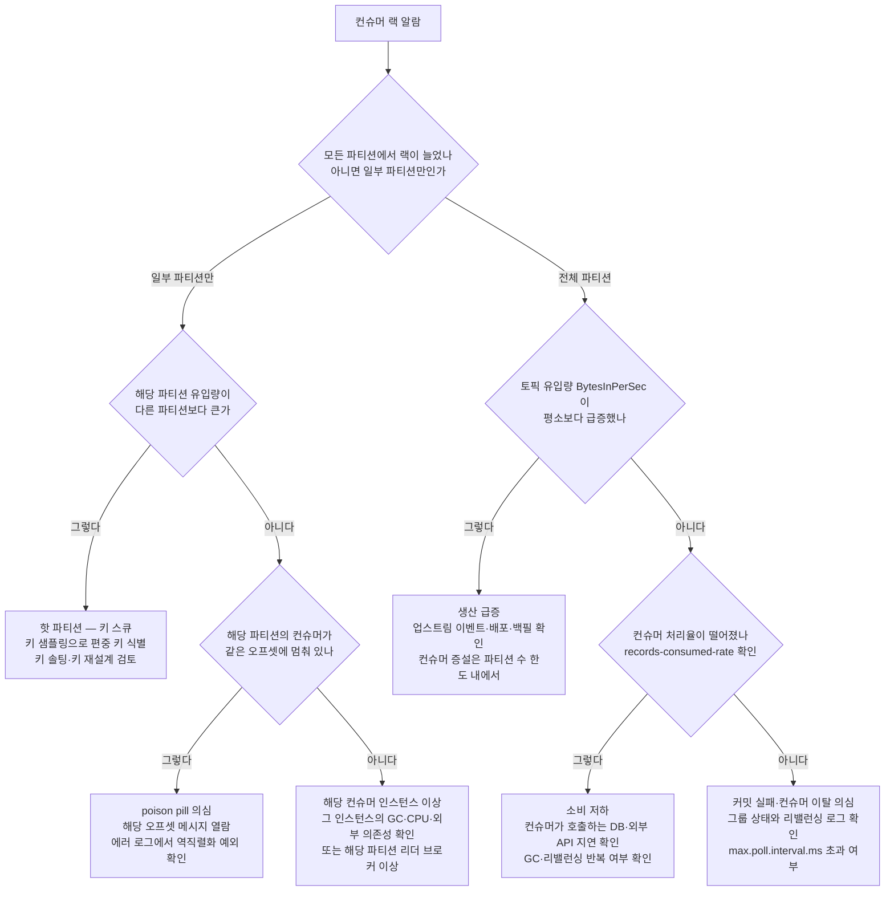
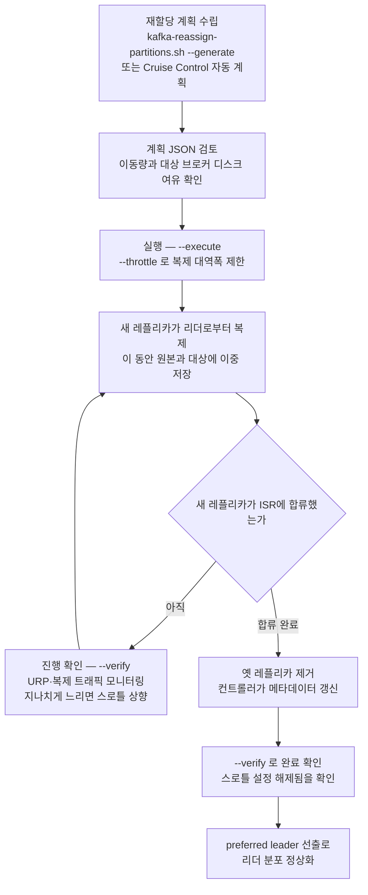

# 운영과 튜닝 — 파티션 수·모니터링·장애 대응

> 시리즈 06편. 이 편은 "클러스터를 굴리는 사람"의 관점에서 쓴다. 개념(01), 저장 구조(02), 복제와 컨트롤러(03), 프로듀서(04), 컨슈머(05)를 읽었다는 전제 위에서, **운영 중에 실제로 마주치는 결정과 사고**를 다룬다. 기준 버전은 Apache Kafka 4.x(KRaft 전용)다.

---

## 0. 왜 카프카 "운영"이 따로 한 편인가 🟢 기초

카프카는 애플리케이션이 아니라 **분산 스토리지 시스템**이다. 데이터베이스를 운영하듯 디스크·네트워크·복제·백프레셔를 상시 신경 써야 하고, 잘못된 초기 결정(특히 파티션 수와 키 설계)은 나중에 되돌리기 매우 비싸다.

운영 관점에서 카프카가 어려운 이유는 세 가지다.

1. **되돌릴 수 없는 결정이 많다.** 파티션 수는 늘릴 수는 있어도 줄일 수 없고, 늘리는 순간 키 기반 순서 보장이 깨진다.
2. **장애가 전염된다.** 브로커 하나의 디스크 문제가 복제 지연 → ISR(In-Sync Replicas) 축소 → 가용성 저하로 번지고, 컨슈머 하나의 느려짐이 리밸런싱을 통해 그룹 전체를 멈춘다.
3. **지표가 원인을 직접 말해주지 않는다.** "컨슈머 랙이 늘었다"는 결과일 뿐이고, 원인은 생산 급증·소비 저하·파티션 편중·poison pill 중 무엇이든 될 수 있다. 원인 분해 능력이 곧 운영 실력이다.

비유하자면 카프카 운영은 **물류 창고 관리**와 같다. 도크(파티션) 수를 몇 개로 지을지, 각 도크의 대기 트럭 수(랙)를 어떻게 감시할지, 특정 도크에만 트럭이 몰리면(핫 파티션) 어떻게 분산할지, 창고가 꽉 차면(디스크 풀) 무엇부터 버릴지를 미리 정해둬야 한다. 다만 이 비유의 한계는, 카프카에서는 "도크를 늘리는 것" 자체가 기존 화물의 분류 규칙(키 → 파티션 매핑)을 바꿔버린다는 점이다. 물리 창고보다 훨씬 비가역적이다.

---

## 1. 파티션 수 산정 🔴 심화

### 1.1 왜 어려운 문제인가

파티션은 카프카 병렬성의 단위다(01편). 파티션이 많을수록 프로듀서·컨슈머 병렬성이 올라가지만, 파티션 하나하나가 브로커의 **파일 핸들, 메모리, 복제 커넥션, 컨트롤러 메타데이터**를 소비한다. 즉 파티션 수 결정은 "처리량 확보"와 "클러스터 관리 비용" 사이의 트레이드오프이며, 한 번 늘리면 줄일 수 없다는 비가역성 때문에 초기 산정이 중요하다.

### 1.2 목표 처리량 기반 공식

가장 널리 쓰이는 산정법은 처리량 기반이다.

```
필요 파티션 수 = max( 목표 처리량 T / 파티션당 프로듀서 처리량 P,
                     목표 처리량 T / 파티션당 컨슈머 처리량 C )
```

- **T**: 이 토픽이 감당해야 할 목표 처리량(예: 100MB/s). 반드시 피크 기준 + 성장 여유(보통 1년 치, 2~3배)를 잡는다.
- **P**: 파티션 1개에 프로듀서가 밀어 넣을 수 있는 처리량. 배치 설정(04편의 `batch.size`, `linger.ms`), 압축, `acks` 설정에 따라 수 MB/s ~ 수십 MB/s.
- **C**: 파티션 1개를 컨슈머 1개가 소화하는 처리량. **거의 항상 이쪽이 병목이다.** 컨슈머는 메시지를 읽기만 하는 게 아니라 역직렬화하고, DB에 쓰고, 외부 API를 호출한다. 이 처리 로직이 C를 결정한다.

예시: 피크 60MB/s, 성장 여유 2배 → T=120MB/s. 프로듀서는 파티션당 20MB/s를 넣을 수 있지만, 컨슈머는 처리 로직 때문에 파티션당 5MB/s밖에 소화하지 못한다면:

```
max(120/20, 120/5) = max(6, 24) = 24개
```

여기에 실무적 보정을 얹는다.

- **컨슈머 최대 병렬성 = 파티션 수**다(05편). 컨슈머를 파티션 수 이상 띄워도 놀기 때문에, "장애 후 밀린 랙을 따라잡을 때 컨슈머를 몇 대까지 늘리고 싶은가"를 상한으로 고려한다.
- **브로커 수의 배수**로 잡으면 리더가 고르게 분산된다(브로커 6대면 12, 24, 30…).
- 처리량이 아주 작은 토픽은 공식과 무관하게 **작게 시작**한다(1~6개). "나중에 곤란할까 봐 미리 100개" 같은 과잉 할당이 아래 1.3의 비용을 만든다.

### 1.3 파티션이 너무 많을 때의 비용

"파티션은 공짜가 아니다"를 항목별로 뜯어보면 다음과 같다.

| 비용 | 메커니즘 | 체감 증상 |
|---|---|---|
| **리더 선출·페일오버 시간** | 브로커 1대가 죽으면 그 브로커가 리더였던 모든 파티션의 리더를 재선출해야 한다. 파티션이 많을수록 선출·메타데이터 전파 대상이 늘어난다 | 브로커 다운 시 일부 파티션이 수 초간 쓰기 불가 |
| **파일 핸들** | 파티션의 각 로그 세그먼트는 로그 파일 + 인덱스 파일들을 연다(02편). 파티션 2,000개 × 세그먼트당 3~4개 핸들이면 브로커당 수만 개 | `Too many open files`로 브로커 프로세스 사망 |
| **복제 트래픽·커넥션** | 팔로워는 파티션 단위로 리더에게서 fetch한다. 파티션이 많으면 복제 fetch 요청 수와 브로커 간 커넥션이 비례해서 증가 | 브로커 CPU·네트워크가 "데이터 양"이 아니라 "요청 수"에 잠식됨 |
| **E2E 지연 증가** | 총 유입량이 같은데 파티션이 많으면 파티션당 유입이 줄어 프로듀서 배치가 안 채워지고(`linger.ms`까지 대기), 컨슈머 fetch도 파티션당 소량씩 긁게 되어 왕복이 늘어난다 | 처리량은 그대로인데 p99 지연이 올라감 |
| **컨트롤러·메타데이터 부담** | 파티션마다 리더·ISR 상태를 컨트롤러가 추적한다. KRaft(03편)가 ZooKeeper 시절 대비 이 한계를 크게 끌어올렸지만(클러스터 전체 수백만 파티션 수준), 브로커 개별 자원 비용은 그대로다 | 메타데이터 요청 응답 지연, 재할당 계획 수립 시간 증가 |

ZooKeeper 시절엔 "브로커당 4,000개, 클러스터당 20만 개" 같은 가이드가 있었다. KRaft에서 컨트롤러 쪽 한계는 사실상 풀렸지만, **파일 핸들·복제 커넥션·배치 효율 같은 브로커 로컬 비용은 KRaft와 무관하게 남는다.** "KRaft니까 파티션 마음껏 늘려도 된다"는 오해다.

### 1.4 나중에 늘리면 키 순서가 깨진다

가장 중요한 함정. 프로듀서의 기본 파티셔너는 키가 있으면 다음처럼 파티션을 정한다(04편).

```
partition = murmur2(key) % numPartitions
```

`numPartitions`가 바뀌는 순간, **같은 키의 새 메시지가 다른 파티션으로 가기 시작한다.** 기존 메시지는 옛 파티션에 그대로 남아 있으므로:

- 카프카의 순서 보장은 "파티션 내"에서만 성립하는데, 같은 키가 두 파티션에 걸치게 되어 **키 단위 순서가 깨진다.** 예: `user-42`의 "주문 생성"은 파티션 3에, 이후의 "주문 취소"는 파티션 7에 있다면 컨슈머가 취소를 먼저 처리할 수 있다.
- 컴팩션 토픽(02편)이라면 같은 키의 옛 값이 옛 파티션에 남아 컴팩션으로 지워지지 않는 기간이 생긴다.
- Kafka Streams처럼 파티션과 상태 저장소가 1:1로 묶인 시스템은 상태 재배치 없이는 그대로 깨진다.

그래서 실무 원칙은 이렇다.

1. **키 기반 순서에 의존하는 토픽은 처음부터 넉넉하게** 잡는다(위 공식 결과의 2배 등). 컨슈머 수는 파티션보다 적게 시작해도 되므로 파티션 여유분은 당장 손해가 아니다.
2. 정말 늘려야 한다면, **늘리는 시점 이후 유입분만 소비하는 새 컨슈머 로직을 준비**하거나, 아예 **새 토픽을 만들어 마이그레이션**한다(프로듀서를 새 토픽으로 전환 → 구 토픽 소진 후 폐기). 순서가 무의미한 토픽(메트릭, 로그)이라면 그냥 늘려도 된다.
3. `kafka-topics.sh --alter --partitions N`은 **늘리기만 가능**하다. 줄이는 방법은 새 토픽 재생성뿐이다.

---

## 2. 핵심 모니터링 지표 — 각 지표가 "아플 때"의 의미 🔴 심화

카프카 지표는 수백 개지만, 페이저를 울려야 하는 지표는 소수다. JMX 지표 이름과 함께 "이 지표가 나쁠 때 클러스터에서 실제로 무슨 일이 벌어지고 있는가"를 정리한다.

### 2.1 Consumer Lag — 소비가 생산을 못 따라가는 정도 🟡

```
lag = 파티션의 LEO — 컨슈머 그룹의 커밋 오프셋
```

LEO(Log End Offset)는 파티션 로그의 끝, 정확히는 "다음에 기록될 메시지가 받을 오프셋"이다(03편의 정의 그대로다). 랙은 "밀린 메시지 수"이며, **절대값보다 추세**가 중요하다. 랙 10만이어도 감소 중이면 따라잡는 중이고, 랙 100이어도 단조 증가면 영원히 못 따라잡는다.

- 측정: `kafka-consumer-groups.sh --describe --group <g>`, 클라이언트 지표 `records-lag-max`, 또는 Burrow 같은 랙 전용 모니터. **시간 환산 랙**(이 랙을 소진하는 데 걸리는 시간)으로 알람을 걸면 토픽별 처리량 차이에 휘둘리지 않는다.
- 아플 때의 의미: 원인이 최소 4갈래(생산 급증 / 소비 저하 / 파티션 편중 / poison pill)라서 **랙 자체는 진단이 아니라 증상**이다. 원인 분해는 4.4절의 의사결정 트리로 다룬다.
- 함정: 랙은 "커밋 오프셋" 기준이므로, 컨슈머가 처리는 했는데 커밋을 안 하고 있어도 랙으로 보인다. `max.poll.interval.ms` 초과로 그룹에서 쫓겨난 컨슈머도 랙 증가로 나타난다.

### 2.2 Under-Replicated Partitions — 복제가 밀리고 있다 🔴

```
kafka.server:type=ReplicaManager,name=UnderReplicatedPartitions
```

ISR 크기 < 레플리카 수인 파티션의 개수. **정상값은 0이며, 0이 아니면 무조건 조사 대상**이다. 지속적인 URP는 다음 중 하나를 의미한다.

- **브로커 1대 다운/재시작 중**: 클러스터 전체 URP가 특정 브로커의 파티션 수만큼 일제히 뛴다. 롤링 재시작 중이라면 정상(일시적).
- **특정 브로커의 디스크·네트워크 병목**: 팔로워 fetch가 리더를 못 따라감. 해당 브로커의 디스크 IO 사용률, 네트워크 스루풋을 함께 본다.
- **복제 스레드 부족**: `num.replica.fetchers` 증설 검토.

URP 상태의 파티션은 `min.insync.replicas`를 겨우 충족하거나 못 채우는 상태로, **한 대만 더 죽으면 쓰기 불가 또는 데이터 유실 후보**가 된다(03편). URP와 함께 `OfflinePartitionsCount`(리더가 아예 없는 파티션 수)가 0보다 크면 이미 해당 파티션은 읽기·쓰기 모두 불가인 장애 상황이다.

### 2.3 ISR Shrink / Expand — 복제 멤버십이 출렁인다 🔴

```
kafka.server:type=ReplicaManager,name=IsrShrinksPerSec
kafka.server:type=ReplicaManager,name=IsrExpandsPerSec
```

팔로워가 `replica.lag.time.max.ms`(기본 30초) 동안 리더를 따라잡지 못하면 ISR에서 제외되고(shrink), 따라잡으면 복귀한다(expand). 안정 상태에서는 둘 다 0에 가깝다.

- **shrink와 expand가 짝을 이루며 반복**(flapping): 팔로워가 "겨우 따라가는" 상태. 브로커 간 성능 편차(느린 디스크 한 대), GC 스톱, 네트워크 순간 단절을 의심한다. 특히 **긴 GC pause는 ISR 이탈 + 세션 타임아웃의 단골 원인**이므로 브로커 GC 로그를 함께 본다.
- shrink만 발생하고 복귀가 없으면 해당 팔로워 브로커가 사실상 죽은 것이다.
- flapping은 그 자체로도 나쁘다. ISR 변경은 컨트롤러에 기록·전파되는 메타데이터 변경이라 클러스터 전체에 잡음을 만든다.

### 2.4 Request / Queue Latency — 브로커가 어디서 시간을 쓰는가 🔴

```
kafka.network:type=RequestMetrics,name=TotalTimeMs,request={Produce|FetchConsumer|FetchFollower}
```

`TotalTimeMs`는 구간별로 분해된다: `RequestQueueTimeMs`(요청 큐 대기) → `LocalTimeMs`(리더 처리, 주로 디스크) → `RemoteTimeMs`(대기: Produce는 팔로워 ack 대기, Fetch는 `fetch.max.wait.ms` 대기) → `ResponseQueueTimeMs` + `ResponseSendTimeMs`(응답 전송).

어느 구간이 비대한지가 곧 진단이다.

| 비대한 구간 | 의미 | 조치 방향 |
|---|---|---|
| RequestQueueTimeMs | 네트워크 스레드가 받아둔 요청을 IO 스레드가 못 꺼내감 | `num.io.threads` 증설, 브로커 증설. `RequestHandlerAvgIdlePercent`가 0.2 미만이면 확증 |
| LocalTimeMs | 디스크 쓰기/읽기 자체가 느림 | 디스크 IOPS 확인, 페이지 캐시 미스 여부(오래된 오프셋을 읽는 컨슈머가 캐시를 오염시키는 경우) |
| RemoteTimeMs — Produce | 팔로워 복제가 느려 acks=all 대기가 김 | URP·ISR 지표와 교차 확인 |
| ResponseSendTimeMs | 네트워크 대역폭 포화 | `num.network.threads`, NIC 사용률 확인 |

주의: FetchConsumer의 `RemoteTimeMs`는 새 메시지를 기다리는 정상 대기(`fetch.max.wait.ms`)를 포함하므로 크다고 무조건 문제가 아니다. **Produce의 p99 TotalTimeMs**가 프로듀서 지연 체감과 가장 직결된다.

### 2.5 Active Controller Count — 두뇌가 정확히 하나인가 🔴

```
kafka.controller:type=KafkaController,name=ActiveControllerCount
```

KRaft 컨트롤러 쿼럼(03편)에서 이 값은 **클러스터 전체 합이 정확히 1**이어야 한다.

- 합계 0: 컨트롤러 리더가 없다. 쿼럼 과반 상실(컨트롤러 노드 3대 중 2대 다운 등). 이 상태에서는 리더 선출·토픽 생성·ISR 변경 같은 메타데이터 작업이 전부 멈춘다. 기존 리더로의 읽기·쓰기는 당분간 되지만, 장애가 겹치는 순간 복구 불능이 된다. **최우선 대응 대상.**
- 합계 2 이상: 스플릿 브레인 징후 또는 지표 수집 시점 차이. 지속되면 쿼럼 상태(`kafka-metadata-quorum.sh --describe`)를 확인한다.

함께 볼 KRaft 지표: 컨트롤러 리더 교체 빈도, 브로커의 메타데이터 적용 지연(`kafka.server:type=broker-metadata-metrics`의 lag 계열). 교체가 잦으면 컨트롤러 노드의 GC·디스크(메타데이터 로그 fsync)가 불안정한 것이다.

### 2.6 그 밖의 상비 지표 🟡

- `RequestHandlerAvgIdlePercent` / `NetworkProcessorAvgIdlePercent`: IO·네트워크 스레드의 유휴율. 0.3 아래로 내려가면 포화 임박.
- `BytesInPerSec` / `BytesOutPerSec` / `MessagesInPerSec`: 용량 계획의 기초. Out에는 컨슈머 fetch + 팔로워 복제 fetch가 모두 포함된다는 점에 유의.
- `LogFlushRateAndTimeMs`: 플러시가 갑자기 느려지면 디스크 이상 조기 신호.
- 브로커 프로세스 외부: **디스크 사용률(파티션별), IO 대기 시간, NIC 사용률, 열린 파일 수, GC pause**. 카프카 장애의 절반은 JMX가 아니라 OS 지표에서 먼저 보인다.

---

## 3. 브로커 사이징 감각 🔴 심화

### 3.1 디스크 — 용량은 산수, IOPS는 패턴 이해

**용량**은 산수다.

```
브로커당 필요 용량 ≈ (유입 MB/s × retention 초 × 복제 팩터 RF) / 브로커 수 × 여유율
```

예: 유입 50MB/s, `retention.ms` 7일, RF=3, 브로커 6대 → 50 × 604,800 × 3 / 6 ≈ 15TB/브로커. 여기에 **여유율 30~40%**를 얹는다. 여유가 필요한 이유: 재할당 중에는 이동 중 파티션이 원본·대상에 이중으로 존재하고, 세그먼트 삭제는 `retention.ms`를 지나도 세그먼트 롤링 단위로 지연되며, 트래픽은 계획을 초과한다.

**IOPS**는 카프카의 IO 패턴을 이해해야 한다(02편). 쓰기는 세그먼트 파일에 대한 순차 append이고, 읽기는 대부분 방금 쓴 데이터라 **페이지 캐시에서 해소**된다. 그래서 카프카는 순차 처리량만 받쳐주면 HDD로도 굴러가는 드문 시스템이었다. 그러나 다음 상황에서는 랜덤 IO가 터진다.

- 브로커 하나에 파티션이 수백~수천 개면, 파티션별 순차 쓰기가 디스크 입장에서는 **여러 파일에 대한 교차 쓰기 = 준-랜덤 IO**가 된다.
- 랙이 큰 컨슈머가 오래된 오프셋을 읽으면 페이지 캐시 미스 → 디스크 랜덤 읽기 + **캐시 오염**(뜨거운 데이터가 밀려남)으로 다른 컨슈머까지 느려진다.

그래서 요즘 기본값은 NVMe SSD다. RAID 10 대신 브로커별 JBOD + 카프카 복제로 내결함성을 확보하는 구성이 일반적이며, 파일시스템은 XFS에 `noatime` 마운트가 표준이다.

### 3.2 네트워크가 먼저 병목이 되는 이유

브로커의 NIC이 감당하는 트래픽을 세어 보면, 유입 1에 대해 나가는 트래픽이 몇 배로 증폭된다.

```
유입:  프로듀서 쓰기 1
유출:  팔로워 복제 fetch — RF가 3이면 리더 기준 2
     + 컨슈머 fetch — 컨슈머 그룹 수 F만큼, F가 3이면 3
→ 유입 1당 유출 5, NIC 총 트래픽은 유입의 6배
```

디스크는 브로커마다 여러 개 꽂아 스케일할 수 있지만 NIC 대역폭은 그러기 어렵다. 그래서 **중간 규모 이상 클러스터에서 가장 먼저 포화되는 자원은 대개 네트워크**다. 25GbE 이상 NIC, 압축 전송(6절), 그리고 컨슈머 fetch를 같은 가용영역 팔로워에서 읽게 하는 follower fetching(`replica.selector.class`, 클라우드에서 AZ 간 전송 비용 절감 효과가 큼)이 대응 수단이다.

### 3.3 OS 튜닝 체크리스트

| 항목 | 권장 | 이유 |
|---|---|---|
| 파일 디스크립터 | `ulimit -n 100000` 이상 | 세그먼트 파일 + 인덱스 + 소켓. 파티션이 많으면 수만 개는 기본. 부족하면 브로커가 그냥 죽는다 |
| `vm.swappiness` | `1` | 브로커 힙이나 페이지 캐시가 스왑되면 GC pause·지연이 수 초 단위로 튄다. 0 대신 1을 쓰는 이유는 OOM killer 직행보다는 최후의 스왑 여지를 남기기 위해 |
| `vm.dirty_background_ratio` / `vm.dirty_ratio` | 5 / 60 부근 | 카프카는 fsync를 OS에 맡긴다(`flush.messages` 기본 비활성, 내구성은 복제로 확보 — 03편). 백그라운드 플러시를 일찍 시작하게 해 쓰기 폭주 시 전체 프로세스가 멈추는 동기 플러시를 피한다 |
| 디스크 스케줄러 | NVMe/SSD는 `none`(또는 `mq-deadline`) | CFQ류 스케줄러의 재정렬은 순차 쓰기 워크로드에 손해. SSD는 커널 재정렬 이득이 거의 없다 |
| 힙 크기 | 6~8GB 안팎, 나머지는 페이지 캐시 | 카프카 성능의 핵심은 힙이 아니라 페이지 캐시다. 메모리 64GB 머신에 힙 32GB를 주는 것은 캐시를 절반 버리는 것 |
| `net.core.wmem_max` 등 소켓 버퍼 | 상향 | 브로커 간·DC 간 고지연 링크에서 처리량 확보 |

---

## 4. 흔한 장애 시나리오와 대응 절차 🔴 심화

### 4.1 디스크 풀

카프카에서 디스크가 가득 차면 브로커는 해당 로그 디렉토리를 오프라인 처리하고, 디렉토리가 하나뿐이면 프로세스가 내려간다. 내려간 브로커의 파티션은 다른 레플리카로 리더가 넘어가는데, **원인이 전체 유입량 증가라면 남은 브로커들의 디스크도 곧 찬다.** 도미노가 시작되기 전에 끊어야 한다.

대응 절차(빠른 순서대로):

1. **retention 긴급 축소**: 가장 큰 토픽부터 `kafka-configs.sh --alter --entity-type topics --entity-name big-topic --add-config retention.ms=21600000`(6시간). 삭제는 세그먼트 단위로 이뤄지므로 몇 분 내 공간이 회수된다. `retention.bytes`를 함께 걸면 상한이 명확해진다.
2. **불필요 토픽·재현 가능한 토픽부터 정리**: 원본이 다른 곳에 있는 파생 토픽, 테스트 토픽.
3. 디스크에 무관 파일(로그 덤프, 코어 덤프)이 있으면 제거. **단, 카프카 로그 디렉토리 안의 세그먼트 파일을 수동으로 `rm` 하는 것은 절대 금지** — 브로커가 관리하는 상태와 어긋나 파티션이 깨진다.
4. 중기: 브로커·디스크 증설 후 파티션 재할당(5절), Tiered Storage(02편) 검토.
5. 예방: 디스크 사용률 알람은 70%(주의)/80%(페이저)로. 재할당·복구에 쓸 여유 공간이 필요하므로 90% 알람은 이미 늦다.

### 4.2 리밸런싱 폭풍

컨슈머 그룹에서 멤버 변동이 생기면 파티션을 다시 분배한다(05편). 문제는 리밸런싱이 리밸런싱을 부르는 악순환이다.

전형적 시나리오: 컨슈머가 poll 사이 처리에 `max.poll.interval.ms`(기본 5분)를 초과 → 그룹에서 추방 → 리밸런싱 → 파티션을 넘겨받은 다른 컨슈머의 부하 증가 → 그 컨슈머도 초과 → 또 리밸런싱 → **그룹 전체가 소비는 못 하고 리밸런싱만 반복**한다. 배포 시 인스턴스가 순차 재시작하면서 매번 리밸런싱을 유발하는 것도 흔한 패턴이다.

대응·예방:

- **처리 시간 관리가 근본 대책**: `max.poll.records`를 줄여 한 번의 poll에서 처리할 양을 줄이거나, `max.poll.interval.ms`를 실제 처리 시간에 맞게 늘린다. 처리 자체가 느린 것이면 그걸 고쳐야 한다.
- **정적 멤버십**: `group.instance.id`를 지정하면 재시작한 컨슈머가 `session.timeout.ms` 내에 같은 ID로 복귀할 때 리밸런싱을 생략한다. 쿠버네티스 롤링 배포와 궁합이 좋다.
- **점진적 리밸런싱**: 4.x의 새 그룹 프로토콜(KIP-848, `group.protocol=consumer`)은 브로커 주도 점진 재할당이라 stop-the-world가 없다. 구 프로토콜을 쓴다면 `CooperativeStickyAssignor`가 유사한 효과를 낸다(05편).
- 폭풍이 이미 진행 중이면: 컨슈머를 일단 소수만 남기고 내려서 그룹을 안정시킨 뒤, 설정을 고쳐 순차 재투입한다.

### 4.3 핫 파티션 — 키 스큐

특정 키(대형 고객, 인기 상품, null 키가 아닌 고정 키 실수)에 트래픽이 몰리면 그 키가 매핑된 파티션 하나만 뜨거워진다. 증상: 파티션별 유입량 편차, 해당 파티션 리더 브로커만 CPU·디스크 사용률이 높음, **그 파티션에 붙은 컨슈머만 랙 증가**.

진단: 파티션별 `MessagesInPerSec`·크기를 비교하고, 편중된 파티션의 메시지 키를 샘플링한다(`kafka-console-consumer.sh --property print.key=true`).

대응은 키 설계 문제라 쉬운 답이 없다.

- **복합 키 / 키 솔팅(salting)**: `bigCustomerId` → `bigCustomerId#{0..9}`로 쪼개 10개 파티션에 분산. 대신 그 키의 전역 순서는 포기하고, 필요하면 컨슈머 쪽에서 재집계한다.
- 순서가 필요 없는 토픽이면 키를 빼서 라운드로빈/sticky 분배로 전환.
- 2단계 토픽: 원본은 순서 유지, 뜨거운 키만 별도 토픽으로 분리해 다르게 스케일.
- 하지 말 것: 핫 파티션을 좋은 브로커로 옮기는 재할당은 위치만 바꿀 뿐 편중 자체를 못 고친다. 임시 완화일 뿐이다.

### 4.4 랙 폭증 — 원인 분해 의사결정 트리

랙 알람이 울렸을 때의 진단 순서를 트리로 정리한다. 핵심 질문은 세 가지다: **생산이 늘었나? 소비가 줄었나? 특정 파티션만 그런가?**



트리의 각 리프에서 확인할 실측 명령·지표:

- 파티션별 랙 분포: `kafka-consumer-groups.sh --describe` 출력에서 파티션별 LAG 컬럼 비교.
- 생산 급증: 토픽별 `BytesInPerSec` 시계열. 배포 이력, 업스트림 백필 작업과 대조.
- 소비 저하: 컨슈머 클라이언트 지표 `records-consumed-rate`, `fetch-latency-avg`, 그리고 **컨슈머가 의존하는 다운스트림**(DB 슬로우 쿼리, 외부 API p99)이 진범인 경우가 가장 많다.
- 랙을 따라잡을 때는 컨슈머 증설이 유효하지만 **파티션 수가 상한**임을 기억한다(1.2절).

### 4.5 Poison Pill — 소비를 막는 독약 메시지

역직렬화가 불가능하거나(스키마 불일치, 깨진 페이로드) 처리 로직을 반드시 예외로 몰아넣는 메시지가 파티션에 들어오면, 컨슈머는 **같은 오프셋에서 실패 → 재시작 → 같은 메시지 재수신 → 실패**를 무한 반복한다. 그 파티션의 소비가 완전히 멈추고 랙이 선형으로 증가한다.

식별: 컨슈머 로그의 반복되는 동일 오프셋 예외(`SerializationException` 등). 해당 메시지 확인:

```
kafka-console-consumer.sh --topic t --partition 3 --offset 12345 --max-messages 1
```

대응:

- **응급**: 해당 오프셋을 건너뛴다. 컨슈머 코드의 `seek()` 또는 오프라인 상태에서 `kafka-consumer-groups.sh --reset-offsets --to-offset 12346 --topic t:3 --execute`. 메시지를 버리는 결정이므로 비즈니스 영향 판단이 필요하다.
- **구조적 해법 — DLT(Dead Letter Topic)**: 역직렬화·처리 실패 메시지를 별도 토픽으로 보내고 원 파티션 소비는 계속 진행한다. Spring Kafka의 `DefaultErrorHandler` + `DeadLetterPublishingRecoverer`, Connect의 `errors.tolerance=all` + `errors.deadletterqueue.topic.name`이 이 패턴의 구현이다. DLT는 반드시 모니터링·재처리 절차와 세트로 운영한다(쌓이기만 하는 DLT는 조용한 데이터 유실이다).
- **예방**: 스키마 레지스트리(07편)로 호환성을 강제해 애초에 깨진 스키마가 들어오지 못하게 한다. 역직렬화 예외는 반드시 try-catch 경계 안에서 다루도록 컨슈머를 설계한다.

---

## 5. 파티션 재할당과 롤링 재시작 🔴 심화

### 5.1 파티션 재할당 — 언제, 어떻게

파티션 재할당(partition reassignment)은 파티션 레플리카를 다른 브로커로 옮기는 작업이다. 필요한 순간: **브로커 증설 후 부하 분산**(카프카는 새 브로커에 기존 파티션을 자동으로 옮겨주지 않는다), 브로커 퇴역, 디스크 불균형 해소, RF 변경.

동작 원리는 03편의 복제 메커니즘 그대로다: 대상 브로커가 새 팔로워로 추가되어 리더에게서 데이터를 복제하고, ISR에 합류하면 옛 레플리카를 제거한다. 즉 **재할당은 대량 복제 트래픽을 유발**하며, 스로틀 없이 실행하면 운영 트래픽을 잡아먹는다.



실무 절차와 함정:

1. **계획 생성**: `kafka-reassign-partitions.sh --generate`에 대상 토픽 JSON과 브로커 목록을 주면 계획을 만들어 준다. 단, 이 생성기는 단순 라운드로빈이라 파티션 크기·부하를 모른다. 규모가 있으면 **Cruise Control**(디스크·CPU·네트워크 부하 기반 자동 리밸런싱)을 쓰는 것이 표준이다.
2. **스로틀은 필수**: `--throttle 50000000`(50MB/s)처럼 복제 대역폭을 제한한다. 너무 낮으면 재할당이 영원히 안 끝나고(신규 유입 속도보다 복제가 느리면 ISR 합류 불가), 너무 높으면 운영 트래픽이 죽는다. 유입 속도와 여유 대역폭을 보고 정하고, 진행하며 조정한다.
3. **`--verify`를 끝까지**: 완료 확인뿐 아니라 **스로틀 설정 제거**도 verify가 해 준다. verify를 안 돌리면 스로틀이 토픽에 남아 이후 정상 복제까지 제한하는 사고가 난다.
4. 진행 중 취소가 필요하면 `--cancel`(진행 중 이동을 중단하고 원상 복구).
5. 재할당 완료 후 리더가 한쪽에 몰려 있으면 preferred leader 선출(`kafka-leader-election.sh --election-type preferred`)로 정리한다. `auto.leader.rebalance.enable=true`(기본)면 자동으로도 수행된다.

### 5.2 롤링 재시작 — 무중단으로 전 브로커 재기동

설정 변경·버전 업그레이드 시 브로커를 한 대씩 재시작한다. 원칙: **URP가 0으로 돌아온 것을 확인하고 다음 브로커로 넘어간다.**

절차:

1. 사전 확인: 클러스터 URP=0, `OfflinePartitionsCount`=0, 모든 파티션이 `min.insync.replicas`를 여유 있게 충족(RF=3, min.isr=2라면 ISR 3인 상태). 여유가 없는 상태에서 한 대를 내리면 곧바로 쓰기 불가 파티션이 생긴다.
2. 대상 브로커에 SIGTERM으로 **graceful shutdown**. 브로커는 종료 전 자신이 리더인 파티션의 리더십을 다른 레플리카로 넘기고(controlled shutdown), 로그를 정리하고 내려간다. `kill -9`는 다음 기동 시 로그 복구(recovery) 스캔을 유발해 재시작이 수 배 느려진다. 복구가 필요해진 경우를 대비해 `num.recovery.threads.per.data.dir`를 코어 수 수준으로 잡아 두면 기동이 빨라진다.
3. 재기동 후 대기: 브로커가 클러스터에 합류하고, 자신의 레플리카들이 **모두 ISR에 복귀해 URP=0**이 될 때까지 기다린다. 이 대기를 생략하고 다음 브로커를 내리는 것이 롤링 재시작 중 데이터 유실 사고의 전형이다.
4. 리더 재분배: `auto.leader.rebalance.enable` 기본값이면 자동. 아니면 preferred leader 선출을 수동 실행.
5. **컨트롤러 노드는 마지막에**: KRaft 쿼럼 노드를 재시작할 때는 쿼럼 과반이 항상 살아 있도록 한 대씩, 그리고 현재 리더인 컨트롤러는 가장 마지막에 재시작한다.
6. 버전 업그레이드라면 전 브로커 교체 완료 후 `kafka-features.sh upgrade`로 metadata version 등 feature 레벨을 올린다(올리기 전까지는 다운그레이드 여지가 남는다).

---

## 6. 보안 개요 — TLS·SASL·ACL 한 장 정리 🟡 실무

카프카 보안은 세 층으로 나뉜다: **암호화(TLS) — 인증(authentication, SASL 또는 mTLS) — 인가(authorization, ACL)**. 셋은 독립적이라 하나만 켤 수도 있지만, 인증 없는 인가는 무의미하므로 보통 세트로 간다.

### 6.1 전송 암호화 — TLS

리스너 단위로 프로토콜을 지정한다: `listeners=SASL_SSL://:9093` 식으로, 보안 프로토콜은 `PLAINTEXT`(둘 다 없음), `SSL`(암호화, 선택적으로 mTLS 인증), `SASL_PLAINTEXT`(인증만), `SASL_SSL`(둘 다) 네 가지 조합이다. 브로커에 `ssl.keystore.location` 등 키스토어를 설정하고, 클라이언트는 truststore로 브로커 인증서를 검증한다. `ssl.client.auth=required`로 하면 클라이언트 인증서 기반 mTLS 인증이 된다. TLS는 CPU 비용과 함께 **zero-copy 전송 이점을 일부 상실**시키지만(02편), 최신 하드웨어에서는 대개 감내 가능한 수준이다.

### 6.2 인증 — SASL 메커니즘 선택

| 메커니즘 | 방식 | 언제 쓰나 |
|---|---|---|
| SASL/PLAIN | 평문 ID·비밀번호 | 반드시 TLS와 함께. 계정이 정적 설정에 묶여 관리가 불편 |
| **SASL/SCRAM** — SCRAM-SHA-256/512 | 챌린지-응답, 솔트된 해시 저장 | 자체 운영 클러스터의 사실상 표준. 계정을 동적으로 추가·삭제 가능. KRaft에서는 자격 증명이 메타데이터 로그에 저장되며 `kafka-configs.sh --alter --add-config 'SCRAM-SHA-512=[password=...]' --entity-type users --entity-name alice`로 관리 |
| **SASL/OAUTHBEARER** | OAuth 2.0 / OIDC 토큰 | 사내 IdP(Keycloak, Okta 등)와 통합, 단기 토큰·중앙 권한 관리가 필요할 때. 4.x는 표준 OIDC 연동을 기본 지원 |
| SASL/GSSAPI | Kerberos | 기존 Kerberos 인프라(전통적 Hadoop 계열)가 있을 때만 |
| Delegation Token | 브로커 발급 단기 토큰 | 대량 워커(프레임워크 작업자)가 Kerberos/SSL 부하 없이 인증할 때 |

### 6.3 인가 — ACL

KRaft에서는 `authorizer.class.name=org.apache.kafka.metadata.authorizer.StandardAuthorizer`를 쓴다(ZooKeeper 시절 AclAuthorizer의 대체이며 ACL을 메타데이터 로그에 저장). 원칙:

- `allow.everyone.if.no.acl.found=false`(기본)를 유지하고, **기본 거부 + 명시적 허용**으로 운영한다.
- 부여 예시: `kafka-acls.sh --add --allow-principal User:order-service --producer --topic orders`, 소비 측은 `--consumer --topic orders --group order-consumers`(토픽 Read + 그룹 Read가 함께 필요하다).
- 접두사 패턴(`--resource-pattern-type prefixed`)으로 `team1.` 접두사 토픽 전체에 권한을 주는 식의 관리가 스케일된다.
- `super.users=User:admin`으로 운영 계정을 지정하되 최소화한다.

브로커 간 통신·컨트롤러 리스너에도 인증을 거는 것을 잊지 말 것. 클라이언트 리스너만 잠그고 내부 리스너를 PLAINTEXT로 두면 옆문이 열린 금고다.

---

## 7. 클라이언트 쿼터 🟡 실무

멀티테넌트 클러스터에서 한 팀의 폭주(백필 작업, 버그로 인한 무한 재시도)가 클러스터 전체를 마비시키는 것을 막는 장치가 쿼터(quota)다. user 또는 client.id 단위로 건다.

- **네트워크 쿼터**: `producer_byte_rate`, `consumer_byte_rate`(바이트/초).
- **요청 쿼터**: `request_percentage` — IO·네트워크 스레드 시간 점유율 제한. 바이트는 적지만 요청 수가 많은 클라이언트(작은 배치로 두들기는 프로듀서)를 잡는 데 필요하다.

```
kafka-configs.sh --alter --add-config 'producer_byte_rate=10485760,consumer_byte_rate=52428800' \
  --entity-type users --entity-name analytics-team
```

동작 방식이 중요하다. 쿼터를 초과하면 브로커는 에러를 반환하는 게 아니라 **응답을 지연(throttle)시켜** 클라이언트를 자연스럽게 감속시킨다. 클라이언트 지표의 `produce-throttle-time-avg`가 0보다 크면 쿼터에 걸리고 있다는 뜻이다 — 클라이언트 입장에서 "브로커가 느려요"로 보이는 문제의 숨은 원인이 쿼터인 경우가 있으니, 지연 이슈 진단 시 함께 확인한다. 기본 쿼터(`--entity-type users --entity-default`)를 깔고 예외만 상향하는 운영이 안전하다.

---

## 8. 압축 선택 가이드 — lz4 vs zstd 🟡 실무

압축은 프로듀서의 `compression.type`으로 설정하며 **배치 단위**로 압축된다(04편 — 배치가 클수록 압축률이 좋아지는 이유). 토픽 설정 `compression.type`의 기본값은 `producer`로, 브로커가 프로듀서가 보낸 압축 형태를 그대로 저장한다(재압축 CPU 비용 없음). 압축 해제는 컨슈머가 한다.

| 코덱 | 압축률 | 속도 | 평가 |
|---|---|---|---|
| none | — | — | 네트워크·디스크가 남아돌 때만 |
| gzip | 높음 | 느림, CPU 비쌈 | 신규 채택 이유가 거의 없음. zstd로 대체 |
| snappy | 중간 | 빠름 | 과거의 기본 선택. 지금은 같은 속도대에서 lz4가 우세 |
| **lz4** | 중간 | 매우 빠름 | **지연 민감·CPU 민감 워크로드의 기본값** |
| **zstd** | 높음 — gzip급 이상 | 빠름 — gzip보다 훨씬 | **처리량·저장 비용 중심 워크로드의 기본값**. `compression.zstd.level`로 레벨 조정 가능 |

선택 기준을 한 줄로 요약하면: **저지연이 최우선이면 lz4, 네트워크·스토리지 절감이 최우선이면 zstd, 고민되면 zstd부터 벤치마크.** 3.2절에서 봤듯 카프카 클러스터의 병목은 네트워크인 경우가 많아, 압축률이 좋은 zstd는 CPU를 조금 쓰고 가장 귀한 자원(NIC 대역폭)을 아끼는 교환이라 대체로 남는 장사다. 주의점 하나: zstd는 브로커·컨슈머 모두 2.1 이상이어야 하므로, 아주 오래된 컨슈머가 섞인 토픽에서는 확인이 필요하다.

---

## 면접 포인트

**Q1. 토픽의 파티션 수는 어떻게 정하나? 많이 잡으면 뭐가 문제인가?**

- 나쁜 답변: "많을수록 병렬성이 좋으니 넉넉하게 100개쯤 잡습니다."
- 좋은 답변의 뼈대: ① 목표 처리량 T를 프로듀서·컨슈머 파티션당 처리량으로 나눈 max 값이 출발점이고, 대개 컨슈머 처리 로직이 병목이므로 그쪽이 결정한다. ② 과다 비용을 구체적으로: 브로커 다운 시 리더 재선출 대상 증가, 파일 핸들 고갈, 복제 fetch 요청·커넥션 증가, 파티션당 유입 감소로 배치 효율이 떨어져 E2E 지연 증가. ③ KRaft로 컨트롤러 한계는 완화됐지만 브로커 로컬 비용은 남는다. ④ 키 순서 의존 토픽은 나중에 늘리면 순서가 깨지므로 처음에 여유를 두고, 아니면 작게 시작한다 — 이 비대칭을 언급하면 실무 경험이 드러난다.

**Q2. 컨슈머 랙 알람이 울렸다. 어떤 순서로 진단하겠는가?**

- 나쁜 답변: "컨슈머를 늘립니다."
- 좋은 답변의 뼈대: 랙은 증상이지 원인이 아니므로 분해부터 한다. ① 전체 파티션인가 일부인가 — 일부면 핫 파티션(키 스큐) 또는 poison pill(동일 오프셋 정체) 또는 특정 인스턴스 이상. ② 전체면 생산 급증(`BytesInPerSec`)인지 소비 저하(`records-consumed-rate`, 다운스트림 DB·API 지연, 리밸런싱 반복)인지 구분. ③ 컨슈머 증설은 파티션 수가 상한이라는 제약까지 말하면 완성.

**Q3. Under-Replicated Partitions가 0이 아니면 무슨 의미이고 왜 위험한가?**

- 나쁜 답변: "복제가 안 되고 있다는 뜻이니 브로커를 재시작합니다."
- 좋은 답변의 뼈대: ISR이 레플리카 수보다 작은 파티션이 존재한다는 뜻. 패턴으로 원인을 좁힌다 — 특정 브로커 파티션 수만큼 일제 증가면 그 브로커 다운/재시작, 산발적이고 ISR shrink/expand가 출렁이면 느린 디스크·GC pause·네트워크 문제. 위험한 이유는 내결함성 여유가 소진된 상태라 추가 장애 한 번에 `min.insync.replicas` 미달로 쓰기 불가가 되거나, unclean 선출을 하면 데이터 유실로 이어지기 때문(03편). 롤링 재시작 중 URP=0 복귀를 기다리는 이유이기도 하다.

**Q4. 무중단으로 브로커 전체를 재시작(업그레이드)하는 절차를 설명하라.**

- 나쁜 답변: "한 대씩 순서대로 재시작합니다." (핵심 대기 조건 누락)
- 좋은 답변의 뼈대: ① 사전에 URP=0·오프라인 파티션 0 확인 — ISR 여유가 없으면 한 대 내리는 순간 장애. ② SIGTERM graceful shutdown으로 리더십을 미리 이양시키고 kill -9를 피한다(재기동 시 로그 복구 스캔 방지). ③ **재기동한 브로커의 레플리카가 전부 ISR에 복귀해 URP=0이 된 것을 확인한 뒤** 다음 브로커로 — 이 대기 생략이 사고의 전형. ④ KRaft 쿼럼 노드는 과반 유지, 컨트롤러 리더는 마지막. ⑤ 업그레이드라면 전체 완료 후 feature/metadata version 상향.

**Q5. lz4와 zstd 중 무엇을 쓰겠는가?**

- 나쁜 답변: "zstd가 최신이니 zstd요."
- 좋은 답변의 뼈대: 어떤 자원이 병목인지로 결정한다. 카프카는 복제·다중 컨슈머로 유출 트래픽이 유입의 몇 배로 증폭되어 네트워크가 먼저 병목이 되는 경우가 많고, 그렇다면 압축률 높은 zstd로 CPU를 조금 내주고 대역폭·스토리지를 아끼는 게 이득. 반대로 초저지연이 목표거나 CPU가 빠듯하면 lz4. 압축이 배치 단위라 `batch.size`·`linger.ms`와 상호작용한다는 점, 브로커는 기본적으로 재압축하지 않고 컨슈머가 해제한다는 점을 곁들이면 이해 깊이가 드러난다.

---

*이전 편: [05-consumer-deep-dive.md](05-consumer-deep-dive.md) — 다음 편: [07-ecosystem.md](07-ecosystem.md)*
