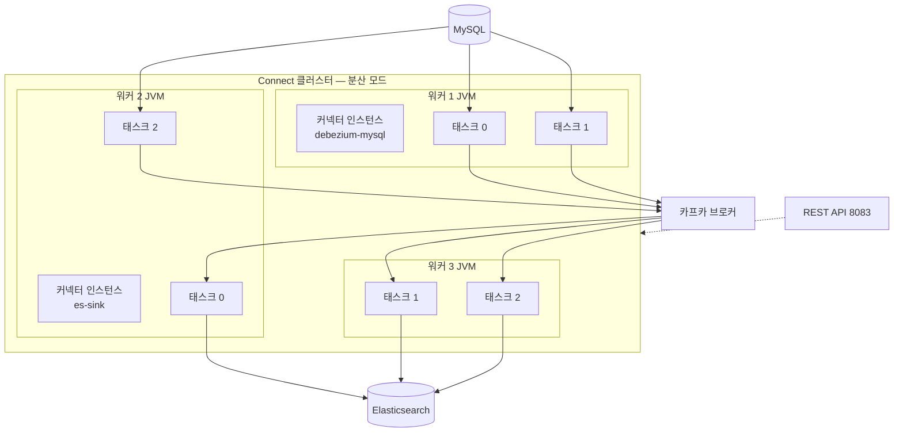
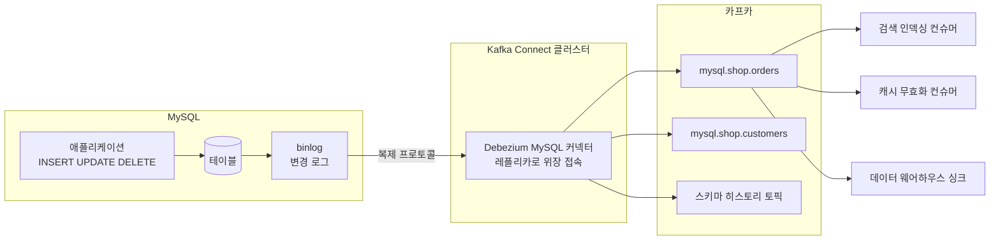
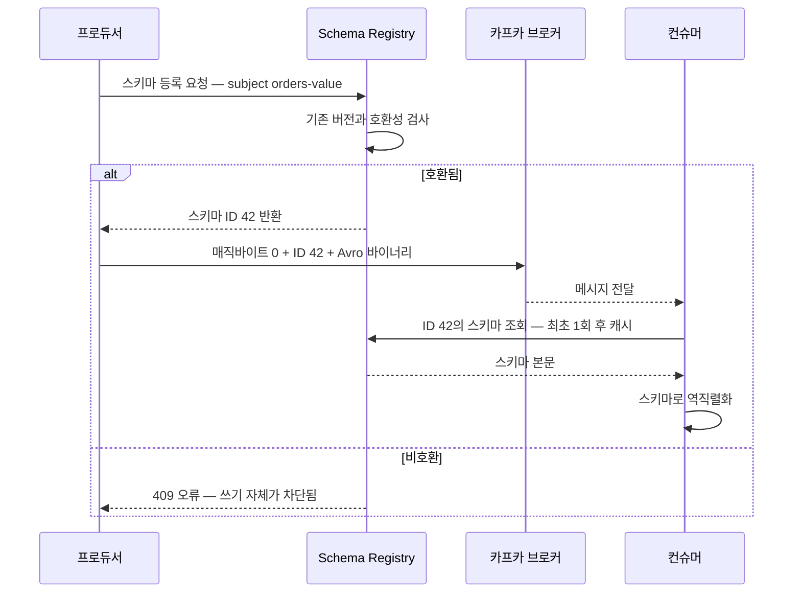
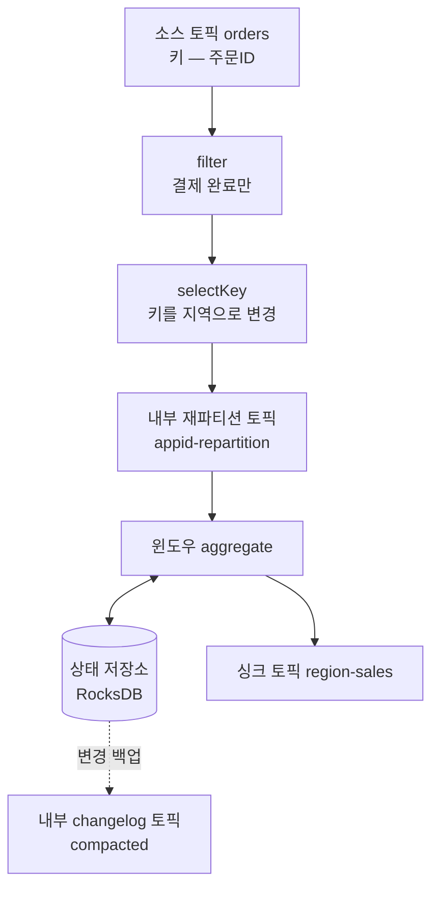
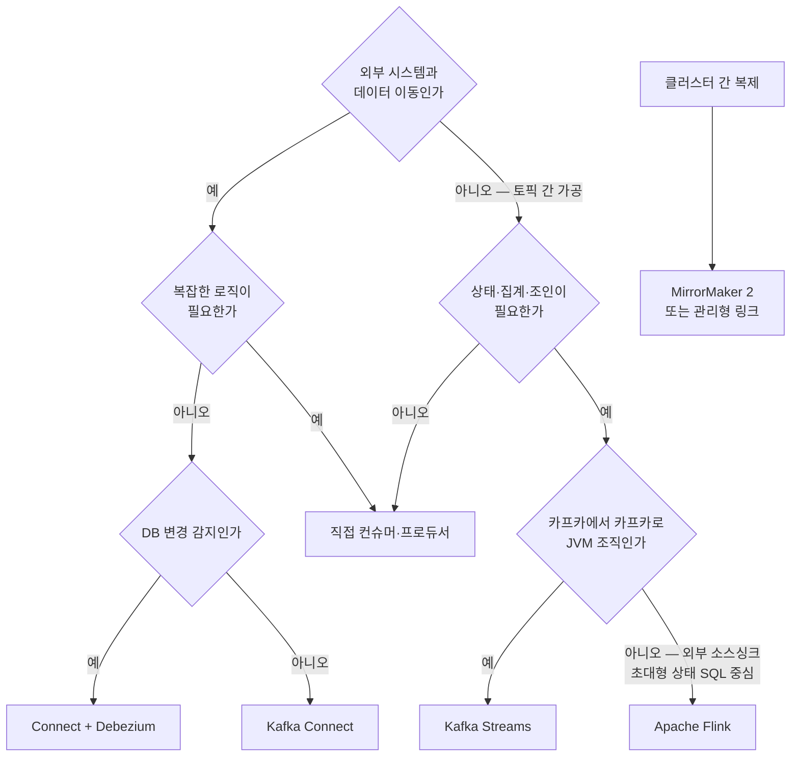

# 카프카 생태계 — Connect·CDC·Schema Registry·Streams

> 시리즈 07편. 브로커·프로듀서·컨슈머의 코어를 이해했다면(01~05편), 이제 그 위에 얹히는 생태계 도구를 다룬다.
> 이 편은 🟡 실무 난이도 위주다. 코어 개념(파티션, 컨슈머 그룹, 오프셋)은 [01-core-concepts.md](01-core-concepts.md)를 전제로 한다.

---

## 0. 왜 "생태계"가 필요한가 🟢

카프카 코어가 제공하는 것은 결국 두 가지 API뿐이다. **프로듀서 API**(쓰기)와 **컨슈머 API**(읽기). 그런데 실무에서 카프카를 쓰는 목적을 나열해 보면 대부분 이렇다.

1. "MySQL의 주문 테이블 변경을 카프카로 흘려보내고 싶다" — **데이터 통합**
2. "카프카의 이벤트를 Elasticsearch·S3·BigQuery에 넣고 싶다" — **데이터 통합**
3. "프로듀서 팀이 필드 하나 바꿨더니 컨슈머가 전부 죽었다" — **계약 관리**
4. "토픽의 이벤트를 집계·조인해서 다른 토픽으로 내보내고 싶다" — **스트림 처리**
5. "서울 클러스터의 데이터를 도쿄 클러스터로 복제하고 싶다" — **클러스터 간 복제**

이 다섯 가지를 전부 프로듀서/컨슈머 API로 직접 짜면 어떻게 되는가? 팀마다 "DB 폴링해서 카프카에 넣는 데몬", "카프카 읽어서 ES에 넣는 데몬"을 각자 만들고, 각자 오프셋 관리·재시도·장애 복구·스케일아웃을 재발명한다. 똑같은 바퀴를 회사 안에서 열 번 만드는 것이다.

카프카 생태계는 이 반복 패턴을 표준화한 레이어다.

| 문제 | 해결 도구 | 이 문서의 섹션 |
|---|---|---|
| 외부 시스템 ↔ 카프카 데이터 이동 | Kafka Connect | 1 |
| DB 변경분을 이벤트로 | CDC / Debezium (Connect 위에서 동작) | 2 |
| 프로듀서-컨슈머 간 데이터 계약 | Schema Registry | 3 |
| 토픽 → 가공 → 토픽 스트림 처리 | Kafka Streams | 4 |
| SQL로 스트림 처리 | ksqlDB | 5 |
| 클러스터 간 복제 | MirrorMaker 2 (역시 Connect 기반) | 6 |

비유하자면 카프카 코어는 **고속도로**다. 생태계 도구는 그 위의 **화물 터미널(Connect)**, **세관·표준 규격 팔레트(Schema Registry)**, **도로 위에서 바로 조립하는 이동식 공장(Streams)** 이다. 고속도로만 깔아 놓으면 화물이 알아서 실리지 않는다. 비유의 한계: 실제로는 이 도구들이 전부 "카프카의 클라이언트"일 뿐이라는 점이다. Connect도 Streams도 브로커 입장에선 그냥 프로듀서/컨슈머다. 브로커에 특별한 플러그인을 설치하는 게 아니다. 이 사실이 운영 관점에서 중요하다 — 생태계 도구의 장애는 브로커 장애가 아니고, 브로커 튜닝([06-operations-and-tuning.md](06-operations-and-tuning.md))과 별개로 각 도구를 따로 운영해야 한다.

또 하나 짚을 점: Schema Registry, ksqlDB, 커넥터 상당수는 **Apache Kafka 프로젝트가 아니라** Confluent 등 외부 프로젝트다. Apache Kafka 본체에 포함된 것은 Connect 프레임워크, Streams 라이브러리, MirrorMaker 2뿐이다. 라이선스(Confluent Community License 등)와 벤더 종속성을 도입 전에 확인해야 한다.

---

## 1. Kafka Connect — 코드 없이 파이프라인 🟡

### 1.1 어떤 문제를 푸는가

"MySQL → Kafka → Elasticsearch" 파이프라인을 직접 구현한다고 하자. 필요한 것들:

- DB에서 데이터를 읽는 로직 + **어디까지 읽었는지 오프셋 관리**
- 카프카에 쓰는 프로듀서 + 직렬화
- 장애 시 **재시작 후 이어서 처리**
- 처리량이 늘면 **여러 인스턴스로 분산**
- 실패 레코드 처리(버릴지, 별도 보관할지)
- 이 모든 것의 모니터링

핵심 관찰: 이 목록에서 **비즈니스 고유 로직은 하나도 없다**. 전부 인프라 배관(plumbing)이다. Kafka Connect는 이 배관을 프레임워크로 제공하고, 시스템별 차이(MySQL 읽는 법, ES에 쓰는 법)만 **커넥터(connector) 플러그인**으로 꽂는 구조다. 사용자는 JSON 설정만 작성한다 — 이것이 "코드 없이 파이프라인"의 의미다.

### 1.2 소스 커넥터와 싱크 커넥터 🟢

- **소스 커넥터(source connector)**: 외부 시스템 → 카프카. 내부적으로 프로듀서로 동작. 예: JDBC Source, Debezium.
- **싱크 커넥터(sink connector)**: 카프카 → 외부 시스템. 내부적으로 컨슈머 그룹으로 동작. 예: Elasticsearch Sink, S3 Sink, JDBC Sink.

싱크 커넥터는 진짜 컨슈머 그룹이다. `connect-{커넥터이름}` 형태의 그룹 ID로 브로커에 등록되고, 컨슈머 랙 모니터링도 일반 컨슈머와 동일하게 한다. 소스 커넥터의 오프셋(외부 시스템의 "어디까지 읽었나" — 예: binlog 위치)은 브로커의 `__consumer_offsets`가 아니라 Connect가 관리하는 별도 토픽에 저장된다(아래 1.4).

### 1.3 커넥터 — 태스크 — 워커 구조 🟡

Connect의 실행 모델은 3계층이다. 용어가 비슷해서 처음엔 헷갈리는데, 역할이 명확히 다르다.

| 계층 | 무엇인가 | 비유 |
|---|---|---|
| **워커(worker)** | Connect 프레임워크를 실행하는 JVM 프로세스. 물리적 실행 단위 | 공장 건물 |
| **커넥터(connector)** | "무엇을 어떻게 옮길지"의 논리적 정의 + 작업 분할 계획 수립 | 작업 반장 — 일을 나누는 사람 |
| **태스크(task)** | 실제 데이터를 옮기는 스레드. 병렬성의 단위 | 작업자 |

커넥터 인스턴스 자체는 데이터를 옮기지 않는다. 커넥터는 "이 작업을 몇 개의 태스크로 어떻게 나눌지"를 계산하는 역할이다. 예를 들어 JDBC 소스 커넥터에 테이블 10개를 지정하고 `tasks.max=4`로 설정하면, 커넥터가 테이블들을 4개 태스크에 분배한다. 싱크라면 토픽 파티션들이 태스크에 분배된다(컨슈머 그룹의 파티션 할당과 동일한 원리 — [05-consumer-deep-dive.md](05-consumer-deep-dive.md)).



핵심: **태스크는 워커들에 분산 배치된다.** 커넥터 정의는 한 곳에 있지만 태스크는 클러스터 전체에 퍼진다. 워커가 죽으면 그 워커의 태스크들이 남은 워커로 **리밸런싱**된다. Connect는 2.3부터 **점진적 협력 리밸런싱(incremental cooperative rebalancing)** 을 사용해, 워커 하나가 죽어도 전체 태스크가 멈추지 않고 영향받은 태스크만 재배치된다.

### 1.4 독립 모드 vs 분산 모드 🟡

| | 독립 모드 standalone | 분산 모드 distributed |
|---|---|---|
| 워커 수 | 1 | N (같은 `group.id`로 클러스터 구성) |
| 설정 방법 | 프로퍼티 파일 | REST API (`POST /connectors`) |
| 오프셋 저장 | 로컬 파일 | 카프카 내부 토픽 |
| 장애 복구 | 없음(프로세스 죽으면 끝) | 자동 태스크 재배치 |
| 용도 | 개발·테스트 | 운영 전부 |

분산 모드의 워커들은 상태를 **카프카 자체에** 저장한다. 별도 DB가 필요 없다:

- `config.storage.topic` — 커넥터 설정 (파티션 1개, compacted 필수)
- `offset.storage.topic` — 소스 커넥터의 소스 오프셋
- `status.storage.topic` — 커넥터/태스크 상태

즉 Connect 워커는 완전한 무상태(stateless) 프로세스다. 아무 워커나 죽이고 새로 띄워도 카프카에서 상태를 복원한다. 쿠버네티스에 올리기 좋은 이유다. 이 토픽들이 compaction으로 관리되는 원리는 [02-storage-internals.md](02-storage-internals.md) 참조.

운영 인터페이스는 REST API다(기본 8083 포트):

```bash
# 커넥터 생성
curl -X POST localhost:8083/connectors -H "Content-Type: application/json" -d '{
  "name": "es-sink-orders",
  "config": {
    "connector.class": "io.confluent.connect.elasticsearch.ElasticsearchSinkConnector",
    "topics": "orders",
    "tasks.max": "3",
    "connection.url": "http://es:9200"
  }
}'
# 상태 확인 / 태스크 재시작
curl localhost:8083/connectors/es-sink-orders/status
curl -X POST localhost:8083/connectors/es-sink-orders/tasks/0/restart
```

### 1.5 컨버터와 SMT — 데이터는 어디서 변환되는가 🟡

Connect 파이프라인에서 레코드는 세 단계를 거친다. 이 구분을 모르면 설정 지옥에 빠진다.

```
외부 시스템 → [커넥터] → 내부 표현 → [SMT 체인] → 내부 표현 → [컨버터] → byte[] → 카프카
```

- **커넥터**: 외부 시스템 프로토콜 ↔ Connect 내부 표현(스키마 있는 구조체) 변환.
- **SMT(Single Message Transform)**: 내부 표현 상태에서 메시지 **한 건 단위**의 가벼운 변형. 필드 마스킹, 필드 추출, 토픽 이름 변경, 타임스탬프 추가 등. 체인으로 연결 가능.
- **컨버터(converter)**: 내부 표현 ↔ 카프카에 실제 저장되는 바이트 배열 변환. `JsonConverter`, `AvroConverter`, `ProtobufConverter` 등. **직렬화 포맷을 결정하는 것은 커넥터가 아니라 컨버터다.** 같은 Debezium 커넥터라도 컨버터 설정에 따라 JSON으로도 Avro로도 나간다.

```properties
# 워커 또는 커넥터 단위로 설정
key.converter=org.apache.kafka.connect.storage.StringConverter
value.converter=io.confluent.connect.avro.AvroConverter
value.converter.schema.registry.url=http://schema-registry:8081

# SMT 예: 개인정보 마스킹 후 토픽명 변경
transforms=mask,route
transforms.mask.type=org.apache.kafka.connect.transforms.MaskField$Value
transforms.mask.fields=phone_number
transforms.route.type=org.apache.kafka.connect.transforms.RegexRouter
transforms.route.regex=mysql\.shop\.(.*)
transforms.route.replacement=cdc.$1
```

SMT의 함정: **한 건 단위 변형만** 가능하다. 조인·집계·여러 메시지에 걸친 로직은 불가능하다. SMT에 무거운 로직(외부 API 호출 등)을 넣으면 파이프라인 전체 처리량이 무너진다. 그런 로직이 필요하면 Streams(섹션 4)로 별도 처리 단계를 두는 것이 정석이다.

### 1.6 에러 처리와 DLQ 🟡

싱크 커넥터에서 역직렬화 실패나 변환 실패가 나면 기본 동작은 **태스크 정지(fail fast)** 다. 운영에서는 보통 이렇게 완화한다:

```properties
errors.tolerance=all
errors.deadletterqueue.topic.name=dlq-es-sink-orders
errors.deadletterqueue.context.headers.enable=true
```

실패 레코드를 데드 레터 큐(dead letter queue, DLQ) 토픽으로 보내고 파이프라인은 계속 흐르게 한다. 헤더에 실패 원인·원본 토픽·파티션·오프셋이 기록된다. 함정: DLQ는 **싱크 커넥터의 컨버터/변환 단계 실패**에만 적용된다. 외부 시스템 쓰기 실패(ES가 죽었다든가)는 커넥터 자체의 재시도 정책 영역이고, 소스 커넥터에는 DLQ 개념이 기본 제공되지 않는다.

### 1.7 전달 보장 🟡

- **싱크**: 기본 at-least-once. 태스크 재시작 시 마지막 커밋 오프셋부터 다시 읽으므로 중복이 가능하다. ES처럼 문서 ID 기반 upsert가 되는 싱크는 사실상 멱등이라 실무 문제로 이어지지 않는 경우가 많다.
- **소스**: 역시 기본 at-least-once. Kafka 3.3+(KIP-618)부터 `exactly.once.source.support=enabled`로 소스 커넥터에 트랜잭션 기반 exactly-once가 지원된다(커넥터가 지원해야 함). 트랜잭션 원리는 [04-producer-deep-dive.md](04-producer-deep-dive.md) 참조.

### 1.8 "코드 없이"의 한계 — 언제 Connect를 쓰면 안 되는가 🟡

Connect가 만능이 아니다. 다음 신호가 보이면 직접 컨슈머/프로듀서를 짜는 게 낫다.

1. **복잡한 비즈니스 로직이 필요할 때.** SMT는 한 건 단위 변형까지다. "주문 이벤트를 받아서 재고를 확인하고 결제 API를 부른다"는 Connect의 영역이 아니라 애플리케이션의 영역이다.
2. **커넥터가 없는 시스템.** 커스텀 커넥터 개발은 가능하지만, 프레임워크 학습 비용을 생각하면 사내 전용 시스템 하나 때문이라면 그냥 컨슈머를 짜는 게 싸게 먹히는 경우가 많다.
3. **설정 지옥.** "코드가 없다"는 말은 "로직이 없다"가 아니라 "로직이 JSON 설정과 SMT 체인으로 이동했다"에 가깝다. SMT가 7~8개 체인으로 이어진 커넥터 설정은 코드보다 읽기 어렵고 테스트도 어렵다.
4. **운영 부담은 존재한다.** Connect 클러스터라는 새로운 분산 시스템을 하나 더 운영하는 것이다. 커넥터 플러그인 버전 관리, 워커 힙 튜닝, 리밸런싱 스톰 대응은 온전히 운영자의 몫이다.

정리하면 Connect의 적정 영역은 **"양쪽 끝이 잘 알려진 시스템이고, 중간 변형이 가벼운 데이터 이동"** 이다.

---

## 2. CDC와 Debezium — DB의 변경 로그를 카프카로 🟡

### 2.1 왜 CDC인가 — 폴링의 한계 🟢

"DB 데이터를 카프카로 보내라"는 요구의 1차원적 해법은 폴링이다: `SELECT * FROM orders WHERE updated_at > ?`를 주기적으로 실행한다(JDBC Source Connector가 이 방식이다). 문제가 많다.

- **삭제를 감지할 수 없다.** 사라진 행은 쿼리에 안 나온다.
- **중간 상태를 놓친다.** 폴링 주기 사이에 A→B→C로 바뀌면 B는 영원히 못 본다.
- **`updated_at` 컬럼에 의존한다.** 컬럼이 없거나 갱신을 빼먹는 코드가 하나라도 있으면 유실이다.
- **DB에 부하를 준다.** 주기가 짧을수록 풀스캔성 쿼리가 잦아진다.

**CDC(Change Data Capture, 변경 데이터 캡처)** 는 접근을 뒤집는다. 모든 관계형 DB는 복구·복제를 위해 **모든 변경을 순서대로 기록한 로그**를 이미 갖고 있다 — MySQL의 binlog, PostgreSQL의 WAL(Write-Ahead Log), MongoDB의 oplog. CDC는 이 로그를 구독한다. 즉 DB의 **복제 프로토콜에 레플리카인 척 접속**해서 변경 스트림을 받아낸다.

- 삭제도 로그에 남으므로 감지된다.
- 모든 중간 상태가 순서대로 잡힌다.
- 테이블 스키마에 아무 요구를 하지 않는다.
- 쿼리 부하가 없다. 레플리카 하나가 늘어난 정도의 부하다.

카프카의 로그 중심 철학([00-why-kafka.md](00-why-kafka.md))과 정확히 맞물린다. **DB의 내부 로그를 카프카라는 외부 로그로 옮기는 것**이 CDC다.

### 2.2 Debezium 구조 🟡

**Debezium(디비지움)** 은 CDC의 사실상 표준 오픈소스다. 본질적으로 **Kafka Connect의 소스 커넥터 모음**이다(MySQL, PostgreSQL, MongoDB, SQL Server, Oracle 등). 즉 섹션 1의 인프라(분산 실행, 오프셋 관리, 장애 복구)를 그대로 상속받는다. Debezium이 관리하는 "소스 오프셋"은 binlog 파일명+위치(MySQL) 또는 LSN(PostgreSQL)이다.



기본적으로 **테이블 하나당 토픽 하나**가 생기고(`{서버명}.{DB명}.{테이블명}`), 메시지 키는 해당 행의 PK다. 같은 행의 변경은 같은 파티션으로 가므로 행 단위 순서가 보장된다([01-core-concepts.md](01-core-concepts.md)의 키 파티셔닝).

이벤트 페이로드는 변경의 전후 상태를 담은 **엔벨로프(envelope)** 구조다:

```json
{
  "before": { "id": 1001, "status": "PENDING" },
  "after":  { "id": 1001, "status": "PAID" },
  "source": { "connector": "mysql", "ts_ms": 1755500000000, "file": "binlog.000042", "pos": 1234 },
  "op": "u",
  "ts_ms": 1755500000123
}
```

`op`는 c(생성)/u(수정)/d(삭제)/r(스냅샷 읽기). 삭제 이벤트 뒤에는 값이 null인 **툼스톤(tombstone)** 메시지가 따라와서, compacted 토픽에서 해당 키가 정리될 수 있게 한다.

주의할 전제 조건: MySQL은 `binlog_format=ROW`가 필수다(STATEMENT 포맷은 실행된 SQL문만 남기므로 행 단위 변경을 알 수 없다). PostgreSQL은 `wal_level=logical`과 논리 디코딩 플러그인(`pgoutput`)·복제 슬롯(replication slot)이 필요하다. **PostgreSQL 복제 슬롯의 함정**: 커넥터가 오래 멈춰 있으면 슬롯이 WAL 정리를 막아 디스크가 차오른다. 커넥터를 폐기할 때 슬롯 삭제를 잊으면 장애로 이어진다.

### 2.3 스냅샷과 스트리밍 🟡

커넥터를 처음 붙이는 시점에 binlog에는 최근 변경만 남아 있다(보통 며칠 치). 기존 데이터 전체는 어떻게 하나? Debezium은 두 단계로 동작한다.

1. **스냅샷(snapshot) 단계**: 현재 테이블 전체를 읽어 `op: "r"` 이벤트로 내보낸다. 이때 binlog상의 현재 위치를 기록해 둔다.
2. **스트리밍(streaming) 단계**: 기록해 둔 위치부터 binlog를 실시간으로 따라간다.

`snapshot.mode` 설정으로 제어한다: `initial`(기본 — 최초 1회 스냅샷 후 스트리밍), `no_data`(스냅샷 생략, 지금부터의 변경만), `when_needed`(오프셋이 유실됐을 때만) 등.

대형 테이블의 함정: 수억 행 테이블의 초기 스냅샷은 몇 시간씩 걸리고, 구버전에서는 그동안 스트리밍이 시작되지 못했다. 이를 해결한 것이 **증분 스냅샷(incremental snapshot)** 이다 — 시그널(signal) 테이블에 명령을 INSERT하면, 테이블을 PK 순 청크로 나눠 읽으면서 **스트리밍과 병행**한다. 청크 읽기와 실시간 변경이 겹치는 구간은 워터마크 기법으로 중복 제거한다. 운영 중 특정 테이블만 재스냅샷할 때도 이 방식을 쓴다.

### 2.4 대표 사용처 🟡

1. **검색 인덱스 동기화**: 상품 테이블 변경 → Elasticsearch. "DB에 쓰고 ES에도 쓰는" 이중 쓰기(dual write)의 정합성 문제를 제거한다.
2. **캐시 무효화**: 행 변경 이벤트로 Redis 캐시를 키 단위로 정확히 무효화.
3. **데이터 웨어하우스 실시간 적재**: 일 배치 ETL을 분 단위 지연의 스트리밍으로 대체.
4. **모놀리스 해체(strangler pattern)**: 레거시 DB의 변경을 이벤트로 뽑아 신규 마이크로서비스가 구독. 레거시 코드를 건드리지 않고 데이터를 해방시킨다.
5. **아웃박스 패턴(outbox pattern)**: "DB 트랜잭션 커밋과 카프카 발행을 원자적으로" 하고 싶을 때, 이벤트를 같은 트랜잭션으로 outbox 테이블에 INSERT하고 Debezium이 그 테이블을 카프카로 중계한다. 이중 쓰기 문제의 정석적 해법이며 [08-architecture-patterns.md](08-architecture-patterns.md)에서 자세히 다룬다.

CDC의 본질적 한계도 알아야 한다: 이벤트가 **"행이 이렇게 바뀌었다"** 이지 **"주문이 결제되었다"** 가 아니라는 점이다. 행 변경 이벤트는 테이블 스키마에 결합된 저수준 이벤트라서, 도메인 이벤트가 필요한 곳에 CDC 이벤트를 그대로 노출하면 DB 스키마가 전사 공개 API가 되어 버린다. 그래서 도메인 이벤트가 필요하면 아웃박스 패턴(의도를 담은 이벤트를 발행)이 권장된다.

---

## 3. Schema Registry — 프로듀서와 컨슈머의 계약 🟡

### 3.1 스키마 없는 카프카의 위험 🟢

카프카 브로커에게 메시지는 그냥 바이트 배열이다. 브로커는 내용을 검사하지 않는다([02-storage-internals.md](02-storage-internals.md)). 그러면 "이 토픽의 메시지가 어떤 구조인가"는 누가 보장하는가? **아무도 안 한다.** 프로듀서와 컨슈머 사이의 **암묵적 계약**만 있을 뿐이다.

이 암묵 계약은 조용히 깨진다. 전형적 사고 시나리오:

1. 주문팀(프로듀서)이 `orderAmount` 필드명을 `amount`로 리팩터링해서 배포한다.
2. 정산팀(컨슈머)은 이 사실을 모른다. 컨슈머는 `orderAmount`를 읽으려다 null/파싱 오류.
3. 최악의 경우 예외가 아니라 **0으로 처리되어 조용히 잘못된 정산**이 흘러간다.
4. 게다가 토픽에는 신·구 포맷 메시지가 섞여서 남아 있다. 컨슈머를 고쳐도 과거분 재처리가 다시 문제가 된다.

REST API라면 이런 변경은 컴파일 오류나 계약 테스트에서 잡힌다. 카프카는 프로듀서와 컨슈머가 시간적으로도 분리되어 있어(토픽에 며칠 치 데이터가 쌓여 있다) 더 위험하다. **Schema Registry(스키마 레지스트리)** 는 이 계약을 명시적으로 만들고, 계약을 깨는 배포를 **프로듀서가 쓰는 시점에** 차단하는 장치다.

구현체는 Confluent Schema Registry가 사실상 표준이고(Confluent Community License), Aiven의 Karapace(오픈소스 호환 구현), AWS Glue Schema Registry 등이 있다. 이하 설명은 Confluent 구현 기준이다.

### 3.2 동작 원리와 와이어 포맷 🟡

핵심 아이디어: **스키마 본문을 매 메시지에 싣지 말고, 중앙 저장소에 등록한 뒤 ID만 싣는다.**



카프카에 실제 저장되는 **와이어 포맷(wire format)** 은 다음과 같다:

```
[ 매직 바이트 0x00 | 스키마 ID 4바이트 빅엔디안 | 직렬화된 페이로드 ]
```

- 오버헤드는 메시지당 딱 5바이트다. 스키마 본문(수 KB)을 매번 싣는 JSON 대비 크게 작다.
- 매직 바이트는 와이어 포맷 버전 표식이다. 이 5바이트 헤더 때문에 **레지스트리 직렬화기를 쓴 메시지를 일반 역직렬화기로 읽으면 깨진다**(앞 5바이트가 페이로드로 해석됨). 반대도 마찬가지다. "Avro인데 왜 안 읽히지"의 90%는 이 헤더 유무 불일치다.
- 프로듀서·컨슈머 모두 스키마를 로컬 캐시하므로, 정상 상태에서 레지스트리는 데이터 경로(hot path)에 있지 않다. 레지스트리가 잠깐 죽어도 이미 캐시된 스키마로는 계속 흐른다. 단, **새 스키마의 첫 등록/조회는 실패**하므로 배포 타이밍과 겹치면 장애가 된다.
- 레지스트리 자체의 저장소는 카프카다. `_schemas`라는 compacted 토픽에 모든 스키마가 저장되고, 레지스트리 인스턴스는 이를 읽어 메모리에 올린 캐시일 뿐이다. 그래서 레지스트리도 무상태로 수평 확장된다.

**서브젝트(subject)** 는 호환성 검사의 단위다. 기본 전략인 `TopicNameStrategy`는 `{토픽명}-value`, `{토픽명}-key`를 서브젝트로 쓴다 — 즉 "토픽당 스키마 하나"가 기본 가정이다. 한 토픽에 여러 이벤트 타입을 넣어야 하면 `RecordNameStrategy` 또는 `TopicRecordNameStrategy`로 바꾼다([08-architecture-patterns.md](08-architecture-patterns.md)의 이벤트 타입 설계와 연결).

### 3.3 포맷 선택 — Avro vs Protobuf vs JSON Schema 🟡

레지스트리는 세 포맷을 지원한다.

| | Avro | Protobuf | JSON Schema |
|---|---|---|---|
| 인코딩 | 바이너리, 필드명 미포함 — 가장 작음 | 바이너리, 필드 번호 태그 포함 | 텍스트 JSON — 가장 큼 |
| 스키마 진화 | 필드명 기반. 기본값 있는 필드 추가·삭제 자유로움 | 필드 번호 기반. 번호 재사용 금지 규칙 | 제약 기반이라 진화 규칙이 직관적이지 않음 |
| 언어 지원 | JVM 최강, 그 외 편차 | 전 언어 고르게 우수, gRPC와 공유 가능 | 전 언어 |
| 생태계 궁합 | 카프카 생태계의 전통적 기본값. Connect·Debezium 궁합 최상 | gRPC 쓰는 조직이면 스키마 단일화 이점 | 사람이 읽을 수 있어 디버깅 쉬움 |

경험칙: 카프카 중심 데이터 플랫폼이면 **Avro**, 사내 표준이 이미 gRPC/Protobuf면 **Protobuf**, 외부 파트너와의 경계 토픽처럼 가독성이 중요하면 **JSON Schema**. 어떤 포맷이든 "레지스트리로 강제되는 명시적 스키마"라는 본질이 포맷 선택보다 중요하다.

### 3.4 호환성 모드와 진화 전략 🟡

스키마는 반드시 바뀐다. 문제는 "바뀌어도 되는 방향"을 정하는 것이다. 호환성 모드는 **새 스키마가 등록될 때 무엇을 검사할지**를 정의한다.

| 모드 | 보장 | 허용되는 변경 — Avro 기준 | 먼저 배포해야 하는 쪽 |
|---|---|---|---|
| `BACKWARD` (기본값) | **새 스키마로 옛 데이터를 읽을 수 있다** | 필드 삭제, 기본값 있는 필드 추가 | **컨슈머 먼저** |
| `FORWARD` | 옛 스키마로 새 데이터를 읽을 수 있다 | 필드 추가, 기본값 있는 필드 삭제 | 프로듀서 먼저 |
| `FULL` | 양방향 모두 | 기본값 있는 필드의 추가·삭제만 | 순서 무관 |
| `NONE` | 검사 안 함 | 전부 | — 사실상 레지스트리를 버전 저장소로만 쓰는 것 |
| `*_TRANSITIVE` | 직전 버전만이 아니라 **역대 전체 버전**과 검사 | 위와 동일하되 전체 이력 대상 | |

암기법이 아니라 원리로 이해하자. **"읽는 쪽 스키마 기준으로, 없는 필드는 기본값으로 채울 수 있어야 한다"** 가 전부다.

- BACKWARD가 기본값인 이유: 카프카에서는 **토픽에 옛 데이터가 남아 있는 것**이 통상 상황이기 때문이다. 컨슈머를 최신 스키마로 재배포하고 과거분을 재처리하는 시나리오(replay)가 성립하려면 "새 스키마로 옛 데이터 읽기"가 보장되어야 한다.
- FORWARD가 필요한 경우: 컨슈머 팀들이 많고 업데이트가 느린 조직에서, 프로듀서가 먼저 필드를 추가해도 옛 컨슈머들이 깨지지 않아야 할 때.
- FULL + TRANSITIVE는 가장 안전하지만 허용 변경이 좁다. 전사 공용 토픽은 `FULL_TRANSITIVE`, 팀 내부 토픽은 `BACKWARD` 정도가 흔한 타협이다.
- TRANSITIVE가 아닌 기본 모드는 **직전 버전 하고만** 비교한다는 함정: v1→v2 호환, v2→v3 호환이어도 v1→v3이 비호환일 수 있다. 토픽 보존 기간이 길거나 compacted 토픽이면(아주 오래된 스키마의 메시지가 살아 있음) TRANSITIVE를 진지하게 고려해야 한다.

실무 진화 절차의 예 — `BACKWARD`에서 필드명을 바꾸고 싶다면(비호환 변경이다):

1. 새 필드를 기본값과 함께 **추가**하고, 옛 필드는 남겨둔 채 양쪽에 값을 쓴다(v2).
2. 모든 컨슈머가 새 필드를 읽도록 이전한다.
3. 옛 필드를 **삭제**한다(v3). BACKWARD에서 필드 삭제는 허용된다.

즉 비호환 변경은 "금지"가 아니라 **여러 단계의 호환 변경으로 분해**하는 것이다. 그래도 안 되면 새 토픽(`orders-v2`)으로 갈아타는 것이 마지막 수단이다.

---

## 4. Kafka Streams — 토픽에서 토픽으로, 라이브러리로 🟡

### 4.1 어떤 문제를 푸는가 🟢

"orders 토픽을 읽어, 5분 단위로 지역별 매출을 집계해, region-sales 토픽으로 내보내라." 일반 컨슈머로 짜 보면 바로 벽에 부딪힌다.

- 집계하려면 **상태**(지역별 누적값)가 필요하다. 어디에 두나? 인스턴스 메모리에 두면 죽을 때 날아가고, 리밸런싱으로 파티션이 다른 인스턴스로 가면 상태와 파티션이 어긋난다.
- "5분 단위"의 5분은 **어느 시계** 기준인가? 메시지가 늦게 도착하면?
- "지역별"로 집계하려면 같은 지역이 같은 인스턴스에 모여야 한다. 그런데 orders 토픽은 주문 ID로 파티셔닝되어 있다면?

**Kafka Streams(카프카 스트림즈)** 는 이 문제들(상태 관리, 시간 처리, 재파티셔닝, 장애 복구)을 프레임워크가 떠안는 **자바 라이브러리**다. 가장 중요한 특징이 이것이다 — **별도 클러스터가 없다.** Flink나 Spark처럼 잡을 제출할 클러스터를 운영하는 게 아니라, 일반 스프링 부트 앱에 의존성 하나 넣고 배포하면 그게 스트림 처리 애플리케이션이다. 스케일아웃은 같은 `application.id`의 인스턴스를 더 띄우면 되고, 인스턴스 간 작업 분배는 컨슈머 그룹 리밸런싱([05-consumer-deep-dive.md](05-consumer-deep-dive.md))이 그대로 담당한다.

### 4.2 토폴로지 🟡

Streams 애플리케이션은 **토폴로지(topology)** — 프로세서들의 방향 그래프 — 를 선언하고 실행한다.

```java
StreamsBuilder builder = new StreamsBuilder();

KStream<String, Order> orders = builder.stream("orders");

orders
    .filter((k, order) -> order.status() == PAID)                  // 무상태
    .selectKey((k, order) -> order.region())                       // 키 변경 → 재파티셔닝 유발
    .groupByKey()
    .windowedBy(TimeWindows.ofSizeAndGrace(
        Duration.ofMinutes(5), Duration.ofMinutes(1)))             // 5분 텀블링 + 유예 1분
    .aggregate(SalesAgg::empty, (region, order, agg) -> agg.add(order.amount()))  // 상태 필요
    .toStream()
    .to("region-sales");
```



여기서 두 가지 내부 동작이 자동으로 일어난다.

- **재파티셔닝(repartition)**: `selectKey` 후 `groupByKey`를 하면, 같은 지역이 같은 파티션에 모여야 하므로 Streams가 **내부 재파티션 토픽**을 만들어 새 키로 다시 쓰고 다시 읽는다. 편하지만 공짜가 아니다 — 카프카 왕복이 한 번 늘어난다. 토폴로지에 불필요한 키 변경이 있으면 재파티션 토픽이 줄줄이 생겨 지연·비용이 늘어난다.
- **태스크 분할**: 토폴로지는 입력 파티션 수만큼의 태스크로 쪼개져 인스턴스들에 분배된다. 최대 병렬성 = 입력 토픽 파티션 수. 파티션 수 설계([06-operations-and-tuning.md](06-operations-and-tuning.md))가 Streams 처리량 상한을 결정한다.

### 4.3 KStream / KTable 이중성 🟡

Streams의 개념적 핵심이다. 같은 데이터를 두 관점으로 볼 수 있다.

- **KStream**: **이벤트의 흐름**. 각 레코드는 독립적인 사실(fact)이다. "주문 1001이 발생했다", "주문 1002가 발생했다" — 둘 다 유효하다.
- **KTable**: **키별 최신 상태**. 각 레코드는 해당 키의 갱신(update)이다. "고객 A의 주소는 X다"가 오면 이전 주소는 의미를 잃는다.

**스트림-테이블 이중성(stream-table duality)**: 테이블은 스트림의 압축이고(키별 마지막 값만 남김 — compacted 토픽과 정확히 동일한 아이디어, [02-storage-internals.md](02-storage-internals.md)), 스트림은 테이블의 변경 이력이다(CDC가 하는 일이 바로 이것이다). 즉 `KTable = 스트림을 키로 접은 것`, `KStream = 테이블의 changelog`. RDB에서 테이블과 그 redo 로그의 관계와 같다.

실무 감각:

- 주문·클릭·로그 이벤트 → KStream
- 고객 프로필·상품 정보·환율 등 "현재 값"이 의미 있는 것 → KTable (Debezium CDC 토픽을 KTable로 읽는 조합이 매우 흔하다)
- 조인의 의미도 달라진다. KStream-KTable 조인은 "이벤트에 현재 상태를 붙이는 것"(주문 이벤트 + 고객 등급 룩업), KStream-KStream 조인은 "시간 윈도우 안에서 두 이벤트를 맞추는 것"(클릭과 결제를 30분 내 매칭)이다.
- **GlobalKTable**: 일반 KTable 조인은 양쪽이 같은 키·같은 파티션 수여야 하지만(co-partitioning 요구), GlobalKTable은 전체 데이터를 모든 인스턴스에 복제해 이 제약을 없앤다. 작은 참조 데이터(코드 테이블 등) 전용이다.

### 4.4 상태 저장소와 changelog 토픽 🟡

집계·조인·윈도우는 상태가 필요하다. Streams의 상태는 이렇게 관리된다.

1. 상태는 각 인스턴스 **로컬의 RocksDB**(임베디드 키-값 저장소)에 저장된다. 로컬이므로 조회가 네트워크 없이 빠르고, 상태 크기가 힙이 아니라 디스크에 제한된다.
2. 모든 상태 변경은 동시에 **changelog 토픽**(내부 생성, compacted)에 기록된다.
3. 인스턴스가 죽으면 그 태스크를 넘겨받은 인스턴스가 **changelog 토픽을 처음부터 재생**해 RocksDB를 복원한 뒤 처리를 재개한다.

즉 로컬 상태는 캐시이고, **진실의 원천은 카프카 자신**이다. 카프카가 카프카의 백업 저장소인 셈이다. 우아하지만 함정이 있다 — **복원 시간**. 상태가 수십 GB면 changelog 재생에 수십 분이 걸리고 그동안 해당 파티션 처리가 멈춘다. 완화책이 `num.standby.replicas`다: 다른 인스턴스가 changelog를 미리 따라 읽는 대기 복제본을 유지해, 장애 시 복원을 거의 즉시로 만든다. 상태가 큰 운영 앱에서는 1 이상이 사실상 필수다.

부가 기능으로 **대화형 쿼리(interactive query)** 가 있다: 상태 저장소를 REST 등으로 직접 조회해, 별도 DB 없이 "현재 집계값 API"를 만들 수 있다.

### 4.5 시간과 윈도잉 🔴

스트림 처리에서 가장 어려운 주제다. "5분간의 집계"에서 시간은 세 가지가 있다.

- **이벤트 시간(event time)**: 사건이 실제 발생한 시각. 보통 프로듀서가 찍은 레코드 타임스탬프.
- **처리 시간(processing time)**: Streams 앱이 그 레코드를 처리하는 시각.
- (로그 추가 시간 log append time: 브로커가 받은 시각 — 토픽 설정 `message.timestamp.type`에 따라 레코드 타임스탬프가 이것일 수도 있다.)

둘이 왜 다른가? 모바일 앱이 오프라인 상태에서 발생한 이벤트를 1시간 뒤에 전송하면, 이벤트 시간은 14:00인데 처리 시간은 15:00이다. **처리 시간 기준 집계는 재처리할 때마다 결과가 달라진다**(오늘 재생하면 전부 "오늘" 윈도우에 들어가 버린다). 그래서 Streams는 기본적으로 이벤트 시간 기준으로 동작하며, `TimestampExtractor`로 페이로드 내부 필드를 시간으로 쓸 수도 있다.

윈도우 종류:

| 윈도우 | 정의 | 용도 |
|---|---|---|
| 텀블링 tumbling | 고정 크기, 겹침 없음 — 0에서 5분, 5분에서 10분 | 분 단위 매출 집계 |
| 호핑 hopping | 고정 크기, 일정 간격으로 겹침 — 5분 창을 1분마다 | 이동 평균 |
| 슬라이딩 sliding | 레코드 쌍의 시간 차 기준 | 근접 이벤트 조인 |
| 세션 session | 활동 사이 공백 gap 으로 경계 결정, 크기 가변 | 사용자 세션 분석 |

지각 데이터(late arrival) 처리: 이벤트 시간 기준이면 "14:00~14:05 윈도우"가 닫힌 뒤에도 14:03 이벤트가 도착할 수 있다. **유예 기간(grace period)** 동안은 윈도우를 다시 열어 결과를 갱신하고, 그 이후 도착분은 버린다. 여기서 중요한 사고 전환: Streams의 윈도우 결과는 "한 번 확정되는 값"이 아니라 **계속 갱신되는 KTable**이다. 다운스트림은 같은 윈도우 키의 갱신을 여러 번 받을 수 있고, 이를 전제로 설계해야 한다(예: 싱크에서 upsert). 최종값만 내보내고 싶으면 `suppress`로 윈도우 닫힘까지 방출을 억제한다 — 단 suppress는 유예 기간만큼의 지연을 감수하는 것이다.

### 4.6 exactly-once 처리 🔴

Streams의 처리 사이클은 "읽기 → 상태 변경 → 쓰기 → 오프셋 커밋"이다. 이 중간에 죽으면 재시작 후 같은 입력을 다시 처리해 **집계가 이중 반영**될 수 있다(at-least-once의 본질적 문제).

Streams는 설정 한 줄로 이를 해결한다:

```properties
processing.guarantee=exactly_once_v2
```

원리는 [04-producer-deep-dive.md](04-producer-deep-dive.md)의 트랜잭션이다: **출력 토픽 쓰기 + changelog 쓰기 + 오프셋 커밋(consumer offset도 결국 토픽 쓰기다)** 을 하나의 카프카 트랜잭션으로 묶는다. 전부 카프카에 쓰는 작업이기에 가능한 원자성이다. 죽으면 트랜잭션이 abort되고, 재처리 결과만 커밋된다. 다운스트림 컨슈머는 `isolation.level=read_committed`여야 abort된 중간 결과를 안 본다.

정확한 범위를 이해해야 한다. 이 보장은 **카프카 → 카프카 토폴로지 내부**에서만 성립한다. 토폴로지 안에서 외부 API를 호출하거나 DB에 직접 쓰는 부수 효과(side effect)는 트랜잭션 밖이며, 재처리 시 중복 실행된다. "카프카 밖 세계까지의 exactly-once"는 존재하지 않으며 싱크 측 멱등성으로 해결해야 한다는 원칙은 여기서도 유효하다. 비용도 있다: 트랜잭션 커밋 주기(`commit.interval.ms`, EOS에서 기본 100ms)마다 오버헤드가 있어 처리량이 다소 감소하고 종단 지연이 커밋 주기만큼 늘어난다.

`exactly_once_v2`는 Kafka 2.5+에서 도입된 개선판으로, 구버전(v1)이 태스크당 프로듀서를 만들던 것을 인스턴스당 프로듀서로 줄여 파티션이 많을 때의 오버헤드를 크게 낮췄다. 4.x 시대에는 v2만 쓰면 된다.

---

## 5. ksqlDB — SQL로 스트림 처리 🟡

**ksqlDB**는 Kafka Streams 위에 SQL 인터페이스를 얹은 이벤트 스트리밍 데이터베이스다(Confluent Community License). Streams의 개념이 그대로 SQL로 대응된다: KStream → `STREAM`, KTable → `TABLE`.

```sql
CREATE STREAM orders (order_id VARCHAR KEY, region VARCHAR, amount DECIMAL(10,2))
  WITH (KAFKA_TOPIC='orders', VALUE_FORMAT='AVRO');

CREATE TABLE region_sales AS
  SELECT region, SUM(amount) AS total
  FROM orders
  WINDOW TUMBLING (SIZE 5 MINUTES)
  GROUP BY region
  EMIT CHANGES;
```

이 `CREATE TABLE AS SELECT`는 일회성 쿼리가 아니라 **영구 쿼리(persistent query)** 다 — ksqlDB 서버 클러스터 위에서 Streams 토폴로지로 컴파일되어 계속 돈다. 쿼리는 두 종류다: **푸시 쿼리(push query)** 는 `EMIT CHANGES`로 결과 변경을 계속 스트리밍받고, **풀 쿼리(pull query)** 는 구체화된 테이블의 현재 값을 점 조회한다.

적정 사용처와 한계:

- **맞는 곳**: 필터링·라우팅·단순 집계·CDC 토픽 가공처럼 정형적인 파이프라인을 빠르게 세울 때. SQL만 아는 분석 엔지니어가 스트림 처리에 참여해야 할 때. Connect 커넥터 관리 기능도 내장되어 있어 소규모 파이프라인은 ksqlDB 하나로 완결할 수 있다.
- **안 맞는 곳**: 복잡한 분기·외부 호출·커스텀 상태 로직(UDF로 일부 보완되지만 한계가 뚜렷하다), 세밀한 성능 튜닝이 필요한 대규모 워크로드. SQL로 표현이 꼬이기 시작하면 그건 Streams(코드)로 내려가라는 신호다.
- **생태계 동향에 주의**: Confluent는 스트림 처리의 무게 중심을 Apache Flink(Confluent Cloud의 Flink 서비스)로 옮겼고, ksqlDB의 신규 기능 개발은 사실상 정체 상태다. 2026년 현재 신규 시스템에 ksqlDB를 채택하는 것은 신중해야 하며, SQL 기반 스트림 처리가 필요하면 Flink SQL이 더 미래가 안전한 선택지로 평가받는다.

---

## 6. MirrorMaker 2 — 클러스터 간 복제 🟡

복제(replication, [03-replication-and-controller.md](03-replication-and-controller.md))는 **클러스터 안** 브로커 간 이야기다. 그럼 **클러스터 사이** — 서울↔도쿄, 온프레미스↔클라우드, 운영↔DR — 복제는? Apache Kafka에 포함된 답이 **MirrorMaker 2(MM2)** 다.

MM2는 별도 시스템이 아니라 **Kafka Connect 커넥터 세트**다(전용 드라이버 모드로도 실행 가능):

- `MirrorSourceConnector`: 원본 클러스터의 토픽을 읽어 대상 클러스터에 쓴다. 토픽 설정(파티션 수, 정책)도 동기화한다.
- `MirrorCheckpointConnector`: 컨슈머 그룹의 **오프셋을 번역**한다. 같은 메시지라도 두 클러스터에서 오프셋 숫자가 다르므로(각자 독립적으로 쓰였기에), 원본의 커밋 오프셋을 대상 클러스터 기준 오프셋으로 매핑해 기록한다. 페일오버한 컨슈머가 "이어서" 읽을 수 있게 하는 핵심이다.
- `MirrorHeartbeatConnector`: 복제 경로의 생존·지연 모니터링용 하트비트.

기본 동작에서 복제된 토픽은 **클러스터 별칭 접두사**가 붙는다: 서울의 `orders`는 도쿄에서 `seoul.orders`가 된다. 이는 양방향(active-active) 복제 시 **무한 복제 루프를 방지**하기 위한 설계다 — `seoul.` 접두사가 이미 붙은 토픽은 서울로 되복제하지 않는다. 접두사가 싫으면 `IdentityReplicationPolicy`로 끌 수 있지만, 그 순간 루프 방지는 운영자 책임이 된다.

반드시 알아야 할 한계:

- **오프셋은 보존되지 않는다.** 복제본은 대상 클러스터에 "새로 쓰인" 메시지다. 오프셋 기반 로직이 있다면 체크포인트 번역에 의존해야 한다.
- **복제는 비동기다.** 페일오버 시점에 아직 안 넘어간 꼬리 데이터는 유실될 수 있다(RPO > 0). 순서는 파티션 단위로 유지되지만, 정확히 한 번 복제는 기본 보장이 아니다.
- 활성-활성 구성에서 같은 논리 토픽이 `orders`와 `tokyo.orders` 두 개가 되므로, 컨슈머가 둘 다 구독하도록 설계해야 한다.

관리형 환경(Confluent Cluster Linking, MSK Replicator 등)은 오프셋 보존 복제 같은 MM2의 한계를 완화한 대안을 제공한다. 멀티 리전 아키텍처 전반은 [08-architecture-patterns.md](08-architecture-patterns.md)에서 다룬다.

---

## 7. 언제 무엇을 쓰나 — 선택 가이드 🟡

### 7.1 데이터 이동: Connect vs 직접 컨슈머·프로듀서

| 상황 | 선택 | 이유 |
|---|---|---|
| DB·검색엔진·스토리지 등 잘 알려진 시스템 간 이동, 변형은 가벼움 | **Connect** | 검증된 커넥터 + 오프셋·재시도·분산이 공짜 |
| DB 변경 감지 | **Connect + Debezium** | 폴링의 근본 한계를 로그 구독으로 해결 |
| 메시지 처리에 비즈니스 로직·외부 호출·조건 분기가 필요 | **직접 컨슈머** | SMT의 한 건 변형 한계를 넘는 순간 Connect는 부적합 |
| 커넥터가 없는 사내 시스템 하나 연동 | 보통 **직접 구현** | 커스텀 커넥터 개발·운영 비용이 이득을 넘기 쉬움 |
| 대상 시스템으로의 전달 자체가 제품 기능 — 세밀한 에러 정책 필요 | **직접 구현** | Connect의 에러 모델(재시도·DLQ)로 부족할 때 |

### 7.2 스트림 처리: 단순 컨슈머 vs Kafka Streams vs Flink

| 기준 | 단순 컨슈머 | Kafka Streams | Apache Flink |
|---|---|---|---|
| 상태 필요 없음 — 필터·변환·호출 | **최적** | 과함 | 과함 |
| 집계·조인·윈도우 — 상태 필요 | 직접 구현 지옥 | **최적** | 가능 |
| 배포 형태 | 일반 앱 | **일반 앱 — 라이브러리** | 별도 클러스터·잡 제출 |
| 언어 | 제약 없음 | JVM 전용 | JVM 중심 + Python |
| 카프카 외 소스·싱크 | 직접 | 카프카 전용 | **다양한 커넥터** |
| 초대형 상태·정교한 이벤트시간 처리·배치 겸용 | 불가 | 한계 있음 | **최적** |
| 운영 부담 | 낮음 | 낮음 — 앱 운영과 동일 | 높음 — 클러스터 별도 운영 |

경험칙: **"카프카 → 카프카"이고 JVM 조직이면 Streams가 기본값.** 카프카 밖 소스/싱크를 오가거나, 상태가 수백 GB를 넘거나, SQL 중심 조직이거나, 배치와 스트리밍을 하나의 엔진으로 통일하고 싶으면 Flink. 상태가 아예 필요 없으면 그냥 컨슈머를 짜라 — 프레임워크는 공짜가 아니다.

### 7.3 전체 지도



그리고 어떤 조합을 고르든, **여러 팀이 공유하는 토픽에는 Schema Registry를 깔아라.** 이것은 선택지가 아니라 다인원 조직의 전제 조건에 가깝다.

---

## 면접 포인트

**Q1. Kafka Connect의 커넥터·태스크·워커를 구분해 설명해 보세요.**
- 뼈대: 워커는 JVM 프로세스(물리 실행 단위), 커넥터는 작업 정의와 분할 계획(논리), 태스크는 실제 데이터를 옮기는 병렬성 단위. 태스크가 워커들에 분산되고, 워커 장애 시 점진적 협력 리밸런싱으로 재배치. 분산 모드에서 상태(설정·오프셋·상태)는 카프카 내부 토픽에 저장되어 워커가 무상태라는 점까지 말하면 좋다.
- 나쁜 답변: "커넥터가 데이터를 옮긴다" — 커넥터는 옮기지 않는다, 태스크가 옮긴다. 이 구분을 못 하면 구조를 모르는 것으로 보인다.

**Q2. CDC가 폴링 방식보다 나은 점은? Debezium은 어떻게 동작하나요?**
- 뼈대: 폴링은 삭제 감지 불가·중간 상태 유실·updated_at 의존·DB 부하의 4가지 한계. CDC는 DB가 이미 갖고 있는 변경 로그(binlog/WAL)를 복제 프로토콜로 구독하므로 전부 해결. Debezium은 Connect 소스 커넥터로 동작하며 최초 스냅샷 후 로그 스트리밍으로 전환, 대형 테이블은 증분 스냅샷. before/after/op 엔벨로프 구조와 PK 키 파티셔닝으로 행 단위 순서 보장까지.
- 나쁜 답변: "트리거로 감지한다" — 트리거 기반 CDC는 구식이고 쓰기 경로에 부하를 준다. 로그 기반이 현대 표준임을 모르는 답.

**Q3. Schema Registry의 BACKWARD와 FORWARD 호환성 차이, 그리고 각각 어느 쪽을 먼저 배포해야 하나요?**
- 뼈대: BACKWARD는 "새 스키마로 옛 데이터를 읽을 수 있음" — 컨슈머를 먼저 올린다. FORWARD는 "옛 스키마로 새 데이터를 읽을 수 있음" — 프로듀서를 먼저 올린다. BACKWARD가 기본값인 이유는 토픽에 옛 데이터가 남아 있어 재처리 시나리오가 흔하기 때문. TRANSITIVE가 아니면 직전 버전과만 검사한다는 함정, 와이어 포맷(매직바이트 1바이트 + 스키마 ID 4바이트)까지 말하면 시니어급.
- 나쁜 답변: 허용 변경 목록만 암기해서 나열 — "읽는 쪽이 없는 필드를 기본값으로 채울 수 있는가"라는 원리로 설명하지 못하면 응용 질문에서 무너진다.

**Q4. KStream과 KTable의 차이를 설명하고, 스트림-테이블 이중성이 무엇인지 말해 보세요.**
- 뼈대: KStream은 독립적 사실의 흐름(모든 레코드가 유효), KTable은 키별 최신 상태(새 레코드가 이전 값을 대체). 이중성: 테이블은 스트림을 키로 접은 것(compaction), 스트림은 테이블의 변경 이력(CDC). 조인 의미 차이(이벤트+상태 룩업 vs 윈도우 매칭)와 CDC 토픽을 KTable로 읽는 실무 패턴을 예로 들면 좋다.
- 나쁜 답변: "KTable은 데이터베이스 테이블이다" — 물리적으로는 똑같이 카프카 토픽+RocksDB이고 관점의 차이라는 것을 놓친 답.

**Q5. Kafka Streams의 상태는 어떻게 장애를 견디나요? exactly-once는 어떻게 성립하나요?**
- 뼈대: 상태는 로컬 RocksDB + 모든 변경을 changelog 토픽(compacted)에 이중 기록. 장애 시 changelog 재생으로 복원, 복원 시간 문제는 num.standby.replicas로 완화. EOS는 processing.guarantee=exactly_once_v2 — 출력 쓰기·changelog·오프셋 커밋이 전부 "카프카에 쓰기"라서 하나의 트랜잭션으로 묶임. 보장 범위는 카프카→카프카 내부뿐이고 외부 부수 효과는 중복될 수 있다는 한계 명시가 핵심.
- 나쁜 답변: "exactly_once 옵션을 켜면 중복이 절대 없다" — 외부 시스템 호출까지 보장된다고 말하는 순간 트랜잭션의 경계를 이해하지 못한 것이 드러난다.

**Q6. 새 파이프라인을 만들 때 Connect, Streams, Flink, 직접 구현 중 무엇을 어떤 기준으로 고르겠습니까?**
- 뼈대: 축 두 개 — (1) 경계가 카프카 안인가 밖인가, (2) 상태·복잡 로직이 필요한가. 밖+단순=Connect, 밖+복잡=직접 구현, 안+상태=Streams(JVM, 카프카 전용, 라이브러리라 운영 가벼움), 초대형 상태·다양한 소스싱크·SQL 중심=Flink, 상태 없음=단순 컨슈머. "프레임워크는 공짜가 아니다"라는 비용 감각을 드러내는 것이 포인트.
- 나쁜 답변: 도구 나열만 하고 선택 기준(트레이드오프)이 없는 답. "다 Streams로 하면 된다"류의 만능론.

---

*이전 편: [06-operations-and-tuning.md](06-operations-and-tuning.md) — 운영과 튜닝*
*다음 편: [08-architecture-patterns.md](08-architecture-patterns.md) — 아키텍처 패턴*
