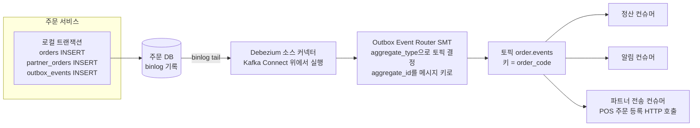
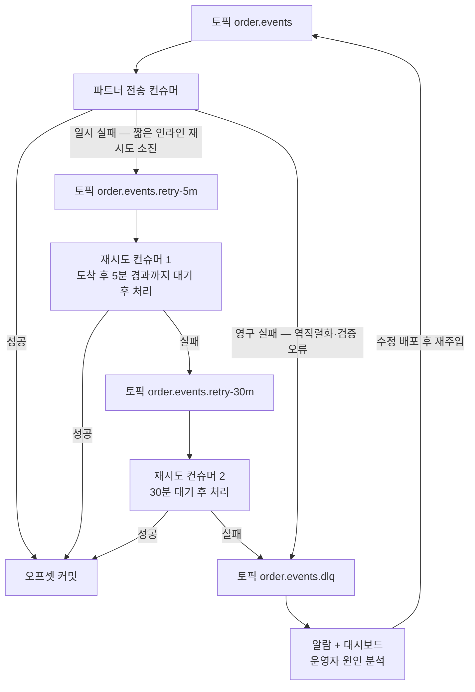
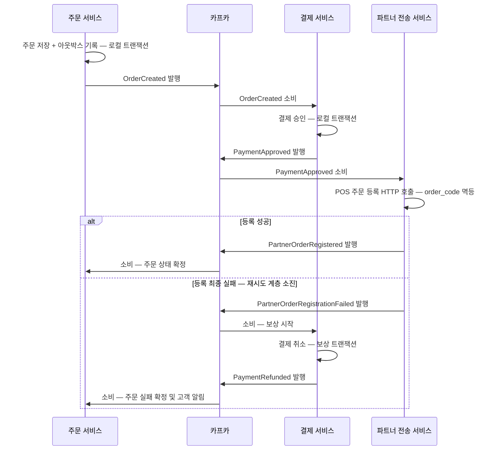

# 카프카 기반 아키텍처 패턴 — 아웃박스·순서 보장·DLQ

> 시리즈 08편. 기준 버전은 Apache Kafka 4.x(KRaft 전용)다. 이 편은 브로커 내부가 아니라 **카프카 위에 시스템을 설계하는 사람**의 관점이다. 프로듀서 멱등성·트랜잭션은 [04-producer-deep-dive.md](04-producer-deep-dive.md), 컨슈머 리밸런싱·커밋은 [05-consumer-deep-dive.md](05-consumer-deep-dive.md), Kafka Connect·Streams는 [07-ecosystem.md](07-ecosystem.md)를 전제한다.
>
> 예시 도메인은 이 리포지토리의 **직연동 POS 주문 시스템**이다(상세 플로우는 `docs/cores/02-as-is-outbound-flows.md`). 핵심 플로우만 요약하면: 고객 결제 완료 → 파트너 POS에 주문 등록(HTTP) → `partner_orders` 매핑 저장, 취소는 당근이 먼저 확정하고 POS로 best-effort 전파, 미수락 주문은 SQS 지연 메시지로 자동취소. 이 동기 호출 사슬을 "카프카로 다시 설계한다면 어디에 어떤 패턴이 필요한가"가 이 문서의 관통 질문이다.

---

## 목차

1. [이벤트 드리븐 아키텍처 — 이벤트는 세 종류다](#1-이벤트-드리븐-아키텍처--이벤트는-세-종류다) 🟡
2. [이중 쓰기 문제와 아웃박스 패턴](#2-이중-쓰기-문제와-아웃박스-패턴) 🔴
3. [컨슈머 멱등 처리 — 정확히 한 번은 설계가 만든다](#3-컨슈머-멱등-처리--정확히-한-번은-설계가-만든다) 🔴
4. [순서 보장 설계 — 파티션 키가 아키텍처다](#4-순서-보장-설계--파티션-키가-아키텍처다) 🔴
5. [DLQ와 재시도 토픽 계층](#5-dlq와-재시도-토픽-계층) 🔴
6. [CQRS·이벤트 소싱 — 카프카는 이벤트 스토어인가](#6-cqrs이벤트-소싱--카프카는-이벤트-스토어인가) 🔴
7. [사가 — 분산 트랜잭션의 현실적 대체](#7-사가--분산-트랜잭션의-현실적-대체) 🔴
8. [멀티 리전과 DR 개요](#8-멀티-리전과-dr-개요) 🔴
9. [면접 포인트](#면접-포인트)

---

## 1. 이벤트 드리븐 아키텍처 — 이벤트는 세 종류다 🟡

### 왜 필요한가 — 동기 호출 사슬의 비용

AS-IS 주문 등록 플로우를 보자. 고객이 결제 버튼을 누르면, 그 HTTP 요청 하나가 **결제 승인(gRPC) → 파트너 POS 주문 등록(HTTP, 재시도 4회 지수백오프) → `partner_orders` 저장**을 전부 동기로 통과해야 응답이 돌아간다. 파트너 서버가 느리면 고객이 최악 수십 초를 기다렸고, 파트너가 죽으면 결제까지 역순으로 되감아야 했다.

이 구조의 문제를 결합도(coupling) 언어로 정리하면 세 가지다.

- **시간적 결합(temporal coupling)**: 파트너 POS가 지금 살아 있어야 주문이 성립한다. 파트너의 가용성이 곧 우리의 가용성이 된다.
- **기술적 결합**: 호출하는 쪽이 상대의 프로토콜·엔드포인트·타임아웃을 전부 알아야 한다.
- **팀 결합**: 새 소비처가 생길 때마다(예: 정산팀이 주문 완료를 알고 싶다) 주문 서비스 코드에 호출을 추가해야 한다. 주문 팀이 모든 소비처의 배포 일정에 엮인다.

이벤트 드리븐 아키텍처(Event-Driven Architecture, EDA)는 이 방향을 뒤집는다. 주문 서비스는 "주문이 생성됐다"는 **사실(fact)**을 카프카에 남기고 끝낸다. 누가 그걸 소비하는지 모르고, 알 필요도 없다. 신문사에 비유하면, 기자(프로듀서)는 기사를 신문(토픽)에 실을 뿐 구독자 명단을 관리하지 않는다. 다만 비유의 한계: 신문은 어제 신문을 다시 배달해주지 않지만, 카프카는 보존 기간 내 과거 이벤트를 언제든 다시 읽을 수 있다([02-storage-internals.md](02-storage-internals.md)). 이 "다시 읽기"가 EDA에서 카프카가 단순 메시지 큐와 갈라지는 지점이다.

### 이벤트의 3분류

"이벤트를 발행한다"는 말은 실제로는 세 가지 서로 다른 설계를 뭉뚱그린 표현이다. Martin Fowler의 분류를 따라가면 명확해진다.

#### 1) 알림 이벤트 — notification

"주문 1234가 생성됐다"만 알리고, 상세가 필요하면 소비자가 발행자 API를 다시 호출하게 하는 방식이다.

```json
{ "eventType": "OrderCreated", "orderId": "ORD-2026-1234", "occurredAt": "..." }
```

- **장점**: 페이로드가 작고, 데이터의 원본(source of truth)이 발행자 DB 한 곳에 유지된다.
- **단점**: 소비자가 결국 발행자를 동기 호출한다 — 시간적 결합이 절반만 풀린다. 소비자가 많아지면 이벤트 하나가 조회 폭풍을 일으킨다. 또한 "이벤트 시점의 상태"가 아니라 "조회 시점의 상태"를 보게 되어, 이벤트와 조회 사이에 주문이 취소됐다면 소비자는 생성 이벤트를 받고도 취소된 주문을 조회하는 시간 왜곡이 생긴다.

#### 2) 상태 운반 이벤트 — event-carried state transfer, ECST

이벤트에 소비자가 필요로 할 상태를 실어 보낸다.

```json
{
  "eventType": "OrderCreated",
  "orderId": "ORD-2026-1234",
  "orderCode": "K2026081812345678",
  "storeId": "STR-889",
  "partnerId": "cj",
  "items": [ { "menuCode": "AME-01", "qty": 2, "price": 4500 } ],
  "totalAmount": 9000,
  "status": "CREATED",
  "version": 1,
  "occurredAt": "..."
}
```

- **장점**: 소비자가 발행자를 되부르지 않는다. 소비자는 자기 로컬에 필요한 만큼 복제본을 쌓고(뒤의 CQRS로 이어진다), 발행자가 죽어도 동작한다. 시간적 결합이 완전히 끊긴다.
- **단점**: 데이터가 여러 곳에 복제되고 **최종적 일관성(eventual consistency)**을 감수해야 한다. 스키마가 커질수록 "누가 어떤 필드를 쓰는지"가 불투명해져 스키마 변경이 어려워진다 — 스키마가 곧 팀 간 계약이 되며, Schema Registry의 호환성 검사([07-ecosystem.md](07-ecosystem.md))가 이 계약의 집행자다.

#### 3) 이벤트 소싱용 이벤트

앞의 둘은 "통합(integration)을 위한 이벤트"다. 세 번째는 성격이 다르다. **상태를 저장하는 대신 상태 변화 자체를 저장**하는, 시스템 내부 영속화 모델로서의 이벤트다. `OrderCreated → OrderAccepted → OrderCanceled` 이벤트 열을 처음부터 재생(replay)하면 현재 상태가 복원된다. 이건 6절에서 본격적으로 다루되, 여기서 하나만 못 박아 두자: **내부 영속화용 이벤트와 외부 통합용 이벤트는 같은 것이 아니다.** 내부 이벤트를 그대로 외부에 노출하면 내부 모델 변경이 곧 대외 계약 파기가 된다.

### 실무 함정 — 이벤트로 위장한 명령

가장 흔한 EDA 안티패턴은 이벤트 이름을 달고 있는 명령(command)이다. `SendCancelToPartnerRequested` 같은 "이벤트"는 사실 특정 소비자 하나가 특정 행동을 하기를 기대하는 명령이다. 구분 기준은 간단하다 — **발행자가 소비자의 반응을 전제하면 명령, 소비자가 없어도 사실로 성립하면 이벤트**다. 명령이 필요하면 명령임을 인정하고 명령 토픽으로 설계하는 게 낫다(7절 오케스트레이션 사가가 정확히 이 구조다). 이벤트인 척하는 명령은 결합을 숨길 뿐 없애지 못한다.

두 번째 함정은 **이벤트 스파게티**다. 서비스 10개가 서로의 이벤트를 구독하기 시작하면 "주문 하나가 생성되면 시스템에서 무슨 일이 벌어지는가"를 아무도 답할 수 없게 된다. 처방은 기술이 아니라 거버넌스다: 토픽 소유권을 팀 단위로 명시하고(발행 팀이 스키마와 호환성을 책임진다), 이벤트 카탈로그를 문서화하며, 도메인 경계를 넘는 이벤트는 내부 이벤트와 분리된 공개 계약으로 관리한다.

---

## 2. 이중 쓰기 문제와 아웃박스 패턴 🔴

### 왜 필요한가 — 두 시스템에 원자적으로 쓸 방법은 없다

주문 서비스를 이벤트 드리븐으로 바꾸기로 했다. 주문 생성 시 ① `orders`·`partner_orders`를 DB에 저장하고 ② `order.events` 토픽에 `OrderCreated`를 발행해야 한다. 순진한 구현은 이렇다.

```kotlin
@Transactional
fun createOrder(cmd: CreateOrder) {
    val order = orderRepository.save(Order.from(cmd))     // ① DB 쓰기
    kafkaTemplate.send("order.events", order.id, event)   // ② 카프카 발행
}
```

이것이 **이중 쓰기(dual write)** 문제다. DB와 카프카는 서로 다른 시스템이고, 둘을 묶는 분산 트랜잭션은 없다. 어떤 순서로 배치해도 깨진다.

- **DB 커밋 후 발행**: 커밋 직후 프로세스가 죽으면 주문은 존재하는데 이벤트가 없다. 정산팀·알림팀은 이 주문을 영원히 모른다. 유령 주문의 이벤트판이다.
- **발행 후 DB 커밋**: 발행은 됐는데 커밋이 롤백되면(유니크 제약 위반 등), 존재하지 않는 주문의 이벤트가 세상에 퍼진다. 더 나쁘다.
- **트랜잭션 안에서 발행(위 코드)**: `send()`는 비동기이고([04-producer-deep-dive.md](04-producer-deep-dive.md)), 발행 성공이 커밋을 보장하지도 커밋이 발행을 보장하지도 않는다. 게다가 카프카가 느려지면 DB 트랜잭션이 그만큼 길어져 커넥션 풀이 마른다.

여기서 자주 나오는 오해 하나를 정리하자. **카프카 트랜잭션은 이 문제를 못 푼다.** 04편에서 본 카프카 트랜잭션은 "여러 카프카 파티션 + 컨슈머 오프셋"을 원자적으로 묶는 것이지, 외부 DB와의 XA(2단계 커밋)가 아니다. `KafkaTransactionManager`와 JPA 트랜잭션을 체이닝해도 마지막 커밋 순간의 부분 실패 창은 그대로 남는다.

### 해법 — 트랜잭셔널 아웃박스

발상의 전환은 이렇다. **두 시스템에 원자적으로 쓸 수 없다면, 한 시스템에만 쓰고 나머지는 그걸 보고 따라오게 하라.** 이벤트를 카프카에 직접 쓰는 대신, **같은 DB의 아웃박스 테이블에 이벤트를 함께 저장**한다. DB 로컬 트랜잭션 하나이므로 원자성은 공짜다. 별도 프로세스가 아웃박스를 읽어 카프카로 릴레이한다.

우체국에 비유하면, 편지를 직접 들고 우체국까지 뛰어가는 대신(가다가 쓰러지면 편지 유실) 집 앞 우편함(outbox)에 넣어두면 집배원이 수거해 간다. 우편함에 넣는 행위는 집안일(DB 트랜잭션)과 같은 공간에서 일어나므로 원자적이다. 비유의 한계: 진짜 집배원은 하루 한 번 오지만, CDC 릴레이는 밀리초 단위로 따라온다.

#### 테이블 설계

```sql
CREATE TABLE outbox_events (
    id             BINARY(16)   NOT NULL,            -- UUIDv7 권장: 시간순 정렬 가능
    aggregate_type VARCHAR(50)  NOT NULL,            -- 'order' — 라우팅용, 토픽 결정
    aggregate_id   VARCHAR(64)  NOT NULL,            -- 주문 order_code — 카프카 메시지 키가 된다
    event_type     VARCHAR(80)  NOT NULL,            -- 'OrderCreated', 'OrderCanceled'
    payload        JSON         NOT NULL,            -- ECST 본문
    headers        JSON         NULL,                -- traceId 등 전파용 메타데이터
    created_at     TIMESTAMP(6) NOT NULL DEFAULT CURRENT_TIMESTAMP(6),
    PRIMARY KEY (id)
);
```

설계 포인트 세 가지.

- **`aggregate_id`가 곧 카프카 메시지 키**다. 같은 주문의 이벤트가 같은 파티션으로 가서 순서가 유지된다(4절). PK를 UUIDv7 같은 시간순 정렬 가능한 값으로 두면 인덱스 단편화도 피하고 릴레이 순서 판단에도 쓸 수 있다.
- **payload는 발행 시점에 확정**한다. 릴레이 시점에 다른 테이블을 조인해 조립하면, 그 사이 상태가 바뀌어 "이벤트 발생 시점의 사실"이 왜곡된다. 이벤트는 스냅샷이어야 한다.
- **상태 컬럼(`published_at` 등)은 CDC 방식에서는 불필요**하다. 폴링 방식에서만 필요하다(아래).

#### 주문 생성 코드는 이렇게 바뀐다

```kotlin
@Transactional
fun createOrder(cmd: CreateOrder) {
    val order = orderRepository.save(Order.from(cmd))
    partnerOrderRepository.save(PartnerOrderMapping(order))   // 기존 매핑 저장
    outboxRepository.save(OutboxEvent(                        // 같은 트랜잭션 — 원자성 확보
        aggregateType = "order",
        aggregateId   = order.orderCode,
        eventType     = "OrderCreated",
        payload       = OrderCreatedPayload.from(order),
    ))
}   // 커밋되면 주문과 이벤트가 함께 존재, 롤백되면 함께 사라진다
```

카프카 발행 코드가 비즈니스 트랜잭션에서 완전히 사라졌다는 점에 주목하라. 카프카가 통째로 죽어 있어도 주문 생성은 성공하고, 이벤트는 아웃박스에 쌓였다가 카프카 복구 후 발행된다. **시간적 결합 제거가 아웃박스의 숨은 보너스**다.

### 릴레이 — 폴링 vs CDC

아웃박스를 카프카로 옮기는 릴레이는 두 방식이 있다.

**폴링 발행기(polling publisher)**: 별도 스레드/스케줄러가 `SELECT ... WHERE published_at IS NULL ORDER BY id LIMIT n`으로 긁어 발행하고 마킹한다. 구현이 단순하고 인프라 추가가 없지만, 폴링 주기만큼 지연이 생기고, DB에 상시 폴링 부하가 걸리며, 다중 인스턴스에서 중복 발행을 막으려면 `FOR UPDATE SKIP LOCKED` 같은 잠금 설계가 필요하다.

**CDC(Change Data Capture) — Debezium**: DB의 복제 로그(MySQL binlog, PostgreSQL WAL)를 Kafka Connect 소스 커넥터([07-ecosystem.md](07-ecosystem.md))인 Debezium이 tail하여, `outbox_events`에 INSERT가 커밋되는 즉시 카프카로 흘려보낸다. 애플리케이션은 릴레이 코드를 아예 갖지 않고, 지연은 밀리초~초 단위이며, 폴링 부하가 없다. Debezium의 **Outbox Event Router**(SMT, Single Message Transform)가 이 패턴을 위해 존재한다: `aggregate_type`으로 목적지 토픽을 정하고(`outbox.event.<aggregate_type>` 형태 등), `aggregate_id`를 메시지 키로, `payload`를 메시지 본문으로 변환해 준다. 아웃박스 행의 DELETE/UPDATE 변경분은 무시하도록 설정할 수 있어(`tombstones.on.delete=false` 등), 발행 후 행을 지워도 안전하다.



AS-IS와 연결해 보면: 파트너 POS 주문 등록이 고객 응답 경로 안의 동기 호출에서, **`OrderCreated`를 구독하는 파트너 전송 컨슈머의 비동기 작업**으로 빠진다. 고객 응답은 결제 승인과 DB 커밋까지만 기다리면 되고, 파트너 등록 실패 시의 보상(결제 취소)은 7절 사가에서 다룬다.

### 아웃박스의 실무 함정

- **여전히 at-least-once다.** Debezium이 오프셋 커밋 전에 죽으면 같은 아웃박스 행이 두 번 발행될 수 있다. 아웃박스는 유실(at-most-once의 구멍)을 막을 뿐, 중복은 3절의 컨슈머 멱등이 막는다. 프로듀서 멱등성(`enable.idempotence=true`)은 커넥터 재시작을 넘는 중복까지는 못 막는다는 것도 04편에서 본 그대로다.
- **아웃박스 청소 정책이 필요하다.** CDC 방식이면 INSERT 직후 같은 트랜잭션에서 DELETE해도 무방하고(binlog에는 INSERT가 이미 남았다), 남겨서 감사 로그로 쓰려면 파티셔닝+주기 삭제를 설계해야 한다. 무한히 쌓이는 아웃박스는 언젠가 장애가 된다.
- **순서는 커밋 순서다.** binlog는 커밋 순서로 기록되므로 릴레이 순서도 커밋 순서다. 같은 `aggregate_id` 안에서라면 이는 원하는 순서와 일치한다 — 단, 애플리케이션이 한 애그리게잇을 동시에 두 트랜잭션에서 수정하지 않는다는 전제(낙관적 잠금 등)가 필요하다.
- **listen-to-yourself는 다른 패턴이다.** "카프카에 먼저 쓰고, 자기 이벤트를 구독해 DB를 갱신"하는 변형도 있으나, 쓰기 직후 읽기 일관성이 깨져(내가 만든 주문이 조회에 안 보임) 주문 같은 대고객 도메인엔 부적합하다.

---

## 3. 컨슈머 멱등 처리 — 정확히 한 번은 설계가 만든다 🔴

### 왜 필요한가 — 중복은 반드시 온다

2절까지의 파이프라인은 at-least-once다. 중복이 생기는 경로는 다양하다: Debezium 재시작, 프로듀서 재시도, 그리고 가장 흔하게는 **컨슈머가 처리를 마치고 오프셋 커밋 전에 죽는 경우**다. 리밸런싱이 일어나면 새 컨슈머는 마지막 커밋 오프셋부터 다시 읽는다([05-consumer-deep-dive.md](05-consumer-deep-dive.md)). 즉 "처리는 됐는데 커밋만 안 된" 메시지들이 통째로 재전달된다.

"정확히 한 번(exactly-once)"이라는 말의 정확한 범위를 다시 확인하자. 04편에서 본 카프카 EOS는 **카프카 → 카프카**(read-process-write, Kafka Streams류) 경계 안의 이야기다. 컨슈머가 DB에 쓰고, 외부 HTTP를 호출하는 순간 그 보장은 끝난다. 파트너 POS로 주문 등록 HTTP를 두 번 쏘는 것을 브로커는 막아줄 수 없다. 그래서 시니어의 언어로는 이렇게 말한다 — **전달(delivery)은 at-least-once로 받아들이고, 처리 효과(effect)를 exactly-once로 만드는 것은 애플리케이션 설계의 몫이다.** "exactly-once delivery"가 아니라 "effectively-once processing"이 목표다.

### 멱등 키 — 무엇으로 "같은 요청"임을 알아보는가

멱등 처리의 첫 설계 결정은 멱등 키다. 두 후보가 있다.

- **이벤트 ID(`event_id`, 아웃박스 PK)**: "같은 이벤트의 재전달"을 잡는다. 기술적 중복 제거에 정확하다.
- **비즈니스 키(`order_code` + 상태전이)**: "같은 비즈니스 의미의 요청"을 잡는다. 이벤트가 다른 경로로 두 번 만들어져도(버그, 수동 재발행) 막아준다.

실전에서는 비즈니스 키가 더 강한 방어선이다. AS-IS가 정확히 이 판단을 했다: 파트너 주문 등록의 재시도 4회가 안전했던 근거는 **`order_code` 기준 멱등 처리를 당근 규격서로 파트너에게 요구**했기 때문이고, `partner_orders.order_id` 유니크 제약이 우리 쪽 최종 방어선이었다. 멱등 계약은 코드가 아니라 **인터페이스 규격의 일부**라는 것 — 이것이 이 사례의 교훈이다. 카프카 컨슈머를 설계할 때도 마찬가지로, "이 컨슈머는 같은 이벤트를 두 번 받아도 안전한가"가 코드 리뷰 체크리스트에 올라야 한다.

### 멱등을 만드는 네 가지 기법

**1) 자연 멱등 — 업서트(upsert)와 절대값 쓰기.** 연산 자체를 멱등하게 만든다. "재고를 2 감소시켜라"(상대값)는 두 번 실행하면 4가 줄지만, "재고를 7로 설정하라"(절대값)는 몇 번 실행해도 7이다. ECST 이벤트가 최종 상태를 실어 나르면 소비자는 `INSERT ... ON DUPLICATE KEY UPDATE`(업서트)로 끝난다. AS-IS의 재고 응답 비동기 DB 반영이 이 유형이다 — 응답의 절대 수량을 덮어쓰므로 중복 반영이 무해하다. **가능하면 항상 이 방식이 최선이다.** 별도 인프라가 없고, 이력 테이블 정리 같은 운영 부담도 없다.

**2) 처리 이력 테이블(processed_events) + 로컬 트랜잭션.** 부수 효과가 업서트로 환원되지 않으면(적립금 지급, 외부 호출 기록), 처리 여부를 기록한다. 핵심은 **비즈니스 쓰기와 이력 기록이 같은 DB 트랜잭션**이어야 한다는 것이다 — 분리하면 "처리는 했는데 이력 기록 전에 죽는" 똑같은 이중 쓰기 문제가 재발한다.

```sql
CREATE TABLE processed_events (
    consumer_group VARCHAR(80)  NOT NULL,   -- 컨슈머 그룹별로 독립 — 그룹마다 한 번씩 처리
    event_id       BINARY(16)   NOT NULL,
    processed_at   TIMESTAMP(6) NOT NULL,
    PRIMARY KEY (consumer_group, event_id)
);
```

```kotlin
@Transactional
fun handle(event: OrderCreatedEvent) {
    try {
        processedEventRepository.insert(GROUP, event.eventId)  // 중복이면 여기서 유니크 위반
    } catch (e: DuplicateKeyException) {
        return  // 이미 처리됨 — 조용히 스킵하고 오프셋만 커밋
    }
    settlementService.accrue(event)   // 같은 트랜잭션 안의 비즈니스 쓰기
}
```

이력 테이블은 자라므로 보존 기간(재전달이 올 수 있는 최대 창 — 토픽 보존 기간 + 재처리 정책을 고려해 수 주 정도)을 정하고 파티션 드랍으로 청소한다.

**3) 버전·시퀀스 비교.** 중복만이 아니라 **역전(out-of-order)**까지 막는 기법이다. 이벤트에 애그리게잇 버전(주문의 상태 변경 횟수)을 실어 보내고, 소비자는 자기 로컬 버전보다 낮거나 같은 이벤트를 버린다.

```sql
UPDATE order_view SET status = :status, version = :version
 WHERE order_code = :orderCode AND version < :version;   -- 0행 갱신이면 스킵
```

조건부 갱신 한 문장으로 중복과 역전을 동시에 처리한다. 4절의 순서 문제, 5절의 재처리 순서 문제의 해독제가 바로 이것이다.

**4) 외부 호출의 멱등 위임.** 소비자의 효과가 외부 API 호출이면, 멱등 키를 상대에게 넘겨 상대가 멱등을 보장하게 한다. 파트너 POS에 `order_code`를 멱등 키로 요구한 것, 결제 게이트웨이의 idempotency-key 헤더가 이 유형이다. 상대가 멱등을 지원하지 않으면? 2)의 이력 테이블로 "내가 이미 호출했는지"를 기록하는 수밖에 없는데, "호출했고 응답을 못 받은" 회색 지대는 원리적으로 남는다. 이때는 상대 시스템 조회로 확인하는 보정(reconciliation) 배치가 마지막 그물이 된다.

### 오프셋 커밋과의 관계

멱등 처리가 갖춰지면 오프셋 커밋 전략이 단순해진다: **처리(DB 커밋) 후 커밋, 실패 시 커밋하지 않고 재시도.** 중복은 멱등이 흡수하므로 "커밋을 먼저 할까 나중에 할까"의 딜레마가 사라진다. 반대로 멱등 없이 auto-commit에 의존하면 at-most-once와 at-least-once 사이 어딘가의 정의 불가능한 보장이 된다. 멱등은 선택이 아니라 at-least-once 세계의 입장료다.

---

## 4. 순서 보장 설계 — 파티션 키가 아키텍처다 🔴

### 왜 필요한가 — 순서가 뒤집히면 돈이 새는 도메인

주문 도메인에서 순서 역전은 관념적 문제가 아니다. `OrderCreated`보다 `OrderCanceled`가 먼저 소비되면: 파트너 전송 컨슈머는 존재하지 않는 주문의 취소를 쏘고(2026-05 롯데 404 장애가 정확히 "모르는 주문의 취소" 케이스였다), 뒤늦게 도착한 생성 이벤트로 취소된 주문이 POS에 등록된다 — 유령 주문의 재림이다.

카프카의 순서 보장 범위를 정확히 하자([01-core-concepts.md](01-core-concepts.md)): **순서는 파티션 안에서만 보장된다.** 토픽 전체의 순서는 없다. 같은 키의 메시지는 같은 파티션으로 해시되므로, "무엇을 키로 삼는가"가 곧 "어떤 범위의 순서를 보장받는가"다. 그리고 프로듀서 쪽 재시도 역전(`max.in.flight` 문제)은 멱등 프로듀서로 닫아야 파티션 내 순서가 완성된다는 것은 [04-producer-deep-dive.md](04-producer-deep-dive.md)에서 본 대로다.

### 키 선택 — orderId인가 storeId인가

주문 이벤트의 키 후보를 비교해 보자.

| 키 | 보장되는 순서 | 분산 | 함정 |
|---|---|---|---|
| `orderId` / `order_code` | 한 주문의 생애주기 순서 — 생성→수락→취소 | 주문 수만큼 고르게 분산, 핫 파티션 거의 없음 | 매장 단위 순서는 없음 — 같은 매장의 주문 A, B는 다른 파티션에서 병렬 소비 |
| `storeId` | 한 매장의 모든 주문 이벤트 순서 | 매장별 주문량 편차만큼 쏠림 | 대형 프랜차이즈 지점·이벤트 매장이 **핫 파티션**을 만든다 |
| 키 없음 | 없음 — 스티키 파티셔너가 배치 단위로 분산 | 최상 | 같은 주문의 생성·취소가 역전 가능 — 주문 도메인에선 실격 |

판단 기준은 이 질문이다: **"순서가 꼭 필요한 최소 범위는 무엇인가?"** 주문 도메인의 불변식은 "한 주문의 상태 전이 순서"다. 매장 안에서 주문 A와 B가 어느 순서로 처리되는지는 비즈니스가 요구하지 않는다(POS 화면 정렬은 타임스탬프로 하면 된다). 따라서 정답은 `order_code`다. 순서 범위를 필요 이상으로 넓게 잡으면(storeId) 얻는 것 없이 핫 파티션 위험만 산다.

핫 파티션의 비용을 구체화하면: 파티션은 컨슈머 그룹 내 병렬성의 단위이므로, 한 파티션에 트래픽이 쏠리면 **컨슈머를 아무리 늘려도 그 파티션 담당 하나만 일하고** 랙이 쌓인다. 브로커 쪽에서도 해당 파티션 리더가 있는 브로커의 디스크·네트워크만 뜨거워진다. 모니터링에서 파티션별 랙 편차가 크면 키 분포부터 의심하라([06-operations-and-tuning.md](06-operations-and-tuning.md)).

### 순서에 관한 세 가지 실무 규칙

**1) 파티션 수 변경은 키-파티션 매핑을 깬다.** 파티션을 12에서 24로 늘리는 순간 해시 결과가 바뀌어, 같은 `order_code`의 과거 이벤트는 파티션 3에, 이후 이벤트는 파티션 17에 있게 된다. 두 파티션을 병렬 소비하면 순서 역전이다. 그래서 순서 민감 토픽은 **처음부터 파티션 수를 여유 있게** 잡고(파티션 수 산정은 06편), 정말 늘려야 하면 구주문 드레인 기간을 두거나 새 토픽으로 마이그레이션한다.

**2) 순서 의존을 줄이는 게 순서 보장보다 싸다.** 이벤트를 "무슨 일이 있었다"(델타)가 아니라 "지금 상태가 이렇다"(상태 + 버전)로 설계하면, 소비자는 3절의 버전 비교로 역전을 스스로 흡수한다. `OrderCanceled version=3`이 `OrderAccepted version=2`보다 먼저 와도, 뒤늦은 v2는 버전 비교에서 버려진다. **순서 보장은 인프라에 요구하는 것이고, 순서 내성(order tolerance)은 설계로 얻는 것**이다 — 후자가 있으면 전자의 실패(재처리, 파티션 변경, DLQ 복귀)가 사고가 아니게 된다.

**3) 컨슈머 안의 순서도 지켜야 한다.** 파티션이 순서대로 줘도, 컨슈머가 배치를 내부 스레드풀로 병렬 처리하면 순서는 거기서 깨진다. 병렬화가 필요하면 **키 단위로 직렬화되는 파티셔닝된 워커 풀**(같은 키는 같은 워커 큐로)을 쓴다.

---

## 5. DLQ와 재시도 토픽 계층 🔴

### 왜 필요한가 — poison pill 한 개가 파티션을 멈춘다

컨슈머가 어떤 메시지 처리에 계속 실패한다고 하자 — 역직렬화가 안 되는 깨진 페이로드, 코드가 처리 못 하는 예외 케이스, 혹은 참조하는 데이터가 아직 없는 일시적 상황. 카프카 컨슈머는 파티션을 **순서대로만** 읽으므로, 이 메시지를 넘어가지 않는 한 그 파티션의 뒤 메시지 전부가 막힌다. 이런 메시지를 **poison pill**이라 부른다. 무한 재시도는 파티션 정지이고, 무조건 스킵은 데이터 유실이다. 둘 다 답이 아니므로 구조가 필요하다.

실패를 두 부류로 나누는 게 출발점이다.

- **일시적(transient) 실패**: 파트너 POS 타임아웃, DB 데드락, 잠깐의 참조 데이터 부재. → 시간이 해결한다. 재시도가 답.
- **영구적(permanent) 실패**: 스키마 불일치, 검증 실패, 코드 버그. → 만 번 재시도해도 실패한다. 격리가 답.

### 계층 설계 — 인라인 재시도, 재시도 토픽, DLQ



**1단계 — 인라인(in-place) 재시도.** 컨슈머 안에서 짧은 백오프로 2~3회. 네트워크 순단은 대부분 여기서 끝난다. 단, 총 블로킹 시간이 `max.poll.interval.ms`를 넘으면 컨슈머가 그룹에서 쫓겨나 리밸런싱 폭풍이 나므로([05-consumer-deep-dive.md](05-consumer-deep-dive.md)) 상한을 엄격히 잡는다. AS-IS의 `@Retryable` 4회 지수백오프가 이 층에 해당한다 — 동기 세계에선 이 층이 전부였고, 그래서 최종 실패가 곧 Sentry 로깅 후 종료였다.

**2단계 — 재시도 토픽 계층.** 인라인이 소진되면 메시지를 `retry-5m` 토픽으로 넘기고 **원본 파티션의 오프셋은 커밋**한다 — 이것이 핵심이다. 실패한 메시지가 파티션을 떠났으므로 뒤 메시지들이 흐른다. 재시도 토픽 컨슈머는 지연 후 처리하고, 또 실패하면 다음 단계(`retry-30m`, `retry-2h`…)로 넘긴다. 단계별 지연을 지수적으로 키우는 이유는, 오래 지속되는 장애(파트너 POS 점검 등)에 짧은 재시도를 퍼붓지 않기 위해서다.

카프카에는 지연 큐가 내장되어 있지 않으므로 지연은 컨슈머가 구현한다. 표준 기법: 메시지의 헤더(원본 타임스탬프 또는 `retry-not-before`)를 보고, 아직 때가 아니면 **`pause()`로 해당 파티션 소비를 멈추고 때가 되면 `resume()`**한다. `sleep`으로 버티면 `max.poll.interval.ms` 위반이므로 반드시 pause/resume이어야 한다. Spring Kafka의 `@RetryableTopic`은 이 계층 전체(재시도 토픽 생성, 지연, DLT 이동)를 선언 한 줄로 만들어 주는 구현체다.

**3단계 — DLQ(Dead Letter Queue).** 재시도 계층까지 소진했거나, 애초에 재시도가 무의미한 영구 실패는 DLQ 토픽으로 격리한다. DLQ에 넣을 때 **원본의 토픽·파티션·오프셋·예외 스택·실패 시각을 헤더로 보존**해야 한다 — 이게 없으면 DLQ는 분석 불가능한 쓰레기통이 된다. 역직렬화 실패는 컨슈머 코드에 도달하기도 전에 터지므로, `ErrorHandlingDeserializer`처럼 역직렬화 계층에서 잡아 DLQ로 보내는 장치가 별도로 필요하다.

DLQ는 큐가 아니라 **운영 프로세스**다: 쌓이면 알람(DLQ 적재는 랙과 달리 0이 정상), 원인 분석, 코드 수정 배포, 그리고 재주입(replay) 도구. 재주입은 원본 토픽으로 되돌리는 게 일반적이며, 이때 3절 멱등이 없으면 재주입이 이중 처리 사고가 된다.

AS-IS와 대비하면 개선점이 선명하다. 취소 전파는 "4회 재시도 → Sentry 로깅 후 종료"였다 — 즉 최종 실패는 사람이 Sentry를 보고 눈치채야 하는 **유실**이었다. 카프카 기반에서는 취소 이벤트가 재시도 계층을 타고 수 시간을 버티다가, 그래도 안 되면 DLQ에 **데이터로 남는다**. best-effort가 "언젠가는 반드시(eventually guaranteed)"로 바뀌는 것이 이 구조의 가치다.

### 재처리와 순서 — 이 패턴의 아픈 곳

재시도 토픽으로 메시지를 빼돌리는 순간 **파티션 순서 보장을 스스로 깬 것**이다. `order_code=X`의 `OrderAccepted`가 retry-30m에 가 있는 동안, 원본 파티션의 `OrderCanceled`(같은 X)는 먼저 처리된다. 30분 뒤 낡은 Accepted가 돌아와 Canceled를 덮어쓰면 사고다. 대응 전략은 세 가지다.

- **버전 비교로 흡수(권장)**: 3절의 조건부 갱신이 있으면 뒤늦은 v2는 v3을 이길 수 없다. 순서 내성 설계가 여기서 다시 배당을 준다.
- **키 파킹(key parking)**: 어떤 키가 재시도 중이면 그 키의 후속 메시지도 즉시 재시도 토픽으로 따라 보낸다. 키 단위 순서는 지켜지지만 재시도 중 키 목록을 관리하는 상태가 필요해 복잡도가 크게 오른다.
- **파티션 블로킹**: 재시도 토픽을 포기하고 해당 파티션을 pause로 세워두고 인라인으로 버틴다. 순서는 완벽하지만 poison pill 문제로 회귀한다. 순서가 절대적이고 트래픽이 작은 토픽에서만.

대부분의 도메인에서 답은 첫 번째다. **DLQ 패턴을 쓰기로 한 순간, 순서 내성 설계는 선택이 아니라 전제 조건이다.**

---

## 6. CQRS·이벤트 소싱 — 카프카는 이벤트 스토어인가 🔴

### CQRS — 읽기와 쓰기를 분리하고, 카프카가 그 사이를 잇는다

CQRS(Command Query Responsibility Segregation)는 쓰기 모델과 읽기 모델을 분리하는 패턴이다. 왜 필요한가 — 주문 시스템의 쓰기는 정규화된 트랜잭션 모델이 필요하지만, 읽기는 제각각이다: 어드민은 매장별 주문 목록, 정산은 일별 집계, 검색은 Elasticsearch 인덱스. 하나의 스키마로 전부를 감당하면 조인 지옥과 인덱스 비대가 온다.

카프카는 CQRS의 **전파 배관**으로 자연스럽다. 2절의 아웃박스로 발행된 `order.events`를 읽기 모델별 컨슈머(프로젝터, projector)가 각자 구독해 자기 저장소를 갱신한다. 새 읽기 모델이 필요하면? 새 컨슈머 그룹을 만들어 **토픽을 처음부터 재생**하면 과거 데이터까지 채워진 읽기 모델이 만들어진다 — 로그의 재읽기 가능성이 빛나는 순간이다. 대가는 최종적 일관성: 쓰기 직후 읽기 모델은 잠시 낡아 있다. "내 주문이 목록에 안 보여요"를 UX(쓰기 응답으로 화면 구성)나 read-your-own-writes 라우팅으로 흡수하는 설계가 따라와야 한다.

### 이벤트 소싱 — 그리고 논쟁

이벤트 소싱(event sourcing)은 한발 더 나간다. 애그리게잇의 현재 상태를 저장하지 않고 **이벤트 열 자체를 유일한 진실로 저장**하며, 상태는 이벤트를 재생해 도출한다. 주문이라면 `orders` 테이블의 status 컬럼 대신 `OrderCreated, OrderAccepted, OrderCanceled` 열이 저장의 전부다. 감사 이력이 공짜고, 과거 임의 시점 상태를 복원할 수 있으며, 버그 수정 후 재생으로 상태를 재계산할 수 있다.

그렇다면 "이벤트의 로그"인 카프카가 이벤트 스토어 그 자체가 될 수 있는가? 이 논쟁은 양쪽 논거를 다 알아야 한다.

**찬성 쪽 논거 — 카프카로 충분하다:**

- 카프카 로그는 이미 **순서 있는 불변 추가 전용(append-only) 이벤트 시퀀스**다. 이벤트 스토어의 핵심 성질을 태생적으로 갖고 있다.
- `retention.ms=-1`로 무한 보존이 가능하고, Tiered Storage(KIP-405, [02-storage-internals.md](02-storage-internals.md))로 오래된 세그먼트를 오브젝트 스토리지에 내려 비용도 감당된다.
- Kafka Streams의 상태 저장소 + 체인지로그 토픽 조합으로 "이벤트에서 파생한 상태"를 로컬에 물질화(materialize)할 수 있고, 재생·재계산이 프레임워크 수준에서 지원된다([07-ecosystem.md](07-ecosystem.md)).
- 스토어와 전파 버스가 하나이므로 아웃박스 같은 이중화가 필요 없다.

**반대 쪽 논거 — 카프카는 이벤트 스토어가 아니다:**

- **애그리게잇 단위 조회가 안 된다.** 이벤트 소싱의 기본 연산은 "주문 X의 이벤트만 순서대로 로드"(리하이드레이션)인데, 카프카는 오프셋/타임스탬프 탐색만 지원한다. 주문 X를 복원하려면 파티션 전체를 스캔해야 한다. 애그리게잇당 토픽을 만드는 우회는 수백만 주문 = 수백만 파티션이 되어 클러스터 한계(파티션 수는 유한한 자원, [03-replication-and-controller.md](03-replication-and-controller.md))에 부딪힌다.
- **낙관적 동시성 제어가 없다.** 진짜 이벤트 스토어(EventStoreDB 등)는 "주문 X의 현재 버전이 3일 때만 이 이벤트를 추가"라는 조건부 추가(expected version)를 지원한다. 카프카 append에는 이 조건이 없어, 동시 명령 두 개가 모순된 이벤트를 나란히 남길 수 있다. 쓰기 앞단에 키 단위 직렬화 계층(예: Streams 기반 검증 프로세서)을 자작해야 하는데, 그 시점에 이미 "카프카만으로"가 아니다.
- **컴팩션은 이벤트 소싱과 상충한다.** `cleanup.policy=compact`는 키별 최신값만 남긴다 — 이벤트 열을 지우고 스냅샷만 남기는 것이므로 이벤트 소싱의 정의를 파괴한다. 컴팩션 토픽은 ECST 캐시(테이블 복제)용이지 이벤트 스토어용이 아니다.
- 스냅샷, 개인정보 삭제(GDPR — 불변 로그에서 특정인 데이터 제거), 이벤트 스키마 업캐스팅 같은 이벤트 소싱 운영 문제에 대한 도구가 없다.

**실무 결론**은 대체로 절충이다: **애그리게잇의 진실은 DB(또는 전용 이벤트 스토어)에, 카프카는 그로부터 파생되는 통합·프로젝션 버스로.** 즉 이벤트 소싱을 하더라도 이벤트 스토어는 DB 테이블(`order_events`: order_code, version, event_type, payload — PK로 조회와 expected-version 갱신이 됨)로 두고, 아웃박스/CDC로 카프카에 흘려 CQRS 읽기 모델과 타 팀 통합에 쓴다. 1절의 "내부 영속화 이벤트 ≠ 외부 통합 이벤트" 원칙이 여기서 실체를 갖는다. 카프카를 시스템 전체의 유일한 진실로 삼는 설계(예: 은행 원장 전체를 Streams로)는 가능은 하지만, 그것은 이벤트 소싱이라기보다 **스트림 처리 아키텍처**라는 다른 종목이며, 위 반대 논거들을 전부 자작 코드로 메꿀 각오가 필요하다.

---

## 7. 사가 — 분산 트랜잭션의 현실적 대체 🔴

### 왜 필요한가 — 결제와 파트너 등록은 다른 세계다

주문 성립에는 여러 시스템이 걸린다: 당근페이 결제 승인(gRPC), 파트너 POS 주문 등록(HTTP), 우리 DB의 매핑 저장. 이들을 하나의 ACID 트랜잭션으로 묶을 방법은 없다 — 2단계 커밋(XA)은 참여자 전원이 지원해야 하고, 잠금을 오래 쥐며, 코디네이터가 단일 장애점이라 마이크로서비스 세계에서 사실상 폐기됐다.

**사가(saga)**는 분산 트랜잭션을 **로컬 트랜잭션의 연쇄 + 실패 시 보상 트랜잭션(compensating transaction)의 역연쇄**로 대체한다. 원자성 대신 "최종적으로 전부 성공하거나, 이미 한 일을 전부 되돌린다"를 보장한다. AS-IS가 이미 사가였다는 점이 흥미롭다: "파트너 등록 실패 → 역순 보상: 결제 취소, 재고·할인 원복"은 교과서적 보상 연쇄다. 다만 **동기 호출로 엮인 사가**여서 고객이 전 과정을 기다렸고, 보상 자체가 실패하면 Sentry에 남을 뿐이었다. 카프카는 이 사가를 비동기·내구성 있게 만드는 자리에 선다.

### 코레오그래피 vs 오케스트레이션

**코레오그래피(choreography)** — 중앙 조정자 없이, 각 서비스가 앞 서비스의 이벤트에 반응해 자기 일을 하고 다음 이벤트를 낸다. 춤추는 무용수들처럼 각자가 음악(이벤트)에 맞춰 움직인다.

- 결제 서비스: `PaymentApproved` 발행 → 파트너 전송 서비스가 구독, POS 등록 후 `PartnerOrderRegistered` 발행 → 주문 서비스가 구독, 상태 확정. 실패 시: `PartnerOrderRegistrationFailed` 발행 → 결제 서비스가 구독해 환불.
- 장점: 서비스 간 직접 결합이 없고 조정자라는 단일 지점이 없다. 단계가 2~3개면 가장 단순하다.
- 단점: **사가의 전체 흐름이 어디에도 적혀 있지 않다.** "주문 사가가 지금 어느 단계인가"를 보려면 모든 참여자의 상태를 모아야 하고, 단계가 늘면 이벤트 순환·누락을 추론하기 어렵다. 1절의 이벤트 스파게티로 직행하는 지름길이기도 하다.

**오케스트레이션(orchestration)** — 사가 오케스트레이터가 상태 기계를 쥐고, 각 참여자에게 **명령**을 보내고 응답 이벤트를 받아 다음 단계를 결정한다. 오케스트라 지휘자다.

- 장점: 흐름이 오케스트레이터 한 곳에 코드/상태 기계로 명시된다. 타임아웃, 재시도, 보상 분기가 한눈에 보이고 "주문 X의 사가 상태" 조회가 가능하다. 단계가 많거나 분기가 복잡하면 사실상 유일한 선택지다.
- 단점: 오케스트레이터가 모든 참여자를 알아야 하고(결합의 재집중), 비대해지면 분산 모놀리스의 두뇌가 된다. 오케스트레이터 자신의 상태 저장(사가 로그)과 가용성 설계가 추가로 필요하다.

카프카에서의 구현 형태: 명령 토픽(`partner.order.commands`)과 응답 토픽(`partner.order.replies`)을 두고, 오케스트레이터는 사가 상태를 DB에 저장하며(그 상태 변경도 2절 아웃박스로!), 참여자는 명령을 소비해 처리하고 응답을 낸다. 코레오그래피라면 각 서비스의 도메인 이벤트 토픽만으로 구성된다.



### 사가 설계 원칙 — 카프카 위에서

- **모든 단계와 모든 보상은 멱등이어야 한다.** 사가 메시지도 at-least-once로 전달되므로, "결제 취소" 보상이 두 번 소비돼도 한 번만 환불돼야 한다(3절 기법 그대로). 보상의 멱등을 빼먹는 것이 사가 구현의 최다 빈출 버그다.
- **단계 순서는 위험도 순으로.** 되돌리기 어려운(또는 불가능한) 단계를 뒤로 보낸다. "재시도로 반드시 성공시킬 수 있는 단계(retriable)"를 마지막에 두면 그 뒤로는 보상이 필요 없다. AS-IS가 결제 승인을 파트너 등록보다 먼저 둔 것은 "결제는 취소 가능, 파트너 등록 후 방치는 유령 주문"이라는 위험도 판단이었다.
- **중간 상태를 도메인에 노출하라.** 사가 진행 중 주문은 확정도 실패도 아닌 `PENDING`이다. 이 상태를 숨기지 말고 모델에 두어야(semantic lock), 진행 중 주문에 대한 다른 조작(고객 취소 등)을 정의할 수 있다. 비동기화의 대가로 "결제됐는데 주문이 안 잡히는 짧은 창"이 생기는데, 이 창의 UX(주문 접수 중 표시, 실패 시 자동 환불 알림)까지가 사가 설계의 범위다.
- **타임아웃도 이벤트다.** 파트너 응답이 영원히 안 오는 경우를 위해 타임아웃 트리거가 필요하다. AS-IS의 SQS 지연 메시지(미수락 자동취소)가 정확히 이 부품이며, 카프카 세계에선 5절의 지연 토픽이나 외부 스케줄러로 구현한다.

---

## 8. 멀티 리전과 DR 개요 🔴

### 왜 필요한가

리전 하나가 통째로 내려가는 일은 드물지만 일어난다. 주문 파이프라인이 카프카에 실려 있다면 카프카의 DR(Disaster Recovery)이 곧 주문의 DR이다. 설계는 두 숫자로 시작한다 — **RPO**(Recovery Point Objective, 유실 허용량)와 **RTO**(Recovery Time Objective, 복구 허용 시간). "주문 이벤트는 RPO 0이어야 하는가, 수 초 유실을 감수할 수 있는가"에 따라 아키텍처가 갈린다.

### 선택지 세 가지

**1) 스트레치 클러스터(stretched cluster)** — 하나의 클러스터를 가용 영역(AZ) 2.5개 또는 3개에 걸친다. `broker.rack`으로 브로커에 AZ를 표시하면 파티션 레플리카가 AZ에 분산 배치되고, `min.insync.replicas`와 `acks=all` 조합([03-replication-and-controller.md](03-replication-and-controller.md))으로 **AZ 하나가 죽어도 RPO 0, 자동 페일오버**가 된다. 단 동기 복제이므로 지연이 낮은 AZ 간(수 ms)에서만 성립한다. 대륙 간 리전에는 못 쓴다 — 왕복 수십 ms가 모든 쓰기에 얹힌다.

**2) 비동기 복제 — MirrorMaker 2, active-passive/active-active.** 리전별로 독립 클러스터를 두고, Kafka Connect 기반의 MirrorMaker 2(MM2)가 토픽을 비동기 복제한다. 비동기이므로 **RPO는 0이 아니다** — 장애 순간 미복제분은 유실된다. 핵심 운영 지식 두 가지:

- **오프셋은 클러스터마다 다르다.** 소스의 오프셋 1000이 타깃에서 1000이 아니므로, MM2는 체크포인트로 **오프셋 번역(offset translation)**을 제공해 컨슈머 그룹이 타깃 클러스터에서 "대략 이어서" 읽게 해준다. 번역은 근사이므로 페일오버 후 소량 재소비가 생긴다 — 3절 멱등이 또 한 번 전제가 된다.
- **active-active는 순환 복제를 막아야 한다.** MM2는 원격 토픽에 소스 클러스터 접두어(`seoul.order.events`)를 붙이는 명명으로 루프를 끊는다. 양 리전이 같은 키에 동시 쓰기를 하면 순서·충돌 해소가 애플리케이션 몫이 되므로, 실전에서는 **키 공간을 리전으로 분할**(한국 주문은 서울 리전에서만 쓰기)하는 active-active가 일반적이다.

**3) 클러스터 링킹 계열** — Confluent Cluster Linking처럼 커넥터 없이 브로커 간 프로토콜로 복제하며 **오프셋을 그대로 보존**하는 상용 기능도 있다. 오프셋 번역 문제가 사라져 페일오버가 단순해진다. Apache Kafka 본체 기능이 아니라는 점만 구분해 두자.

### 설계 감각

주문 도메인이라면: 결제·주문 확정 같은 돈 경로는 클러스터 장애 자체를 견디도록 스트레치 클러스터(AZ 단위 RPO 0)로 받치고, 리전 단위 재해는 MM2 active-passive + 멱등 컨슈머 + 보정 배치(파트너·결제사와의 대사)로 "소량 재소비는 흡수, 유실분은 대사로 복원"하는 층위 설계가 현실적이다. DR은 아키텍처 다이어그램이 아니라 **페일오버 리허설**로 완성된다 — 오프셋 번역, DNS 전환, 프로듀서 재접속까지 실제로 굴려본 적 없는 DR은 없는 것과 같다.

---

## 면접 포인트

**Q1. DB 저장과 카프카 발행을 어떻게 원자적으로 처리하나요?**

- 나쁜 답: "트랜잭션 안에서 send하고 실패하면 롤백합니다." — send는 비동기이고, 커밋과 발행 사이 부분 실패 창을 설명 못 하면 이중 쓰기 문제를 이해 못 한 것이다. "카프카 트랜잭션을 씁니다"도 오답 — 카프카 트랜잭션은 DB와의 원자성이 아니다.
- 좋은 답의 뼈대: ① 이중 쓰기 문제 정의(두 시스템, 분산 트랜잭션 부재, 순서 불문 실패 시나리오) → ② 트랜잭셔널 아웃박스: 이벤트를 같은 DB 트랜잭션으로 아웃박스 테이블에 저장 → ③ 릴레이는 폴링 vs Debezium CDC 비교, Outbox Event Router로 토픽/키 매핑 → ④ "그래도 at-least-once이므로 컨슈머 멱등이 세트"까지 말하면 끝.

**Q2. exactly-once를 어떻게 보장하나요?**

- 나쁜 답: "enable.idempotence와 트랜잭션을 켜면 됩니다." — 그 보장의 경계(카프카→카프카)를 모르면, DB·외부 API가 낀 실제 시스템에서 틀린 답이 된다.
- 좋은 답의 뼈대: ① 전달은 at-least-once가 현실적 전제(커밋 전 크래시, 리밸런싱 재전달) → ② 브로커 EOS의 정확한 범위(read-process-write 한정) → ③ 외부 효과의 멱등은 설계로: 업서트/절대값, 처리 이력 테이블을 비즈니스 쓰기와 같은 트랜잭션에, 버전 조건부 갱신, 외부 API에는 멱등 키 계약 → ④ 실사례 하나(예: 주문번호 기준 멱등을 파트너 규격으로 요구해 재시도를 안전하게 만든 경험)를 붙이면 강하다.

**Q3. 주문 이벤트의 파티션 키를 무엇으로 잡겠습니까?**

- 나쁜 답: "storeId요, 매장별로 순서가 지켜져야 하니까요." — 어떤 불변식이 순서를 요구하는지 검증 없이 넓은 범위를 잡고, 핫 파티션 트레이드오프를 언급하지 못하는 답.
- 좋은 답의 뼈대: ① 순서는 파티션 내에서만 → ② "순서가 꼭 필요한 최소 범위"를 도메인 불변식으로 정의(한 주문의 상태 전이) → ③ orderId 키: 순서 충분 + 분산 우수, storeId 키: 불필요하게 넓은 순서 + 대형 매장 핫 파티션 → ④ 파티션 수 변경이 매핑을 깨는 함정과, 버전 비교로 순서 내성을 확보해 순서 의존 자체를 줄이는 설계까지.

**Q4. 처리 실패한 메시지는 어떻게 다루나요? DLQ 재처리 시 문제는요?**

- 나쁜 답: "재시도하다가 안 되면 DLQ로 보냅니다." — 일시/영구 실패 구분, 파티션 블로킹 문제, 재처리 시 순서·멱등 이슈가 빠진 답.
- 좋은 답의 뼈대: ① poison pill이 파티션을 막는 문제 → ② 3층 구조: 인라인 재시도(max.poll.interval.ms 상한 주의) / 지연 재시도 토픽 계층(pause-resume으로 지연 구현, 원본 오프셋은 커밋) / DLQ(원본 메타데이터 헤더 보존, 알람) → ③ 재시도 토픽이 키 순서를 깨는 문제와 대응(버전 비교 권장, 키 파킹, 파티션 블로킹) → ④ 재주입은 멱등이 전제.

**Q5. 카프카를 이벤트 스토어로 쓸 수 있나요?**

- 나쁜 답: "네, 카프카가 이벤트 로그니까 그게 이벤트 소싱입니다." 혹은 "아니요, 안 됩니다." — 양쪽 논거 없이 단정하는 답.
- 좋은 답의 뼈대: ① 찬성 논거: 불변 순서 로그, 무한 보존+Tiered Storage, Streams 물질화 → ② 반대 논거: 애그리게잇 단위 리하이드레이션 불가, expected-version 조건부 추가 부재, 파티션 수 한계, 컴팩션과 이벤트 소싱의 상충 → ③ 실무 절충: 진실은 DB/전용 스토어에, 카프카는 CQRS 프로젝션·통합 버스로 → ④ 내부 영속화 이벤트와 외부 통합 이벤트를 분리한다는 원칙으로 마무리.

---

*다음 편: [09-build-your-own-kafka.md](09-build-your-own-kafka.md) — 미니 카프카를 직접 만들며 전체 시리즈를 복습한다.*
