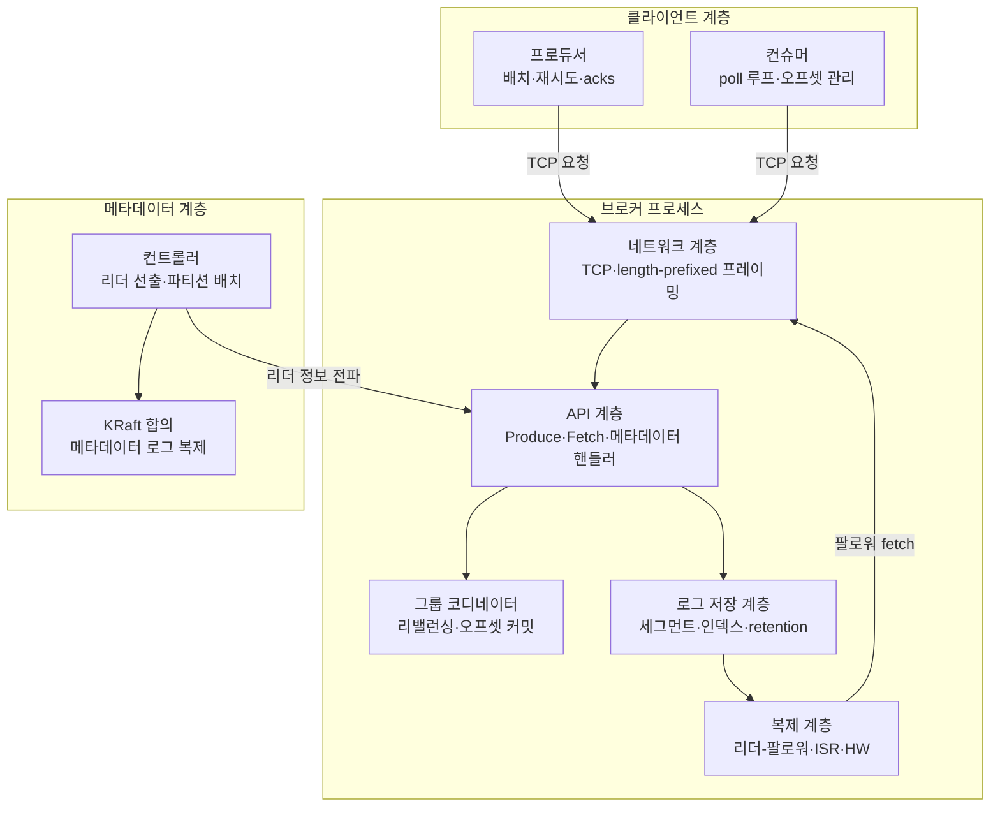
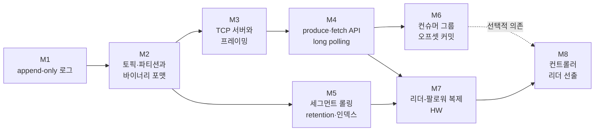
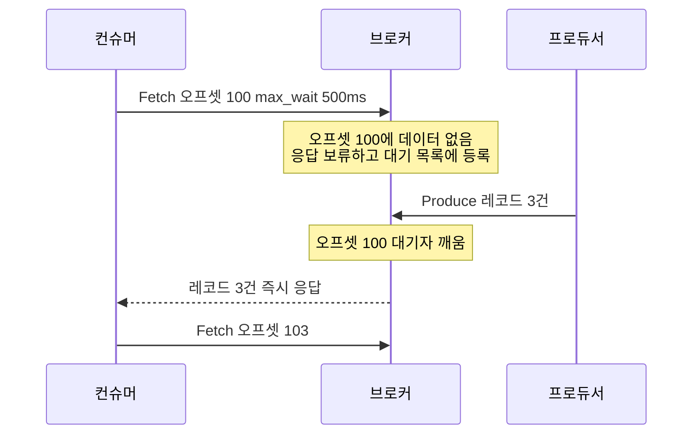

# 카프카를 직접 만들어보기 — 0 to 100 구현 로드맵

> 시리즈 마지막 편. 지금까지 9편에 걸쳐 카프카의 개념과 내부 원리를 읽었다면, 이번 편은 그 지식을 **손으로 검증하는 지도**다. "읽어서 아는 것"과 "만들 수 있는 것" 사이의 간극은 생각보다 크고, 그 간극을 메우는 순간 카프카의 설계 결정 하나하나가 "왜 그렇게밖에 할 수 없었는지"로 이해된다.

---

## 0. 왜 직접 만들어보는가 🟢

### 문제: 읽기만 한 지식은 휘발된다

카프카 문서를 아무리 읽어도 다음 질문에 즉답하기 어렵다면, 아직 지식이 "빌려온 것"이라는 뜻이다.

- 오프셋(offset)은 파일의 몇 바이트째에 있는 레코드인지 어떻게 아는가?
- long polling에서 브로커는 데이터가 올 때까지 스레드를 잡고 기다리는가?
- 하이 워터마크(High Watermark, HW)는 **누가, 언제** 올리는가?
- 리더가 죽었을 때 "새 리더를 뽑는다"는 코드는 실제로 어디서 실행되는가?

직접 구현하면 이 질문들이 **컴파일 에러와 버그의 형태로** 눈앞에 나타난다. 예를 들어 "오프셋으로 읽기"를 구현하는 순간, 오프셋은 논리 번호이고 파일 위치는 바이트 단위라는 사실이 충돌하고, 그 충돌을 해결하다 보면 카프카가 왜 희소 인덱스(sparse index)를 만들었는지 몸으로 이해하게 된다.

비유하자면, 지도를 외우는 것과 직접 걸어보는 것의 차이다. 지도만 본 사람은 "여기서 우회전"을 외우지만, 걸어본 사람은 그 길에 왜 신호등이 필요한지 안다. 다만 이 비유의 한계도 분명하다 — 우리가 만들 미니 카프카는 실제 카프카의 산책로 버전이다. 수년간의 성능 최적화(zero-copy, 배치 압축, purgatory의 계층 타이머 등)와 엣지 케이스 처리는 생략한다. 목표는 프로덕션 대체품이 아니라 **설계 이해의 도구**다.

### 이 문서의 사용법

- 8개의 마일스톤을 순서대로 진행한다. 각 마일스톤은 앞 단계의 결과물 위에 쌓인다.
- 각 마일스톤마다 **목표 / 구현할 것 / 검증 방법 / 만나게 될 어려움 / 대응 이론 문서**를 정리했다. 막히면 대응 이론 문서로 돌아가서 읽고 다시 구현하라. 이 왕복이 학습의 핵심 루프다.
- 마일스톤 1~5는 주말 이틀 정도씩, 6~8은 각각 일주일 이상 걸릴 수 있다. 8번은 완성하지 못해도 좋다 — 시도 자체가 분산 합의를 이해하는 최고의 방법이다.

---

## 1. 카프카를 구성요소로 분해하기 🟡

### 문제: "카프카"는 하나의 프로그램이 아니라 여러 층의 합이다

카프카 브로커를 열어보면 사실상 독립적인 여러 서브시스템의 결합이다. 각 층은 이 시리즈의 특정 문서와 1:1로 대응한다. 즉, **이 시리즈 전체가 미니 카프카의 설계 문서**였던 셈이다.



### 구성요소 ↔ 시리즈 문서 매핑 표

| 층 | 핵심 책임 | 대응 이론 문서 | 미니 카프카 마일스톤 |
|---|---|---|---|
| 로그 저장 | append-only 파일, 세그먼트, 인덱스, retention | 02-storage-internals.md | M1, M2, M5 |
| 네트워크·프로토콜 | TCP, 요청/응답 프레이밍, API 버저닝 | 04-producer-deep-dive.md, 공식 프로토콜 가이드 | M3 |
| 클라이언트 | produce/fetch, 폴링, long polling | 04-producer-deep-dive.md, 05-consumer-deep-dive.md | M4 |
| 그룹 관리 | 컨슈머 그룹, 리밸런싱, 오프셋 커밋 | 05-consumer-deep-dive.md | M6 |
| 복제 | 리더-팔로워, ISR, HW, 장애 복구 | 03-replication-and-controller.md | M7 |
| 메타데이터·컨트롤러 | 리더 선출, epoch, 합의 | 03-replication-and-controller.md | M8 |
| 운영 관점 검증 | 설정값의 의미를 구현으로 확인 | 06-operations-and-tuning.md | 전 구간 |

한 가지 통찰: 이 표를 아래에서 위로 읽으면 **카프카의 의존성 순서**이기도 하다. 저장 없이는 API가 없고, API 없이는 그룹 관리가 없으며, 복제 없이는 컨트롤러가 필요 없다. 우리의 마일스톤 순서가 정확히 이 순서를 따르는 이유다.

---

## 2. 구현 언어 선택 가이드 🟡

독자가 Kotlin/JVM 백엔드 개발자라는 전제에서 정리한다.

### 1순위 추천: Kotlin — 익숙함이 최고의 무기

이 프로젝트의 목표는 **분산 시스템 개념 학습**이지 언어 학습이 아니다. 낯선 언어를 쓰면 인지 부하가 언어 문법으로 새어 나간다. Kotlin을 추천하는 구체적 이유는 다음과 같다.

- **`java.nio.ByteBuffer`**: 바이너리 프로토콜 인코딩/디코딩에 필요한 모든 것이 있다. `putInt`, `getShort`, big-endian 기본값(카프카 프로토콜도 big-endian이다)까지 궁합이 좋다.
- **`java.nio.channels.FileChannel`**: append, `force`를 통한 fsync, `transferTo`를 통한 zero-copy까지 실제 카프카가 쓰는 바로 그 API다. 실제 카프카 브로커가 JVM(Java/Scala) 위에서 돌아간다는 점을 기억하라 — 여러분은 원본과 같은 재료로 요리하는 것이다.
- **코루틴(coroutine)**: long polling과 지연 응답(카프카의 purgatory에 해당)을 스레드 블로킹 없이 `delay`와 `Channel`로 우아하게 표현할 수 있다.
- 단점: JVM 기동이 느려 "프로세스 여러 개 띄우고 죽이는" 마일스톤 7~8의 실험 루프가 살짝 답답할 수 있다.

### 대안 비교

| 언어 | 장점 | 단점 | 추천 상황 |
|---|---|---|---|
| Kotlin/Java | 실제 카프카와 같은 플랫폼, ByteBuffer·FileChannel·NIO 완비 | JVM 기동 느림 | 기본 선택 |
| Go | goroutine으로 서버 작성이 매우 쉬움, 바이너리 하나로 배포, 프로세스 실험 빠름 | `encoding/binary` 수동 처리, 제네릭 표현력 낮음 | 언어도 함께 배우고 싶을 때 |
| Rust | 소유권 모델이 동시성 버그를 컴파일 타임에 잡음 | 학습 곡선이 가파라 본래 목표가 흐려짐 | 이미 Rust 중급 이상일 때 |
| Python | 프로토타이핑 최속 | GIL·성능 한계로 M7 이후 병목, 바이너리 처리 장황 | M1~M4 개념 검증만 할 때 |

**결론**: Kotlin으로 시작하라. 단, 네트워크 서버는 처음에는 코루틴이나 NIO 셀렉터 없이 **연결당 스레드(thread-per-connection) 블로킹 I/O**로 시작하는 것을 강력히 권한다. 미니 카프카에 연결이 수십 개를 넘을 일이 없고, 블로킹 모델이 디버깅하기 압도적으로 쉽다. 성능이 아니라 정확성이 목표다.

---

## 3. 마일스톤 로드맵 한눈에 보기 🟡



의존 관계에서 읽어야 할 것: M5(세그먼트)는 M3~M4(네트워크)와 독립적이다. 네트워크 코드가 지겨워지면 M5로 잠시 도망갈 수 있다. 반면 M7(복제)은 저장과 네트워크가 모두 필요하고, M8(컨트롤러)은 모든 것의 정점이다.

---

## 4. 마일스톤 상세

### M1. append-only 로그 파일 + 오프셋으로 읽기 🟡

**목표**: 카프카의 심장인 "추가만 가능한 로그"를 단일 파일로 구현하고, 논리적 오프셋으로 임의 레코드를 읽는다.

**구현할 것**

- `Log` 클래스: `append(record: ByteArray): Long` — 파일 끝에 쓰고 부여된 오프셋을 반환.
- `read(offset: Long): ByteArray` — 해당 오프셋의 레코드를 반환.
- 레코드 앞에 4바이트 길이(length)를 붙이는 최소한의 프레이밍. 길이를 모르면 어디까지가 한 레코드인지 알 수 없다.
- 오프셋 → 파일 바이트 위치 매핑. 첫 버전은 메모리의 `ArrayList<Long>`(인덱스 = 오프셋, 값 = 바이트 위치)로 충분하다.
- 프로세스 재시작 시 파일을 처음부터 스캔해 매핑을 재구축하는 복구(recovery) 로직.

**검증 방법**

- 레코드 1만 개를 append하고, 무작위 오프셋 1천 개를 read해서 내용 일치 확인.
- 프로세스를 재시작한 뒤에도 같은 read가 성공하는지 확인 — 이것이 "로그는 디스크에 있다"의 첫 증명이다.
- append 도중 프로세스를 `kill -9`로 죽여보고, 재시작 시 마지막 불완전 레코드를 어떻게 처리할지 결정해보라(잘라내기가 정답이다 — 실제 카프카의 로그 복구와 같다).

**만나게 될 어려움**

- **오프셋 ≠ 바이트 위치**라는 사실이 모든 설계를 지배한다. 이 불일치를 메우는 자료구조가 인덱스이고, M5에서 희소 인덱스로 진화한다.
- `write` 호출이 성공해도 데이터가 디스크에 있다는 보장이 없다(OS 페이지 캐시). `FileChannel.force`(fsync)를 언제 부를지 고민하게 되는데, 카프카가 fsync를 매번 하지 않고 복제에 내구성을 맡기는 이유(`flush.messages` 기본값이 사실상 무한인 이유)를 여기서 체감한다.

**대응 이론 문서**: 02-storage-internals.md

---

### M2. 토픽/파티션 디렉토리 구조와 레코드 바이너리 포맷 🟡

**목표**: 단일 파일을 "토픽의 파티션"으로 승격시키고, 레코드에 제대로 된 바이너리 포맷을 입힌다.

**구현할 것**

- 디렉토리 구조: `data/{topic}-{partition}/00000000000000000000.log` — 실제 카프카와 같은 레이아웃. 파일명이 그 파일의 첫 오프셋(base offset)이라는 규칙을 지금부터 적용해두면 M5가 쉬워진다.
- 레코드 바이너리 포맷 설계. 최소 구성:

```
길이 4B | CRC 4B | 매직 바이트 1B | 타임스탬프 8B | 키 길이 4B | 키 | 값 길이 4B | 값
```

- CRC32 체크섬 계산·검증(`java.util.zip.CRC32`). 키 길이 -1은 null 키를 의미하는 관례도 실제 카프카와 같다.
- `LogManager`: 토픽·파티션 이름으로 해당 `Log` 인스턴스를 찾아주는 라우팅 계층.

**검증 방법**

- `xxd`나 `hexdump -C`로 로그 파일을 직접 열어 설계한 포맷대로 바이트가 놓였는지 눈으로 확인한다. 이 경험이 의외로 중요하다 — 이후 프로토콜 디버깅이 전부 hex dump 읽기다.
- 파일 중간의 바이트 하나를 에디터로 손상시킨 뒤, read 시 CRC 불일치를 감지하는지 확인.
- 같은 토픽의 파티션 0과 1에 쓴 데이터가 서로 섞이지 않는지 확인.

**만나게 될 어려움**

- **엔디언(endianness)**: 정수를 바이트로 쓰는 순서를 문서로 못 박아야 한다. 카프카 프로토콜은 big-endian(network byte order)이다. `ByteBuffer` 기본값이 big-endian이라 Kotlin에서는 자연스럽게 맞는다.
- **포맷 진화**: 매직 바이트를 왜 넣는가? 나중에 포맷을 바꿀 때 옛 파일을 읽을 수 있어야 하기 때문이다. 실제 카프카가 메시지 포맷 v0 → v1 → v2(레코드 배치)로 진화하며 매직 바이트로 구분한 역사가 있다.
- 실제 카프카의 현행 포맷은 레코드 단위가 아니라 **레코드 배치(record batch) v2** 단위이고, 배치 안의 레코드는 varint 기반 델타 인코딩을 쓴다. 미니 버전에서는 생략해도 되지만, M9(프로토콜 호환)를 꿈꾼다면 이 차이를 기억해두라.

**대응 이론 문서**: 02-storage-internals.md, 01-core-concepts.md

---

### M3. TCP 서버와 length-prefixed 프로토콜 🟡

**목표**: 로그를 네트워크 너머에서 쓸 수 있게 만든다. "TCP는 메시지가 아니라 바이트 스트림"이라는 사실과 정면으로 부딪히는 단계다.

**구현할 것**

- `ServerSocket` 기반 TCP 서버. 연결당 스레드 모델로 시작.
- **length-prefixed 프레이밍**: 모든 요청/응답은 `4바이트 크기 + 페이로드`. 실제 카프카 프로토콜과 동일한 방식이다.
- 요청 헤더 설계: `api_key 2B | api_version 2B | correlation_id 4B`. correlation_id는 클라이언트가 보낸 값을 응답에 그대로 되돌려주는 필드로, 한 연결에서 여러 요청이 오갈 때 짝을 맞추는 열쇠다.
- 페이로드를 아직 해석하지 않아도 된다. 받은 것을 그대로 돌려주는 echo 핸들러면 충분하다.

**검증 방법**

- 간단한 테스트 클라이언트를 작성해 요청 1천 개를 한 연결로 보내고 correlation_id가 전부 맞게 돌아오는지 확인.
- **고의로 잔인한 클라이언트**를 만들어보라: 4바이트 길이를 1바이트씩 4번에 나눠 보내고, 페이로드도 중간에 100ms씩 쉬며 찔끔찔끔 보낸다. 서버가 이를 올바르게 조립하면 프레이밍을 제대로 이해한 것이다.
- 페이로드 크기를 100MB라고 선언하는 악성 요청을 보내 서버가 OOM으로 죽는지 확인하고, 최대 요청 크기 제한(실제 카프카의 `socket.request.max.bytes`)을 추가하라.

**만나게 될 어려움**

- **부분 읽기(partial read)**: `read` 한 번이 요청 하나를 돌려준다는 보장이 없다. `readFully` 성격의 루프(정확히 N바이트를 채울 때까지 반복)를 짜는 것이 이 마일스톤의 진짜 학습 내용이다. `DataInputStream.readFully`를 쓰면 JVM이 이를 해결해준다는 것도 배운다.
- 연결이 중간에 끊겼을 때의 자원 정리. try-finally와 소켓 타임아웃을 고민하게 된다.
- 여기서 만든 프레이밍 코드가 이후 모든 마일스톤의 기반이다. 대충 만들면 M4부터 계속 발목을 잡는다.

**대응 이론 문서**: 04-producer-deep-dive.md(클라이언트-브로커 통신 부분), 공식 카프카 프로토콜 가이드(6장 참고)

---

### M4. produce/fetch API — 폴링 기반 소비와 long polling 🟡

**목표**: 프로토콜에 의미를 부여한다. 프로듀서가 쓰고 컨슈머가 읽는, "동작하는 메시지 브로커"의 최소 완성형이다.

**구현할 것**

- **Produce API**: 요청 = 토픽, 파티션, 레코드들. 응답 = 각 레코드에 부여된 base offset과 에러 코드.
- **Fetch API**: 요청 = 토픽, 파티션, 시작 오프셋, max_wait_ms, min_bytes. 응답 = 레코드 묶음과 해당 파티션의 끝 오프셋.
- 컨슈머 CLI: fetch → 처리 → 오프셋 증가 → 다시 fetch의 **poll 루프**. 카프카 컨슈머가 push가 아니라 pull이라는 사실을 코드로 재현하는 것이다.
- **long polling**: 요청한 오프셋에 데이터가 없으면 즉시 빈 응답을 주지 말고, `max_wait_ms` 동안 기다렸다가 그 사이 데이터가 오면 바로 응답한다. 실제 카프카 컨슈머의 `fetch.max.wait.ms`와 `fetch.min.bytes`가 정확히 이것이다.



**검증 방법**

- 터미널 두 개를 열고 한쪽에서 produce, 다른 쪽에서 poll 루프 소비. 이 순간이 이 프로젝트에서 가장 짜릿한 순간 중 하나다.
- long polling 검증: 컨슈머를 먼저 붙여두고 1초 뒤에 produce했을 때, 컨슈머가 produce 직후(수 ms 내)에 데이터를 받는지 측정한다. 500ms를 꽉 채워 기다린 뒤 받는다면 "대기 중 깨우기"가 없는 것이다.
- 컨슈머 둘이 **같은 파티션을 각자 다른 오프셋으로** 읽어도 서로 간섭이 없는지 확인 — "소비해도 데이터가 사라지지 않는다"는 카프카의 핵심 성질 증명.

**만나게 될 어려움**

- **long polling을 어떻게 구현할 것인가**가 최대 난관이다. 스레드를 `sleep` 루프로 돌리는 폴링(busy-wait에 가깝다)은 쉽지만 낭비고, 조건 변수나 코루틴 `Channel`로 "새 데이터 도착 이벤트"를 만들어 대기자를 깨우는 방식이 정석이다. 이 지점에서 실제 카프카의 **purgatory**(지연된 요청을 보관했다가 조건 충족 시 완성하는 자료구조)가 왜 존재하는지 이해하게 된다.
- 쓰기와 읽기가 같은 파티션에 동시 접근하므로 첫 동시성 버그를 만난다. 파티션 단위 락으로 시작해서, append는 직렬화하되 read는 락 없이 가능한 구조(불변 데이터의 힘)로 개선해보라.

**대응 이론 문서**: 04-producer-deep-dive.md, 05-consumer-deep-dive.md

---

### M5. 세그먼트 롤링과 retention, 희소 인덱스 🟡

**목표**: "로그는 무한히 자라지 않는다." 파일 하나였던 파티션을 세그먼트(segment)의 연속으로 재구성하고, 오래된 데이터를 지우며, 오프셋 조회를 O(전체 스캔)에서 O(log n)으로 만든다.

**구현할 것**

- 세그먼트 롤링: 활성 세그먼트가 설정 크기(테스트용으로 1KB처럼 작게)를 넘으면 새 파일로 전환. 파일명 = base offset. 예: `00000000000000000000.log`, `00000000000000000042.log`.
- 파티션 = 세그먼트 리스트. 오프셋으로 읽을 때 ① base offset 목록에서 이진 탐색으로 세그먼트 선택 → ② 세그먼트 안에서 위치 탐색.
- **희소 인덱스**: 레코드 N개(또는 N바이트)마다 한 번씩만 `오프셋 → 바이트 위치` 엔트리를 `.index` 파일에 기록. 조회 시 인덱스에서 "요청 오프셋 이하의 가장 큰 엔트리"를 이진 탐색으로 찾고, 거기서부터 로그를 순차 스캔. M1의 전수 메모리 매핑을 이것으로 교체한다.
- retention 스레드: 주기적으로 돌며 보존 시간(`retention.ms`에 해당)이나 총 크기(`retention.bytes`)를 넘은 **비활성 세그먼트를 통째로 삭제**. 레코드 단위 삭제가 아니라 파일 단위 삭제라는 것이 핵심이다 — 이것이 카프카 retention이 저렴한 이유다.

**검증 방법**

- 세그먼트 크기를 아주 작게 두고 레코드를 쏟아부은 뒤 `ls`로 파일이 롤링되는 것을 관찰.
- 세그먼트 경계에 걸친 오프셋 범위 fetch가 정상 동작하는지 확인(경계 버그의 단골 서식지).
- retention으로 앞쪽 세그먼트가 삭제된 뒤, 삭제된 오프셋을 fetch하면 "out of range" 에러를 돌려주는지 확인. 실제 카프카 컨슈머의 `auto.offset.reset`이 왜 필요한지 여기서 이해된다.
- 재시작 후 디렉토리의 파일명만 보고 세그먼트 리스트를 재구축할 수 있는지 확인.

**만나게 될 어려움**

- **삭제와 읽기의 경합**: 컨슈머가 읽고 있는 세그먼트를 retention 스레드가 지우면? 참조 카운팅, 삭제 유예(실제 카프카는 `.deleted` 확장자로 rename 후 지연 삭제), 또는 "읽기 실패 시 out of range로 처리" 중 선택해야 한다. 처음으로 만나는 진짜 동시성 설계 문제다.
- 희소 인덱스의 정확성: 인덱스는 "정확한 위치"가 아니라 "탐색 시작점"만 준다는 사고 전환이 필요하다. 인덱스 파일이 로그와 어긋났을 때(비정상 종료) 재생성하는 복구 로직도 필요해진다.

**대응 이론 문서**: 02-storage-internals.md

---

### M6. 컨슈머 그룹과 오프셋 커밋 🔴

**목표**: 컨슈머 여러 개가 파티션을 나눠 갖고, 진행 상황(오프셋)을 브로커에 저장하며, 하나가 죽으면 나머지가 이어받게 한다.

**구현할 것**

- **오프셋 커밋 저장소**: `(group, topic, partition) → offset` 매핑. 두 가지 구현 중 선택:
  - 쉬운 길 — 브로커의 로컬 파일이나 RocksDB류 키-값 저장.
  - 카프카다운 길 — **내부 토픽**(`__consumer_offsets`에 해당)에 커밋을 레코드로 append하고, 시작 시 전체를 재생(replay)해 최신 상태를 메모리에 구축. 컴팩션(compaction)의 존재 이유를 덤으로 이해하게 된다.
- CommitOffset / FetchOffset API 추가.
- **단순화된 그룹 프로토콜**: JoinGroup(그룹 참여, 멤버 ID 발급) → 브로커가 파티션을 멤버들에게 배분 → 각 멤버에게 할당 통보. 실제 카프카의 클라이언트 주도 할당(컨슈머 리더가 할당을 계산하는 구조)까지 갈 필요는 없다. 브로커가 직접 배분하는 서버 주도 방식이 구현이 훨씬 쉽고, 실제 카프카도 KIP-848 이후 서버 주도 리밸런싱으로 이동했다.
- **하트비트와 세션 타임아웃**: 멤버가 일정 시간 하트비트를 안 보내면 죽은 것으로 간주하고 리밸런싱을 발동. `session.timeout.ms`의 재현이다.
- **세대 번호(generation)**: 리밸런싱이 일어날 때마다 증가. 옛 세대 번호로 들어온 커밋 요청은 거부한다 — 이것이 **펜싱(fencing)**의 첫 등장이다.

**검증 방법**

- 파티션 4개짜리 토픽에 컨슈머 2개를 붙여 각각 2개씩 할당받는지 확인. 3번째 컨슈머를 추가하면 재배분되는지 확인.
- 컨슈머 하나를 `kill -9`하고, 세션 타임아웃 뒤 남은 컨슈머가 그 파티션들을 이어받는지, **이어받은 지점이 마지막 커밋 오프셋인지** 확인.
- 컨슈머를 죽였다 살리기를 반복하며 전체 레코드가 유실 없이(단, 중복은 있을 수 있게) 소비되는지 카운트로 검증. "왜 중복이 생기는가?"에 스스로 답해보라 — 커밋 시점과 처리 시점의 간극, 즉 at-least-once의 본질이다.

**만나게 될 어려움**

- **리밸런싱 중의 좀비**: 리밸런싱으로 파티션을 뺏긴 옛 멤버가 그 사실을 모르고 계속 처리·커밋하려는 상황. 세대 번호 펜싱이 없으면 오프셋이 뒤로 감기는 버그를 직접 목격하게 된다. 이 버그를 한 번 겪는 것이 이 마일스톤의 최고 수확이다.
- 상태 머신 복잡도: 그룹은 Empty → PreparingRebalance → Stable 같은 상태를 오간다. 상태 전이를 명시적으로 그려두지 않으면 반드시 꼬인다.
- 커밋 주기의 트레이드오프: 매 레코드 커밋(느림, 중복 최소) vs 주기 커밋(빠름, 중복 증가). `enable.auto.commit`과 `auto.commit.interval.ms` 설계의 재발견이다.

**대응 이론 문서**: 05-consumer-deep-dive.md

---

### M7. 리더-팔로워 복제와 HW — 프로세스 2개로 🔴

**목표**: 브로커를 2개 띄워 하나를 리더, 하나를 팔로워로 두고, 복제와 하이 워터마크를 구현한다. "커밋된 데이터"의 정확한 의미를 코드로 확인하는 단계다.

**구현할 것**

- 브로커 프로세스를 포트만 다르게 2개 실행(9092, 9093). 파티션마다 리더 브로커를 정적 설정으로 지정(선출은 M8의 몫).
- **팔로워 = 특별한 컨슈머**: 팔로워는 리더에게 Fetch 요청을 보내 레코드를 가져와 자기 로그에 append한다. M4의 Fetch API를 거의 그대로 재사용할 수 있다는 것을 발견하는 순간, 카프카 설계의 우아함(복제가 소비와 같은 경로를 탄다)을 이해하게 된다. 요청에 "나는 팔로워다" 표시(replica id)만 추가한다.
- **LEO와 HW**: 리더는 각 팔로워의 fetch 요청에 담긴 오프셋으로 팔로워의 LEO(Log End Offset)를 추적하고, **ISR 전체(리더 포함) LEO의 최솟값**으로 HW를 전진시킨다(03편의 정의 그대로다). HW는 fetch 응답에 실어 팔로워에게 전파한다.
- **컨슈머는 HW까지만 읽는다**: 일반 컨슈머의 fetch는 HW 이전 데이터만 반환. 복제가 덜 된 데이터는 존재하지만 보이지 않는다.
- **acks 재현**: produce 요청에 acks 필드를 추가. `acks=1`은 리더 append 즉시 응답, `acks=all`은 HW가 해당 오프셋을 넘을 때까지 응답을 보류(M4의 long polling 인프라 재사용).
- **ISR 관리**: 팔로워가 일정 시간(`replica.lag.time.max.ms`에 해당) fetch를 안 오면 ISR에서 제외하고 HW 계산에서 뺀다.

**검증 방법**

- 리더에 produce한 데이터가 팔로워 로그 파일에도 나타나는지 두 데이터 디렉토리를 diff로 비교.
- 팔로워를 죽인 상태에서 `acks=all` produce가 어떻게 되는지 관찰: ISR 축소 전에는 타임아웃/대기, ISR에서 빠진 후에는 즉시 성공 — `min.insync.replicas` 개념이 왜 필요한지 여기서 스스로 필요성을 느끼게 된다. 느꼈다면 min ISR 검사도 추가해보라.
- 팔로워를 죽였다 살렸을 때 밀린 데이터를 따라잡고(catch-up) ISR로 복귀하는지 확인.
- 컨슈머가 HW 너머를 절대 읽지 못하는지: 팔로워를 멈춰 HW를 고정시킨 채 리더에 계속 produce하고, 컨슈머가 멈춘 지점에서 더 읽지 못하는지 확인.

**만나게 될 어려움**

- **HW 전진 타이밍**: 팔로워의 LEO를 "이번 fetch 요청의 오프셋"으로 아는 구조라, 팔로워가 데이터를 받고 **다음 fetch를 보내야** 리더가 복제 완료를 안다. 즉 HW는 항상 한 라운드트립 늦게 움직인다. 이 미묘함이 `acks=all` 지연의 근원이고, 실제 카프카에서 리더 교체 시 HW 불일치로 인한 잘림(truncation) 문제와 리더 epoch가 등장한 배경이다.
- 리더 장애 후 수동으로 팔로워를 리더로 승격시켜보면, 옛 리더에만 있고 HW를 못 넘긴 레코드를 **잘라내야** 두 로그가 다시 일치한다는 것을 발견한다. "커밋 안 된 데이터는 유실될 수 있다"의 실체다.
- 프로세스 2개 + 클라이언트를 오가는 디버깅. 로그(logging)에 브로커 ID·오프셋·HW를 꼬박꼬박 남기지 않으면 지옥을 맛본다.

**대응 이론 문서**: 03-replication-and-controller.md

---

### M8. 도전 과제 — 컨트롤러와 리더 선출 🔴

**목표**: M7에서 정적 설정으로 박아둔 "누가 리더인가"를 시스템이 스스로 결정하게 만든다. 여기가 분산 시스템의 심연 입구이며, 완주하지 못해도 시도만으로 가치가 있다.

**구현할 것** — 난이도 순 3단계 중 선택

1. **중앙 컨트롤러 방식(추천 시작점)**: 컨트롤러 역할의 세 번째 프로세스를 둔다. 브로커들은 컨트롤러에 하트비트를 보내고, 컨트롤러는 브로커 생사에 따라 파티션 리더를 결정해 전파한다. 합의는 없다 — 컨트롤러가 단일 장애점(SPOF)임을 받아들인다. 옛 ZooKeeper 시절 카프카의 컨트롤러 구조를 단순화한 것과 같다.
2. **epoch 펜싱 추가**: 리더가 바뀔 때마다 **리더 epoch**를 증가시키고, 모든 복제·produce 경로에서 "옛 epoch의 리더"가 보낸 요청을 거부한다. 네트워크 단절로 자기가 여전히 리더인 줄 아는 **스플릿 브레인(split brain)** 상황을 만들어 펜싱이 막아내는지 실험한다.
3. **단순화된 합의(진짜 도전)**: 컨트롤러 자체의 SPOF를 없애기 위해 컨트롤러 후보 3개가 리더 선출 합의를 하게 한다. Raft의 리더 선출 파트만(임기 term, 투표 요청, 과반 득표, 랜덤 선거 타임아웃) 구현해보라. 로그 복제까지 가면 사실상 KRaft의 재구현이 된다 — 카프카 4.x의 KRaft가 정확히 "메타데이터를 Raft 합의로 복제되는 내부 로그(`__cluster_metadata`)에 담자"는 설계다. 여러분의 M1 로그 구현이 메타데이터 저장소로 재등장하는 아름다운 순환을 볼 수 있다.

**검증 방법**

- 리더 브로커를 `kill -9` → 컨트롤러가 감지 → 팔로워가 새 리더로 승격 → 클라이언트가 새 리더를 찾아 재개. 이 전체 장애 조치(failover)가 사람 손 없이 완료되는지 확인.
- 스플릿 브레인 시뮬레이션: 옛 리더의 하트비트만 차단(iptables 대신, 코드에 인위적 차단 플래그를 넣는 게 쉽다)한 상태에서 옛 리더에 produce를 시도하고, epoch 펜싱이 거부하는지 확인.
- 3단계까지 갔다면: 컨트롤러 3개 중 리더를 죽이고 새 리더가 과반 투표로 뽑히는지, 그리고 **2개를 동시에 죽이면 과반 미달로 선출이 멈추는지**(가용성보다 일관성을 택하는 순간) 확인.

**만나게 될 어려움**

- "죽었다"의 판정이 본질적으로 불확실하다는 것 — 느린 것과 죽은 것을 구분할 수 없다(비동기 네트워크의 근본 한계). 타임아웃은 추측일 뿐이고, 그래서 펜싱이 선택이 아니라 필수라는 결론에 도달한다.
- 랜덤 선거 타임아웃 없이 Raft 선출을 구현하면 후보들이 무한히 표를 나눠 갖는 선거 반복(split vote)을 직접 목격한다. 논문의 한 줄이 왜 거기 있는지 몸으로 안다.
- 여기까지 오면 "카프카가 왜 ZooKeeper를 쓰다가 KRaft로 직접 합의를 내재화했는지"(외부 시스템과의 메타데이터 이중 관리 문제)를 자기 언어로 설명할 수 있게 된다.

**대응 이론 문서**: 03-replication-and-controller.md

---

## 5. 실제 카프카 프로토콜과 호환하기 🔴

### 문제: 내가 만든 프로토콜은 나만 쓸 수 있다

지금까지의 미니 카프카는 자체 프로토콜을 쓴다. 최종 보스 격의 확장 과제는 **실제 카프카 와이어 프로토콜을 구현해서, 진짜 `kafka-console-producer`/`kafka-console-consumer`가 내 서버에 붙게 만드는 것**이다. 이게 되는 순간의 성취감은 이 프로젝트 전체에서 가장 크다.

### 공식 프로토콜 가이드 읽는 법

카프카 프로토콜은 완전히 문서화된 공개 스펙이다: **https://kafka.apache.org/protocol** (A Guide To The Kafka Protocol). 읽는 요령:

- 모든 API는 `api_key`(정수)로 식별된다: Produce=0, Fetch=1, Metadata=3, ApiVersions=18 등. 각 API는 버전이 여럿이고, 요청 헤더의 `api_version`으로 협상한다.
- **ApiVersions부터 구현하라.** 모든 카프카 클라이언트는 연결 직후 ApiVersions 요청(api_key 18)을 보내 "이 브로커가 어떤 API의 어떤 버전을 지원하는가"를 묻는다. 이것 하나만 올바르게 응답해도 실제 클라이언트와의 핸드셰이크 첫 단추가 끼워진다.
- 그다음은 **Metadata**(클라이언트가 "이 토픽의 리더가 어느 브로커냐"를 묻는 API — 자기 자신을 리더로 광고하면 된다), 그다음 Produce 또는 Fetch 순서로 넓혀간다.
- 스펙의 타입 표기에 주의: 최신 버전들은 **flexible version**이라 불리며, 문자열이 `COMPACT_STRING`(길이를 unsigned varint로, 그리고 길이+1로 인코딩), 필드 끝에 tagged fields가 붙는 등 옛 버전과 인코딩이 다르다. 처음에는 낮은 버전(비-flexible)으로 구현하는 것이 쉽다.
- 레코드 자체의 인코딩(record batch v2 — CRC32C, varint 델타, 압축)은 프로토콜 가이드가 아니라 문서의 "Messages" / record batch 섹션과 KIP-98 문서에 있다. Produce 요청 페이로드 안에 이 배치 바이트가 통째로 들어온다는 점이 함정이다.

디버깅 팁: **Wireshark에 카프카 프로토콜 디섹터가 내장**되어 있다. 진짜 카프카 브로커와 클라이언트 사이 트래픽을 캡처해 정답지를 눈으로 본 뒤 내 구현과 비교하는 것이 최고의 학습법이다. `kcat`(구 kafkacat)은 콘솔 도구보다 가볍고 옵션이 세밀해 호환성 테스트 상대로 좋다.

### 훈련 코스: CodeCrafters "Build your own Kafka"

혼자 스펙을 읽는 것이 막막하다면 **CodeCrafters의 "Build your own Kafka" 코스**가 좋은 안내자다. 실제 카프카 와이어 프로토콜을 단계별로 구현하며, 각 단계마다 자동 테스트가 내 서버에 진짜 프로토콜 요청을 보내 검증해준다. 진행 구조가 이 문서의 마일스톤과 상보적이다 — CodeCrafters는 프로토콜 호환(이 절)에 집중하고, 이 문서의 M5~M8(세그먼트, 그룹, 복제, 선출)은 다루지 않는다. 순서 제안: 이 문서의 M1~M4로 개념을 잡고 → CodeCrafters로 실제 프로토콜을 훈련하고 → 돌아와서 M5~M8을 완성하는 흐름이 이상적이다. Kotlin을 포함한 다수 언어를 지원한다.

### 최종 검증 시나리오

```bash
# 내 미니 카프카를 9092 포트에 띄운 뒤 — 진짜 카프카 배포판의 CLI로 접속
kafka-console-producer.sh --bootstrap-server localhost:9092 --topic test
kafka-console-consumer.sh --bootstrap-server localhost:9092 --topic test --from-beginning
```

이 두 명령이 내 서버를 상대로 동작하면, 여러분은 카프카 프로토콜을 말할 줄 아는 서버를 만든 것이다. 이력서 한 줄이 아니라 면접에서 30분을 끌고 갈 수 있는 프로젝트가 된다.

---

## 6. 더 나아가기 🔴

완주했다면 다음 확장 주제들이 기다린다. 각각이 시리즈 문서 하나와 대응한다.

- **배치와 압축**: 프로듀서에 `linger.ms`/`batch.size` 스타일의 배치 축적을 넣고 처리량 변화를 측정 → 04-producer-deep-dive.md
- **로그 컴팩션**: M6에서 내부 토픽 방식을 택했다면 자연스럽게 필요해진다. 키별 최신값만 남기는 컴팩터 스레드 → 02-storage-internals.md
- **멱등 프로듀서**: producer id와 시퀀스 번호로 재시도 중복 제거 → 04-producer-deep-dive.md
- **zero-copy fetch**: `FileChannel.transferTo`로 fetch 응답을 커널에서 소켓으로 직송하고 CPU 사용률 비교 → 02-storage-internals.md
- **메트릭 노출**: 파티션별 LEO/HW/lag을 HTTP 엔드포인트로 노출하고 미니 대시보드 만들기 → 06-operations-and-tuning.md
- 참고로 실제 카프카 소스는 github.com/apache/kafka 에 있고, 저장 계층(`storage` 모듈의 UnifiedLog, LogSegment)부터 읽으면 여러분이 만든 것과 구조가 겹쳐 보여 놀랄 만큼 잘 읽힌다. 직접 만든 자의 특권이다.

---

## 면접 포인트

**Q1. 카프카는 오프셋으로 어떻게 빠르게 레코드를 찾나요?**

- 좋은 답변 뼈대: 파티션은 base offset을 파일명으로 갖는 세그먼트들로 나뉜다 → 세그먼트 목록에서 이진 탐색으로 대상 세그먼트 선택 → 세그먼트의 희소 인덱스에서 요청 오프셋 이하의 가장 가까운 엔트리를 이진 탐색 → 그 바이트 위치부터 짧은 순차 스캔. "인덱스가 모든 오프셋을 담지 않는 이유(메모리·쓰기 비용 절약, 어차피 순차 스캔이 저렴)"까지 말하면 직접 만들어본 티가 난다.
- 나쁜 답변 예시: "인덱스가 있어서 빠릅니다." — 희소성, 2단계 탐색 구조를 말하지 못하면 문서만 읽은 답이다.

**Q2. 컨슈머가 fetch했는데 새 데이터가 없으면 어떻게 되나요?**

- 좋은 답변 뼈대: 즉시 빈 응답을 주면 클라이언트가 폴링 폭풍을 일으키므로, 브로커는 `fetch.max.wait.ms`와 `fetch.min.bytes` 조건이 찰 때까지 응답을 보류하는 long polling을 한다 → 브로커 내부에서는 지연된 요청을 purgatory에 보관했다가 새 데이터 append 이벤트로 깨운다 → 따라서 pull 모델이면서도 push에 가까운 지연 특성을 얻는다.
- 나쁜 답변 예시: "컨슈머가 계속 요청을 반복합니다." — 반복은 맞지만 브로커 측 대기 메커니즘을 모르면 절반짜리 답이다.

**Q3. 하이 워터마크는 왜 필요하고, 누가 어떻게 올리나요?**

- 좋은 답변 뼈대: 컨슈머에게 "복제가 끝나 유실되지 않을 데이터"만 보여주기 위한 경계다 → 리더는 팔로워의 fetch 요청 오프셋으로 각 팔로워의 LEO를 추적하고, ISR 전체 LEO의 최솟값으로 HW를 전진 → 팔로워는 다음 fetch 응답으로 HW를 전달받는다 → 팔로워의 복제 완료를 리더가 다음 fetch에서야 알기 때문에 HW는 한 라운드트립 늦게 움직이며, 이것이 acks=all 지연과 리더 epoch 도입 배경으로 이어진다.
- 나쁜 답변 예시: "복제된 지점을 표시하는 값입니다." — 갱신 주체와 전파 경로, 한 박자 늦는 특성을 말하지 못하면 깊이가 없다.

**Q4. 리밸런싱 중 파티션을 뺏긴 컨슈머가 계속 커밋하면 어떻게 막나요?**

- 좋은 답변 뼈대: 세대 번호(generation/epoch) 기반 펜싱 → 리밸런싱마다 세대가 증가하고, 브로커는 옛 세대의 커밋·하트비트를 거부한다 → 분산 시스템에서 "죽음"은 판정 불가능하므로(느린 것과 죽은 것을 구분 못 함) 좀비를 막는 유일한 일반해가 펜싱이다 → 같은 패턴이 리더 epoch, 멱등 프로듀서 epoch, KRaft의 term까지 카프카 전반에 반복된다.
- 나쁜 답변 예시: "죽은 컨슈머는 요청을 안 보내니 문제없습니다." — 좀비 시나리오 자체를 인식 못 한 답이다.

**Q5. 카프카를 미니로 구현한다면 어떤 순서로 만들 건가요?** (설계 면접 단골)

- 좋은 답변 뼈대: 의존성 순서로 — append-only 로그와 오프셋 읽기 → 바이너리 포맷과 파티션 디렉토리 → length-prefixed TCP 프로토콜 → produce/fetch와 long polling → 세그먼트·retention·희소 인덱스 → 그룹과 오프셋 커밋 → 복제와 HW → 리더 선출. 각 단계에서 "무엇이 어려운지"(스트림 프레이밍, 삭제-읽기 경합, HW 타이밍, 스플릿 브레인)를 한 개씩 짚으면 실제로 만들어본 사람의 답이 된다.
- 나쁜 답변 예시: "메시지 큐니까 큐 자료구조를 만들고 네트워크를 붙입니다." — 카프카는 큐가 아니라 로그라는 첫 단추부터 틀린 답이다.

---

*시리즈 끝. 00-why-kafka.md에서 시작한 여정이 여기서 끝나지만, 여러분의 미니 카프카 저장소는 이제 시작이다.*
